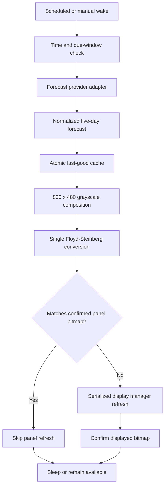
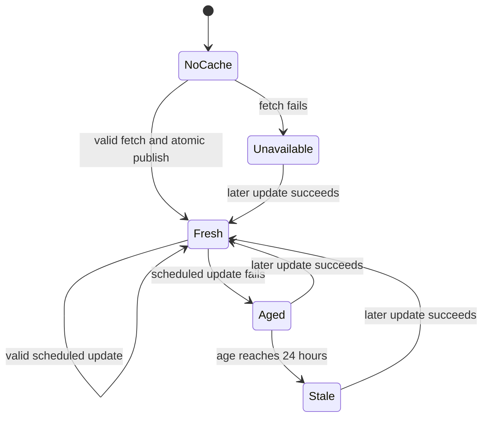
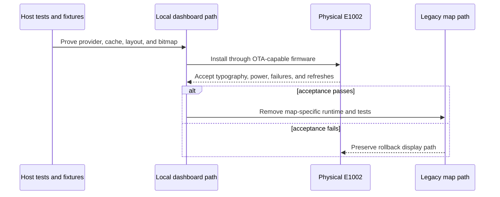

# Local Wind Dashboard - Plan

## Goal Capsule

- **Objective:** The reTerminal E1002 shows an accurate, legible five-day wind forecast as a deterministic black-and-white dashboard and remains useful through network failures and deep-sleep cycles.
- **Means:** Fetch a small forecast response, normalize it on the device, render one 800 x 480 grayscale frame, convert that frame once to black and white, and publish it through the existing display stack (KTD1-KTD6).
- **Authority:** The Product Contract owns visible behavior. The Planning Contract owns implementation boundaries. The supplied Figma design and font assets own visual geometry and typography once their exact values can be read.
- **Execution profile:** Deep firmware replacement with an external API, persistent cache, hardware-specific rendering, scheduled power behavior, OTA preservation, and physical-panel acceptance.
- **Stop conditions:** Stop rather than invent values when the provider response lacks any required sample, when font redistribution rights are insufficient, when the generated firmware exceeds an OTA slot, or when the local renderer cannot preserve the existing display and rollback path.
- **Tail ownership:** Remove the map prototype only after the local dashboard passes host, firmware-size, OTA, power, and physical-device acceptance.

---

## Product Contract

### Summary

Replace the map-based wind experiment with a focused five-day wind dashboard for the Seeed reTerminal E1002. The device displays five fixed daytime forecasts per day, wakes only at planned times, keeps its last valid data during failures, and renders the complete interface locally without a required image server.

### Problem Frame

The map experiment proved the panel, palette, update path, Wi-Fi connection, and OTA foundation, but its color differences are too difficult to read reliably on Spectra 6 e-ink. The product now needs a presentation where wind speed, gusts, direction, freshness, and day-to-day changes can be read directly.

The dashboard must remain precise despite constrained firmware memory and low-DPI output. It must also remain honest when the forecast source, storage, clock, or network is unavailable.

### Requirements

**Forecast data**

- R1. The dashboard shall show today plus the next four calendar days in the configured spot timezone.
- R2. Each day shall show samples for 08:00, 11:00, 14:00, 17:00, and 20:00 local time.
- R3. Each sample shall contain sustained 10 m wind in whole knots, 10 m gusts in whole knots, and a direction arrow whose tip points where the wind travels.
- R4. A forecast update shall be accepted only when all 25 required samples and their timestamps are present and valid.
- R5. Cached forecast dates and times shall never be shifted forward to make old data look current.

**Dashboard presentation**

- R6. The dashboard shall render at exactly 800 x 480 pixels using the supplied Figma layout as visual authority.
- R7. Lines, day boundaries, bars, gust markers, and other geometric primitives shall use integer pixel coordinates and exact black or white values.
- R8. Text and wind-direction icons may use grayscale antialiasing before the final conversion to panel pixels.
- R9. Sustained wind shall use a fixed 0-40 kt vertical scale across every day and refresh.
- R10. Values above 40 kt shall meet the chart ceiling, keep their real numeric label, and show a compact overflow cue.
- R11. The spot name shall keep its designed size; coordinates disappear first when space is insufficient, after which the name is width-fitted with an ellipsis.
- R12. The header shall show the active model family, last successful forecast retrieval, data-age warning when applicable, and battery state with right-aligned geometry.

**Reliability and power**

- R13. The device shall attempt online updates at 00:05, 07:00, 11:00, 15:00, and 19:00 in the configured spot timezone.
- R14. A wake after a missed boundary shall fetch once when the current forecast has not yet satisfied that boundary.
- R15. A failed fetch or invalid response shall preserve the previous last-good forecast and cache.
- R16. After a missed scheduled update, the cached dashboard shall show data age; after 24 hours it shall show `!! FORECAST STALE`.
- R17. A first boot without valid cached data or connectivity shall show a stable forecast-unavailable state and shall not fabricate zero-wind samples.
- R18. The panel shall refresh only when the final 800 x 480 black-and-white bitmap differs from the bitmap last confirmed as displayed.
- R19. Forecast updates, button actions, OTA/status output, and other display work shall remain serialized through the existing display manager.

**Product and distribution boundary**

- R20. Forecast-provider details shall stay behind a replaceable adapter so the dashboard and cache do not depend on Open-Meteo field names or endpoints.
- R21. The free Open-Meteo endpoint shall be development-only; a commercial build shall require a licensed endpoint or approved gateway configuration.
- R22. Existing Wi-Fi provisioning, battery reporting, deep sleep, OTA update and rollback, and physical button support shall remain available after the map prototype is removed.

### Key Decisions

- **Local device rendering.** (session-settled: user-approved — chosen over mandatory server-rendered images: it avoids a permanent backend dependency and per-device image delivery.) Governs R6-R8, R18-R20.
- **Five fixed daytime samples.** (session-settled: user-approved — chosen over adaptive or continuous sampling: fixed columns make days directly comparable.) Governs R1-R4.
- **Fixed 0-40 kt chart scale.** (session-settled: user-approved — chosen over an adaptive daily scale: a stable visual height must always mean the same wind speed.) Governs R9-R10.
- **Keep the last honest forecast.** (session-settled: user-approved — chosen over clearing the screen or showing invented values after failure: the physical display should remain useful without hiding staleness.) Governs R5, R15-R17.
- **Fixed typography priority.** (session-settled: user-directed — chosen over shrinking the spot name: coordinates disappear first and only then may the name be ellipsized.) Governs R11.
- **Five scheduled network windows.** (session-settled: user-directed — chosen over an additional 03:00 fetch or continuous polling: the display stays current while limiting battery and network use.) Governs R13-R14.

### Key Flows

- F1. Successful scheduled update
  - **Trigger:** A scheduled or missed-boundary wake requires fresh data.
  - **Steps:** Synchronize time, fetch and validate the provider response, atomically publish the normalized cache, render the final bitmap, compare it with the confirmed panel bitmap, and refresh only when changed.
  - **Outcome:** The new forecast is visible or the unchanged panel is retained, then the device returns to its normal power state.
  - **Covered by:** R1-R4, R13-R15, R18-R19.
- F2. Failed update with valid cache
  - **Trigger:** The network, HTTP request, parse, validation, or persistence step fails.
  - **Steps:** Preserve the last-good cache, calculate its age, render the corresponding warning state, and compare the result with the confirmed panel bitmap.
  - **Outcome:** Old data remains attached to its original dates and is visibly marked as old.
  - **Covered by:** R5, R15-R18.
- F3. First boot without usable data
  - **Trigger:** No compatible persistent cache exists and the fetch fails.
  - **Steps:** Render the forecast-unavailable state through the same final image pipeline.
  - **Outcome:** The device reports that no forecast is available without suggesting calm wind.
  - **Covered by:** R17-R19.
- F4. Accepted replacement and cleanup
  - **Trigger:** Host, firmware, OTA, power, and physical-panel acceptance all pass.
  - **Steps:** Make the local dashboard the only wind-display path, retain shared device services, and remove map-specific server and firmware code.
  - **Outcome:** One supported renderer remains without losing setup, OTA, battery, sleep, or buttons.
  - **Covered by:** R20-R22.

### Acceptance Examples

- AE1. **Covers R1-R4.** Given a complete forecast response in `Europe/Amsterdam`, when the device renders on Monday, then the columns show Monday through Friday and each day uses exactly the five requested local hours.
- AE2. **Covers R3.** Given provider direction `270 degrees`, when the value is normalized, then the arrow points toward `90 degrees` because the provider reports where wind comes from.
- AE3. **Covers R9-R10.** Given sustained wind of 44 kt, when it is rendered, then the bar reaches the 40 kt ceiling, the label remains `44`, and the overflow cue is visible.
- AE4. **Covers R11.** Given a spot name and coordinates that do not fit beside the status block, when the header is laid out, then coordinates are omitted before the spot name is ellipsized and the font size stays unchanged.
- AE5. **Covers R15-R16.** Given a last-good cache and a failed scheduled fetch, when the warning state differs from the current panel, then the cached dates remain unchanged and the panel refreshes once with its data age.
- AE6. **Covers R17.** Given a first boot with no valid cache and no network, when startup completes, then the panel shows a forecast-unavailable state rather than empty or zero-height forecast bars.
- AE7. **Covers R18.** Given a provider response whose visible rounded values and status are identical to the confirmed panel bitmap, when the scheduled update succeeds, then the device writes no e-ink refresh.
- AE8. **Covers R21.** Given a build marked for commercial distribution, when no licensed provider configuration exists, then release validation fails before firmware publication.

### Success Criteria

- All 25 samples, labels, arrows, bars, gust markers, warning states, and header elements fit within 800 x 480 without clipping.
- Every structural line and filled primitive survives rendering as a stable black-or-white shape with no avoidable dither.
- The visual hierarchy and spacing are accepted on the physical E1002 against the Figma reference.
- Scheduled online updates, unchanged-state suppression, offline fallback, deep sleep, OTA update, and rollback work on the device.
- No production path depends on Mapbox, the old map renderer, or a server-generated dashboard image.

### Scope Boundaries

**Included**

- One configured spot at a time, initially Edam.
- A local five-day wind dashboard and its error states.
- Provider abstraction, Open-Meteo KNMI implementation, cache, schedule, renderer, and physical-device acceptance.
- Removal of obsolete map-specific code after acceptance.

**Deferred to Follow-Up Work**

- On-device spot selection using physical buttons.
- A polished end-user Wi-Fi and location setup flow.
- Multi-spot rotation and menus.
- A commercial forecast gateway or paid account rollout.
- Additional weather variables such as tide, swell, rain, or temperature.

**Outside this product direction**

- Wind maps, color gradients, map labels, particles, and animated wind fields.
- Server-rendered dashboard images as a mandatory runtime dependency.

---

## Planning Contract

### Product Contract Preservation

Product behavior was bootstrapped from the confirmed brainstorm dialogue. No confirmed scope was weakened; planning adds explicit first-boot, timezone, cache-integrity, commercial-release, and acceptance behavior needed to make that scope executable.

### Key Technical Decisions

- KTD1. **Normalize before rendering.** Provider-specific JSON is converted into one five-day forecast model containing spot identity, timezone, model metadata, retrieval time, and exactly 25 samples. This implements R1-R5 and R20.
- KTD2. **Use one device-side grayscale composition.** (session-settled: user-approved — chosen over server-side image composition: the device should remain independent of a rendering backend.) All content is composed on an 8-bit 800 x 480 PSRAM surface before conversion. This implements R6-R12.
- KTD3. **Run Floyd-Steinberg once at the final boundary.** (session-settled: user-approved — chosen over per-layer or repeated dithering: repeated conversion damages thin geometry and typography.) The completed grayscale frame is converted deterministically to black and white and streamed through an explicit display-manager interface. This implements R7-R8 and R18-R19.
- KTD4. **Identify visible state by the final bitmap.** The unchanged detector hashes the black-and-white frame last confirmed as displayed, not HTTP metadata or raw forecast JSON. This implements R16 and R18.
- KTD5. **Publish forecast and panel state separately.** Stage and atomically publish only normalized forecast data plus its compatibility and integrity metadata; the previous last-good forecast remains authoritative until publication completes. Rendering happens after forecast publication, and confirmed-panel identity advances separately only after `display_manager` reports a successful physical refresh. This implements R5 and R15-R18.
- KTD6. **Reuse wall-clock scheduling and sleep correction.** (session-settled: user-directed — chosen over an interval timer: the update windows must remain fixed local times across sleep and DST.) The wind schedule uses the existing cron and wake-correction path. This implements R13-R14 and R22.
- KTD7. **Use the configured spot timezone as time authority.** Provider data, day boundaries, labels, missed-window checks, and scheduled wakes all resolve through the same timezone. This implements R1-R2 and R13-R14.
- KTD8. **Keep provider licensing outside visible behavior.** Development may use the free Open-Meteo endpoint, while release validation requires a licensed provider configuration for commercial builds. This implements R20-R21.
- KTD9. **Replace in parallel, remove after acceptance.** The legacy server image path remains selectable until the local path passes physical acceptance and OTA rollback, after which only map-specific code is removed. This implements R22.

### High-Level Technical Design

**Data and rendering flow**

**Forecast lifecycle**

**Replacement sequence**

### System-Wide Impact

**Module boundaries and dependency direction**

- `main.c` owns wake-cycle startup and delegates dashboard work to `wind_app`; it does not fetch, parse, cache, or render forecast data directly.
- `wind_app` is the only dashboard orchestrator. It coordinates time eligibility, provider fetch, cache selection, rendering, display publication, and completion status.
- `wind_provider` exposes only the normalized forecast contract. Open-Meteo URLs, JSON fields, units, and licensing configuration remain inside `open_meteo_knmi_provider`.
- `wind_cache` persists normalized forecasts and display-confirmation metadata. It does not depend on provider JSON, rendering code, networking, or display hardware.
- `wind_renderer` is a deterministic, side-effect-free transformation from normalized forecast plus visible status into one final black-and-white bitmap. It performs no networking, persistence, scheduling, or panel I/O.
- `display_manager` remains the sole panel writer and serialization boundary for dashboard, button, OTA, and status display requests.
- `wind_schedule` determines whether a forecast boundary is due but does not fetch data or enter deep sleep.
- `power_manager` remains the sole owner of the final sleep/remain-awake decision. Dashboard modules return outcomes and must not enter deep sleep directly.
- Dependencies flow from orchestration toward provider, cache, renderer, schedule, and display interfaces; lower-level modules must not call back into `wind_app`.

**Wake-cycle control and data flow**

1. Load and validate configuration, trusted time, cache metadata, and confirmed-panel identity.
2. Determine the wake reason and whether a forecast boundary is due.
3. When due, fetch into a temporary normalized model and validate all 25 samples before exposing it to other modules.
4. Atomically publish the normalized forecast. If persistence fails, keep the previous last-good forecast authoritative and treat the update as failed.
5. Select the newly published forecast or previous compatible last-good forecast, derive freshness state, and compose one 800 x 480 grayscale frame.
6. Apply Floyd-Steinberg exactly once, hash the final black-and-white bitmap, and compare it with the last confirmed panel identity.
7. Submit a changed bitmap through `display_manager`. Commit its confirmed identity only after the display manager reports success.
8. Complete OTA and other wake-owned work, calculate the next wall-clock boundary, and let `power_manager` make the single final power-state decision.

A successfully published forecast and a successfully displayed bitmap are separate state transitions. A display failure must not roll back valid forecast data, and a forecast publication must never imply that its bitmap reached the panel.

**Failure isolation**

| Failure boundary | Required containment |
|---|---|
| Time or configuration invalid | Do not fetch against guessed time or location; use a compatible cache or the unavailable state. |
| DNS, TLS, HTTP, parse, units, or sample validation failure | Produce no partial model and make no cache mutation. |
| Cache staging or integrity failure | Preserve the previous last-good cache and render from it when compatible. |
| Renderer, PSRAM allocation, or final-conversion failure | Perform no panel write and preserve forecast cache and confirmed-panel identity. |
| Display refresh failure | Preserve forecast data, do not advance confirmed identity, and retry on a later eligible wake. |
| OTA activity | Prevent deep sleep until OTA reaches a safe terminal state; route OTA/status display work through `display_manager`. |
| One dashboard subsystem failure | Return a typed outcome to `wind_app`; no subsystem may recursively retry, reboot, sleep, or mutate another subsystem's state. |

Forecast networking remains bounded to one update attempt per due boundary, with explicit HTTP and total wake-cycle deadlines. Only OTA may intentionally extend the connected wake beyond the forecast-work deadline.

**Configuration, cache, and OTA compatibility**

- Version dashboard configuration, normalized forecast cache, final-frame identity, and render compatibility independently.
- New firmware accepts legacy configuration with dashboard fields absent and applies documented defaults without deleting legacy keys during the trial period.
- Unknown cache versions are ignored rather than destructively migrated in place. Dashboard state is namespaced separately from legacy map/image state.
- Marking an OTA image valid must not depend on provider availability or panel refresh success; a network outage must not cause firmware rollback.
- The commercial build profile fails release validation when it resolves to the free Open-Meteo endpoint. A runtime warning is insufficient.

**Rollout and cutover**

1. Produce trial firmware with the local dashboard selectable and the legacy path still available.
2. Run host, firmware-size, OTA, power, failure, and physical-panel gates against the same candidate intended for acceptance.
3. Verify upgrade from legacy firmware and rollback from the candidate, including configuration, cache isolation, buttons, Wi-Fi, and a bootable display.
4. After acceptance, make the local dashboard the only production wind-display path and remove the legacy selector so failures cannot silently fall back to server-rendered content.
5. Remove map-only source, tests, dependencies, configuration keys, secrets, routes, scripts, deployment artifacts, and documentation using an explicit keep/remove inventory.
6. Re-run retained shared-service and commercial-release gates after cleanup. Cleanup is complete only when production firmware and deployment configuration contain no Mapbox or server-image dependency.

### Deepened Persistence and Time Invariants

- Store forecasts in alternating A/B slots. Write and flush the inactive slot, reopen and validate it, then publish its generation. Never modify the active slot in place. Boot recovery scans both slots and selects the newest fully valid compatible generation.
- Persist confirmed-panel identity separately and only after `display_manager` reports success. A power loss must recover either the previous complete forecast or the new complete forecast, never a mixture.
- Every cache envelope contains a magic value, envelope version, forecast schema version, payload length, monotonically increasing generation, checksum, canonical spot identity and coordinates, IANA timezone, units, retrieval timestamp, forecast range, sample count, provider provenance, and render compatibility version.
- Forecast compatibility and bitmap compatibility are separate. A dimensions, orientation, dithering, bitmap-format, or render-version mismatch invalidates only confirmed-frame identity; it does not discard compatible normalized forecast data.
- Store sample instants as UTC timestamps together with intended local date and local hour. Validate exactly one sample for each `{local date, 08|11|14|17|20}` key and never create future day labels by adding 24-hour durations.
- Persist the last satisfied schedule boundary as `{spot identity, timezone, local date, local scheduled time}`. Repeated wakes, reboot, NTP correction, or the autumn DST overlap may not satisfy the same local boundary twice; a missed boundary remains due until a valid fetch satisfies it.
- `last_successful_retrieval`, `last_attempt`, and `last_satisfied_boundary` are distinct. Without a successful fetch, freshness severity may remain unchanged or increase but never regress, including after reboot or a backward clock correction.
- Cache-schema migration is copy-on-write. Keep the last rollback-readable generation until the new OTA image is confirmed and rollback acceptance has passed. Older firmware ignores unsupported newer records and recovers its retained compatible generation.
- Clearing the cache commits a higher-generation tombstone before recycling older slots so interrupted clearing cannot resurrect an obsolete forecast.

### Assumptions

- Edam is the initial configured spot; location configuration remains structured so coordinates and timezone can change later.
- The dashboard uses whole-knot labels and treats a response with any missing required sample as invalid.
- Gusts lower than sustained wind are retained as source data but the renderer prevents the gust marker from visually implying a lower maximum than the sustained bar.
- Data age changes only after a scheduled update is missed, then displays in whole hours; a visible age change is a legitimate panel refresh.
- Dashboard mode requires persistent storage for offline resilience. Memory-only fallback may render the unavailable state but cannot claim last-good recovery.
- The supplied embedded font assets retain the approved dashboard typography.
- Exact Figma layer measurements will replace screenshot-derived values when connector access becomes available; no product behavior depends on that access.

### Dependencies and Prerequisites

- The existing E1002 display, Wi-Fi, battery, deep-sleep, OTA, button, and local-time modules remain the hardware foundation.
- Berkeley Mono and Inter glyph subsets must fit inside each `0x380000` OTA application slot together with the new renderer.
- The provider must return hourly `wind_speed_10m`, `wind_direction_10m`, and `wind_gusts_10m` for five days in the requested timezone.
- Commercial distribution depends on a licensed Open-Meteo plan, another commercially permitted provider, or a compliant gateway.

### Risks and Mitigations

| Risk | Consequence | Mitigation |
|---|---|---|
| Font assets exceed the OTA slot | Firmware cannot update safely | Generate only required glyphs and sizes, measure binary size early, and retain both OTA slots. |
| Font assets exceed the approved build inputs | Firmware output cannot be reproduced reliably | Pin source hashes and verify generated assets before release. |
| Wrong timezone or DST handling | Samples appear under the wrong day or hour | Use one spot timezone for provider, sampling, labels, and cron tests. |
| Direction semantics are reversed | Arrows communicate the opposite wind flow | Normalize meteorological source direction by 180 degrees and test cardinal directions. |
| Cache write or mount failure | Last-good data is lost or silently replaced | Use staged atomic publication, compatibility metadata, integrity checks, and a visible unavailable state. |
| Repeated stale-age updates waste power | The panel refreshes without forecast changes | Change age only at scheduled failure boundaries and at defined stale transitions. |
| Existing host tests are stale or undiscovered | Regressions appear only on hardware | Repair the baseline and make the default host test target run every registered wind and wake test. |
| Free API is used in a sold product | Distribution violates provider terms | Make licensed provider configuration a release gate rather than a runtime afterthought. |

### Sources and Research

- `firmware/main/display_manager.c`, `firmware/main/display_flow.c`, and `firmware/main/image_processor.c` define the existing serialized and PSRAM-aware display path.
- `firmware/main/cron.c`, `firmware/main/power_manager.c`, and `firmware/host_tests/test_wake_schedule.cpp` define local wall-clock scheduling and early-wake correction.
- `firmware/main/ota_manager.c` and `firmware/main/periodic_tasks.c` define OTA checking and rollback-compatible update behavior.
- `firmware/main/utils.c` contains the existing bounded HTTPS and certificate-bundle behavior.
- `server/src/render/dither.ts` and `server/src/render/epdgz.ts` preserve the measured palette and proven Floyd-Steinberg/EPDGZ concepts for reference, not runtime reuse.
- [Open-Meteo KNMI API](https://open-meteo.com/en/docs/knmi-api) defines the hourly wind variables, KNMI-to-ECMWF seamless horizon, and direction derivation.
- [Open-Meteo pricing](https://open-meteo.com/en/pricing) and [terms](https://open-meteo.com/en/terms) define free-tier limits and the commercial-use boundary.

---

## Implementation Units

### U1. Restore the host-test baseline and define the forecast contract

- **Goal:** Establish an executable test baseline and a provider-independent five-day data model before replacing runtime behavior.
- **Requirements:** R1-R5, R9-R10, R20.
- **Dependencies:** None.
- **Files:** `firmware/main/wind_forecast.h`, `firmware/main/wind_math.c`, `firmware/main/wind_math.h`, `firmware/host_tests/test_wind_math.cpp`, `firmware/host_tests/test_wind_forecast.cpp`, `firmware/host_tests/CMakeLists.txt`, `firmware/Makefile`.
- **Approach:** Repair stale wind-test expectations, make every registered host test part of the default test target, and define exact types for five days, 25 samples, spot identity, timezone, retrieval time, model metadata, freshness, and render compatibility.
- **Execution note:** Add characterization coverage for the existing wake and display-facing math before changing legacy behavior.
- **Patterns to follow:** Pure calculations in `firmware/main/cron.c` and `firmware/main/wind_math.c`; paired C headers and sources with `esp_err_t` at integration boundaries.
- **Test scenarios:**
  1. Construct a complete five-day model with 25 ordered samples and verify its day/sample indexing.
  2. Reject duplicate, missing, out-of-order, non-finite, or timezone-inconsistent samples.
  3. Convert whole-knot labels and classify exactly 40 kt versus values above 40 kt.
  4. Convert provider directions at 0, 90, 180, 270, and 359 degrees into destination directions.
  5. Confirm the default host test target discovers existing wake, display, image, wind, and new forecast tests.
- **Verification:** The host suite has one reliable entry point and the normalized model can be used without any provider or renderer field names.

### U2. Add the replaceable KNMI Seamless provider

- **Goal:** Fetch and normalize one five-day wind forecast for the configured spot without coupling other modules to Open-Meteo.
- **Requirements:** R1-R5, R20-R21.
- **Dependencies:** U1.
- **Files:** `firmware/main/wind_provider.h`, `firmware/main/open_meteo_knmi_provider.c`, `firmware/main/open_meteo_knmi_provider.h`, `firmware/main/utils.c`, `firmware/main/utils.h`, `firmware/main/CMakeLists.txt`, `firmware/host_tests/fixtures/open_meteo_knmi.json`, `firmware/host_tests/test_wind_provider.cpp`, `firmware/host_tests/CMakeLists.txt`.
- **Approach:** Reuse bounded HTTPS and cJSON support, request hourly knot values in the spot timezone, validate the response as one transaction, and expose only KTD1's normalized model. Keep endpoint and licence mode configurable without placing secrets in committed firmware.
- **Patterns to follow:** HTTP timeout, redirect, status, cleanup, and certificate handling in `firmware/main/utils.c`; cJSON dependency in `firmware/main/CMakeLists.txt`.
- **Test scenarios:**
  1. Parse a complete fixture and select exactly the five local hours for today plus four days.
  2. Reject malformed JSON, array-length mismatch, null values, duplicate timestamps, missing hours, invalid units, and timezone mismatch.
  3. Preserve sustained wind, gust, retrieval timestamp, model metadata, and converted destination direction.
  4. Return a failure without partial output for timeout, DNS, TLS, HTTP status, body-size, or parse failure.
  5. Verify development and licensed endpoint configurations use the same normalized contract.
- **Verification:** Provider fixtures prove all accepted data is complete, locally timed, in knots, and independent of renderer/cache structures.

### U3. Add deterministic font assets and layout measurement

- **Goal:** Provide the exact typography metrics required to reproduce the dashboard at fixed sizes without runtime font files.
- **Requirements:** R6-R8, R11-R12.
- **Dependencies:** U1.
- **Files:** `firmware/main/wind_font.c`, `firmware/main/wind_font.h`, `firmware/main/fonts/berkeley_mono_*.c`, `firmware/main/fonts/inter_*.c`, `firmware/main/CMakeLists.txt`, `firmware/host_tests/test_wind_font.cpp`, `firmware/host_tests/CMakeLists.txt`, `docs/fonts.md`.
- **Approach:** Generate bounded grayscale glyph subsets with advances, baselines, and deterministic fallback glyphs. Measure text by actual glyph advances. Encode the coordinate-removal and ellipsis sequence as layout behavior, not ad-hoc string mutation.
- **Execution note:** Measure firmware size after the first representative glyph subsets before generating every size.
- **Patterns to follow:** Existing embedded font storage under `firmware/components/epaper_src/Fonts/`, while replacing its fixed-width monochrome assumptions only inside the wind renderer.
- **Test scenarios:**
  1. Measure representative Berkeley Mono and Inter strings at every designed size against generated metrics.
  2. Fit a normal name with coordinates, then verify coordinates disappear before ellipsis at the same font size.
  3. Render unsupported and accented characters through the defined fallback without buffer overrun.
  4. Verify baseline alignment between the spot name, coordinate block, and right-aligned status block.
  5. Confirm generated assets plus firmware remain below the OTA-slot limit.
- **Verification:** Font output is deterministic, width-aware, provenance-documented, and small enough for safe OTA builds.

### U4. Build the pixel-precise dashboard renderer

- **Goal:** Render every normal and warning state into one deterministic 800 x 480 final bitmap.
- **Requirements:** R6-R12, R16-R19.
- **Dependencies:** U1, U3.
- **Files:** `firmware/main/wind_renderer.c`, `firmware/main/wind_renderer.h`, `firmware/main/display_manager.c`, `firmware/main/display_manager.h`, `firmware/main/CMakeLists.txt`, `firmware/host_tests/fixtures/dashboard_*.pbm`, `firmware/host_tests/test_wind_renderer.cpp`, `firmware/host_tests/test_image_pipeline.cpp`, `firmware/host_tests/CMakeLists.txt`.
- **Approach:** Compose integer-aligned geometry and grayscale text/icons on one PSRAM luminance surface, apply KTD3 once, and stream explicit black/white rows through the display manager. Hash the produced bitmap only after final conversion.
- **Patterns to follow:** PSRAM and row-streaming behavior in `firmware/main/display_flow.c`, `firmware/main/display_manager.c`, and `firmware/main/image_processor.c`; Floyd-Steinberg reference in `server/src/render/dither.ts`.
- **Test scenarios:**
  1. Covers AE1. Render five days and 25 slots at exactly 800 x 480 with all boundaries on integer coordinates.
  2. Covers AE3. Render 0, 1, 39, 40, and over-40 sustained/gust values with stable scale and overflow cues.
  3. Covers AE4. Render normal, coordinate-dropped, and ellipsized headers without moving the right status block.
  4. Render fresh, aged, stale, unavailable, low-battery, and unsupported-glyph fixtures without clipping.
  5. Prove the final output contains only black and white and that a second dither pass is never invoked.
  6. Compare deterministic golden bitmaps for normal, high-wind, long-name, stale, and unavailable states.
- **Verification:** Golden frames match expected geometry, contain only supported pixels, and can be published without bypassing display serialization.

### U5. Add atomic cache and refresh orchestration

- **Goal:** Preserve the last honest forecast and panel identity through failure, reboot, and unchanged updates.
- **Requirements:** R5, R15-R19.
- **Dependencies:** U1, U2, U4.
- **Files:** `firmware/main/wind_cache.c`, `firmware/main/wind_cache.h`, `firmware/main/wind_app.c`, `firmware/main/wind_app.h`, `firmware/main/config.h`, `firmware/main/storage.c`, `firmware/main/display_flow.c`, `firmware/main/CMakeLists.txt`, `firmware/host_tests/test_wind_cache.cpp`, `firmware/host_tests/test_wind_app.cpp`, `firmware/host_tests/CMakeLists.txt`.
- **Approach:** Store spot, timezone, provider, schema, units, retrieval time, forecast range, render version, integrity data, and final confirmed bitmap identity. Stage writes before atomic rename. Publish new forecast data before render, but mark a bitmap confirmed only after the display manager reports success.
- **Patterns to follow:** Last-published-state lifecycle in `firmware/main/display_flow.c`; filesystem handling in `firmware/main/storage.c`.
- **Test scenarios:**
  1. Covers AE5. Fail before write, during write, before rename, and after rename while preserving the previous compatible cache.
  2. Reject corrupt, truncated, schema-mismatched, spot-mismatched, timezone-mismatched, and expired-range caches.
  3. Covers AE6. Render unavailable on first boot without persistent data and recover after a later successful fetch.
  4. Covers AE7. Skip refresh for an identical final bitmap, including raw responses changed only in invisible metadata.
  5. Refresh once when age or stale severity changes, then suppress repeated identical failure states.
  6. Invalidate confirmed-panel identity after clear-button action or failed display refresh.
- **Verification:** Failure injection cannot destroy the previous cache or falsely claim that an undisplayed bitmap is on the panel.

### U6. Integrate fixed scheduling, power, buttons, and OTA

- **Goal:** Make the local dashboard the scheduled device behavior without regressing deep sleep, manual wake, or update safety.
- **Requirements:** R13-R14, R18-R19, R22.
- **Dependencies:** U2, U5.
- **Files:** `firmware/main/wind_schedule.c`, `firmware/main/wind_schedule.h`, `firmware/main/main.c`, `firmware/main/power_manager.c`, `firmware/main/periodic_tasks.c`, `firmware/main/utils.c`, `firmware/main/config_manager.c`, `firmware/main/config_manager.h`, `firmware/main/CMakeLists.txt`, `firmware/host_tests/test_wind_schedule.cpp`, `firmware/host_tests/test_wind_app.cpp`, `firmware/host_tests/test_wake_schedule.cpp`, `firmware/host_tests/CMakeLists.txt`.
- **Approach:** Initialize dashboard mode before timer-wake dispatch, express the five windows through the existing cron/local-time system, check missed boundaries on every wake, and route forced refresh through serialized wind orchestration. Preserve OTA periodic work on connected wakes and keep generic photo rotation separate from dashboard schedule configuration.
- **Patterns to follow:** Cron parsing in `firmware/main/cron.c`, early-wake correction in `firmware/main/main.c`, sleep decisions in `firmware/main/power_manager.c`, and OTA invocation in `firmware/main/periodic_tasks.c`.
- **Test scenarios:**
  1. Trigger exactly at 00:05, 07:00, 11:00, 15:00, and 19:00 and select the next correct boundary.
  2. Handle early RTC wakes, NTP correction, DST start/end, timezone changes, and a boot after a missed boundary.
  3. Ensure an always-awake USB-powered device performs one update per boundary rather than polling repeatedly.
  4. Serialize manual refresh, clear, OTA/status output, and scheduled forecast refresh with a defined final panel state.
  5. Confirm connected scheduled wakes still run OTA checks and disconnected wakes return to sleep after bounded failure.
  6. Confirm generic image-rotation settings cannot silently change the wind update schedule.
- **Verification:** Wake simulations and integration tests prove the fixed schedule, sleep behavior, buttons, and OTA coexist without duplicate fetches or display races.

### U7. Validate on device, cut over, and remove the map prototype

- **Goal:** Accept the dashboard on the physical E1002, retain rollback until acceptance, then remove obsolete map-only runtime and tests.
- **Requirements:** R6-R12, R18-R22.
- **Dependencies:** U1-U6.
- **Files:** `firmware/main/wind_app.c`, `firmware/main/utils.c`, `firmware/main/wind_math.c`, `firmware/main/wind_math.h`, `firmware/main/wind_config.h`, `firmware/main/wind_config.example.h`, `firmware/main/CMakeLists.txt`, `server/src/mapbox/`, `server/src/wind/`, `server/src/render/compose.ts`, `server/src/http/routes.ts`, `server/public/dashboard.html`, `server/test/`, `server/scripts/`, `tools/`, `firmware/README.md`, `server/README.md`, `docs/learnings/wind-rendering.md`.
- **Approach:** Keep the legacy path selectable during device trials. Capture accepted dashboard fixtures and hardware observations. After the gate passes, remove only map-specific fetch, composition, preview, and configuration code while preserving display drivers, Wi-Fi setup, battery endpoints, OTA, buttons, and general HTTP configuration support.
- **Execution note:** Treat physical acceptance and OTA rollback as a hard cutover gate; removal is the last change.
- **Patterns to follow:** Existing URL-path rollback and EPDGZ display support until the local dashboard is accepted.
- **Test scenarios:**
  1. Compare normal, high-wind, long-name, stale, and unavailable fixtures with the physical E1002 at normal viewing distance.
  2. Verify typography, arrow interpretation, thin-line survival, clipping, ghosting, and battery-icon alignment against the Figma reference.
  3. Measure unchanged scheduled wake, changed refresh, failed-network wake, and deep-sleep current.
  4. Upgrade from the legacy firmware to the dashboard build and complete an OTA rollback without losing a bootable display path.
  5. Confirm no production firmware path fetches Mapbox, asks a server for a dashboard image, or rotates to unrelated content after forecast failure.
  6. Confirm map-specific server tests and routes are gone while configuration, OTA, battery, Wi-Fi, and button regressions remain covered.
- **Verification:** The physical acceptance record passes, rollback is proven, one dashboard renderer remains, and retained hardware services still work.

---

## Verification Contract

| Gate | Applies to | Required evidence |
|---|---|---|
| Host behavior suite | U1-U6 | `firmware/Makefile` runs every registered host test, including forecast, provider, font, renderer, cache, schedule, wake, display, and image tests. |
| Golden bitmap suite | U3-U5 | Deterministic 800 x 480 black-and-white fixtures match for normal, overflow, stale, unavailable, and long-name states. |
| Firmware build and size | U2-U7 | The E1002 firmware builds with both OTA partitions intact and remains below each `0x380000` application-slot limit. |
| Provider contract | U2, U5 | Fixture and failure tests prove exact local sample selection, full-response rejection, and preservation of last-good data. |
| Power and schedule | U6-U7 | Wake simulations and physical measurements cover all five windows, missed boundaries, unchanged updates, network failure, and deep sleep. |
| Physical display acceptance | U4-U7 | Opal/physical inspection confirms hierarchy, geometry, typography, fine lines, arrows, warnings, and no unintended double dithering. |
| OTA and rollback | U6-U7 | Upgrade and rollback complete without losing Wi-Fi setup, cache compatibility handling, or a bootable screen. |
| Commercial release gate | U2, U7 | A commercial build without a licensed provider configuration is rejected before release. |

---

## Definition of Done

- R1-R22 are implemented and traced to passing host, build, or physical-device evidence.
- U1-U7 meet their verification outcomes with no launch-blocking question left unresolved.
- The dashboard matches the accepted 800 x 480 Figma composition on the physical E1002.
- Forecast and cache failures never fabricate data, shift old dates, or destroy the last valid cache.
- The panel does not refresh for a bitmap identical to the last successfully displayed bitmap.
- The five scheduled update windows, missed-window recovery, deep sleep, battery reporting, buttons, Wi-Fi, OTA update, and rollback all work together.
- Commercial firmware cannot ship against the non-commercial free endpoint.
- Mapbox and server-generated wind images are absent from the production path after acceptance.
- Documentation describes provider attribution, licence mode, font generation, spot/timezone configuration, stale states, and recovery behavior.
- Dead-end experiments, temporary generated assets, obsolete map settings, and abandoned replacement code are removed from the final diff.
