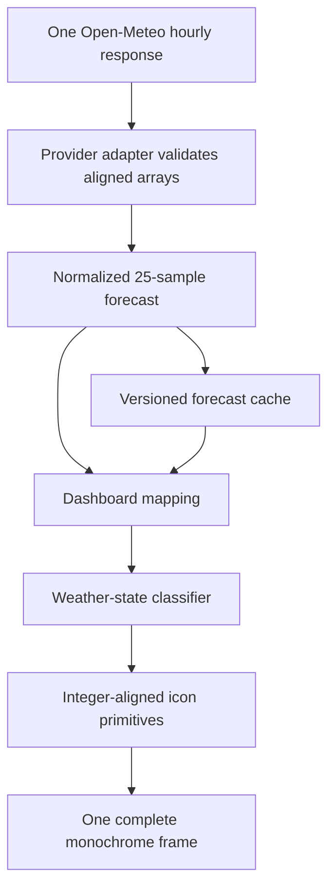

# Weather icon row for the WindScout forecast dashboard

## Goal Capsule

- **Objective:** Make every wind forecast moment immediately useful by showing whether that same moment is clear, cloudy, or rainy.
- **Means:** Extend the existing normalized forecast samples with optional weather observations and draw one compact monochrome icon below each of the 25 existing wind bars.
- **Authority:** The confirmed conversation decisions define icon placement, states, thresholds, and missing-data behavior.
- **Execution profile:** Extend the existing provider, cache, app-mapping, and deterministic renderer paths without introducing a second API request or image pipeline.
- **Stop condition:** All 25 weather slots classify and render deterministically, old wind-only caches remain usable, and missing weather never hides valid wind data.

---

## Product Contract

### Summary

Add one black-and-white weather icon beneath every existing wind sample. Each icon describes the same location and timestamp as the wind bar above it, making it possible to judge wind and weather together without adding numbers or another dashboard panel.

### Problem Frame

The current dashboard shows when it will be windy but not whether that moment is sunny, cloudy, or rainy. The empty row below the wind chart can carry this context without reducing the chart height or changing the five-day, five-samples-per-day layout.

### Requirements

**Forecast alignment**

- R1. Every available wind sample at 08:00, 11:00, 14:00, 17:00, and 20:00 shall carry weather data for the exact same location and timestamp.
- R2. Weather shall be fetched in the existing forecast request; rendering weather shall not require another API call or backend.
- R3. Weather data shall remain optional so valid wind data can still be cached and rendered when one or more weather values are absent or invalid.

**Weather classification**

- R4. A dry sample with at most 20 percent cloud cover shall show a sun during daylight and a moon after sunset.
- R5. A dry sample with 21 through 60 percent cloud cover shall show a partly cloudy day or night icon.
- R6. A dry sample above 60 percent cloud cover shall show a cloud.
- R7. Precipitation from 0.1 up to but not including 1.0 millimeter in the preceding hour shall show a cloud with one raindrop.
- R8. Precipitation of at least 1.0 millimeter in the preceding hour shall show a cloud with two raindrops.
- R9. Precipitation below 0.1 millimeter shall be treated as dry.
- R10. Rain classification shall take precedence over cloud and day/night classification.

**Dashboard presentation**

- R11. Each icon shall be centered on the same horizontal slot as its wind bar in the existing empty bottom row.
- R12. Icons shall use only pure black and white integer-aligned geometry; no gray fills, antialiasing, labels, or icon-specific dithering shall be introduced.
- R13. Missing weather data shall leave its icon position completely empty, without a placeholder or warning.
- R14. Weather icons shall not change day widths, chart scaling, header geometry, reference lines, wind bars, gust markers, wind-direction icons, or display-mode behavior.

### Key Decisions

- **One combined icon per timestamp.** (session-settled: user-approved — chosen over separate cloud and rain indicators: a single glyph keeps 25 samples legible and directly paired with each wind bar.) Governs R4-R13.
- **Two rain levels.** (session-settled: user-directed — chosen over one or three rain levels: one versus two drops communicates useful intensity without relying on very small visual differences.) Governs R7-R10.
- **Pure black-and-white iconography.** (session-settled: user-directed — chosen over gray or selectively emphasized icons: every state should remain equally crisp and avoid E-ink dithering noise.) Governs R11-R14.
- **Blank means unavailable.** (session-settled: user-directed — chosen over a dash or question mark: missing secondary weather data should not attract attention away from valid wind data.) Governs R3 and R13.

### Acceptance Examples

- AE1. Covers R1-R6. Given a daylight sample with 15 percent cloud cover and no rain, when the dashboard renders, then a sun appears directly below that sample's wind bar.
- AE2. Covers R4. Given the same clear conditions at 20:00 after local sunset, when the dashboard renders, then a moon appears instead of a sun.
- AE3. Covers R5-R6. Given dry samples with 45 and 80 percent cloud cover, when the dashboard renders, then the first is partly cloudy and the second is cloudy.
- AE4. Covers R7-R10. Given precipitation values of 0.09, 0.1, 0.99, and 1.0 millimeter, when classification runs, then the states are dry, one drop, one drop, and two drops respectively.
- AE5. Covers R3 and R13. Given valid wind values but missing cloud cover for one timestamp, when the forecast is accepted, cached, and rendered, then the wind bar remains and the weather slot is blank.
- AE6. Covers R11-R14. Given a complete 25-sample forecast, when the final frame is rendered twice, then all icons share the existing slot centers, no primitive clips, and both monochrome frames are byte-identical.

### Success Criteria

- A viewer can scan wind and weather together for all five days without reading additional text.
- Weather is present for all valid fields returned by the live KNMI Seamless request and never shifts to a neighboring forecast time.
- Updating firmware does not discard a still-valid wind-only cache solely because weather fields were added.
- The completed frame remains an 800 x 480, pure black-and-white, deterministic renderer output with one final conversion pass.

### Scope Boundaries

- No temperature, precipitation probability, amount labels, snow, fog, thunderstorm, or sunrise/sunset text.
- No color weather icons, gradients, animation, remote icon assets, or downloaded SVG/PNG files.
- No change to spots, button behavior, refresh schedule, forecast provider selection, or forecast length.
- No settings surface for weather thresholds or icon visibility in this feature.

---

## Planning Contract

### Key Technical Decisions

- KTD1. **Extend the normalized sample, not the renderer with provider fields.** Add cloud cover, precipitation, day/night, and an explicit weather-availability flag to `wind_forecast_sample_t`. Open-Meteo names and units remain contained in the provider adapter. Implements R1-R3.
- KTD2. **Treat weather as optional secondary data.** Missing or invalid weather arrays mark affected samples unavailable for weather while the existing wind validity rules continue to decide whether the forecast is usable. This prevents a secondary display enhancement from suppressing the dashboard's primary information. Implements R3 and R13.
- KTD3. **Classify before drawing.** Introduce a small provider-independent weather-state classifier with explicit boundary behavior, then let the renderer map each state to fixed geometry. This keeps thresholds testable without pixel assertions and keeps icon drawing free of meteorological rules. Implements R4-R10.
- KTD4. **Draw firmware-native glyphs.** Build sun, moon, cloud, partly-cloudy, and rain glyphs from integer-coordinate lines, circles, polygons, and filled drops in `wind_renderer.c`; do not add font glyphs or runtime assets. Implements R11-R14.
- KTD5. **Preserve deployed cache data through a versioned upgrade.** Bump the normalized forecast schema and teach the cache boundary to recognize the previous wind-only record shape, migrate its samples with weather unavailable, and publish the migrated value through the current validated record format. A later cache write replaces it naturally. Implements R3 and protects the existing last-honest-forecast behavior.

### High-Level Technical Design

The following is directional design guidance rather than implementation code.

Each weather sample has two independent validity layers: the existing wind sample remains required, while weather availability controls only the bottom-row glyph. The application maps normalized values into renderer-facing weather states so the renderer never knows Open-Meteo field names or missing-array rules.

The icon region reuses the five existing horizontal sample centers per day. Its vertical bounds are the current empty row below the wind-value separator and above the outer frame. Geometry is defined relative to a shared icon box so every state has comparable optical size and remains inside the day cell at the first and last screen edges.

### Data and Compatibility Contract

- Request `cloud_cover`, `precipitation`, and `is_day` alongside the three existing wind arrays.
- Validate documented units: cloud cover as percent, precipitation as millimeters for the preceding hour, and day/night as a boolean-like numeric value.
- Keep weather precision in the normalized model until classification: integer percent is sufficient for cloud cover; precipitation must retain at least tenths of a millimeter so the 0.1 and 1.0 boundaries are stable.
- Require all arrays that are present to have the same hourly length and timestamp ordering as wind. An absent weather array or invalid weather element marks weather unavailable instead of invalidating otherwise complete wind data.
- Append or version new persisted fields explicitly. Do not rely only on changed C struct size as an implicit migration policy.

### Sequencing

1. Extend and test the normalized forecast contract and weather classifier.
2. Extend the provider fixture and parser while preserving wind-only acceptance.
3. Add cache-version migration before changing production writes to the new shape.
4. Map normalized weather into the dashboard and render the icon row.
5. Update golden frames and run the complete host suite and device build.

### Risks and Mitigations

| Risk | Impact | Mitigation |
|---|---|---|
| New fields invalidate deployed cache records | An offline device loses its last useful forecast after OTA | Decode schema v1 explicitly and migrate it with blank weather slots before writing schema v2 |
| Optional arrays become misaligned with wind | An icon describes the wrong hour | Validate equal array lengths and select weather through the same source index as each wind sample |
| Small composite icons merge visually | Partly cloudy and rainy states become ambiguous | Use a shared icon box, optical-size tests, and device-reviewed golden fixtures with pure black/white geometry |
| Edge thresholds classify inconsistently | 0.1 or 1.0 mm changes state between parser and renderer | Store sufficient precipitation precision and centralize all thresholds in one classifier |
| The final dither pass alters icon edges | Intended crisp primitives gain noise | Feed exact black/white icon pixels into the existing single full-frame pass and assert deterministic palette output |

### Sources and Research

- [Open-Meteo KNMI Weather Model API](https://open-meteo.com/en/docs/knmi-api): confirms native total cloud cover and precipitation, derived day/night availability, hourly temporal resolution, and the meaning of KNMI Seamless.
- `firmware/main/wind_forecast.h`: current 25-sample normalized contract and schema boundary.
- `firmware/main/open_meteo_knmi_provider.c`: current single-request parser and exact-hour selection pattern.
- `firmware/main/wind_renderer.c`: deterministic 800 x 480 renderer, shared sample centers, and final monochrome conversion.
- `docs/learnings/wind-rendering.md`: preserve forecast state separately from confirmed panel identity and keep rendering deterministic.

---

## Implementation Units

### U1. Extend normalized weather data and classification

- **Goal:** Represent optional weather values and convert them into a small provider-independent state set.
- **Files:** `firmware/main/wind_forecast.h`, `firmware/main/wind_forecast.c`, `firmware/host_tests/test_wind_forecast.cpp`.
- **Approach:** Bump the forecast schema, append weather fields and availability to each sample, preserve all existing wind validation, and expose one classifier covering clear day/night, partly cloudy day/night, cloudy, light rain, and clear rain.
- **Test scenarios:**
  1. Classify daylight and nighttime clear samples into sun and moon.
  2. Verify cloud-cover boundaries at 20, 21, 60, and 61 percent.
  3. Verify precipitation boundaries immediately below, at, and above 0.1 and 1.0 millimeter.
  4. Confirm rain overrides day/night and cloud state.
  5. Confirm a sample with unavailable weather still passes wind validation and returns an unavailable weather state.

### U2. Parse weather in the existing KNMI request

- **Goal:** Populate all 25 normalized weather samples from the same hourly response as wind.
- **Files:** `firmware/main/open_meteo_knmi_provider.c`, `firmware/host_tests/fixtures/open_meteo_knmi.json`, `firmware/host_tests/test_wind_provider.cpp`.
- **Approach:** Extend the hourly query and fixture units/arrays, parse weather from the same source index selected for each required local hour, and make weather degradation independent from required wind-array validation.
- **Test scenarios:**
  1. Parse complete cloud, precipitation, and day/night arrays for all five days and verify representative timestamps.
  2. Reject present arrays whose lengths or ordering cannot align with wind.
  3. Accept complete wind with an absent weather array and mark all weather slots unavailable.
  4. Accept complete wind when one weather element is null or non-finite and blank only that sample's weather.
  5. Verify precipitation precision survives parsing at both classification thresholds.

### U3. Preserve wind-only caches across the schema change

- **Goal:** Keep the last valid deployed wind forecast usable immediately after an OTA update.
- **Files:** `firmware/main/wind_cache.c`, `firmware/main/wind_cache.h`, `firmware/host_tests/test_wind_cache.cpp`.
- **Approach:** Define the previous persisted sample/forecast representation at the cache boundary, validate its envelope and identity, translate it to the new schema with weather unavailable, and continue using the existing atomic A/B publication flow.
- **Test scenarios:**
  1. Load a valid schema-v1 cache into the schema-v2 model with unchanged wind values and blank weather.
  2. Reject a malformed, truncated, checksum-invalid, or identity-mismatched legacy record.
  3. Store and reload schema-v2 weather values without precision loss.
  4. Prefer the newest valid generation when one slot is legacy and the other is current.
  5. Preserve the active valid slot when migration or a subsequent write is interrupted.

### U4. Map and render the bottom weather row

- **Goal:** Draw one crisp weather glyph under every available forecast sample without disturbing the existing dashboard.
- **Files:** `firmware/main/wind_renderer.h`, `firmware/main/wind_renderer.c`, `firmware/main/wind_app.c`, `firmware/host_tests/test_wind_app.cpp`, `firmware/host_tests/test_wind_renderer.cpp`, `firmware/host_tests/goldens/dashboard_normal.pbm`, `firmware/host_tests/goldens/dashboard_high_wind.pbm`, `firmware/host_tests/goldens/dashboard_long_name.pbm`, `firmware/host_tests/goldens/dashboard_stale.pbm`, `firmware/host_tests/goldens/dashboard_unavailable.pbm`.
- **Approach:** Add a renderer-facing weather state per sample, derive it during app mapping, and draw fixed integer-coordinate glyphs in a shared bottom-row icon box centered on each existing sample slot. Keep unavailable slots untouched white.
- **Test scenarios:**
  1. Render every icon state in representative neighboring slots and assert no clipping or overlap with borders.
  2. Verify first-day/first-sample and fifth-day/last-sample centers align with their wind bars.
  3. Verify an unavailable weather state adds no black pixels in its icon box while its wind bar remains.
  4. Verify all three display modes produce identical weather icons and preserve their existing bar/direction behavior.
  5. Verify a complete dashboard renders deterministically with exactly one final dither pass and only palette values zero and one.
  6. Regenerate and visually inspect all dashboard goldens, including clear day, clear night, partly cloudy, cloudy, light rain, heavy rain, stale, and unavailable combinations.

### U5. Document and verify the integrated feature

- **Goal:** Make the external data dependency and device-visible behavior explicit and prove the complete firmware path remains healthy.
- **Files:** `firmware/README.md`, `docs/learnings/wind-rendering.md` only if implementation reveals a durable new rendering constraint.
- **Approach:** Document the additional hourly variables, weather thresholds, blank fallback, and cache compatibility. Do not add a learning unless execution uncovers a reusable constraint beyond this feature.
- **Test scenarios:**
  1. A live Edam response contains weather fields for the same five local sample hours used by wind.
  2. Host tests cover full, partial, and absent weather while preserving wind output.
  3. The complete firmware builds with the enlarged normalized forecast and response buffer constraints.
  4. A device frame shows all weather states at readable optical sizes with no unintended dithering or changed dashboard geometry.

---

## Verification Contract

| Verification | Covers | Expected result |
|---|---|---|
| `cd firmware && make test` | U1-U4 | Every registered host test passes, including provider, forecast, cache, app, renderer, and golden tests |
| `cd firmware && make format-check` | U1-U5 | All changed C, header, test, and documentation-adjacent source files satisfy repository formatting |
| ESP-IDF production firmware build | U1-U5 | Firmware links without memory or response-buffer regressions |
| Live KNMI Seamless request for Edam | U2, U5 | All requested hourly variables align at 08, 11, 14, 17, and 20 local time for five days |
| On-device visual check | U4, U5 | The six weather families remain distinct, centered, unclipped, and crisp at normal viewing distance |
| OTA/cache compatibility check | U3, U5 | A device with an existing wind-only cache boots into the same wind forecast with blank weather until a successful refresh |

---

## Definition of Done

- The existing request fetches cloud cover, precipitation, and day/night together with wind for every configured spot.
- Every normalized sample independently records whether weather is available.
- Classification exactly matches the approved cloud and precipitation thresholds.
- The bottom row renders one pure black-and-white icon per available sample and nothing for missing weather.
- Existing dashboard geometry, display modes, wind values, gust markers, direction arrows, refresh behavior, and spot navigation remain unchanged.
- A deployed schema-v1 wind cache remains readable after upgrading to the new firmware.
- Provider, model, cache, app, renderer, golden, full host, production-build, live-data, and physical-device checks pass.
