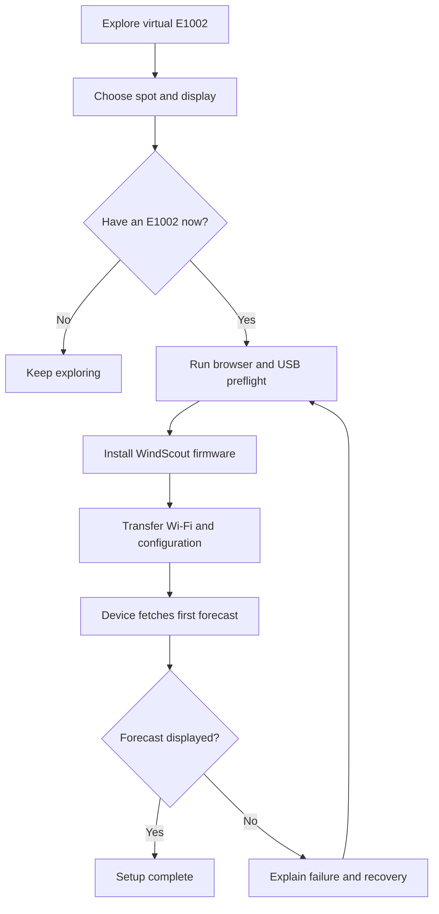
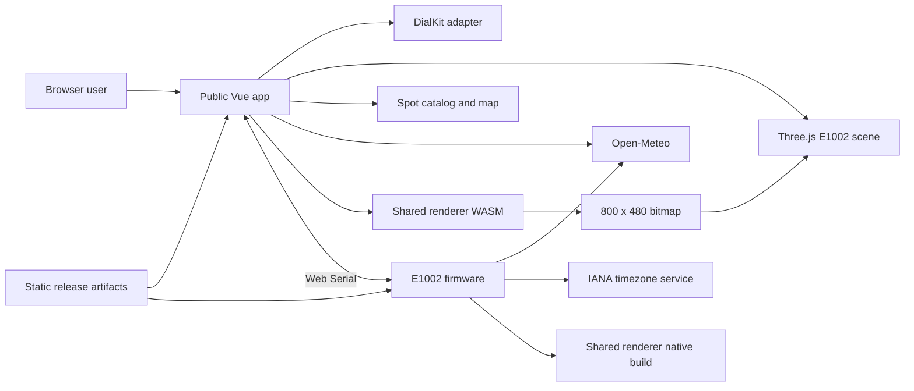
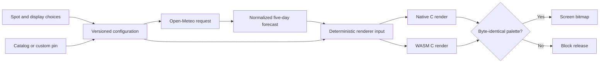
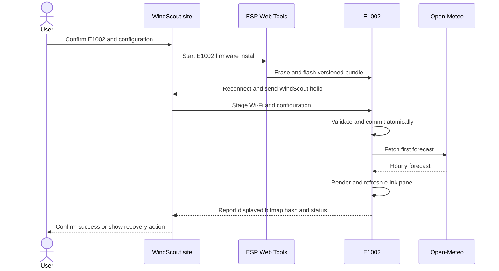
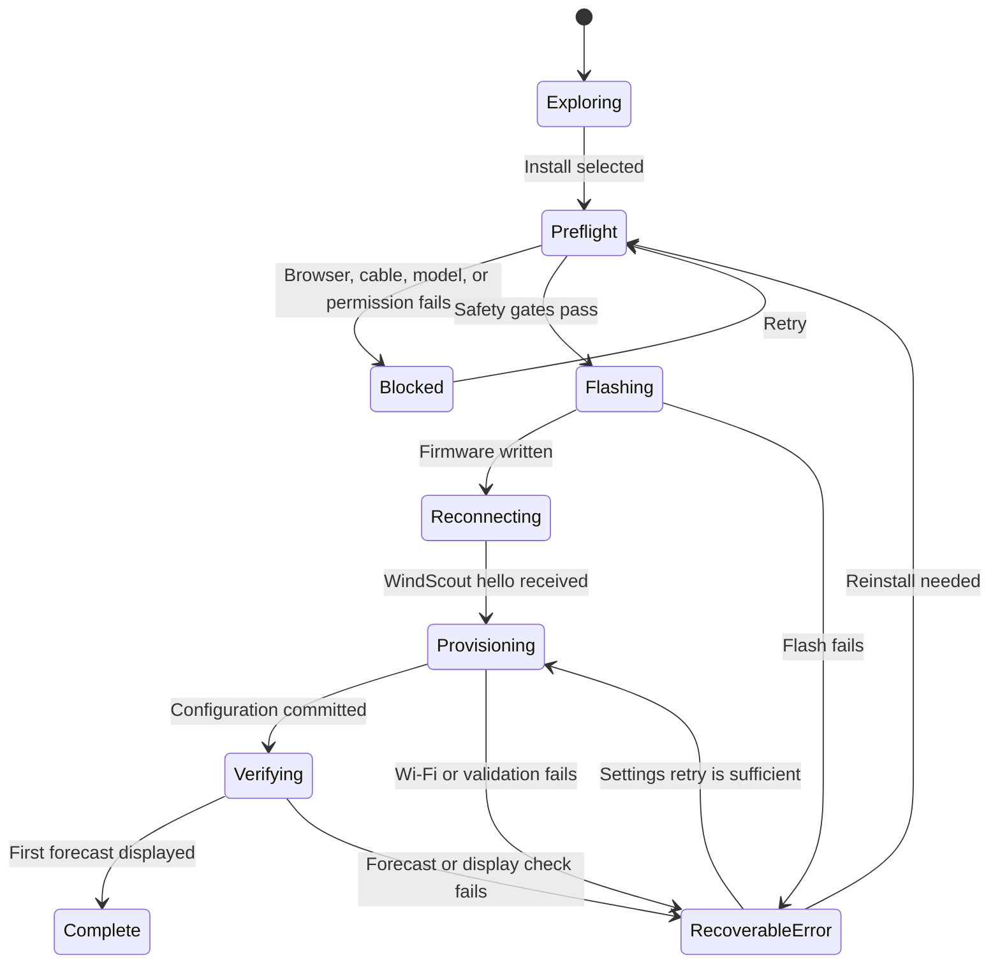
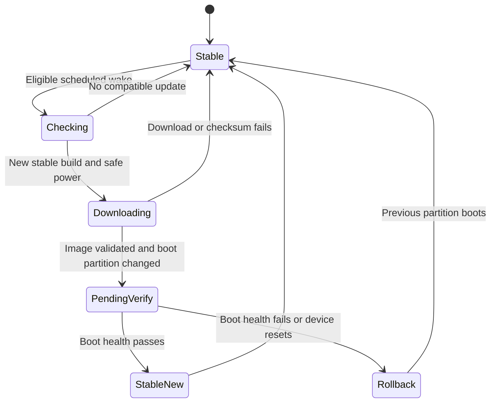

# Public 3D Configurator - Plan

## Goal Capsule

- **Objective:** A wind- or watersporter without technical knowledge can explore, configure, install, and activate a WindScout E1002 from one public website, then see a working forecast on the physical device.
- **Means:** Center the experience on an interactive 3D E1002 whose screen uses the firmware renderer, use DialKit for live display settings, and turn the configured virtual device into a physical one over USB.
- **Product authority:** This Product Contract owns the public experience, supported scope, and success conditions. The physical E1002 owns final display acceptance.
- **Execution profile:** Cross-cutting public website, configuration model, forecast preview, firmware provisioning, release, recovery, and OTA work.
- **Stop conditions:** Do not publish restricted font or 3D assets. Do not remove captive-portal recovery until USB recovery passes physical acceptance. Do not enable unattended OTA until rollback passes a deliberately broken-build test.
- **Tail ownership:** The release workflow publishes the website, first-install bundle, OTA bundle, checksums, and version manifest. The maintainer owns best-effort release approval and physical E1002 checks.

---

## Product Contract

### Summary

Build WindScout as a free, public browser experience where people configure a virtual 3D E1002 and install the matching firmware, Wi-Fi settings, and WindScout configuration over USB. The configured screen must match the physical e-ink output pixel for pixel.

### Problem Frame

WindScout already renders a useful five-day forecast, but its location, forecast model, and display choices are still embedded in firmware-oriented configuration. The existing public site can explain the idea, while the existing firmware web app can flash supported devices, but neither gives a non-technical watersporter one complete route from curiosity to a working personal forecast.

Splitting discovery, setup, Wi-Fi provisioning, and later recovery across separate sites or temporary networks makes the product feel more technical than the result warrants. A hand-built website preview also becomes misleading as display modes evolve independently from the device renderer.

### Actors

- A1. **Prospective user:** A wind- or watersporter exploring WindScout without owning hardware yet.
- A2. **E1002 owner:** A user installing, reconfiguring, or recovering a physical WindScout through a Windows or macOS computer.
- A3. **Maintainer or contributor:** A person publishing stable firmware, maintaining compatibility, or extending the open project.

### Key Decisions

- **Free public project.** (session-settled: user-directed — chosen over paid firmware with purchase recovery: adoption, openness, and creative ambition now matter more than revenue.) Governs R1, R26.
- **3D-first product surface.** (session-settled: user-directed — chosen over a wizard-first or 2D-first configurator: the physical presence of WindScout is part of the product's appeal.) Governs R2-R5.
- **Pixel-accurate preview.** (session-settled: user-directed — chosen over an approximate browser rendering: users must be able to trust that the configured screen is the screen they will receive.) Governs R10-R12.
- **E1002 first.** (session-settled: user-directed — chosen over launching E1001 and E1002 together: one device can reach physical and visual parity sooner.) Governs R6, R17.
- **One USB setup route.** (session-settled: user-directed — chosen over a temporary device Wi-Fi network in the normal flow: firmware, Wi-Fi, and configuration should feel like one installation.) Governs R15-R21.
- **Online configurator remains canonical.** (session-settled: user-approved — chosen over maintaining a second full configurator on the device: users expect to configure primarily once and can reconnect USB for later changes.) Governs R20-R22.
- **Automatic stable OTA.** (session-settled: user-directed — chosen over manual confirmation or repeated USB installs: routine maintenance should require no user attention.) Governs R24-R25.
- **Curated spots with a free map pin.** (session-settled: user-approved — chosen over place-name search alone: a named town or beach does not reliably identify the forecast point on the water.) Governs R7-R9.

### Requirements

**Public experience and accessibility**

- R1. Anyone shall be able to use the landing page, configurator, firmware installer, and source without payment, login, licence key, or WindScout account.
- R2. The primary configurator shall present an interactive 3D E1002 with the active forecast UI rendered into its screen.
- R3. Configuration controls shall remain visible and operable without manipulating the 3D scene.
- R4. Every configuration and installation action shall remain available in a reduced-motion 2D fallback with keyboard support.
- R5. The experience shall keep one primary next action visible from exploration through successful installation.
- R6. The first public release shall support only the Seeed Studio reTerminal E1002 as an installable WindScout target.

**Spot and display configuration**

- R7. A user shall be able to choose a reviewed WindScout spot from a searchable catalog.
- R8. When the catalog lacks the desired spot, the user shall be able to navigate a map, place the forecast point manually, and give it a personal name.
- R9. Spot confirmation shall show the final name, coordinates, and derived timezone before the configuration is applied.
- R10. The first release shall expose the existing background-fade, threshold-line, and solid display treatments.
- R11. A user shall be able to set a personal wind threshold in knots, with the selected treatment and threshold reflected immediately in the preview.
- R12. For the same forecast input and configuration, the browser preview shall match the final E1002 firmware bitmap at every pixel.
- R13. A user without hardware shall be able to explore every first-release display and spot option using preview forecast data.
- R14. The configuration selected during exploration shall remain active when the user continues into USB installation in the same browser session.

**USB installation and recovery**

- R15. The normal setup shall guide the user through configuration, USB connection, firmware installation, Wi-Fi transfer, WindScout configuration, and first-forecast verification as one continuous flow.
- R16. The site shall detect an unsupported browser, missing USB capability, or missing device before offering an operation that can erase flash.
- R17. The site shall prevent an E1001 or other unsupported ESP32 device from being presented as a supported E1002 installation.
- R18. Wi-Fi credentials shall travel only between the user's browser and connected device and shall not be sent to or retained by a WindScout service.
- R19. Each destructive or waiting step shall show what is happening, expected duration, safe cancellation behavior, and the next recovery action if it fails.
- R20. Setup shall finish only after the device has joined Wi-Fi, stored the chosen configuration, and either displayed its first valid forecast or reported a specific recoverable failure.
- R21. A returning owner shall be able to reconnect USB to change the spot, display treatment, threshold, or Wi-Fi without reinstalling unnecessarily.
- R22. The existing captive portal shall be removed from the supported WindScout flow only after USB Wi-Fi setup and Wi-Fi recovery pass physical-device acceptance.

**Independent runtime and maintenance**

- R23. After setup, the E1002 shall fetch forecasts and render its dashboard without the configurator website or a WindScout-hosted forecast service.
- R24. The device shall check for and install stable WindScout firmware updates automatically over Wi-Fi.
- R25. An unsuccessful OTA boot shall roll back to the last working firmware, and USB shall remain the recovery path when rollback cannot restore operation.
- R26. The project shall remain publicly inspectable and buildable from one repository containing the landing experience, configurator, shared preview authority, and firmware, while allowing separate deployment artifacts.
- R27. Maintenance shall be best effort, with critical installation, forecast, and OTA regressions prioritized and the public source available for community continuation.

### Experience Flow



### Key Flows

- F1. Explore without hardware
  - **Trigger:** A1 opens the public WindScout site.
  - **Actors:** A1
  - **Steps:** Rotate or inspect the E1002, choose a catalog or custom spot, adjust the display treatment and threshold, and compare the pixel-accurate preview.
  - **Outcome:** The user understands the product and has a configuration ready to install without needing an account or device.
  - **Covered by:** R1-R14.
- F2. First USB installation
  - **Trigger:** A2 connects an E1002 and chooses to install the active configuration.
  - **Actors:** A2
  - **Steps:** Preflight the environment and target, install stable firmware, transfer Wi-Fi and configuration locally, then wait for the device to fetch and display its first forecast.
  - **Outcome:** The physical E1002 matches the configured virtual WindScout or shows an actionable failure.
  - **Covered by:** R12, R15-R20, R23.
- F3. Reconfigure or repair
  - **Trigger:** A2 changes spot, display preferences, router, or Wi-Fi password after initial setup.
  - **Actors:** A2
  - **Steps:** Reopen the public configurator, reconnect USB, inspect the device state, change only the required settings, and verify reconnection and forecast retrieval.
  - **Outcome:** The existing WindScout is updated without an account, cloud configuration, or unnecessary full reinstall.
  - **Covered by:** R18-R22.
- F4. Automatic update and rollback
  - **Trigger:** A stable release is available during an eligible connected wake.
  - **Actors:** A2, A3
  - **Steps:** Download and validate the update, boot it from the inactive firmware partition, accept it only after a healthy start, and otherwise return to the previous firmware.
  - **Outcome:** Working devices remain current without routine user action and retain a USB recovery route.
  - **Covered by:** R24-R25, R27.
- F5. Reduced-motion fallback
  - **Trigger:** The browser or user preference disables the primary 3D experience.
  - **Actors:** A1, A2
  - **Steps:** Show the same screen preview, configuration controls, progress, and installation actions in a stable 2D composition.
  - **Outcome:** 3D enhances the product without becoming a functional prerequisite.
  - **Covered by:** R3-R5, R13-R21.

### Acceptance Examples

- AE1. **Covers R3-R5, R13.** Given no connected hardware and reduced motion enabled, when a keyboard user changes the display treatment and threshold, then the 2D preview updates and the installation action remains reachable.
- AE2. **Covers R7-R9.** Given the desired launch is absent from the catalog, when the user searches the surrounding area and places a pin on the water, then the confirmation shows the chosen name, exact point, and local timezone.
- AE3. **Covers R10-R12.** Given identical forecast data, spot, threshold, and display treatment, when the browser and E1002 render the dashboard, then their final 800 x 480 bitmaps contain no differing pixels.
- AE4. **Covers R15-R17.** Given the device reports a known E1001 identity or the user identifies it as an E1001 during the illustrated model check, when installation preflight runs, then the site explains that the model is not yet supported and performs no erase or flash operation.
- AE5. **Covers R15, R18-R20.** Given a supported E1002 and valid 2.4 GHz Wi-Fi credentials, when setup completes, then the credentials have not left the browser-device connection and the selected forecast is visible on the physical panel.
- AE6. **Covers R19-R20.** Given the device cannot join Wi-Fi, when first-forecast verification times out, then the site preserves the user's configuration and offers Wi-Fi retry without requiring a firmware reinstall.
- AE7. **Covers R21-R22.** Given an owner has replaced their router, when they reconnect USB and update Wi-Fi, then the existing dashboard configuration is preserved and forecast retrieval resumes without a captive portal.
- AE8. **Covers R24-R25.** Given a new stable build fails its healthy-start check, when the device reboots, then it returns to the previous working partition and remains recoverable over USB.

### Success Criteria

- A first-time, non-technical user can move from a supported Windows or macOS browser to a verified physical forecast in about ten minutes without a terminal, developer tool, account, or separate setup document.
- Every supported configuration has automated browser-versus-firmware bitmap parity evidence.
- The complete first-install, Wi-Fi-recovery, OTA, rollback, and USB-recovery flows pass on a physical E1002.
- The 3D and reduced-motion experiences expose the same settings, states, errors, and installation outcomes.
- A stable release publishes a compatible website, first-install artifact, OTA artifact, and version metadata from the public repository.

### Scope Boundaries

**Included**

- A public landing page, 3D E1002 configurator, settings panel, and USB installer.
- A reviewed spot catalog plus named custom map points.
- Background-fade, threshold-line, and solid treatments with a configurable knot threshold.
- Pixel-accurate browser and firmware rendering parity.
- USB firmware, Wi-Fi, configuration, verification, reconfiguration, and recovery.
- Automatic stable OTA, rollback, and best-effort public maintenance.
- Consolidation into one public source repository with separate build outputs where needed.

**Deferred for later**

- E1001 support, followed by evaluation of other e-ink devices.
- New dashboard layouts, optional getijden, and a general display-module system.
- Community spot submissions and collaborative catalog moderation.
- Sharing or exporting named configuration presets.

**Outside this product's identity**

- Payments, user accounts, licence enforcement, DRM, or paid recovery.
- A WindScout-hosted forecast gateway or required cloud runtime.
- Native Windows, macOS, Android, or iOS applications.
- A second feature-complete configurator hosted by the device.
- A 2D-only primary product experience, although 2D remains the required fallback.

### Dependencies and Assumptions

- The primary install audience has a Windows or macOS computer, a data-capable USB cable, and a browser with the required serial-device support.
- A distributable E1002 3D model can be created or licensed without constraining the public project.
- The firmware's deterministic dashboard output can become the authority for both browser preview and device rendering; planning owns the mechanism.
- Open-Meteo remains the direct, best-effort forecast source for this non-commercial hobby project, with required attribution and a replaceable provider boundary.
- Public static hosting can serve the configurator, spot catalog, version metadata, and versioned release artifacts without a user database.
- The current firmware foundations for browser flashing, rendered preview publication, inactive-partition OTA, and USB recovery remain available during the transition. Bootloader rollback is not enabled yet and must be completed by this plan.

### Risks

- **3D delays the useful route:** Prove the complete configuration-to-forecast journey before final 3D finish and motion work.
- **Preview and firmware drift:** Treat bitmap parity as a release gate for every configuration fixture.
- **Web Serial or drivers fail:** Detect capability early and provide model-specific cable, port, and recovery guidance without exposing developer tooling.
- **Wrong-target flashing damages trust:** Block destructive work until the target is confidently identified as a supported E1002.
- **Spot data is incomplete or imprecise:** Keep the custom water pin available even when catalog search succeeds.
- **Automatic OTA introduces regressions:** Publish only validated stable artifacts and retain inactive-partition rollback plus USB recovery.
- **One repository couples deployments:** Keep website, embedded device UI, first-install firmware, and OTA artifacts independently releasable.

### Sources and Existing Foundations

- `firmware/webapp/src/views/LandingPage.vue` already demonstrates an interactive browser preview and ESP Web Tools installation surface.
- `firmware/scripts/generate_manifests.py` already prepares first-install manifests and merged firmware artifacts.
- `firmware/main/wind_renderer.h` defines the three first-release display treatments.
- `firmware/main/http_server.c` already exposes the latest device-rendered forecast preview.
- `firmware/main/wifi_provisioning.c` and `firmware/main/main.c` own the captive portal that USB provisioning may replace.
- `firmware/main/ota_manager.c` and `firmware/partitions.csv` provide inactive-partition OTA and rollback foundations.
- `docs/plans/2026-08-24-1109-feat-local-wind-dashboard-plan.md` remains the authority for the existing local forecast dashboard behavior.
- [DialKit](https://joshpuckett.me/dialkit) is the production settings-panel dependency for sliders, toggles, selects, and grouped display controls.
- [ESP Web Tools](https://esphome.github.io/esp-web-tools/) documents the browser installation foundation and serial Wi-Fi provisioning option.
- [Seeed's reTerminal E-series comparison](https://wiki.seeedstudio.com/reterminal_e10xx_main_page/) confirms that E1001-E1004 share the ESP32-S3 platform and 32 MB storage, so ROM chip detection is not enclosure detection.
- [ESP-IDF OTA documentation](https://docs.espressif.com/projects/esp-idf/en/stable/esp32/api-reference/system/ota.html) defines pending-verification, valid, invalid, and rollback behavior.
- [Open-Meteo forecast documentation](https://open-meteo.com/en/docs) defines global `best_match`, an explicit IANA timezone parameter, and sea cell selection.
- [Nominatim's public usage policy](https://operations.osmfoundation.org/policies/nominatim/) disallows client-side autocomplete on the public service and shapes the submitted-search flow.
- [ESP-IDF system-time documentation](https://docs.espressif.com/projects/esp-idf/en/stable/esp32/api-reference/system/system_time.html) requires a POSIX `TZ` rule rather than an IANA zone name for libc local-time conversion.
- [AceTimeC](https://github.com/bxparks/acetimec) provides a C IANA timezone database for embedded systems; its complete current-zone database is small enough for the E1002 and avoids pretending an IANA name is a POSIX rule.

---

## Planning Contract

### Key Technical Decisions

- KTD1. **The public product becomes one root `web/` Vue application.** The existing standalone landing-page content moves into this app, while firmware remains under `firmware/` and keeps an independent build. Configurator, Three.js, DialKit, map, and WASM code load only after the visitor enters that route. This satisfies R1, R5, and R26 without embedding the 3D configurator in the device binary or slowing the landing page with product-tool assets.
- KTD2. **Portable C remains the only dashboard renderer.** Move the renderer and its font inputs into an ESP-independent component, compile the same sources into the E1002 firmware and WebAssembly with [Emscripten](https://emscripten.org/docs/compiling/WebAssembly.html), and compare their final 800 x 480 palette buffers in CI. This implements R10-R12 and avoids a browser-only reimplementation.
- KTD3. **A versioned WindScout configuration is the shared contract.** It owns device model, one active spot, coordinates, timezone, forecast policy, display mode, and threshold. Firmware stores a candidate and last-known-good generation in NVS with checksums, defaults, and migrations. The browser holds the active candidate in one Pinia store and reads redacted state back from an installed device. Network credentials use a separate write-only payload and are never included in configuration readback, browser persistence, logs, URLs, or analytics. This implements R7-R11, R14, R18, R21, and R23 while making power loss and failed Wi-Fi changes recoverable.
- KTD4. **DialKit is used directly for the production display panel.** (session-settled: user-directed — chosen over using DialKit only as inspiration: its live Vue controls match the desired configuration interaction and avoid rebuilding that control system.) A WindScout adapter binds DialKit to the canonical Pinia configuration instead of allowing DialKit persistence to become a second state owner. The first release opens one short Display group and hides no required setting behind an Advanced concept. Spot search, maps, Wi-Fi, installation progress, validation, and recovery remain product-specific UI. This implements R3-R5 and R10-R14.
- KTD5. **[Three.js](https://threejs.org/docs/) renders a licensed GLB E1002 model, and the renderer bitmap becomes its screen texture.** The screen material uses the unfiltered bitmap without lighting or color transformation. The same bitmap is shown directly in the 2D fallback. This implements R2-R4 and R12.
- KTD6. **The spot picker is static-first and keyless.** A reviewed JSON catalog ships with the site. [MapLibre](https://maplibre.org/maplibre-gl-js/docs/) renders [OpenFreeMap](https://openfreemap.org/) tiles. A submitted Nominatim search moves the map but does not choose the forecast point; the user confirms a catalog point or places the final pin. `tz-lookup` derives the timezone from the confirmed coordinates. This implements R7-R9 without a WindScout database.
- KTD7. **Open-Meteo `best_match` and an embedded IANA timezone service form the first-release global policy.** The confirmed IANA timezone is stored with the spot and sent explicitly in browser and device Open-Meteo requests with sea-oriented cell selection and the same hourly variables. Browser time conversion uses the platform `Intl` database. Firmware time conversion and scheduling use a pinned AceTimeC current-zone registry instead of passing IANA names to ESP-IDF's POSIX `TZ` parser. The normalized `wind_forecast_t` shape remains provider-neutral so explicit model comparison can be added later. This implements R9, R13, and R23 without a shared API key or hosted forecast gateway.
- KTD8. **ESP Web Tools installs the generic firmware, then a versioned WindScout serial protocol completes setup.** The installer releases and reacquires the port after reboot. The framed protocol has a fixed magic value, version, bounded length, checksum, request ID, typed result, and timeout. It stages network settings and WindScout configuration, promotes them only after validation, reports structured progress, and supports redacted readback, retry, and reconfiguration without reflashing. Physical USB access plus the browser's serial permission is the trust boundary; the protocol is unavailable over Wi-Fi. This implements R15-R21.
- KTD9. **Target confidence is a capability ladder, not a false automatic claim.** Existing WindScout firmware reports its board ID. Recognized factory metadata may also identify a model. A blank ESP32-S3 can identify its chip and flash but not reliably distinguish the E1002 enclosure from other reTerminal E-series models, because those models share the same processor and storage class. In that state the UI must say the model is unverified, show an illustrated E1002 check, and require explicit confirmation before erase. It must never label an unverified board as a detected E1002. This is the feasible safety interpretation of R16-R17.
- KTD10. **OTA uses a static stable-channel manifest and delayed boot acceptance.** A release manifest binds version, E1002 board ID, configuration compatibility, binary URL, size, and SHA-256. Firmware installs only a strictly newer compatible stable build while USB powered or at 50% battery or higher. It marks the new partition valid only after configuration migration, storage, renderer, display-driver, and scheduler health checks pass. A failed local health check explicitly requests rollback before normal tasks or deep sleep begin. Network reachability is not a boot-health condition. HTTPS, checksums, ESP image validation, and rollback provide hobby-project integrity; the release does not claim cryptographic publisher identity without the deferred secure-boot work. This implements R24-R25.
- KTD11. **Public distribution has a hard asset-provenance gate.** Embedded fonts, the E1002 GLB, and all landing-page assets need recorded provenance compatible with the public repository. CI and the release checklist must fail closed when required provenance is missing. This is required by R1 and R26.
- KTD12. **The installation surface is first-party and dependency-minimal.** All executable assets are self-hosted from immutable builds. The install route loads no analytics, advertising, remote scripts, map tiles, or forecast calls while Wi-Fi credentials are in memory. Network connections on that route are limited to the first-party release origin; Web Serial remains a separate permission that the user grants to the connected device. This reduces the credential and firmware supply-chain surface required by R18.

### Shared Configuration Contract

The contract has one version number and these owned groups:

| Group | Stored fields | Rules |
| --- | --- | --- |
| Target | Schema version and E1002 board ID | Reject unsupported future board IDs; migrate older known schemas. |
| Spot | Stable catalog or custom ID, display name, latitude, longitude, IANA timezone | Validate bounds and lengths before staging. A custom name never determines coordinates. |
| Forecast | Provider policy, resolved model metadata, and timezone-database version | Use `best_match` in v1; cached forecasts remain scoped to spot, timezone, and model. |
| Display | Treatment and threshold in whole knots | Accept only the three v1 treatments and the renderer-supported threshold range. |
| Network | SSID and password in a separate write-only transaction | Never return the password; preserve existing credentials when network fields are omitted. |

### High-Level Technical Design

#### Component topology



#### Preview data path



#### First-install sequence



#### Installer state machine



#### OTA lifecycle



### Output Structure

```text
contracts/
├── windscout-config.schema.json
└── windscout-serial-protocol.md
web/
├── public/
│   ├── devices/e1002/
│   ├── spots/
│   └── firmware/
├── src/
│   ├── configurator/
│   ├── installer/
│   ├── map/
│   ├── renderer/
│   ├── stores/
│   └── views/
└── tests/
firmware/
├── components/wind_render_core/
├── main/
├── host_tests/
└── scripts/
```

The tree shows the intended ownership boundary. Exact component filenames may change during implementation, but the public web bundle must not be embedded in firmware.

### Delivery Sequence

1. Establish the public repository layout, asset provenance, and shared configuration contract.
2. Make global forecast data, IANA time conversion, and the native/WASM renderer deterministic before building the visual shell.
3. Build the 2D configurator path and USB protocol from the shared configuration, then develop the 3D E1002 and guided installer in parallel around those proven foundations.
4. Integrate USB installation and reconfiguration while the captive portal remains available as recovery.
5. Enable delayed OTA validation, publish a complete release bundle, and pass physical acceptance.
6. Disable the captive portal in stable builds and cut the standalone site over only after recovery evidence exists.

### System-Wide Impact

- **Firmware configuration:** Build-time spot and timezone constants stop overriding user choices at boot. Existing installations receive a deterministic default migration.
- **Forecast caches:** Cache identity expands from the current hardcoded Dutch model to the stored spot, timezone, and resolved model. A configuration change invalidates only incompatible forecast and panel caches.
- **Rendering:** Font, renderer, and golden-frame changes affect host tests, firmware size, WASM output, screenshots, and release parity.
- **Privacy:** Wi-Fi secrets cross only the browser serial connection and NVS. No website storage, telemetry, query string, or error report may contain them.
- **Power:** Serial setup keeps the device awake while USB is present. OTA runs only in an eligible power state and must finish or abort before deep sleep.
- **Deployment:** Website deployment and firmware release remain independent, but the website consumes only a release manifest whose protocol and schema versions it supports.

### Assumptions and Implementation-Time Checks

- A physical E1002 is available throughout U4, U6, U7, and U8 for screen, serial, sleep, and rollback checks.
- The public host provides HTTPS, cross-origin access to versioned firmware assets, and immutable caching for hashed files while keeping the release manifest fresh.
- The E1002 3D asset is produced as a browser-ready GLB with a separate screen mesh and documented licence. Final polygon count and compression are implementation-time tuning decisions.
- DialKit remains pinned behind a local adapter. If a control fails keyboard, label, disabled-state, or error-state acceptance, fix the adapter or use a semantic WindScout control for that field without replacing DialKit as the panel system.
- Initial catalog size and geographic coverage are content work. The schema, map fallback, and review process must work with a small catalog before expansion.
- Factory-firmware model reporting is not assumed. U6 must characterize E1001 and E1002 serial metadata before claiming any automatic chassis detection.
- AceTimeC's registry and the browser timezone database can differ after political timezone changes. Tagged releases must record the embedded TZDB version, and parity fixtures must cover the zones WindScout publishes in its catalog.

### Risks and Mitigations

| Risk | Consequence | Mitigation |
| --- | --- | --- |
| Shared C code depends on ESP-only functions | WASM parity becomes impractical | Isolate allocation, time formatting, fonts, and drawing behind a portable core before adding browser bindings. |
| DialKit behaves like a developer tool in error or keyboard states | Setup feels inaccessible or unfinished | Keep it inside a WindScout adapter, test every shipped control, and keep install/validation UI outside it. |
| A blank reTerminal cannot report its enclosure model | The site could imply unsafe certainty | Show confidence explicitly, require illustrated confirmation, and never call chip detection E1002 detection. |
| Web Serial permission or reconnect behavior differs by browser and OS | Setup stops after flashing | Support current desktop Chrome and Edge, make reconnect a named step, and preserve non-secret configuration in memory through retries. |
| Malformed or oversized serial input reaches firmware | Setup crashes or secrets leak through diagnostics | Bound every frame and field, reject unknown versions and commands, zero secret buffers, and fuzz the parser on the host. |
| Nominatim usage policy or tiles change | Map search stops working | Submit searches only, cache no personal searches, keep the curated catalog and direct pin usable, and isolate map providers. |
| Open-Meteo changes availability or model coverage | Forecast is missing for a location | Keep the provider adapter replaceable, show resolved model and errors, and retain stale valid cache on the device. |
| Browser and firmware timezone databases disagree | Forecast columns or wake times shift around DST | Store the IANA name, publish the embedded TZDB version, and test UTC/local conversions on both sides at transition boundaries. |
| Automatic OTA accepts a bad boot too early | Devices become unavailable | Enable ESP-IDF rollback, delay acceptance until local health checks pass, and prove rollback with an intentionally failing image. |
| A compromised static host serves a modified update | Automatic OTA could install untrusted code | Use HTTPS, manifest and binary hashes, ESP image validation, immutable artifacts, and a protected release workflow; do not overstate this without secure boot. |
| Restricted fonts or an unclear 3D licence enter the public release | The open repository cannot be distributed safely | Replace or license assets before merge and validate a provenance manifest in release CI. |

### Alternative Approaches Considered

- **Reimplement the dashboard in Vue or Canvas:** Rejected because two renderers would make R12 a permanent synchronization problem.
- **Use DialKit only as a visual reference:** Rejected by the user in favor of the real dependency, with a WindScout adapter protecting product state and accessibility.
- **Use Improv Serial as the entire setup protocol:** Rejected because it covers Wi-Fi but not the WindScout configuration transaction, first-render status, or readback needed by R20-R21.
- **Write a fully custom browser flasher with esptool-js:** Deferred because ESP Web Tools already owns the dangerous flash mechanics and common recovery UX. Revisit only if its modal prevents the required continuous flow.
- **Make the device host the configurator:** Rejected because it duplicates the canonical product surface and couples 3D/web releases to constrained firmware storage.
- **Ship a 2D configurator first and add 3D later:** Rejected as the public product direction. Implementation still proves the underlying 2D fallback before adding the model around it.

### Deferred to Follow-Up Work

- A model-comparison or ensemble forecast UI beyond Open-Meteo `best_match`.
- Cloud-synced configurations, shareable presets, or community catalog submissions.
- Offline/PWA installation and browsers without Web Serial.
- Firmware signing, secure boot, and anti-rollback eFuse policy beyond HTTPS, checksums, ESP image validation, and dual-partition rollback.
- Removal of unrelated legacy photo-frame capabilities that do not block the WindScout experience or public distribution.

---

## Implementation Units

### U1. Establish the public web workspace and distribution gates

- **Goal:** Make this repository the canonical home for the landing page, configurator, release assets, and firmware without coupling their build outputs.
- **Requirements:** R1, R5-R6, R18, R26-R27; KTD1, KTD11-KTD12.
- **Dependencies:** None.
- **Files:** `LICENSE`, `web/package.json`, `web/package-lock.json`, `web/vite.config.js`, `web/src/App.vue`, `web/src/router/`, `web/src/views/`, `web/public/`, `web/tests/`, `README.md`, `docs/fonts.md`, `docs/assets.md`, `.github/workflows/web.yml`, `firmware/build.py`, `firmware/main/CMakeLists.txt`, tests under `web/tests/`.
- **Approach:**
  1. Create the root Vue/Vite app and migrate approved landing copy and assets from the standalone site.
  2. Keep public-site builds separate from the small embedded firmware web surface during the transition.
  3. Add dependency licences and an asset-provenance manifest for distributable public assets.
  4. Add direct routes for exploration, configuration, installation, recovery, privacy, attribution, and source.
- **Execution note:** Prove static deployment, route refreshes, and asset licensing before building feature surfaces.
- **Patterns to follow:** Reuse the existing Vue conventions in `firmware/webapp/src/` and the existing landing-page visual assets where their licences permit it.
- **Test scenarios:**
  - Opening every public route directly on the static host returns the app rather than a 404.
  - Building the public app does not copy Three.js, map, or configurator assets into `firmware/main/webapp/`.
  - Removing a required licence or provenance entry makes the distribution validation fail with the offending asset named.
  - A visitor can reach the configurator and hardware/source guidance without an account or payment step.
- **Verification:** The public app builds independently, the firmware build remains independent, all distributable assets have recorded compatible licences, and no paid-site wording remains.

### U2. Add the versioned WindScout configuration and persistence layer

- **Goal:** Replace boot-time hardcoded personal settings with one validated, migratable configuration shared by browser and firmware.
- **Requirements:** R7-R11, R14, R18, R20-R23; F2-F3; KTD3.
- **Dependencies:** U1.
- **Files:** `contracts/windscout-config.schema.json`, `firmware/main/wind_settings.c`, `firmware/main/wind_settings.h`, `firmware/main/config_manager.c`, `firmware/main/config_manager.h`, `firmware/main/wind_app.c`, `firmware/main/wind_cache.c`, `firmware/main/main.c`, `firmware/host_tests/test_wind_settings.cpp`, `firmware/host_tests/test_wind_app.cpp`, `firmware/host_tests/test_wind_cache.cpp`, `firmware/host_tests/CMakeLists.txt`, `web/src/config/`, `web/src/stores/configurator.js`, `web/tests/config/`.
- **Approach:**
  1. Define the contract owned by KTD3 in one schema description from which browser validation constants and firmware fixtures can be checked.
  2. Persist candidate and last-known-good generations, keep network secrets write-only at the protocol boundary, and expose redacted readback.
  3. Migrate an unconfigured or legacy device to the current Edam/default-treatment behavior once, then stop `wind_app_configure_runtime()` from overwriting stored choices.
  4. Scope forecast, schedule, and panel caches to the active configuration and invalidate incompatible entries after commit.
- **Execution note:** Add characterization coverage around the current hardcoded startup before changing persistence.
- **Patterns to follow:** `config_manager_*` NVS access, `wind_cache_*` identity checks, and schema-version validation in `wind_forecast_t`.
- **Test scenarios:**
  - A blank NVS loads a valid v1 default and persists it without repeatedly overwriting later edits.
  - A valid spot, timezone, treatment, and threshold survive reboot and produce the same readback except for the omitted Wi-Fi password.
  - Invalid coordinates, overlong names, unknown display modes, unsupported board IDs, and out-of-range thresholds are rejected before NVS changes.
  - A simulated future schema is rejected safely; a supported older schema migrates once and preserves meaning.
  - Changing display-only fields invalidates the panel hash but preserves compatible forecast data; changing spot or model also invalidates forecast and schedule scope.
  - A failed multi-key write leaves the previously committed application configuration and network configuration usable.
  - Power loss while writing a candidate selects the newest complete checksummed generation on reboot and never combines fields from two generations.
- **Verification:** Host tests cover defaults, validation, migrations, atomic commit, redaction, and cache invalidation; a rebooted E1002 retains an edited configuration.

### U3. Generalize spots and direct global forecast retrieval

- **Goal:** Let browser and device resolve a confirmed water location into the same global five-day forecast without a WindScout server or shared key.
- **Requirements:** R7-R9, R13, R20, R23, R27; F1-F3; KTD6-KTD7.
- **Dependencies:** U1, U2.
- **Files:** `web/public/spots/v1.json`, `web/src/map/`, `web/src/forecast/`, `web/src/views/ConfiguratorView.vue`, `web/tests/map/`, `web/tests/forecast/`, `firmware/main/idf_component.yml`, `firmware/main/wind_time.c`, `firmware/main/wind_time.h`, `firmware/main/open_meteo_knmi_provider.c`, `firmware/main/open_meteo_knmi_provider.h`, `firmware/main/open_meteo_provider.c`, `firmware/main/open_meteo_provider.h`, `firmware/main/wind_provider.h`, `firmware/main/wind_forecast.c`, `firmware/main/wind_schedule.c`, `firmware/main/wind_spots.c`, `firmware/main/wind_spots.h`, `firmware/host_tests/fixtures/open_meteo_*.json`, `firmware/host_tests/test_wind_provider.cpp`, `firmware/host_tests/test_wind_schedule.cpp`, `firmware/host_tests/test_wind_spots.cpp`.
- **Approach:**
  1. Publish a reviewed, versioned spot catalog with stable IDs, aliases, coordinates, and provenance.
  2. Add catalog search, submitted geocoding, map navigation, manual pin placement, coordinate confirmation, and local timezone derivation.
  3. Replace the KNMI/Amsterdam-only provider validation with KTD7 while preserving the normalized 08:00, 11:00, 14:00, 17:00, and 20:00 dashboard samples.
  4. Introduce one firmware timezone service over AceTimeC and route forecast normalization, day boundaries, display timestamps, and wake scheduling through it instead of libc IANA-name handling.
  5. Use the same request policy and UTC/local-time fixtures in browser tests and firmware host tests.
- **Patterns to follow:** Current `wind_forecast_validate()`, provider fixture tests, and `wind_spots_t` identifiers.
- **Test scenarios:**
  - Searching for Brouwersdam finds the reviewed spot and confirmation shows its exact water coordinates and timezone.
  - Searching for an ordinary place moves the map but does not silently select the geocoder result as the forecast point.
  - A user can place and name a pin outside the Netherlands; its coordinates and derived timezone survive the configuration round trip.
  - Open-Meteo fixtures for western Europe, the Americas, and a southern-hemisphere coastal location normalize into five complete local days.
  - Europe/Amsterdam, America/Los_Angeles, Australia/Sydney, a fixed-offset zone, and a no-DST zone convert the same UTC instants in browser and firmware before, during, and after DST transitions.
  - An unknown IANA zone or unsupported TZDB entry is rejected during staging rather than silently treated as UTC.
  - A location with incomplete hourly data returns a specific unavailable result and does not replace a valid cached forecast.
  - A geocoder, tile, or live forecast failure leaves the catalog and manual coordinate confirmation usable and shows attribution where required.
  - Repeated typing sends no geocoder traffic; each explicit search is rate-limited to the public-service policy.
- **Verification:** Browser and host fixtures produce the same normalized samples and metadata; a physical E1002 fetches a configured non-Dutch coastal forecast directly.

### U4. Build the shared native and WebAssembly renderer

- **Goal:** Make one deterministic renderer generate the browser preview and E1002 bitmap for every supported configuration.
- **Requirements:** R10-R13, R23; AE3; KTD2.
- **Dependencies:** U1, U2, U3.
- **Files:** `firmware/components/wind_render_core/CMakeLists.txt`, `firmware/components/wind_render_core/include/`, `firmware/components/wind_render_core/src/`, `firmware/main/CMakeLists.txt`, `firmware/main/wind_renderer.c`, `firmware/main/wind_renderer.h`, `firmware/main/wind_font.c`, `firmware/main/wind_font.h`, `firmware/main/fonts/`, `firmware/main/wind_app.c`, `firmware/host_tests/test_wind_renderer.cpp`, `firmware/host_tests/goldens/`, `web/scripts/build-renderer.mjs`, `web/src/renderer/`, `web/tests/renderer/`, `web/package.json`, `docs/fonts.md`.
- **Approach:**
  1. Move renderer, font, palette, and deterministic formatting code behind an ESP-independent boundary.
  2. Add threshold to the renderer input instead of leaving it hardcoded. Keep full-frame composition and one final dither pass.
  3. Compile the same core for host tests, ESP-IDF, and WebAssembly. Expose only bounded input and output memory through the browser wrapper.
  4. Store canonical input fixtures and compare native, WASM, golden, and device-reported bitmap hashes.
- **Execution note:** Preserve existing native golden output before moving files, then add the threshold behavior test-first.
- **Patterns to follow:** `docs/learnings/wind-rendering.md`, `firmware/host_tests/test_wind_renderer.cpp`, and the current `WIND_DASHBOARD_RENDER_SIGNATURE` invalidation rule.
- **Test scenarios:**
  - Covers AE3. Each forecast/configuration fixture produces byte-identical 800 x 480 native and WASM palette buffers.
  - The three display treatments at the minimum, default, and maximum thresholds match their approved goldens.
  - Long accented spot names, unavailable weather, stale forecasts, missing battery, and overflow wind values stay clipped and deterministic.
  - Invalid schema versions or undersized buffers fail without writing outside the output buffer.
  - Changing renderer semantics without updating the render signature or goldens fails the release gate.
- **Verification:** Host and browser parity suites report zero differing pixels across the configuration matrix; one device render reports the same bitmap hash as the browser fixture.

### U5. Build the 3D configurator with DialKit

- **Goal:** Deliver the public, understandable configuration experience for people with or without hardware.
- **Requirements:** R2-R14; F1, F5; AE1-AE3; KTD4-KTD6.
- **Dependencies:** U1, U3, U4.
- **Files:** `web/package.json`, `web/src/configurator/`, `web/src/components/WindScoutScene.vue`, `web/src/components/WindScoutScreen.vue`, `web/src/components/WindScoutSettings.vue`, `web/src/views/ConfiguratorView.vue`, `web/public/devices/e1002/`, `web/tests/configurator/`, `web/tests/e2e/configurator.spec.js`.
- **Approach:**
  1. Integrate pinned Three.js and DialKit dependencies behind local Vue components.
  2. Bind DialKit controls one-way to validated Pinia actions and render every accepted state through WASM immediately.
  3. Apply the bitmap as a crisp E1002 screen texture while keeping rotation, zoom, loading, and reset separate from product settings.
  4. Use the same settings and preview in a stable 2D layout when reduced motion is requested, WebGL fails, or the model has not loaded.
  5. Keep one contextual primary action: explore, confirm spot, connect device, continue setup, or retry.
- **Patterns to follow:** Vue/Pinia composition in `firmware/webapp/src/`, but not the current photo-frame branding or generic Vuetify settings layout.
- **Test scenarios:**
  - Covers AE1. A keyboard user in reduced-motion mode changes treatment and threshold, sees the preview update, and reaches installation without entering the 3D canvas.
  - Covers AE2. Catalog and custom-pin selections show final coordinates and timezone before changing the active configuration.
  - Changing a DialKit control updates Pinia once, survives route navigation in the same session, and does not enable DialKit's separate persistence.
  - WebGL failure, model failure, and slow forecast retrieval each reveal the 2D preview and an actionable state without losing configuration.
  - Opening the landing page does not download Three.js, DialKit, map, or WASM chunks; entering the configurator loads them on demand.
  - Spot, treatment, and threshold controls expose programmatic labels, focus visibility, keyboard operation, validation, disabled state, and error association.
  - The screen texture keeps exact pixel edges, aspect ratio, colors, and orientation while the surrounding model responds to scene lighting.
- **Verification:** Automated component and browser tests pass; visual review confirms the E1002 model, 2D fallback, and all DialKit states; bitmap tests prove the preview source remains the shared renderer.

### U6. Implement USB installation, provisioning, reconfiguration, and recovery

- **Goal:** Turn the configured virtual WindScout into a verified E1002 through one guided USB flow, then support later edits without unnecessary reflashing.
- **Requirements:** R15-R22; F2-F3; AE4-AE7; KTD3, KTD8-KTD9, KTD12.
- **Dependencies:** U1-U4. The protocol and 2D installer must be provable without waiting for 3D completion in U5.
- **Files:** `contracts/windscout-serial-protocol.md`, `firmware/main/wind_usb_protocol.c`, `firmware/main/wind_usb_protocol.h`, `firmware/main/main.c`, `firmware/main/wifi_manager.c`, `firmware/main/wifi_provisioning.c`, `firmware/main/config_manager.c`, `firmware/host_tests/test_wind_usb_protocol.cpp`, `firmware/host_tests/CMakeLists.txt`, `web/src/installer/`, `web/src/views/InstallView.vue`, `web/src/views/RecoveryView.vue`, `web/tests/installer/`, `web/tests/e2e/installer.spec.js`, `firmware/scripts/generate_manifests.py`.
- **Approach:**
  1. Define KTD8's framed request/response protocol so it can coexist with console noise and never logs payload secrets.
  2. Implement hello, capability, redacted readback, stage network, stage configuration, validate, commit, connection status, forecast status, retry, and reboot operations.
  3. Wrap ESP Web Tools for the generic first-install binary, then reconnect to the running WindScout protocol for provisioning and verification.
  4. Implement KTD9's confidence ladder before erase. Treat an unidentified ESP32-S3 as unverified, not as an E1002.
  5. Detect old but supported protocol versions and route the owner through a compatible firmware update before editing; reject newer unknown versions without writing.
  6. Preserve the in-memory configuration and clear secrets on success, explicit cancellation, port loss, or page unload.
  7. Keep captive-portal recovery compiled and documented until U8 authorizes its stable-build removal.
- **Execution note:** Prove protocol parsing, transaction rollback, and secret handling with host tests. Then run a minimal ESP Web Tools install-and-reconnect proof before building the finished guided UI.
- **Patterns to follow:** ESP Web Tools manifests, existing config-manager transactions, USB-connected wake behavior in `power_manager.c`, and current Wi-Fi retry handling.
- **Test scenarios:**
  - Covers AE4. A known non-E1002 identity or a declined E1002 visual confirmation blocks erase and names the supported model.
  - A blank ESP32-S3 is shown as unverified and is never described as an automatically detected E1002.
  - Covers AE5. A valid first install flashes, reconnects, commits Wi-Fi and configuration, displays a forecast, and reports a matching bitmap hash without any secret leaving the serial path.
  - Covers AE6. A wrong Wi-Fi password keeps the application configuration staged, reports join failure, and accepts a credential retry without reflashing.
  - Covers AE7. A returning device reports its E1002 board ID and redacted configuration, accepts a Wi-Fi-only or display-only edit, and preserves unrelated fields.
  - Disconnecting during flash shows the correct bootloader recovery; disconnecting during staging leaves the previous committed configuration intact.
  - Unsupported browser, insecure origin, denied port access, missing data cable, serial timeout, and protocol-version mismatch each block the next destructive action and show one recovery step.
  - A returning device on an older supported protocol is offered the matching update before configuration; a newer unknown protocol receives no write.
  - Random, truncated, oversized, repeated, and out-of-order frames cannot crash the host parser, allocate beyond its cap, commit partial data, or echo a secret.
  - Installer progress is announced to assistive technology, focus moves to the current step or actionable error, and retry returns focus to the triggering action.
- **Verification:** Host protocol tests, mocked browser tests, and physical Windows/macOS Chrome or Edge runs pass for install, retry, reconfigure, cancellation, and USB recovery; network inspection and logs contain no password.

### U7. Make automatic OTA and release publishing safe

- **Goal:** Publish compatible first-install and OTA artifacts and let working E1002 devices update automatically with real rollback protection.
- **Requirements:** R24-R27; F4; AE8; KTD10-KTD11.
- **Dependencies:** U2, U4, U6.
- **Files:** `firmware/sdkconfig.defaults`, `firmware/partitions.csv`, `firmware/main/ota_manager.c`, `firmware/main/ota_manager.h`, `firmware/main/main.c`, `firmware/main/config.h`, `firmware/scripts/generate_manifests.py`, `firmware/scripts/package_release.py`, `firmware/host_tests/test_ota_policy.cpp`, `firmware/host_tests/CMakeLists.txt`, `web/public/firmware/`, `.github/workflows/firmware-release.yml`, `README.md`.
- **Approach:**
  1. Enable ESP-IDF bootloader rollback and move partition acceptance out of `ota_manager_init()` into a local boot-health coordinator.
  2. Replace the stale GitHub repository endpoint and release scraping with the static manifest owned by KTD10.
  3. Automatically download only newer compatible stable firmware under safe power and storage conditions; retain the current image on all validation failures.
  4. Publish the OTA app binary, merged first-install binary, ESP Web Tools manifest, stable-channel manifest, checksums, schema compatibility, and provenance report from one tagged build.
  5. Make website deployment consume immutable tagged artifacts and the small mutable stable manifest.
- **Execution note:** First prove rollback using a deliberately unhealthy build. Only then enable automatic installation in stable firmware.
- **Patterns to follow:** Existing dual OTA partitions, `esp_https_ota`, tagged workflow, and local host-test policy seams.
- **Test scenarios:**
  - Covers AE8. A pending image that fails a local boot-health check reboots into the previous valid partition and records a useful reason.
  - A healthy image is marked valid only after configuration migration, storage, renderer, display-driver, and scheduler checks pass.
  - No network or an Open-Meteo outage does not reject an otherwise healthy firmware image.
  - A wrong board ID, incompatible schema range, downgrade, checksum mismatch, truncated download, or insufficient power leaves the active partition unchanged.
  - A tagged build publishes all required artifacts with one version and matching hashes; a missing asset, wrong repo URL, development flag, or restricted asset fails publication.
  - A device checks automatically on schedule, installs one eligible update, and does not retry-loop after success or a permanent compatibility rejection.
  - A device below 50% battery defers the update; the same device proceeds when USB power is present.
- **Verification:** Host policy tests and firmware build pass; the release bundle validates locally; physical healthy and intentionally broken OTA trials prove accept and rollback paths; USB recovery still reinstalls the stable merged image.

### U8. Complete physical acceptance and cut over the public experience

- **Goal:** Make the new site and USB route canonical only after the real E1002 journey is proven end to end.
- **Requirements:** R1-R27; F1-F5; AE1-AE8.
- **Dependencies:** U1-U7.
- **Files:** `web/src/`, `web/tests/e2e/`, `firmware/main/wifi_provisioning.c`, `firmware/main/main.c`, `firmware/sdkconfig.defaults`, `README.md`, `firmware/README.md`, `docs/setup.md`, `docs/recovery.md`, `docs/release.md`, `.github/workflows/web.yml`, `.github/workflows/firmware-release.yml`.
- **Approach:**
  1. Run the complete physical acceptance matrix with a factory-state E1002, a returning WindScout, wrong Wi-Fi, interrupted flash, broken OTA, and USB recovery on Windows and macOS.
  2. Compare device and browser bitmaps for every shipped treatment and threshold boundary.
  3. Disable the captive portal in stable builds only after the USB Wi-Fi recovery matrix passes; keep a documented build-time fallback until one stable release proves the cutover.
  4. Stop embedding the legacy full photo-frame web app in stable WindScout firmware. Retain only the smallest diagnostics/recovery surface required by the fallback build.
  5. Redirect the standalone site to the canonical app and remove paid copy, duplicate installer paths, and stale product names.
  6. Publish short illustrated hardware, cable, browser, privacy, recovery, contribution, and best-effort maintenance guidance inside the product and repository.
- **Execution note:** This is a release gate. Do not convert a failed physical check into documentation-only acceptance.
- **Patterns to follow:** Existing physical dashboard acceptance notes and tagged-release workflow.
- **Test scenarios:**
  - The complete F1-F5 flows and AE1-AE8 pass against the production website and tagged stable artifacts.
  - A clean browser with no device can explore every setting; a clean supported desktop can complete first setup in about ten minutes.
  - A returning device can change spot, display, threshold, and Wi-Fi through USB while offline website storage contains no secret.
  - With the captive portal disabled, wrong Wi-Fi and a replaced router remain recoverable over USB without firmware reinstall unless the firmware is damaged.
  - Old public URLs reach the canonical experience and no page promises payment, accounts, unsupported devices, or guaranteed support.
- **Verification:** The signed-off device/OS/browser matrix, parity report, release validation, recovery evidence, accessibility pass, and public documentation all exist before stable cutover.

---

## Verification Contract

### Automated gates

| Gate | Command or workflow | Proves |
| --- | --- | --- |
| Firmware host behavior | `make -C firmware test` | Configuration, forecast, renderer, protocol, cache, schedule, and OTA policy behavior. |
| Firmware formatting | `make -C firmware format-check` | C, C++, Python, and retained embedded-web formatting. |
| Public web checks | `npm ci`, then `npm run lint:check`, `npm run format:check`, and `npm test` in `web/` | Vue, DialKit adapter, map, forecast, installer, validation, and accessibility component behavior. |
| Renderer parity | `npm run test:parity` in `web/` | Native and WASM fixtures have zero differing palette bytes. |
| Browser journeys | `npm run test:e2e` in `web/` | Exploration, 2D fallback, configuration, mocked serial states, route recovery, and static-host behavior. |
| Production builds | `npm run build` in `web/` and `python3 build.py --board seeedstudio_reterminal_e1002 --step firmware` in `firmware/` | Deployable public app and E1002 firmware compile from a clean checkout. |
| Release packaging | `python3 firmware/scripts/package_release.py --validate` | First-install binary, OTA binary, manifests, hashes, compatibility, and licences agree. |

### Physical E1002 gates

- Factory-state first install on current desktop Chrome and Edge across at least one Windows and one macOS machine.
- Reconfiguration without reinstall for spot, treatment, threshold, and Wi-Fi.
- Wrong password, USB disconnect during non-destructive staging, disconnect during flash, and bootloader recovery.
- Pixel-hash comparison plus photographed panel review for all treatments and threshold boundaries.
- Successful automatic OTA, checksum rejection, incompatible-manifest rejection, deliberately failed boot, automatic rollback, and final USB reinstall.
- Battery/deep-sleep regression check after setup and after OTA.

### Release invariants

- No Wi-Fi password appears in browser storage, network requests, URLs, console output, device readback, crash reports, or CI artifacts.
- The public app never calls a WindScout configuration or forecast backend.
- Website and firmware state one compatible schema and protocol range before installation is offered.
- Stable artifacts are immutable; only the stable-channel pointer changes.
- Missing physical evidence, provenance, parity, rollback, or recovery blocks a stable release.
- The production host enforces HTTPS and restrictive security headers, and firmware artifacts are served only from the allowlisted release origin with required CORS headers.

---

## Definition of Done

- U1 is done when the canonical public app and firmware build independently from one public repository and every shipped asset has compatible provenance.
- U2 is done when personal configuration persists, migrates, validates, reads back safely, and is no longer overwritten at boot.
- U3 is done when catalog and custom water points produce direct global forecasts in browser and firmware without a key or WindScout server.
- U4 is done when every supported fixture has zero native-versus-WASM pixel differences and matches a physical E1002 bitmap hash.
- U5 is done when the 3D and reduced-motion experiences expose the same working DialKit-backed settings and primary actions.
- U6 is done when first install, retry, reconfiguration, and recovery succeed over USB with explicit target confidence and no leaked secret.
- U7 is done when stable releases publish a complete compatible artifact set and healthy/broken OTA trials prove delayed acceptance and rollback.
- U8 is done when the production journey passes the physical matrix, the captive portal is no longer required for supported recovery, and the standalone site points to the canonical experience.
- All requirements R1-R27 and acceptance examples AE1-AE8 have automated or physical evidence in the Verification Contract.
- Documentation explains hardware purchase, cable and browser requirements, setup, privacy, recovery, contribution, forecast attribution, and best-effort support in plain language.
- Abandoned experiments, duplicate renderers, stale paid flows, obsolete release URLs, unused dependencies, and temporary feature flags are removed before completion.
