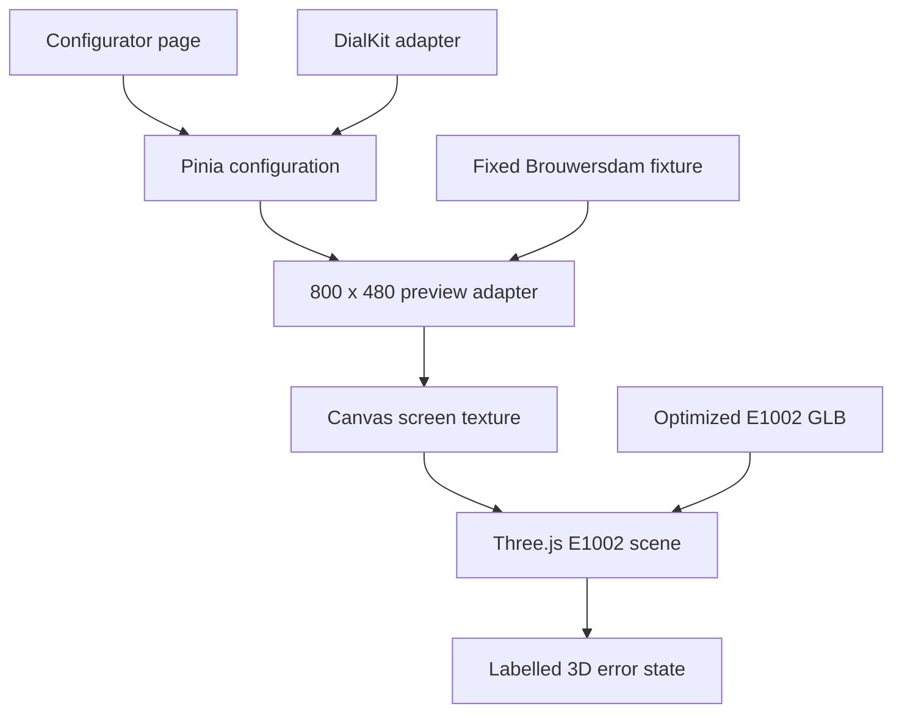
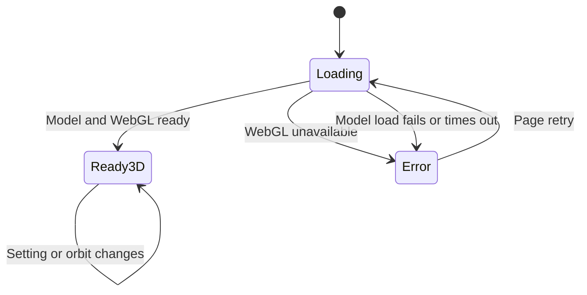

# 3D Configurator Design Prototype - Plan

## Goal Capsule

- **Objective:** A visitor can experience and judge the intended WindScout configurator through a convincing virtual E1002 whose screen and display controls respond immediately.
- **Means:** Build the real Vue web foundation around a CAD-derived Three.js model, an 800 x 480 fixture preview, and the actual DialKit Vue controls.
- **Authority:** This plan owns the first visual design slice. The origin plan remains the authority for the complete product, installation, runtime, and release.
- **Execution profile:** A 3D-only local web prototype with responsive layouts, an honest model-error state, and automated interaction, accessibility, and build checks.
- **Stop conditions:** Do not add USB, live forecasts, maps, OTA, or firmware changes. Keep the recorded Seeed permission and CAD provenance with the derived model.
- **Tail ownership:** A designer-led browser review decides whether the 3D composition, motion, settings panel, and e-ink screen feel strong enough for the next product slice.

---

## Product Contract

### Summary

Build the exciting visual core of WindScout first: one accurately shaped E1002, one live e-ink screen, and a compact DialKit panel for display mode and wind threshold. Use stable fixture data so the prototype can focus on composition, interaction, materials, motion, and clarity.

### Problem Frame

The complete WindScout roadmap combines design, firmware installation, location selection, forecasts, and updates. Building those systems together would delay the part that is most uncertain and most distinctive: whether configuring a virtual WindScout feels desirable rather than technical or gimmicky.

### Key Decisions

- **The 3D design experience is the first implementation slice.** (session-settled: user-directed — chosen over proving USB installation first: the configurator is the exciting product-defining part.) Governs R1-R15.
- **The prototype uses the real web foundation rather than a disposable mockup.** (session-settled: user-approved — chosen over a throwaway visual sketch: successful interaction and layout work should carry into the public product.) Governs R1, R9-R15.
- **The official E1001/E1002 CAD model is the geometry source.** (session-settled: user-approved — chosen over reconstructing the enclosure from photos and dimensions: Seeed provides a more accurate exterior model.) Governs R2-R6.
- **DialKit is the production settings surface.** (session-settled: user-directed — chosen over merely copying its visual style: the actual control system is part of the desired interaction.) Governs R9-R11.
- **This slice has no standalone 2D mode.** (session-settled: user-directed — the virtual object is the product-defining interaction; narrow and reduced-motion layouts keep a restrained 3D scene, while technical failure is shown honestly.) Governs R12-R14.

### Requirements

**Virtual device**

- R1. The primary view shall present the E1002 as the visual focus rather than as decoration beside a conventional settings page.
- R2. The model shall preserve the official 176 x 120 x 17 mm enclosure and 53 mm mounted-stand depth, plus its recognizable bezel, buttons, ports, and back.
- R3. The optimized web model shall keep the body, screen, controls, and stand as independently addressable meshes.
- R4. The E1002 screen shall display an unfiltered 800 x 480 WindScout preview with the correct aspect ratio and orientation.
- R5. Pointer users shall be able to rotate and modestly zoom the device without losing the intended hero composition.
- R6. Camera limits, initial framing, lighting, materials, shadows, and one view-dependent screen glare shall make the object feel physical without adding scene chrome.

**Display configuration**

- R7. The preview shall use one deterministic five-day Brouwersdam fixture and shall not call a live forecast service.
- R8. The preview shall expose the current background-fade, threshold-line, and solid display treatments.
- R9. The settings panel shall use the actual DialKit Vue dependency for the display treatment and wind threshold controls.
- R10. Changing a control shall update the E1002 screen immediately through one canonical configuration store.
- R11. The threshold shall default to 17 knots and remain adjustable across the useful 5–35 knot prototype range.

**Experience quality**

- R12. The page shall keep the virtual device dominant while the settings panel remains compact, understandable, and always reachable.
- R13. The E1002 shall remain a restrained 3D view at narrow widths and with reduced motion; unavailable WebGL or a failed model load shall show a labelled error state with retry guidance.
- R14. All settings shall remain keyboard-operable and labelled independently of the 3D canvas.
- R15. The floating inspector shall include an “Install on device” continuation that opens an inline next-slice explanation and performs no USB action.

### Acceptance Examples

- AE1. **Covers R1-R6.** Given the configurator is ready, when the visitor drags and zooms, then the E1002 moves within constrained angles while the screen remains readable and the accurate CAD geometry stays unchanged.
- AE2. **Covers R7-R11.** Given the fixture forecast is visible, when the visitor changes treatment or threshold in DialKit, then the screen updates immediately without reloading the model or page.
- AE3. **Covers R9-R14.** Given a keyboard-only visitor, when focus moves through the display controls, then every setting can be changed and its current value is announced without entering the 3D canvas.
- AE4. **Covers R13-R14.** Given a narrow or reduced-motion environment, when the configurator opens, then the E1002 remains available in a restrained 3D composition; if 3D cannot start, the page clearly explains that failure without presenting a substitute view as the configured device.
- AE5. **Covers R15.** Given the visitor likes the configured device, when they activate the installation continuation, then the page explains that device installation is the next product slice and performs no USB action.

### Success Criteria

- The first screen reads as a WindScout product experience within a few seconds, with the E1002 and its forecast screen clearly dominant.
- Treatment and threshold changes feel immediate and visually legible on the 3D screen.
- The normal desktop scene remains responsive during orbit interaction and does not visibly degrade the 800 x 480 screen texture.
- A design review can judge composition, device realism, motion, DialKit fit, responsive behavior, and the transition toward installation without waiting for firmware work.
- The approved desktop screenshots at 1440 x 900 and 1024 x 768 keep the full device, active screen, display controls, and primary continuation legible without page-level horizontal scrolling.

### Scope Boundaries

**Included**

- A new root `web/` Vue application and configurator route.
- A CAD-derived, web-optimized E1002 model with recorded provenance.
- A minimal Three.js product scene and an honest error state.
- A fixture-backed 800 x 480 preview with the three existing display treatments.
- Actual DialKit controls for treatment and threshold.
- Responsive, accessible layout and focused browser QA.

**Deferred to follow-up work**

- Shared native/WASM pixel parity with firmware.
- Spot catalog, search, map, custom pin, and live Open-Meteo data.
- USB detection, flashing, Wi-Fi, configuration transfer, and verification.
- Automatic OTA, rollback, captive-portal removal, and release publishing.
- Landing-page migration, production hosting, analytics policy, and old-site redirects.
- E1001 support, tides, additional layouts, and mobile native apps.

### Sources and Constraints

- `docs/plans/2026-08-26-0630-feat-public-3d-configurator-plan.md` owns the complete product roadmap and later integration boundaries.
- `firmware/main/wind_renderer.c` and `firmware/main/wind_renderer.h` own the existing dashboard composition, modes, 800 x 480 dimensions, and current 17-knot threshold.
- The standalone site's forecast SVG and visual language are useful references, but its Berkeley Mono files cannot be copied into a public build without redistribution permission.
- [Seeed's E1002 documentation](https://wiki.seeedstudio.com/getting_started_with_reterminal_e1002/) records the enclosure dimensions and links the official exterior CAD asset.
- [The official E1001/E1002 STEP model](https://files.seeedstudio.com/wiki/reterminal_e10xx/res/reTerminal_E1001_E1002_3D.stp) is the geometry source. The project owner confirmed direct permission from Seeed Studio to use its derived GLB on 26 August 2026.
- DialKit 1.4.3 and Three.js are MIT-licensed dependencies. DialKit remains isolated behind WindScout-owned Vue components.
- [`occt-import-js`](https://github.com/kovacsv/occt-import-js) provides the local Node STEP importer under LGPL-2.1. Its runtime and WASM remain development-only.
- [Three.js `GLTFExporter`](https://threejs.org/docs/pages/GLTFExporter.html) provides the final binary export through the same pinned Three.js dependency used by the scene.

---

## Planning Contract

### Key Technical Decisions

- KTD1. **Create a root `web/` Vue/Vite application.** The prototype uses the final public-app boundary instead of modifying the firmware-embedded photo-frame UI. This implements R1 and R12-R15.
- KTD2. **Convert the official STEP model into a small GLB offline.** A Node asset script uses `occt-import-js` only as a development converter and Three.js `GLTFExporter` for the binary output. It inventories the assembly, keeps exterior geometry, creates a measured screen plane, verifies the exported GLB, and emits a provenance record. The permitted optimized GLB ships with the public app. This implements R2-R4.
- KTD3. **Keep the product scene intentionally minimal.** Three.js owns the camera, lights, contact shadow, orbit constraints, and model loading. The page shell contains only the scene and one floating DialKit inspector. This implements R1, R5-R6, and R12-R14.
- KTD4. **Use an 800 x 480 browser preview adapter for this slice.** The adapter renders the deterministic fixture into a crisp screen canvas and supports the three modes plus adjustable threshold. Its boundary is designed for later replacement by the shared WASM renderer without changing the scene or settings contract. This implements R4 and R7-R11.
- KTD5. **Use DialKit directly but not as a second state owner.** WindScout Vue components translate DialKit changes into one Pinia store, and DialKit persistence remains disabled. This implements R9-R11 and R14.
- KTD6. **Keep this slice 3D-only.** Responsive layouts preserve the same scene and controls. WebGL and model-load failures expose a labelled error state, while reduced motion avoids ornamental animation rather than replacing the product. This implements R10 and R13-R15.
- KTD7. **Self-host only redistributable fonts.** Use Inter and a compatible OFL mono face in the prototype rather than copying Berkeley Mono or its derived assets.

### High-Level Technical Design

#### Component topology



#### Experience states



### Output Structure

```text
web/
├── public/devices/e1002/
├── scripts/
├── src/
│   ├── assets/
│   ├── components/
│   ├── configurator/
│   ├── fixtures/
│   ├── renderer/
│   ├── stores/
│   └── views/
└── tests/
```

### Risks and Mitigations

| Risk | Consequence | Mitigation |
| --- | --- | --- |
| The converted CAD model is too heavy | Loading and orbit feel sluggish | Remove internal parts, simplify hidden surfaces, compress geometry, and keep the generated GLB at or below 3 MB. |
| CAD permission becomes hard to trace later | A future maintainer may unnecessarily remove or replace the model | Keep the project owner's Seeed permission confirmation, pinned source hash, and transformation provenance beside the shipped GLB. |
| DialKit reads as a separate settings page | The device stops feeling like the product | Keep one compact rounded inspector floating over the preview on wide screens and overlapping below it on narrow screens. |
| The 3D object competes with its screen | Settings changes become hard to judge | Keep a designed hero angle, modest orbit limits, and screen-aware lighting. |
| Fixture rendering drifts from firmware | Later integration requires visual rework | Mirror current layout and modes, keep the preview behind a replaceable adapter, and avoid claiming pixel parity in this slice. |
| Mobile layout becomes a compressed desktop scene | The experience feels broken on small screens | Give the 3D stage its own mobile composition and keep controls below it without adding a second view mode. |

---

## Implementation Units

### U1. Establish the public configurator foundation

- **Goal:** Create the production-shaped Vue application, design tokens, fixture data, configuration store, and preview adapter.
- **Requirements:** R4, R7-R12, R14-R15; KTD1, KTD4-KTD5, KTD7.
- **Dependencies:** None.
- **Files:** `web/.gitignore`, `web/package.json`, `web/package-lock.json`, `web/vite.config.js`, `web/index.html`, `web/src/main.js`, `web/src/App.vue`, `web/src/styles/`, `web/src/stores/configurator.js`, `web/src/fixtures/brouwersdam.js`, `web/src/renderer/previewRenderer.js`, `web/tests/configurator-store.test.js`, `web/tests/preview-renderer.test.js`.
- **Approach:**
  1. Scaffold Vue, Pinia, Vitest, and the self-hosted font packages under the new `web/` boundary.
  2. Define the treatment and threshold state with a 17-knot default and validation for the prototype range.
  3. Translate the current dashboard structure into a deterministic 800 x 480 preview adapter using the fixed fixture.
  4. Render the output as a canvas that remains crisp when used directly or as a texture.
- **Execution note:** Prove mode and threshold output with deterministic tests before styling the full page.
- **Patterns to follow:** Existing forecast SVG in the standalone site and display-mode semantics in `firmware/main/wind_renderer.c`.
- **Test scenarios:**
  - The default fixture renders an 800 x 480 frame with Brouwersdam, five days, five samples per day, and a 17-knot threshold.
  - Each accepted treatment produces a visibly distinct deterministic frame.
  - Threshold values at 5, 17, and 35 knots move the treatment boundary and label without changing fixture data.
  - Unknown treatments and out-of-range thresholds are rejected without corrupting the last valid state.
- **Verification:** The new app starts independently of firmware, store tests pass, and the preview remains sharp at its native resolution.

### U2. Produce the browser-ready E1002 model

- **Goal:** Turn Seeed's exterior CAD asset into an efficient, scene-ready E1002 GLB with a separately targetable screen.
- **Requirements:** R2-R4; KTD2, KTD7.
- **Dependencies:** U1.
- **Files:** `web/scripts/prepare-e1002-model.mjs`, `web/public/devices/e1002/e1002.glb`, `web/public/devices/e1002/provenance.json`, `web/src/assets/e1002.js`, `web/tests/model-asset.test.js`, `docs/assets.md`.
- **Approach:**
  1. Download the named STEP source into a temporary conversion workspace instead of committing it as a source asset.
  2. Tessellate it through the development-only importer, convert the resulting meshes through Three.js, and simplify the exterior geometry with recorded settings.
  3. Remove internal parts and map body, controls, ports, and stand into stable mesh roles. Add a measured 800:480 screen plane when the imported assembly does not provide one.
  4. Normalize scale, axes, origin, normals, and materials before exporting the public GLB.
  5. Record source URL, pinned source hash, converter versions, transformation, output hash, dimensions, and confirmed permission basis.
- **Execution note:** First produce a silhouette-correct model and verify screen placement. Spend polygon budget only on details visible in the intended orbit range.
- **Patterns to follow:** The dimensions and hardware overview in Seeed's official E1002 documentation.
- **Test scenarios:**
  - The GLB loads without missing buffers or textures and exposes the required mesh roles.
  - Its normalized bounding box preserves the 176:120:17 enclosure proportions and the 53 mm mounted-stand depth within the documented tolerance.
  - The screen plane matches the 800:480 aspect ratio and faces outward in the default pose.
  - The optimized artifact is no larger than 3 MB and contains no hidden high-density internals.
  - Missing provenance or an unconfirmed redistribution flag fails the asset contract.
- **Verification:** A local model inspection shows the correct silhouette, screen, controls, ports, back, and stand with no visible tessellation holes.

### U3. Build the minimal Three.js product scene

- **Goal:** Present the E1002 as a tactile product object whose live screen stays readable during controlled interaction.
- **Requirements:** R1-R6, R10, R12-R14; AE1, AE4; KTD3-KTD4, KTD6.
- **Dependencies:** U1-U2.
- **Files:** `web/src/components/WindScoutScene.vue`, `web/src/configurator/sceneController.js`, `web/src/configurator/sceneLifetime.js`, `web/src/configurator/modelLoader.js`, `web/src/configurator/screenTexture.js`, `web/tests/scene-controller.test.js`, `web/tests/scene-lifetime.test.js`, `web/tests/model-loader.test.js`.
- **Approach:**
  1. Load the GLB lazily and apply product materials, restrained studio lighting, and a contact shadow.
  2. Feed the preview canvas into the dedicated screen material without texture filtering, tone mapping, or scene lighting.
  3. Constrain orbit and zoom around a designed hero pose without adding view-control buttons outside the canvas.
  4. Release render resources and listeners when the scene unmounts.
- **Execution note:** Establish the hero pose and screen legibility before adding material nuance or motion polish.
- **Patterns to follow:** Three.js GLTF loading, color-management, and texture-disposal guidance for the pinned dependency version.
- **Test scenarios:**
  - Covers AE1. Drag and zoom remain within their limits while the approved initial pose keeps the screen readable.
  - A store update changes the screen texture without reloading the GLB or resetting the orbit.
  - The screen keeps crisp edges and correct color while the enclosure responds to light.
  - A model-load or WebGL failure exposes the labelled 3D error state; reduced motion retains a static-on-idle scene.
  - Mounting and unmounting the scene repeatedly does not leave duplicate animation loops, observers, or controls.
- **Verification:** The scene remains responsive on the target desktop viewport, the screen stays readable across its allowed orbit, and the automated controller tests pass.

### U4. Compose and polish the configurator experience

- **Goal:** Combine the scene, DialKit panel, error state, and next-slice continuation into one coherent design prototype.
- **Requirements:** R1, R7-R15; AE2-AE5; KTD1, KTD3, KTD5-KTD7.
- **Dependencies:** U1-U3.
- **Files:** `web/src/views/ConfiguratorView.vue`, `web/src/components/WindScoutSettings.vue`, `web/src/components/InstallContinuation.vue`, `web/src/styles/configurator.css`, `web/tests/settings.test.js`, `web/tests/configurator-view.test.js`, `web/tests/e2e/configurator.spec.js`, `web/playwright.config.js`.
- **Approach:**
  1. Make the E1002 the dominant desktop region and place one compact DialKit display group beside it.
  2. Bind treatment and threshold controls through the canonical store and disable DialKit persistence.
  3. Add designed loading, model-error, reduced-motion, and narrow 3D compositions.
  4. Make the installation continuation reveal an inline explanation of the next product slice without offering USB behavior.
  5. Refine hierarchy, typography, spacing, material response, focus, and restrained transitions through browser screenshots.
- **Execution note:** Use iterative browser screenshots to improve the composition. Stop adding detail when the device, screen, and two controls already communicate the product clearly.
- **Patterns to follow:** The standalone WindScout site's restrained visual language, not its paid copy or restricted font files.
- **Test scenarios:**
  - Covers AE2. Changing either DialKit control updates the preview while leaving the scene pose unchanged.
  - Covers AE3. A keyboard user can reach, understand, and change both settings and activate the continuation.
  - Covers AE4. Reduced motion and small screens retain the 3D device and controls; unavailable 3D shows a clear error.
  - Covers AE5. The continuation names installation as upcoming and makes no serial or network request.
  - Loading, error, hover, focus, dragging, and narrow-layout states remain visually coherent in browser snapshots.
- **Verification:** Component and browser tests pass, desktop and narrow screenshots are approved, and a designer can evaluate the complete experience without hardware.

---

## Verification Contract

| Gate | Evidence | Proves |
| --- | --- | --- |
| Unit behavior | `npm test` in `web/` | Store, fixture renderer, asset contract, scene controller, and DialKit adapter behavior. |
| Local model preparation | `npm run model:prepare` in `web/` | The official STEP source converts reproducibly into the ignored local GLB and provenance record. |
| Browser journey | `npm run test:e2e` in `web/` | 3D interaction, keyboard operation, responsive states, and truthful continuation. |
| Production build | `npm run build` in `web/` | The prototype compiles as an independent static application. |
| Asset inspection | GLB dimensions, mesh-role, hash, and size report | The model is accurate enough, efficient, reproducible, and provenance-gated. |
| Visual review | Desktop, reduced-motion 3D, error, and narrow 3D screenshots | The device remains dominant and the settings experience feels intentional. |

No firmware build, hardware test, live forecast call, serial permission, or deployment is required for this slice.

---

## Definition of Done

- U1 is done when the independent Vue app renders deterministic 800 x 480 fixture frames for all treatments and threshold boundaries.
- U2 is done when the permitted CAD-derived GLB ships with the app, exposes stable mesh roles, preserves exterior proportions, and carries its provenance record.
- U3 is done when the virtual E1002 has an approved hero pose, controlled orbit, crisp live screen, idle-on-demand rendering, and an honest error state.
- U4 is done when actual DialKit controls, responsive layout, accessible interaction, and the truthful continuation form one coherent design prototype.
- Automated unit, browser, build, and asset checks pass.
- Desktop, reduced-motion, loading, error, and narrow visual states have current review screenshots.
- The diff contains no USB, map, live forecast, OTA, captive-portal, or firmware behavior.
- Restricted Berkeley Mono files and unlicensed public CAD derivatives are not introduced into a publishable path.
- Temporary conversion files, abandoned scene experiments, duplicate state, and unused dependencies are removed.
