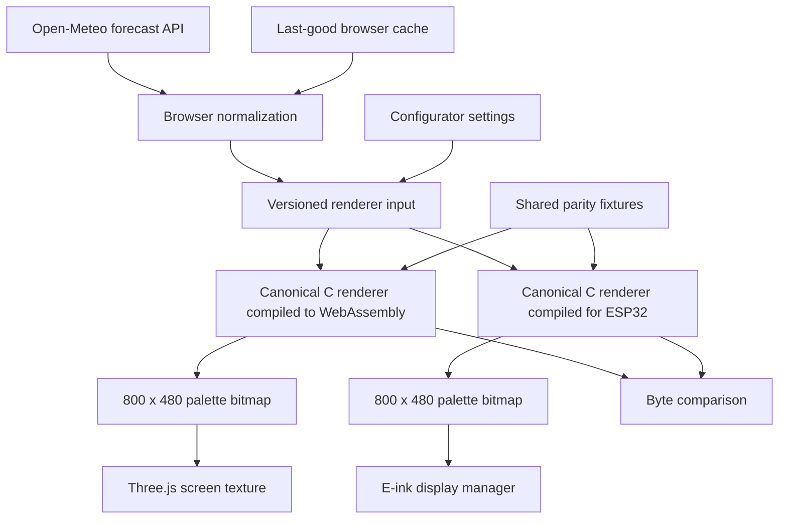
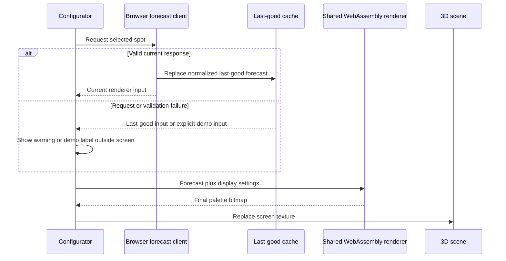

# Shared forecast renderer for device and configurator - Plan

## Goal Capsule

- **Objective:** WindScout owners see a trustworthy, current device preview whose forecast interface is pixel-for-pixel identical to the physical e-ink display for the same inputs.
- **Means:** Compile the existing device renderer for ESP32 and WebAssembly behind one versioned render contract (KTD1-KTD2).
- **Product authority:** This plan owns forecast rendering parity and live forecast preview behavior. Spot discovery, device installation, new display designs, tides, and exceptional device-state previews remain separate work.
- **Open blockers:** None.
- **Execution profile:** Implement parity test-first, then replace the browser-only renderer, then add live forecast behavior.
- **Tail ownership:** CE Work owns local implementation and verification; shipping remains separate.

---

## Product Contract

### Summary

WindScout will use one forecast renderer for both the physical device and the browser configurator. The configurator will show current forecast data inside the 3D device preview and must produce the same final 800 × 480 bitmap as the device when given identical inputs.

### Problem Frame

The current device firmware and browser configurator draw similar forecast screens through separate implementations. Visual changes can therefore reach one surface without reaching the other, and the browser preview can suggest an outcome that the physical device will not reproduce.

The configurator is also limited to fixed example data. A prospective owner cannot yet choose a spot and see the forecast the configured WindScout would display.

### Key Decisions

- **Require exact bitmap parity.** (session-settled: user-directed — chosen over approximate visual parity: separate renderers would continue to drift.) Governs R1-R5.
- **Show a current forecast before device installation.** (session-settled: user-approved — chosen over a fixed demo or waiting for an attached device: the configurator should demonstrate a realistic result immediately.) Governs R6-R10.
- **Keep exceptional device states out of the first release.** (session-settled: user-approved — chosen over previewing offline, stale-data, and battery states now: the first release stays focused on the normal forecast.) Governs R11.
- **Keep failed refreshes useful and honest.** (session-settled: user-directed — chosen over clearing the preview or silently substituting demo data: the last successful preview remains visible with an external warning.) Governs R13-R14.

### Requirements

**Single rendering authority**

- R1. The device renderer shall be the sole authority for forecast-screen layout, typography, icons, threshold treatments, weather presentation, palette conversion, and dithering.
- R2. Firmware and browser shall execute the same renderer rather than maintain separate drawing implementations.
- R3. The shared renderer shall accept a platform-neutral forecast, visible status, and display configuration as its complete rendering input.
- R4. The shared renderer shall return a deterministic 800 × 480 final bitmap without performing networking, persistence, device I/O, or browser UI work.
- R5. Given identical renderer inputs and renderer version, firmware and browser shall produce byte-identical final bitmaps.

**Live configurator preview**

- R6. The configurator shall show Brouwersdam with current forecast data when no other spot has been selected.
- R7. Selecting another spot shall fetch its current forecast in the browser and update the 3D device preview without requiring an attached WindScout.
- R8. Browser forecast retrieval shall not require a WindScout-hosted forecast or rendering service.
- R9. Provider-specific forecast data shall be normalized before it enters the shared renderer.
- R10. Configurator settings that affect the screen shall update the shared renderer input and the 3D texture from its resulting bitmap.
- R13. A failed forecast refresh shall retain the last successful preview and show a subtle freshness warning outside the device screen.
- R14. A first visit without a successful forecast shall show the Brouwersdam fixture as an explicitly labeled demo rather than presenting it as current data.

**Release boundary**

- R11. The first release shall preview only the normal current-forecast state; offline, stale-data, unavailable-data, and battery-state simulation are deferred.
- R12. New display designs, tides, spot-database curation, firmware flashing, and device provisioning shall not be added as part of renderer unification.

### Actors

- A1. **Prospective or existing WindScout owner:** explores a realistic forecast and configures how it will appear.
- A2. **Browser configurator:** obtains current forecast data, normalizes it, invokes the shared renderer, and presents the bitmap on the 3D model.
- A3. **WindScout firmware:** obtains or restores forecast data, invokes the same renderer, and publishes its bitmap to the e-ink panel.

### Key Flows

- F1. Open the configurator without a device
  - **Trigger:** A1 opens the configurator with no saved spot selection.
  - **Actors:** A1, A2
  - **Steps:** A2 selects Brouwersdam, retrieves its current forecast, normalizes the response, renders the final bitmap, and applies it to the 3D model.
  - **Outcome:** A1 immediately sees a realistic current WindScout screen.
  - **Covered by:** R3-R4, R6, R8-R10
- F2. Preview another spot
  - **Trigger:** A1 selects a different supported location.
  - **Actors:** A1, A2
  - **Steps:** A2 retrieves and normalizes that location's current forecast, passes it with the current settings to the shared renderer, and replaces the preview texture.
  - **Outcome:** The 3D preview shows what a WindScout would render for that input.
  - **Covered by:** R3-R4, R7-R10
- F3. Change a display setting
  - **Trigger:** A1 changes a setting that affects the forecast screen.
  - **Actors:** A1, A2
  - **Steps:** A2 updates the renderer input and rerenders without refetching unchanged forecast data.
  - **Outcome:** The preview responds immediately through the authoritative renderer.
  - **Covered by:** R1-R5, R10
- F4. Release a renderer change
  - **Trigger:** A forecast-screen layout, font, icon, treatment, or dithering rule changes.
  - **Actors:** A2, A3
  - **Steps:** The same renderer change is built for browser and firmware and evaluated with identical fixtures.
  - **Outcome:** The change cannot ship when either target produces a different final bitmap.
  - **Covered by:** R1-R5
- F5. Handle a browser forecast failure
  - **Trigger:** The live forecast request fails or returns unusable data.
  - **Actors:** A1, A2
  - **Steps:** A2 keeps the last successful rendered bitmap and reports that it could not refresh. Without a successful bitmap, A2 renders the Brouwersdam fixture and labels it as a demo outside the device screen.
  - **Outcome:** A1 keeps a useful preview without mistaking example or older data for a current forecast.
  - **Covered by:** R13-R14

### Acceptance Examples

- AE1. **Covers R1-R5.** Given the same normalized 25-sample forecast, settings, status, and renderer version, when firmware and browser render it, then their 800 × 480 final bitmap bytes are identical.
- AE2. **Covers R6, R8-R9.** Given a first-time visitor with no attached device or saved spot, when the configurator opens online, then it displays a current Brouwersdam forecast without contacting a WindScout-owned backend.
- AE3. **Covers R7-R10.** Given a visitor selects another supported location, when its forecast succeeds, then the values and screen texture change to that location without reloading the page or attaching hardware.
- AE4. **Covers R1-R5, R10.** Given the same forecast and a changed threshold treatment, when both targets rerender, then the treatment changes identically and their final bitmaps still match byte for byte.
- AE5. **Covers R4, R10.** Given unchanged forecast data and a display-setting change, when the preview updates, then no new forecast request is required.
- AE6. **Covers R11-R12.** Given the first renderer-unification release, when its configurator controls are inspected, then it adds no exceptional-state simulator, tides, flashing flow, provisioning flow, or spot-database editor.
- AE7. **Covers R13.** Given a successful current preview followed by a failed refresh, when the request ends, then the previous bitmap remains visible and a freshness warning appears outside the device screen.
- AE8. **Covers R14.** Given a first visit whose live request fails, when the configurator settles, then the Brouwersdam fixture is visible and labeled as demo data outside the device screen.

### Success Criteria

- Every shared golden forecast fixture produces one byte-identical firmware and browser bitmap.
- The configurator no longer contains an independently maintained forecast drawing implementation.
- Brouwersdam and a newly selected supported location both display current forecasts in the 3D preview without an attached device or WindScout backend.
- Existing device rendering behavior remains valid on physical hardware after the renderer becomes shared.

### Scope Boundaries

**Deferred for later**

- Preview controls for offline, stale, unavailable, and battery states.
- Tide data and tide-specific display layouts.
- Additional display designs beyond those already supported by the device renderer.
- Curated spot-database discovery and map pinning.

**Outside this work**

- Firmware flashing, Wi-Fi provisioning, OTA delivery, and device installation.
- Hosting forecast responses or rendered images for installed WindScout devices.
- Replacing the current forecast provider strategy.

### Product Contract preservation

Product Contract unchanged after planning. R13-R14 and their linked flow and acceptance examples were added during the brainstorm dialogue before enrichment.

---

## Planning Contract

### Key Technical Decisions

- KTD1. **Compile the canonical C renderer for both targets.** (session-settled: user-directed — chosen over approximate visual parity: separate renderers would continue to drift.) ESP-IDF and a pinned Emscripten build consume the same renderer, font, and icon sources. Governs R1-R5.
- KTD2. **Cross the WebAssembly boundary through a versioned flat render contract.** The browser adapter does not depend on native pointer layout or compiler padding. It supplies bounded strings, samples, weather states, display mode, and threshold, then receives the final palette bytes. Governs R3-R5.
- KTD3. **Keep fetching and normalization outside the renderer.** Browser and firmware provider adapters may differ, but both produce the same renderer-domain input. The renderer stays deterministic and side-effect free. Governs R3-R4, R8-R10.
- KTD4. **Make threshold an explicit renderer input.** The current firmware default remains 17 knots, while the configurator may change the value within its supported range. Governs R1-R5, R10.
- KTD5. **Cache normalized browser forecasts, not rendered textures.** A successful response replaces the last-good browser cache. Rendered output is always regenerated with the current renderer and settings. Governs R7, R10, R13-R14.
- KTD6. **Treat generated WebAssembly as a reproducible asset.** A pinned containerized toolchain produces the browser module from canonical sources; generated output is verified against full palette fixtures emitted by the native renderer. Governs R1-R5.

### High-Level Technical Design

### Implementation Constraints

- The browser build must not introduce a second font rasterizer, weather-icon implementation, threshold algorithm, palette conversion, or dither pass.
- WebAssembly startup and live forecast loading must not block the 3D scene from showing an honest loading or demo state.
- The demo label remains visible from first paint until current forecast data has rendered successfully.
- Forecast data kept in browser storage must be versioned and rejected when malformed or incompatible.
- Open-Meteo requests must use explicit coordinates, timezone handling, wind units, hourly variables, and a bounded forecast range.
- The renderer remains usable in firmware host tests without ESP-IDF or browser dependencies.

### Sequencing

1. Establish the shared render contract and native fixture output.
2. Produce the WebAssembly target and prove byte parity before changing the UI.
3. Replace the JavaScript canvas renderer with the WebAssembly texture adapter.
4. Add live forecast state, caching, fallback labeling, and the minimal supported-spot selector.
5. Run browser, native, build, and physical-device-oriented verification.

### System-Wide Impact

- **Firmware:** Renderer input gains explicit configuration while the display manager and panel publication contract remain unchanged.
- **Web runtime:** The screen preview becomes asynchronous because both WebAssembly initialization and forecast retrieval can complete independently of the 3D model.
- **Build pipeline:** The web artifact gains generated WebAssembly with a pinned regeneration path. Normal browser tests consume the checked-in module and parity fixtures.
- **State lifecycle:** The configurator stores a versioned normalized forecast and derives every texture from that forecast plus current display settings.
- **Failure propagation:** Renderer-load failure, forecast failure, and WebGL failure remain distinct so one failure does not mislabel another as current data.

### Risks and Dependencies

| Risk or dependency | Impact | Mitigation |
|---|---|---|
| Native compiler layout leaks into the browser boundary | Output corruption can appear platform-specific | Use KTD2's versioned flat contract and bounds tests instead of exposing native structs directly. |
| WebAssembly memory is retained across rerenders | Repeated settings changes can increase browser memory use | Reuse fixed input and output buffers and cover disposal and repeated-render behavior in U2-U3. |
| Generated module drifts from canonical C sources | The browser silently runs an older renderer | Pin the toolchain, expose a renderer version, and make regeneration plus parity verification part of U2 and U5. |
| Hosting serves WebAssembly incorrectly or from the wrong path | Production preview fails although local development passes | Verify the production Vite output and module loading in U2 and U5. |
| Open-Meteo is unavailable, slow, or returns incomplete arrays | Current preview cannot refresh | Validate before cache replacement and apply R13-R14 through U4. |
| Browser and firmware retrieve different model runs or times | Visible forecast values can differ even when rendering is correct | Define parity over identical normalized inputs per R5 and label browser freshness honestly. |
| Browser timezone or sample selection differs from the device | The same location can show different columns or hours | Mirror the existing five-day sample contract and test timezone boundaries in U4. |

### Sources and Research

- `firmware/main/wind_renderer.c` and `firmware/main/wind_renderer.h` already provide a side-effect-free final-palette renderer.
- `firmware/host_tests/test_wind_renderer.cpp` and `firmware/host_tests/fixtures/dashboard_*.pbm` establish deterministic native golden coverage.
- `firmware/main/wind_app.c` owns conversion from normalized forecast state into renderer-domain values.
- `docs/learnings/wind-rendering.md` requires one final Floyd-Steinberg pass and integer-aligned critical geometry.
- `web/src/renderer/previewRenderer.js` is the independent implementation that must be removed after parity is proven.
- [Emscripten interaction documentation](https://emscripten.org/docs/porting/connecting_cpp_and_javascript/Interacting-with-code.html) defines exported C functions and memory access from JavaScript.
- [Open-Meteo forecast documentation](https://open-meteo.com/en/docs) defines coordinate, hourly-variable, timezone, wind-unit, and model parameters used by the browser client.

---

## Implementation Units

### U1. Define the cross-target renderer contract

- **Goal:** Make all visible configuration part of one bounded renderer-domain input while preserving current firmware output.
- **Requirements:** R1-R5, R10; F3-F4; AE1, AE4-AE5.
- **Dependencies:** None.
- **Files:** `firmware/main/wind_renderer.h`, `firmware/main/wind_renderer.c`, `firmware/main/wind_app.c`, `firmware/host_tests/test_wind_renderer.cpp`, `firmware/host_tests/render_wind_fixture.cpp`, `firmware/host_tests/fixtures/dashboard_*.pbm`, `shared/renderer-fixtures/*.bin`.
- **Approach:** Add threshold to the canonical input, keep 17 knots as the firmware default, and define a versioned bounded bridge representation for browser use per KTD2-KTD4. Preserve existing native golden output for the default configuration.
- **Execution note:** Start with native characterization and threshold-boundary tests before changing renderer behavior.
- **Patterns to follow:** Pure rendering boundary in `firmware/main/wind_renderer.c`; normalized-to-renderer mapping in `firmware/main/wind_app.c`.
- **Test scenarios:**
  1. Existing default fixtures remain byte-identical at 17 knots.
  2. Threshold minimum, maximum, and an intermediate value move only the configured treatment boundary.
  3. Background fade, threshold line, and solid modes remain deterministic.
  4. Oversized strings, invalid mode values, and incomplete samples are rejected or safely bounded without clipped primitives.
  5. Covers AE4. The same changed threshold produces the expected palette output on repeated native renders.
  6. The native fixture exporter writes all 800 × 480 palette indices, including red, without reducing them to monochrome PBM data.
- **Verification:** Native renderer tests preserve existing goldens and add deterministic coverage for every visible setting.

### U2. Build and prove the WebAssembly renderer

- **Goal:** Run the canonical renderer in the browser and prove exact parity before the configurator depends on it.
- **Requirements:** R1-R5; F4; AE1, AE4.
- **Dependencies:** U1.
- **Files:** `web/wasm/wind_renderer_bridge.c`, `web/scripts/build-wind-renderer.mjs`, `web/src/renderer/sharedRenderer.js`, `web/public/renderer/wind-renderer.wasm`, `web/tests/shared-renderer.test.js`, `shared/renderer-fixtures/*.bin`, `web/package.json`, `web/vite.config.js`, `firmware/host_tests/test_wind_renderer.cpp`.
- **Approach:** Use a pinned containerized Emscripten toolchain to compile the canonical renderer, fonts, icons, and a thin browser bridge. Expose only allocation, render, version, and buffer-size operations needed by KTD2. Compare browser output with full native palette fixtures rather than screenshots or PBM previews.
- **Execution note:** Do not replace the current preview until the parity test passes.
- **Patterns to follow:** Existing deterministic fixtures under `firmware/host_tests/fixtures`; generated-asset provenance pattern in `web/scripts/prepare-e1002-model.mjs`.
- **Test scenarios:**
  1. Covers AE1. Each shared fixture produces byte-identical native and WebAssembly palette bytes.
  2. Covers AE4. Every display mode and threshold fixture matches across targets.
  3. Repeated renders reuse or release WebAssembly memory without output drift.
  4. An incompatible input-contract version fails without returning a partial bitmap.
  5. A missing or failed WebAssembly load produces a controlled preview error rather than an uncaught exception.
  6. A fixture containing red threshold pixels remains byte-identical across native and WebAssembly output.
- **Verification:** The generated module is reproducible, loads through Vite, and passes exact byte comparisons against native fixtures.

### U3. Replace the independent browser renderer

- **Goal:** Make the 3D screen texture consume only canonical renderer output.
- **Requirements:** R1-R5, R10; F3; AE4-AE5.
- **Dependencies:** U2.
- **Files:** `web/src/configurator/screenTexture.js`, `web/src/components/WindScoutScene.vue`, `web/src/renderer/sharedRenderer.js`, `web/src/renderer/previewRenderer.js`, `web/src/fixtures/brouwersdam.js`, `web/tests/preview-renderer.test.js`, `web/tests/scene-lifetime.test.js`, `web/tests/e2e/configurator.spec.js`.
- **Approach:** Convert palette bytes to image data for the Three.js texture, rerender from cached forecast input when settings change, and remove the canvas drawing implementation and its implementation-specific tests.
- **Patterns to follow:** Texture lifetime and update boundary in `web/src/configurator/screenTexture.js`; render-on-demand scene lifecycle in `web/src/components/WindScoutScene.vue`.
- **Test scenarios:**
  1. The initial screen texture comes from WebAssembly output.
  2. Covers AE5. Changing a threshold or treatment rerenders without a forecast request.
  3. Rapid setting changes publish only valid complete textures.
  4. Destroying the scene releases renderer and texture resources.
  5. No production import references the deleted independent renderer.
- **Verification:** The 3D preview behaves as before while all visible forecast pixels originate from the shared renderer.

### U4. Add current browser forecast state

- **Goal:** Show current Brouwersdam data by default and current data for another supported spot when selected.
- **Requirements:** R6-R10, R13-R14; F1-F3, F5; AE2-AE3, AE5, AE7-AE8.
- **Dependencies:** U2-U3.
- **Files:** `web/src/forecast/openMeteo.js`, `web/src/forecast/normalizeForecast.js`, `web/src/forecast/forecastCache.js`, `web/src/spots.js`, `web/src/stores/configurator.js`, `web/src/components/WindScoutSettings.vue`, `web/src/views/ConfiguratorView.vue`, `web/src/styles/configurator.css`, `web/tests/forecast-client.test.js`, `web/tests/forecast-normalizer.test.js`, `web/tests/forecast-cache.test.js`, `web/tests/configurator-store.test.js`, `web/tests/configurator-view.test.js`, `web/tests/e2e/configurator.spec.js`.
- **Approach:** Start with the three existing firmware spots as the supported set. Fetch the required hourly variables directly in the browser, normalize five fixed local samples for five days, and persist a versioned last-good forecast. Keep warning and demo labels outside the device screen per R13-R14.
- **Patterns to follow:** Validation rules in `firmware/main/open_meteo_knmi_provider.c`; existing spot coordinates in `firmware/main/wind_spots.c`; compact DialKit inspector in `web/src/components/WindScoutSettings.vue`.
- **Test scenarios:**
  1. Covers AE2. A first online visit renders current Brouwersdam data without an attached device or WindScout backend.
  2. Covers AE3. Selecting Edam or Castricum updates values, coordinates, and texture without a page reload.
  3. Missing hourly arrays, invalid units, incomplete target hours, a timeout, or a non-success response never replaces last-good data.
  4. Covers AE7. A refresh failure after success keeps the previous bitmap and shows a subtle warning outside the screen.
  5. Covers AE8. A first failed request renders the fixture and labels it as demo outside the screen.
  6. A malformed or incompatible cached forecast is discarded safely.
  7. Changing display settings uses cached normalized data and performs no fetch.
  8. The spot selector and forecast-status message have programmatic labels, keyboard operation, and an announced loading or failure state.
  9. The demo label is visible while the first live request is still loading and disappears only after a current bitmap is published.
- **Verification:** Live and fallback flows work in unit tests and in the visible 3D configurator across desktop and mobile layouts.

### U5. Close parity and integration verification

- **Goal:** Prove the shared renderer remains safe for firmware and credible in the browser.
- **Requirements:** R1-R14; F1-F5; AE1-AE8.
- **Dependencies:** U1-U4.
- **Files:** `firmware/host_tests/CMakeLists.txt`, `web/tests/e2e/configurator.spec.js`, `docs/learnings/wind-rendering.md`, `README.md`.
- **Approach:** Run the full native and browser suites, production build, exact parity fixtures, browser interaction checks, and a physical-device-oriented smoke path. Document how to regenerate the WebAssembly asset and how parity is enforced.
- **Test scenarios:**
  1. Every native host test remains green.
  2. Every web unit and browser test remains green.
  3. The production web build contains and can load the generated WebAssembly module.
  4. A shared fixture change fails parity until both expected native output and shared input are intentionally updated.
  5. The configurator remains usable when WebGL, WebAssembly, or forecast networking fails.
  6. The firmware build still links the canonical renderer and preserves its panel output contract.
- **Verification:** All automated gates pass, the local configurator shows current and fallback behavior, and no independent production renderer remains.

---

## Verification Contract

| Gate | Applies to | Done signal |
|---|---|---|
| Native renderer and forecast host tests via `make test` in `firmware/` | U1, U2, U5 | All registered CTest suites pass, including renderer goldens and parity fixtures. |
| Web unit tests via `npm test` in `web/` | U2-U5 | Shared renderer, forecast, cache, store, scene, and view tests pass. |
| Browser tests via `npm run test:e2e` in `web/` | U3-U5 | Live/default, spot change, setting change, and fallback flows pass in Chromium. |
| Production build via `npm run build` in `web/` | U2-U5 | Vite emits a loadable WebAssembly asset and completes without warnings that invalidate deployment. |
| Exact parity fixture comparison | U1-U2, U5 | Native and browser palette buffers are byte-identical for every shared fixture. |
| Static cleanup check | U3, U5 | No production code imports or duplicates the former JavaScript canvas renderer. |
| Local visual check | U3-U5 | The 3D model shows the canonical bitmap and external freshness/demo labels remain legible without covering the device. |

---

## Definition of Done

- The Product Contract remains preserved and every R-ID is implemented or explicitly held outside active scope.
- U1-U5 meet their verification outcomes and all linked acceptance examples pass.
- Firmware and browser produce byte-identical final palette bytes for every shared fixture.
- The browser preview uses current Brouwersdam data by default and updates for each supported spot.
- Forecast failure keeps the last-good preview or shows an explicitly labeled demo on first failure.
- The independent JavaScript forecast renderer and its dead tests are removed.
- The pinned WebAssembly build is reproducible and documented.
- Existing firmware host tests, web tests, browser tests, and production build pass.
- Experimental or abandoned implementation paths are removed from the final diff.
