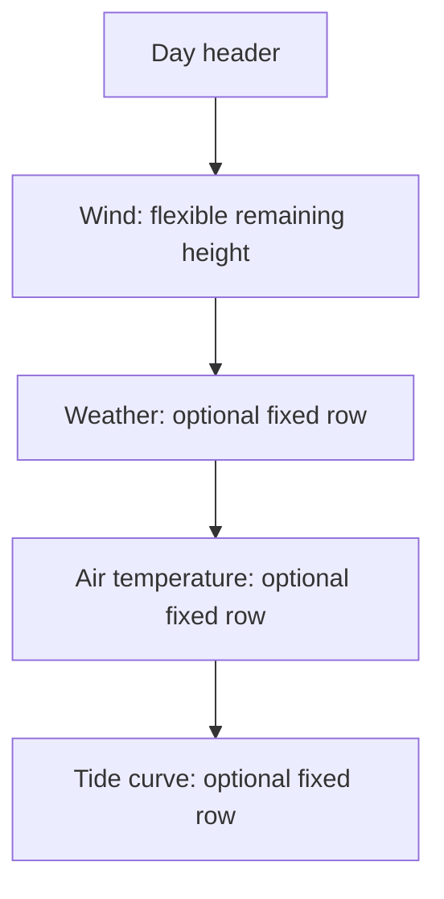
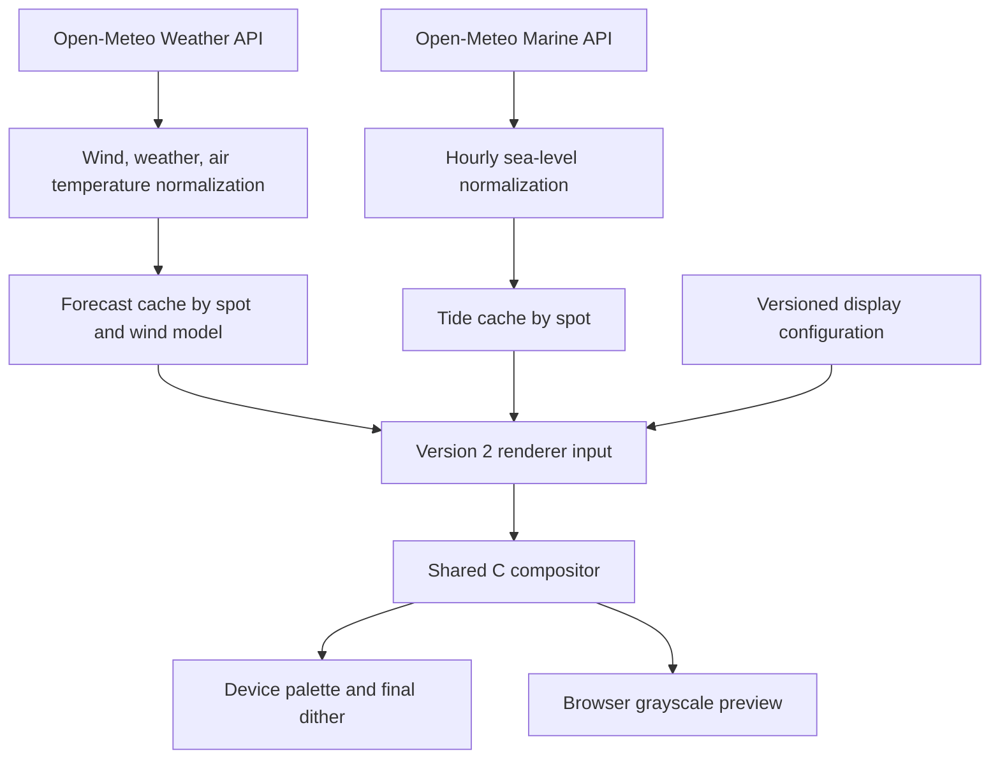
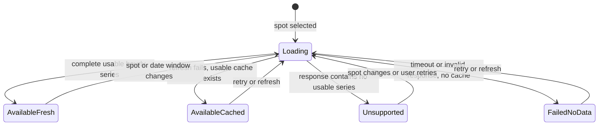

# Configurable Forecast Rows - Plan

## Goal Capsule

- **Objective:** Let a WindScout owner choose which supporting forecast information appears while the browser preview remains compositionally identical to the physical display.
- **Means:** Use a fixed dashboard stack in which wind always occupies the remaining height and weather, air temperature, and tide are independent optional rows.
- **Product authority:** This plan owns forecast-row behavior, its shared configuration, and browser/device rendering parity. The wider installation journey remains governed by `docs/plans/2026-08-26-0630-feat-public-3d-configurator-plan.md`.
- **Open blockers:** None.

---

## Product Contract

### Summary

WindScout gains a compact, configurable forecast stack without becoming a general dashboard builder. Owners can preview weather, air temperature, and tide choices live, then see the same composition on the E1002.

### Problem Frame

The current display already includes weather, but the owner cannot decide which supporting rows deserve scarce e-ink screen space. Adding each new data type as a separate browser-only composition would also let the preview and physical display drift apart.

### Key Decisions

- **Use a fixed stack with independent visibility controls.** (session-settled: user-directed — chosen over presets and reorderable modules: it gives useful choice without turning setup into layout design.) Governs R1-R4.
- **Prefer tide timing over tide height.** (session-settled: user-directed — chosen over meter values: high and low times are easier to understand and avoid false precision.) Governs R8-R10.
- **Keep enabled rows spatially stable during missing data.** (session-settled: user-directed — chosen over collapsing unavailable rows: the wind chart should not resize between refreshes.) Governs R5-R7.
- **Protect crisp display geometry.** Straight structural marks must never acquire avoidable dither. Governs R15.
- **Defer spot search.** (session-settled: user-directed — chosen over solving coastal place matching in this slice: exact named watersport locations need separate product work.)

### Requirements

**Dashboard composition**

- R1. The display shall use the fixed order day header, wind, weather, air temperature, then tide; wind shall always remain visible and consume the height left by enabled optional rows.
- R2. Weather shall be independently switchable and enabled by default; disabling it shall remove its row and return the space to wind.
- R3. Air temperature shall be independently switchable and disabled by default; when enabled, it shall show air temperature for each forecast moment beneath the wind section.
- R4. Tide shall be independently switchable and disabled by default; when enabled, it shall show a compact continuous curve aligned with the forecast timeline.

**Availability and missing data**

- R5. An enabled optional row shall keep its allocated height when its current data is temporarily unavailable.
- R6. A missing value for one weather or temperature moment shall leave that moment blank without hiding the row.
- R7. Tide configuration shall be unavailable for a spot unless its returned marine forecast contains enough valid values to draw the row, with a short explanation in the configurator.

**Tide meaning**

- R8. The tide curve shall label locally derived high and low points with their local times, using `H` and `L`, without displaying height values.
- R9. Tide shall represent Open-Meteo's expected total sea-level signal and shall be described as indicative rather than suitable for navigation.
- R10. Tide times shall reflect the actual source resolution and shall never imply quarter-hour precision when only hourly data is available.

**Preview and device parity**

- R11. Browser preview and device firmware shall compose all forecast rows through the same layout and drawing logic from the same normalized inputs.
- R12. Every accepted setting change shall update the forecast shown in the 3D preview immediately.
- R13. Weather, temperature, and tide visibility shall be part of the versioned WindScout configuration so the settings can later travel through the USB configuration flow without reinterpretation.
- R14. The production settings panel shall expose the three visibility controls through DialKit while keeping forecast-specific availability guidance in WindScout UI.
- R15. Straight rules, borders, bars, and grid marks shall snap to whole output pixels and render without antialiasing; only text, icons, and the curved tide graph may use grayscale edges that require the device's final dither pass.

The fixed composition is:

### Actors

- A1. **WindScout owner:** Chooses the information shown and judges the live preview.
- A2. **Online configurator:** Fetches forecast data, validates availability, and renders the shared output inside the 3D device.
- A3. **E1002 firmware:** Fetches equivalent data and renders the persisted configuration on the physical panel.
- A4. **Forecast provider:** Supplies weather, air-temperature, and marine sea-level series directly to browser or device.

### Key Flows

- F1. Configure supporting rows
  - **Trigger:** A1 opens the display settings for a selected spot.
  - **Actors:** A1, A2
  - **Steps:** A2 shows weather, temperature, and tide controls; A1 changes a control; A2 validates the choice and redraws the E1002 preview.
  - **Outcome:** The preview reflects the accepted configuration without a separate apply action.
  - **Covered by:** R1-R4, R7, R12, R14
- F2. Render the saved composition
  - **Trigger:** A2 previews or A3 refreshes a forecast.
  - **Actors:** A2, A3, A4
  - **Steps:** Forecast data is normalized; the shared renderer reserves enabled rows; wind receives the remaining height; missing values use the stable empty state.
  - **Outcome:** Browser and device produce the same dashboard composition.
  - **Covered by:** R5-R6, R11, R13
- F3. Show available tide timing
  - **Trigger:** A1 selects a spot and tide data is returned.
  - **Actors:** A1, A2, A3, A4
  - **Steps:** The application checks for a usable series, derives local extrema, labels their honest-resolution times, and draws the curve when tide is enabled.
  - **Outcome:** A1 can read indicative high and low timing without interpreting a model-relative height.
  - **Covered by:** R7-R10

### Acceptance Examples

- AE1. **Covers R1-R4, R12.** Given the defaults, when the configurator opens, then weather is visible, temperature and tide are hidden, and wind fills the remaining space; changing any toggle immediately recomposes the preview.
- AE2. **Covers R5-R6.** Given temperature is enabled, when one forecast moment lacks temperature and a later refresh temporarily lacks the full series, then its allocated row remains stable and unavailable values are blank.
- AE3. **Covers R7.** Given the selected marine forecast returns no usable sea-level values, when settings load, then tide cannot be enabled and the panel explains that tide is unavailable for this spot.
- AE4. **Covers R8-R10.** Given an hourly tide series with a derived high point near 14:00, when tide is rendered, then the curve labels `H 14:00` and does not show a height or a fabricated finer time.
- AE5. **Covers R11, R13.** Given identical normalized forecast data and visibility settings, when browser and firmware render the dashboard, then their shared composition contains no differing pixels; the visible browser preview may omit only the documented final e-ink palette and dither treatment.
- AE6. **Covers R15.** Given every supported row combination, when the palette bitmap is inspected, then every straight structural edge occupies intentional whole-pixel rows or columns without a dither fringe.

<!-- ce-section: work-relationships -->
### How This Work Fits Together

This plan owns the configurable forecast stack. The surrounding breakdown is context, not a committed roadmap.

- **Shares** the canonical renderer and versioned configuration established by `docs/plans/2026-08-26-0630-feat-public-3d-configurator-plan.md`.
- **Enables** the later USB flow to transfer the three visibility settings without defining that transport here.
- **Can proceed independently of** a curated spot catalog and coastal autocomplete.
- **Still to decide later:** how named watersport spots, map search, and manual water pins work together.

### Scope Boundaries

- No drag-and-drop, row reordering, arbitrary modules, or user-created layouts.
- No display presets such as Minimal, Weather, or Coastal.
- No water temperature or tide height in the first version.
- No spot-search redesign, curated spot database, map-pin workflow, or coastal geocoding.
- No USB installation, Wi-Fi provisioning, OTA, or recovery-flow implementation in this work unit.
- No WindScout-hosted forecast proxy; browser and device retrieve forecast data directly.

### Dependencies and Assumptions

- The existing shared native/WASM renderer remains the source of truth for the final display bitmap.
- The forecast provider supplies air temperature and weather for the regular forecast and `sea_level_height_msl` for supported marine locations.
- Marine sea-level coverage is not universal, so availability is determined from returned usable values rather than the spot name.
- DialKit remains suitable for the three simple toggles; complex spot autocomplete remains product-specific UI.

### Sources and Research

- `firmware/main/wind_renderer.h` — current renderer inputs already include weather and threshold, but not configurable temperature or tide rows.
- `docs/plans/2026-08-26-0630-feat-public-3d-configurator-plan.md` — broader configurator, shared configuration, pixel-parity, and USB direction.
- [Open-Meteo Marine Weather API](https://open-meteo.com/en/docs/marine-weather-api) — expected total sea-level signal, model coverage, and time-resolution constraints.
- [DialKit](https://joshpuckett.me/dialkit) — production control panel used for the visibility toggles.

---

## Planning Contract

**Product Contract preservation:** Product Contract unchanged during enrichment.

### Key Technical Decisions

- KTD1. **Keep one C compositor and advance its bounded bridge contract.** The renderer input contract moves to version 2 so native firmware and WebAssembly receive the same visibility flags, temperatures, and tide series. The browser preview keeps the shared pre-dither grayscale output while native palette output keeps one final dither pass. Governs R11-R13, R15.
- KTD2. **Keep marine data independent from the regular forecast.** Air temperature joins the existing per-moment weather samples, while tide uses its own provider result and cache keyed by spot and timezone rather than wind model. A marine failure cannot invalidate wind, weather, or temperature. Governs R3-R7, R9.
- KTD3. **Use hourly tide input worldwide in the first version.** Open-Meteo does not identify whether a returned 15-minute value is native or interpolated, so the plan uses the documented hourly series and derives one high and one low label per local day. This implements honest timing without fabricated precision. Governs R8-R10.
- KTD4. **Allocate optional rows inside the renderer.** (session-settled: user-directed — chosen over presets and reorderable modules: the fixed stack gives useful choice without turning setup into layout design.) One integer-coordinate layout calculation reserves fixed row bands, then gives all remaining height to wind. Governs R1-R6, R15.
- KTD5. **Separate tide preference from tide capability.** The saved `show tide` preference remains stable, while current marine availability controls whether the row and DialKit control are effective for the selected spot. Loading, unsupported, failed, and available are distinct states. Governs R4-R7, R13-R14.
- KTD6. **Migrate caches by schema rejection, not in-place reinterpretation.** Forecast, marine, renderer-input, and browser-cache version changes invalidate incompatible records and fall back to a fresh fetch or demo data. Existing weather-on, temperature-off, and tide-off defaults remain deterministic. Governs R2-R7, R13.

### High-Level Technical Design

The regular forecast and marine forecast remain separate until composition. This prevents an optional tide failure from contaminating the core forecast path.

Tide availability is a capability state, not a successful-fetch boolean.

Capability and freshness are separate concerns: `AvailableFresh` and `AvailableCached` both mean the selected spot can show tide, while unsupported is the only conclusive no-capability result. A failed check without cached data remains retryable and must not be presented as proof that the spot has no tide.

The renderer owns all eight optional-row combinations. The order never changes.

| Weather | Temperature | Tide | Bottom stack below wind |
|---|---|---|---|
| Off | Off | Off | None |
| On | Off | Off | Weather |
| Off | On | Off | Temperature |
| Off | Off | On | Tide |
| On | On | Off | Weather, temperature |
| On | Off | On | Weather, tide |
| Off | On | On | Temperature, tide |
| On | On | On | Weather, temperature, tide |

### Implementation Constraints

- The tide domain stores a bounded five-local-day hourly window. Its capacity must accommodate daylight-saving days with 23 or 25 returned hours rather than assuming exactly 120 values. Values use bounded integer storage suitable for firmware caches and the WebAssembly bridge.
- Tide response failures never downgrade a valid regular forecast state.
- Straight structural primitives write full black, white, or red values at integer coordinates. Only glyph masks, icon masks, and the tide curve may contribute intermediate grayscale before palette conversion.
- Daily tide labels use the selected spot timezone. A daylight-saving transition must not shift labels into the wrong local day.
- The browser may check marine capability when a spot is selected. Firmware skips marine network work when tide is disabled.
- Open-Meteo attribution and the non-navigation warning remain visible in the product information around tide configuration.

### Sequencing

The data contracts land before layout work. The provider paths can then feed deterministic shared fixtures. Web and firmware integration follow the renderer contract, and cross-runtime parity closes the work.

---

## Implementation Units

### U1. Add air temperature to the regular forecast contract

- **Goal:** Carry air temperature from Open-Meteo through both normalized forecast paths and their caches.
- **Requirements:** R3, R5-R6, R11; supports F2 and AE2.
- **Dependencies:** None.
- **Files:** `firmware/main/wind_forecast.h`, `firmware/main/wind_forecast.c`, `firmware/main/open_meteo_knmi_provider.c`, `firmware/main/wind_cache.c`, `firmware/host_tests/test_wind_forecast.cpp`, `firmware/host_tests/test_wind_provider.cpp`, `firmware/host_tests/test_wind_cache.cpp`, `firmware/host_tests/fixtures/open_meteo_knmi.json`, `web/src/forecast/openMeteo.js`, `web/src/forecast/normalizeForecast.js`, `web/src/forecast/forecastCache.js`, `web/tests/forecast-client.test.js`, `web/tests/forecast-normalizer.test.js`, `web/tests/forecast-cache.test.js`.
- **Approach:**
  1. Request `temperature_2m` with the existing multi-model weather fields.
  2. Store signed tenths of a degree Celsius plus explicit availability in each of the 25 regular samples.
  3. Advance native and browser forecast schemas so an old cache is rejected instead of interpreted with the new shape.
  4. Preserve a valid wind sample when temperature alone is null or absent.
- **Patterns to follow:** Existing cloud, precipitation, and `weather_available` normalization in `wind_forecast.h`, `open_meteo_knmi_provider.c`, and `web/src/forecast/normalizeForecast.js`.
- **Test scenarios:**
  - A complete multi-model response produces the correct signed tenths-Celsius value for every selected 08:00, 11:00, 14:00, 17:00, and 20:00 sample.
  - A negative temperature rounds deterministically and survives native and browser cache round trips.
  - A missing temperature array keeps wind and weather valid while marking only temperature unavailable.
  - An old forecast cache version is ignored and causes normal fallback behavior.
  - Covers AE2. One missing temperature moment remains unavailable without invalidating the day.
- **Verification:** Native provider and cache tests and browser forecast tests prove the same units, rounding, optionality, and migration behavior.

### U2. Add an independent hourly tide domain

- **Goal:** Fetch, validate, cache, and expose an optional five-day tide series without coupling it to a wind model.
- **Requirements:** R4-R10, R11; implements F3 and AE3-AE4.
- **Dependencies:** None.
- **Files:** `firmware/main/wind_tide.h`, `firmware/main/wind_tide.c`, `firmware/main/open_meteo_marine_provider.h`, `firmware/main/open_meteo_marine_provider.c`, `firmware/main/wind_tide_cache.h`, `firmware/main/wind_tide_cache.c`, `firmware/main/CMakeLists.txt`, `firmware/host_tests/test_wind_tide.cpp`, `firmware/host_tests/test_open_meteo_marine_provider.cpp`, `firmware/host_tests/test_wind_tide_cache.cpp`, `firmware/host_tests/fixtures/open_meteo_marine.json`, `firmware/host_tests/CMakeLists.txt`, `web/src/forecast/openMeteoMarine.js`, `web/src/forecast/normalizeTide.js`, `web/src/forecast/tideCache.js`, `web/tests/marine-client.test.js`, `web/tests/tide-normalizer.test.js`, `web/tests/tide-cache.test.js`.
- **Approach:**
  1. Call the Marine API with `hourly=sea_level_height_msl`, the spot timezone, `forecast_days=5`, and sea-cell preference.
  2. Normalize the result into a bounded five-local-day hourly series with local timestamps, signed millimetres, validity, source resolution, and retrieval time; size the bound for a possible 25-hour local day.
  3. Keep tide identity scoped to spot coordinates and timezone, independent of the selected weather model.
  4. Distinguish a valid series, an all-null unsupported location, an invalid partial response, and a network failure.
  5. Use an atomic two-generation firmware cache and a separately versioned browser cache.
- **Execution note:** Implement parser and cache behavior against fixtures before adding live requests.
- **Patterns to follow:** `open_meteo_knmi_provider.c`, `wind_cache.c`, `web/src/forecast/openMeteo.js`, and `web/src/forecast/forecastCache.js`.
- **Test scenarios:**
  - A Brouwersdam-like complete hourly response produces five correctly ordered local days and a usable tide capability.
  - An all-null Edam-like response produces unsupported capability rather than a zero-height curve.
  - A timeout or malformed JSON produces failed capability and leaves a valid regular forecast untouched.
  - A daylight-saving transition preserves ascending timestamps and assigns each value to the correct local day.
  - A cache identity mismatch, checksum error, or old schema is rejected while the previous valid generation remains recoverable.
  - Selecting a different wind model reuses the same tide series without another marine request.
  - Covers AE3. No usable series makes tide unavailable with a distinct reason.
- **Verification:** Host and browser tests prove isolation, identity, time handling, cache recovery, and the unsupported-versus-failed distinction.

### U3. Extend the shared renderer with fixed optional rows

- **Goal:** Render every supported row combination through the same native and WebAssembly compositor.
- **Requirements:** R1-R12, R15; implements F2-F3 and AE1-AE6.
- **Dependencies:** U1, U2.
- **Files:** `firmware/main/wind_renderer.h`, `firmware/main/wind_renderer.c`, `firmware/main/wind_font.c`, `web/wasm/wind_renderer_bridge.c`, `web/src/renderer/contract.js`, `web/src/renderer/sharedRenderer.js`, `web/scripts/build-wind-renderer.mjs`, `shared/renderer-fixtures/wind_renderer_fixture.h`, `shared/renderer-fixtures/wind_renderer_fixture.c`, `firmware/host_tests/test_wind_renderer.cpp`, `firmware/host_tests/render_wind_fixture.cpp`, `web/tests/shared-renderer.test.js`.
- **Approach:**
  1. Advance the renderer contract and its bridge as described by KTD1.
  2. Add display flags, optional per-sample temperature, and the bounded tide series to the renderer input.
  3. Calculate the fixed bottom-row bands first, then derive the remaining wind chart baseline and scale from integer coordinates per KTD4.
  4. Draw weather and rounded `°` temperature values in their sample columns.
  5. Draw one globally scaled tide curve across the five-day timeline and label each local day's highest and lowest hourly point with `H` or `L` plus time.
  6. Keep structural drawing on full-value integer pixels and limit grayscale coverage to the R15 exceptions.
  7. Preserve one final palette dither pass and the clean RGBA preview path.
- **Execution note:** Add characterization fixtures for the current default before moving layout constants, then change the renderer test-first.
- **Patterns to follow:** Existing `render_dashboard`, bounded `wind_renderer_input_v1_t` bridge pattern, full-frame dither pass, output overlays, and shared binary fixtures.
- **Test scenarios:**
  - Covers AE1. Each of the eight visibility combinations allocates rows in the fixed order and gives all remaining height to wind.
  - Weather-off, temperature-on renders temperatures directly below wind without an empty weather band.
  - An enabled but unavailable temperature row keeps its height and draws blank values.
  - Covers AE4. A synthetic hourly tide series labels each daily maximum and minimum on whole hours and never renders a height.
  - Flat, negative, all-equal, and partially invalid tide fixtures do not divide by zero, overrun the row, or invent extrema.
  - Long tide labels do not cross the outer border or obscure an adjacent day's label.
  - Covers AE6. Every rule, border, grid point, bar, and threshold edge uses exact full-value pixels with no grayscale fringe.
  - Palette output reports exactly one dither pass; preview RGBA reports none.
  - Invalid flags, counts, temperatures, tide values, or contract versions are rejected before drawing.
- **Verification:** Native goldens, pre-dither geometry assertions, and WebAssembly byte comparisons prove layout, safety, and output-pass behavior.

### U4. Bind the new controls and tide capability to the 3D preview

- **Goal:** Let an owner change weather, temperature, and tide visibility and see the accepted configuration immediately on the virtual E1002.
- **Requirements:** R2-R7, R12-R14; implements F1 and AE1-AE3.
- **Dependencies:** U1-U3.
- **Files:** `web/src/stores/configurator.js`, `web/src/components/WindScoutSettings.vue`, `web/src/configurator/screenTexture.js`, `web/src/config/configuration.js`, `web/src/fixtures/brouwersdam.js`, `web/tests/configurator-store.test.js`, `web/tests/settings.test.js`, `web/tests/screen-texture.test.js`, `web/tests/configurator-view.test.js`, `web/tests/e2e/configurator.spec.js`.
- **Approach:**
  1. Make Pinia the owner of the three visibility preferences and marine capability state.
  2. Add DialKit boolean controls with the settled defaults, while keeping DialKit persistence disabled.
  3. Check marine capability when the spot changes. Keep the tide toggle visible, preserve its saved preference, and pair its disabled state with a WindScout loading, unsupported, or failed explanation when it is not actionable.
  4. Rebuild the renderer input from the published forecast, current tide series, and current display configuration after every accepted change.
  5. Keep the last published bitmap if a new forecast or renderer input fails validation.
- **Patterns to follow:** `WindScoutSettings.vue` as a DialKit-to-Pinia adapter, `screenTexture.js` as the renderer boundary, and the existing pending-versus-published forecast state.
- **Test scenarios:**
  - Covers AE1. The initial panel shows weather on, temperature off, and tide off, and each change redraws without an apply action.
  - DialKit values update Pinia once and never become a second persistence owner.
  - A supported spot enables tide; an unsupported spot keeps the disabled toggle visible with a concise unavailable explanation.
  - A marine timeout without cached data keeps the toggle visible and is described as a failed check rather than proof that the spot has no tide.
  - Switching away from and back to a supported spot preserves the saved tide preference while recomputing effective availability.
  - A stale marine response for the previous spot cannot publish over the current spot.
  - A renderer rejection keeps the last valid texture and announces a non-destructive warning.
  - Keyboard and screen-reader users can operate and understand every available toggle and unavailable state.
- **Verification:** Component and browser tests prove live preview updates, race safety, honest capability copy, and accessible control behavior.

### U5. Persist display choices and integrate tide on the device

- **Goal:** Make the E1002 fetch and render the same configured rows without requiring a WindScout forecast service.
- **Requirements:** R2-R13, R15; implements F2-F3 and AE2-AE5.
- **Dependencies:** U1-U3.
- **Files:** `firmware/main/config.h`, `firmware/main/config_manager.h`, `firmware/main/config_manager.c`, `firmware/main/wind_app.h`, `firmware/main/wind_app.c`, `firmware/main/wind_cache.h`, `firmware/main/wind_cache.c`, `firmware/main/wind_config.example.h`, `firmware/main/CMakeLists.txt`, `firmware/host_tests/stubs/fake_config_manager.c`, `firmware/host_tests/test_wind_app.cpp`, `firmware/host_tests/test_wind_config.cmake`, `firmware/host_tests/test_wind_cache.cpp`.
- **Approach:**
  1. Add a versioned display-configuration section containing treatment, threshold, and the three visibility flags.
  2. Migrate an unconfigured device to the settled defaults and stop runtime startup from overwriting saved display choices.
  3. Fetch or load marine data only when tide is requested, without making regular forecast publication depend on that result.
  4. Combine regular forecast, optional tide cache, and display configuration only at the renderer boundary.
  5. Keep an enabled row stable with blank data after a cold marine failure and retain last-known valid marine data when available.
  6. Advance the panel render signature and invalidate only caches made incompatible by the changed contract.
- **Patterns to follow:** Existing NVS-backed boolean settings in `config_manager.c`, `wind_app` stale-cache behavior, two-generation forecast cache recovery, and panel bitmap hashing.
- **Test scenarios:**
  - Fresh and migrated devices load weather on, temperature off, and tide off.
  - Every valid flag combination survives configuration reload and reaches the renderer unchanged.
  - Tide disabled performs no Marine API request and preserves normal wake behavior.
  - Tide enabled with valid cache renders while a refresh runs; a failed refresh keeps that cached series.
  - Tide enabled without cache and with a failed request still renders wind with a stable blank tide row.
  - Changing display-only settings invalidates the panel confirmation but not compatible forecast or tide data.
  - Covers AE5. The device builds the same versioned renderer input as the browser for an equivalent configuration.
- **Verification:** Host integration tests prove persistence, cache isolation, fetch gating, failure recovery, and renderer-input equivalence; an E1002 firmware build proves the new code fits the target.

### U6. Lock cross-runtime parity and visual quality

- **Goal:** Prove that the browser preview remains a faithful clean view of the exact device composition across all new states.
- **Requirements:** R1-R15; covers all acceptance examples.
- **Dependencies:** U1-U5.
- **Files:** `shared/renderer-fixtures/wind_renderer_fixture.h`, `shared/renderer-fixtures/wind_renderer_fixture.c`, `shared/renderer-fixtures/*.bin`, `firmware/host_tests/test_wind_renderer.cpp`, `firmware/host_tests/render_wind_fixture.cpp`, `web/tests/shared-renderer.test.js`, `web/tests/screen-texture.test.js`, `web/tests/e2e/configurator.spec.js`, `README.md`, `firmware/README.md`.
- **Approach:**
  1. Add shared fixtures for all row combinations plus missing temperature, available tide, unsupported tide, and stale tide states.
  2. Compare every device-palette byte emitted by native and WebAssembly builds.
  3. Inspect the clean RGBA output separately for grayscale quality and exact structural pixels.
  4. Photograph the E1002 output for the default, temperature, tide, and all-rows compositions before accepting new goldens.
  5. Document data meaning, defaults, attribution, and the tide warning.
- **Execution note:** Treat golden changes as product review artifacts. Do not update them merely to make tests pass.
- **Patterns to follow:** Existing shared binary parity fixtures, native golden review, and the README distinction between shared composition and different final output passes.
- **Test scenarios:**
  - Covers AE5. Native and WebAssembly palette outputs match byte-for-byte for every shared fixture.
  - Covers AE6. A structural-pixel audit finds no intermediate luma values on straight geometry in any layout combination.
  - The clean preview contains grayscale only at text, icon, and tide-curve edges and keeps red overlays exact.
  - The 3D screen texture preserves 800 x 480 aspect ratio, unfiltered pixel placement, and the current material-lighting separation.
  - Mocked browser journeys cover available, unsupported, loading, failed, cached, and stale marine states.
  - Photographed panel output remains legible at normal viewing distance with all optional rows enabled.
- **Verification:** Full native, WebAssembly, browser, build, and photographed-panel checks pass with reviewed fixtures and no unexplained pixel differences.

---

## System-Wide Impact

- **Data lifecycle:** Regular forecast schemas change for temperature. A separate marine schema and cache are introduced. Old records fail closed and refresh normally.
- **Network and power:** Browser spot selection performs an independent marine capability check. Firmware performs marine work only when tide is enabled and retains stale valid data on failure.
- **Renderer ABI:** Native, WebAssembly, shared fixtures, and the checked-in WASM binary must advance together.
- **Memory:** The fixed hourly tide window adds bounded RAM, flash-cache, and WASM input usage. Target builds must verify headroom before release.
- **Accessibility:** Tide capability cannot rely on a disabled-looking control alone. Status, reason, and keyboard behavior need explicit tests.
- **Operations:** Open-Meteo attribution and the non-navigation warning must remain visible wherever tide is introduced.

---

## Risks and Dependencies

| Risk or dependency | Impact | Mitigation |
|---|---|---|
| Marine coverage returns null inland or near complex coasts | Tide can appear absent or misleading | Use returned usable values for capability, keep unsupported separate from failure, and retain the warning from R9. |
| Marine API failure delays the main refresh | WindScout feels unreliable | Keep provider calls, caches, and publication states independent per KTD2. |
| Optional rows compress the wind chart too far | Wind loses visual priority | Keep fixed compact row bands and validate the all-rows composition on the physical panel. |
| Tide labels collide on narrow day columns | Times become unreadable | Limit labels to one daily high and low, measure text bounds, and cover collision fixtures. |
| Contract versions drift between C, WASM, and JavaScript | Preview fails or lies | Reject mismatched versions and require regenerated WASM plus byte-parity tests. |
| Straight geometry enters the grayscale path | Lines acquire a dither halo | Test pre-dither structural pixels across every row combination per R15. |
| Extra tide storage or parsing exceeds device headroom | Firmware becomes unstable | Use fixed hourly bounds, integer storage, fixture-sized responses, and an E1002 target build gate. |

---

## Verification Contract

| Gate | Command or evidence | Proves |
|---|---|---|
| Firmware host suite | `make test` in `firmware/` | Forecast, marine provider, cache, configuration, app, renderer, and golden behavior. |
| Web unit and component suite | `npm test` in `web/` | Normalization, caching, store, DialKit adapter, renderer bridge, texture, and accessibility behavior. |
| Renderer reproducibility | `npm run renderer:build` followed by `npm run renderer:check` in `web/` | The checked-in WASM matches the pinned Emscripten build and current C sources. |
| Browser journeys | `npm run test:e2e` in `web/` | Live configuration and all marine capability states in the 3D experience. |
| Production web build | `npm run build` in `web/` | The configurator bundles with the extended renderer and controls. |
| E1002 firmware build | `./build.py --board seeedstudio_reterminal_e1002` in `firmware/` | Target compilation, static memory constraints, and component registration. |
| Pixel parity | Native and WebAssembly fixture hashes plus byte comparisons | The physical-palette bitmap is identical across runtimes. |
| Physical display review | Photographs of default, temperature, tide, and all-rows fixtures | Readability, row proportions, crisp lines, curve quality, and real e-ink dithering. |

---

## Definition of Done

- The Product Contract requirements and acceptance examples pass through automated or photographed verification.
- Weather, temperature, and tide settings update the 3D preview without a second layout implementation.
- Air temperature remains optional data inside the regular forecast, and marine failure never invalidates it.
- Tide availability distinguishes unsupported, failed, loading, cached, and available states.
- Native and WebAssembly palette outputs match byte-for-byte for every shared fixture.
- Straight structural geometry has no avoidable dither fringe in any row combination.
- The clean browser preview differs from the device only in its documented final output treatment.
- Display defaults and valid choices survive a firmware configuration reload.
- The E1002 target build and photographed-panel review pass.
- Documentation includes defaults, direct-fetch behavior, attribution, and the non-navigation warning.
- Abandoned experiments, stale fixtures, superseded cache paths, and dead bridge exports are removed from the final diff.
- U1 is complete when signed air temperature and missing-temperature behavior match across native and browser caches.
- U2 is complete when marine data is isolated, cached, time-correct, and honest about unsupported versus failed locations.
- U3 is complete when all layout combinations render through version 2 of the shared compositor with the R15 pixel rule enforced.
- U4 is complete when the DialKit panel and 3D preview handle every tide capability state accessibly and without races.
- U5 is complete when the E1002 persists the settings and handles marine fetch or cache failure without losing wind.
- U6 is complete when automated parity and physical display review approve the final fixtures.
