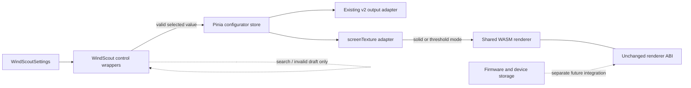

# WindScout Settings Controls - Plan

## Goal Capsule

- **Objective:** People can configure WindScout through a compact, consistent, keyboard-friendly settings panel that feels native to the product rather than like a generic control inspector.
- **Means:** Replace DialKit with WindScout-owned wrappers around Reka UI, make the browser preview use solid bars with an optional threshold line, and make the existing spot catalog searchable without changing the shared renderer ABI.
- **Product authority:** This plan owns the settings-control replacement and the current-catalog spot picker. External place search, map pin placement, and personal spot creation are a separate follow-up.
- **Open blockers:** None.

---

## Product Contract

### Summary

Replace DialKit with a small WindScout settings system inspired by Framer's property panels: Inter typography, section headings and dividers, labels on the left, and compact controls on the right. Keep solid bars as the only display treatment, make the threshold line optional, and provide searchable selection for the existing spot catalog.

### Problem Frame

The current DialKit surface presents settings through one generic inspector system and needs DOM-level accessibility repairs for behavior WindScout does not own. Its layout also makes controls read as broad rows rather than a calm label-and-control form. This limits the ability to distinguish a typed input, a fixed selection, and a searchable selection while keeping the panel visually specific to WindScout.

### Key Decisions

- **Own the WindScout control layer.** (session-settled: user-approved — chosen over styling or extending DialKit: WindScout needs a different layout and clearer control behavior.) Governs R1-R5 and R16-R19.
- **Use Reka UI as the accessible behavior layer.** (session-settled: user-approved — chosen over implementing every popup and keyboard interaction from scratch: unstyled Vue primitives preserve visual ownership without giving up mature focus behavior.) Governs R5-R10 and R16-R19.
- **Remove Treatment and Gradient.** (session-settled: user-directed — chosen over keeping a reduced treatment dropdown: the display should have one solid-bar foundation and only an optional threshold line.) Governs R12-R15.
- **Use a toggle and exact number for threshold.** (session-settled: user-directed — chosen over a slider or treating zero as off: the state and value should be explicit and precise.) Governs R14-R15.
- **Deliver controls before custom spot creation.** (session-settled: user-directed — chosen over building the external place and map flow in the same work package: the reusable control foundation should land first.) Governs R6-R11 and the scope boundary.
- **Keep Inter.** (session-settled: user-directed — chosen over introducing a new interface typeface: the existing product typography already fits the desired density.) Governs R2-R4.

### Requirements

**Visual system and layout**

- R1. The settings panel shall no longer expose DialKit UI, styling, terminology, or behavior.
- R2. The panel shall use Inter and organize settings into named sections with quiet separators, labels on the left, and controls on the right.
- R3. Text inputs, number inputs, selects, and comboboxes shall share the same compact height, neutral-gray surface, rounded corners, typography, and state styling.
- R4. Controls shall size to their content or assigned control column rather than automatically spanning the entire panel; the layout shall remain legible at the configurator's supported narrow width.
- R5. A Select shall use a chevron to signal a fixed choice, while a text or number input shall not use a chevron.

**Selection and display settings**

- R6. Spot shall be an editable combobox that filters the existing WindScout spot catalog as the person types.
- R7. Spot text shall not become configuration by itself; a catalog result must be selected before the spot changes.
- R8. Model shall be a Select with typeahead so a person can jump to a forecast model by typing while the control is focused.
- R9. Weather and Tide shall be independent toggles, and Tide shall preserve a clear unavailable state when the selected spot has no supported tide data.
- R10. Temperature shall be one Select with the choices `Hide`, `Celsius`, and `Fahrenheit`, replacing separate visibility and unit controls.
- R11. Time format shall not be a visible setting; the configurator shall derive 12- or 24-hour notation from the browser locale and write the resolved convention into the active configuration.

**Treatment and threshold**

- R12. Treatment shall no longer be configurable, and Gradient or Background fade shall no longer be available as a display option.
- R13. Solid bars shall be the fixed base rendering in the configurator; the new default shall have threshold disabled, and enabling it shall select the existing threshold renderer mode.
- R14. `Show threshold` shall be a toggle; when enabled, a separate numeric input shall accept the threshold value in knots within the renderer's supported range.
- R15. Disabling the threshold shall remove the threshold line without using zero as a hidden off-state, and re-enabling it shall restore the last valid threshold value.

**Interaction and accessibility**

- R16. Every setting shall update the preview immediately without a page reload or loss of the current 3D scene pose.
- R17. All controls and their open popups shall be operable with Tab, Shift+Tab, arrow keys, Enter, and Escape according to the expected interaction for that control type.
- R18. Every control shall have a programmatic label, visible focus treatment, announced value or state, and a usable disabled or unavailable state.
- R19. An opened Select or Combobox shall align with its closed control, retain the same visual width unless content requires more room, and present options at the same density as the trigger.

<!-- ce-section: work-relationships -->
### How This Work Fits Together

This plan owns the WindScout control system and the first searchable Spot picker. The broader breakdown is current context, not a committed roadmap.

- **Custom Spot flow follows this work.**
  - **Depends on:** The Spot combobox and shared input, dialog, focus, and popup patterns established here.
  - **Adds:** External place results, a map dialog, precise pin placement near the water, naming, confirmation, and personal spot persistence.
  - **Still to decide:** Which place and map provider to use and whether personal spots may later be submitted to a reviewed shared catalog.

### Key Flows

- F1. Change a standard setting
  - **Trigger:** A person opens the configurator settings panel.
  - **Steps:** They scan the left-hand labels, operate the compact control on the right, and see the preview update immediately.
  - **Outcome:** The active configuration and preview reflect the new valid value.
  - **Covered by:** R2-R5, R8-R11 and R16-R19.

- F2. Choose an existing spot
  - **Trigger:** A person focuses or clicks Spot.
  - **Steps:** The combobox opens the existing catalog; typing narrows the results; arrow keys or pointer interaction choose a result.
  - **Outcome:** The spot changes only after a listed result is selected, then its forecast loads through the existing status behavior.
  - **Covered by:** R6-R7 and R16-R19.

- F3. Configure a threshold line
  - **Trigger:** A person enables `Show threshold`.
  - **Steps:** The numeric threshold input appears, accepts an exact supported knot value, and immediately moves the line in the preview; disabling the toggle removes the line.
  - **Outcome:** Threshold visibility and value remain separate, understandable settings.
  - **Covered by:** R12-R16 and R18.

### Acceptance Examples

- AE1. **Covers R6-R7 and R17-R19.** Given the Spot combobox is focused, when a keyboard user types `bro`, moves to Brouwersdam, and presses Enter, then Brouwersdam becomes the configured spot, the popup closes, its committed label is shown, and focus remains in the Spot input.
- AE2. **Covers R6-R7.** Given typed text matches no existing catalog spot, when the person leaves the field without selecting a result, then the previous valid spot remains configured and the typed text is not accepted as a new spot.
- AE3. **Covers R12-R15.** Given solid bars and a valid threshold value are active, when `Show threshold` is turned off, then the line disappears while the solid bars remain; turning it on restores the line at the previous value.
- AE4. **Covers R12-R13.** Given the configurator opens with its new default configuration, then the preview uses solid bars with threshold disabled and no Treatment control; enabling Show threshold uses the threshold renderer mode without exposing Background fade.
- AE5. **Covers R9.** Given Tide is unavailable for the selected spot, when the settings panel renders, then the Tide toggle cannot be enabled and the reason remains available to assistive technology.
- AE6. **Covers R10.** Given Temperature is set to `Hide`, when the configuration updates, then no temperature row appears; selecting Celsius or Fahrenheit restores the row in that unit.
- AE7. **Covers R11.** Given the browser locale prefers 12-hour time, when configuration initializes, then the preview and written configuration use 12-hour notation without presenting a separate time-format row.

### Scope Boundaries

- External place search and geocoding are deferred to the Custom Spot work package.
- Map display, pin placement, spot naming, and personal spot persistence are deferred to the Custom Spot work package.
- A public or automatically crowdsourced WindScout spot database is not part of this work package or yet committed for the follow-up.
- Firmware defaults, persisted device settings, physical device buttons, and NVS migration are outside this web-control refactor. The single development unit may be reflashed or reconfigured separately when device installation is implemented.
- This work does not redesign the 3D product scene, forecast status messaging, installation continuation, forecast models, or tide-availability rules beyond integrating them with the new controls.

### Dependencies and Assumptions

- The existing Vue configurator remains the product surface and its store remains the authority for active settings.
- Reka UI can supply the unstyled Select, Combobox, Switch, and popup behavior needed by the WindScout-owned controls.
- The existing local spot catalog remains the complete Spot data source for this work package.
- Browser-locale time notation is an acceptable default even though it represents locale convention rather than a guaranteed read of every operating-system preference.

### Sources and Research

- `web/src/components/WindScoutSettings.vue` — current DialKit controls, store bindings, and accessibility adaptations.
- `web/src/styles/configurator.css` — current floating panel dimensions and DialKit-specific styling.
- `web/src/config/configuration.js` and `web/src/renderer/contract.js` — current treatment, threshold, time, and temperature contracts.
- `web/src/spots.js` and `web/src/forecast/models.js` — current catalog choices.
- `docs/plans/2026-08-26-0630-feat-public-3d-configurator-plan.md` — broader configurator and later custom-spot product direction.
- [Reka UI introduction](https://www.reka-ui.com/docs/overview/introduction) — unstyled Vue primitives and accessibility goals.
- [Reka UI Select](https://www.reka-ui.com/docs/components/select) and [Combobox](https://www.reka-ui.com/docs/components/combobox) — selection, typeahead, and keyboard behavior.
- [Intl.DateTimeFormat](https://developer.mozilla.org/en-US/docs/Web/JavaScript/Reference/Global_Objects/Intl/DateTimeFormat/DateTimeFormat) — locale-dependent hour-cycle behavior.

---

## Planning Contract

**Product Contract preservation:** R13, AE4, and the firmware scope boundary were narrowed with explicit user approval after repo research showed there is no live browser-to-device installation path and only one development device. All other accepted R1-R19, F1-F3, and AE1-AE7 behavior remains unchanged.

### Key Technical Decisions

- **KTD1. Put Reka UI behind WindScout-owned control wrappers.** `SettingSelect`, `SettingCombobox`, and `SettingSwitch` own the product API and appearance while Reka owns focus, popup, selection, and keyboard mechanics. This prevents Reka component details from spreading through the settings panel and keeps a later visual adjustment local. Governs R1-R10 and R16-R19.
- **KTD2. Make Pinia the only committed form state.** Reka controls are controlled components: they emit candidate values, and `configurator.js` validates and commits them. Search text and temporarily invalid numeric text remain local drafts and never become active configuration. Governs R6-R10 and R14-R16.
- **KTD3. Keep `showThreshold` internal until installation has a real contract.** Pinia replaces its UI-facing `treatment` state with `showThreshold` and retains the last valid `threshold`. The preview derives the existing renderer mode, while `displayConfigurationFromStore` keeps its current version-2 output and derives the existing `treatment` field if that helper remains useful. No persisted browser input or new transfer schema is introduced. Temperature remains stored as the existing visibility-plus-unit pair, with one combined UI adapter. Governs R10 and R12-R16.
- **KTD4. Preserve the shared renderer ABI while removing Gradient from the configurator.** `DISPLAY_MODES` and the C/WASM renderer continue to understand background fade for binary and test compatibility, but the browser preview emits only solid or threshold mode. Deleting the low-level mode is deliberately outside this refactor. Governs R12-R13 and AE4.
- **KTD5. Do not migrate firmware or device storage in this work package.** The installer does not yet write the browser configuration to a device, and there is one development unit that can be reflashed separately. Avoiding a speculative NVS migration keeps this plan aligned with the real product path; device defaults and physical mode controls can be addressed when installation becomes functional. Governs the firmware scope boundary.
- **KTD6. Resolve the hour convention once at configuration initialization.** A small locale helper asks `Intl.DateTimeFormat` for an hour-bearing format and converts its resolved hour cycle to the explicit existing `12-hour` or `24-hour` configuration value. Rendering and installation therefore never depend on locale APIs. Governs R11 and AE7.

### High-Level Technical Design

The settings panel remains a composition layer. It does not know forecast loading, persistence, or renderer constants: it sends valid intent to the Pinia store. The store remains responsible for current spot/model data and active browser configuration. `screenTexture.js` adapts `showThreshold` to the existing low-level renderer modes. The existing configuration helper may derive its version-2 `treatment` field from the same state, but no current browser loader or device-write path exists.

### System-Wide Impact

- **Data lifecycle:** Controls emit values to Pinia and the store updates the live preview. The current version-2 output helper may serialize the derived renderer treatment, but no browser persistence or device write is claimed in this package.
- **Failure propagation:** Failed spot/model forecast requests continue through the existing status and warning states. Invalid spot search text and invalid threshold drafts stop at the control boundary and do not trigger forecast or renderer work.
- **State consistency:** `showThreshold` and `threshold` are separate. Turning the feature off preserves the last valid number. The combined Temperature Select maps `Hide` to `showTemperature=false` and maps either unit to `showTemperature=true` plus the chosen unit.
- **API and ABI compatibility:** The shared C/WASM renderer enum and current version-2 output shape are unchanged. Firmware and NVS formats are untouched.
- **Observability:** Existing visible forecast loading/error copy remains. Invalid numeric input uses inline field state and `aria-invalid`; Tide's unavailable explanation remains associated through `aria-describedby`.

### Risks and Dependencies

- **Reka UI 2.x behavior:** Vue 3.5 satisfies the current peer requirement, but wrapper-level tests must pin the keyboard and focus behavior WindScout depends on rather than trusting a package upgrade implicitly.
- **Popup positioning inside the floating panel:** Select and Combobox content must be portalled above the 3D canvas and use the trigger width variable so desktop and bottom-sheet layouts align.
- **Future installer boundary:** Installation work must define and version its real transfer contract end to end instead of treating this internal Pinia state as an already-promised device format.
- **Combined temperature control:** Hiding temperature must not discard the previously selected unit; choosing a unit must always make the row visible.
- **Locale inference limitation:** Browser locale expresses a convention, not necessarily every custom operating-system preference. The resolved explicit value remains inspectable and deterministic after initialization.

### Alternatives Considered

- **Delete background-fade from the renderer enum immediately:** rejected because the same numeric renderer contract is shared by firmware, WASM, and fixtures. Keeping it unreachable from the configurator makes this UI refactor safer and smaller.
- **Add a new renderer-level `showThreshold` boolean:** rejected because solid and threshold modes already encode the rendered result; an extra renderer parameter would duplicate state across both implementations.
- **Use Reka primitives directly in `WindScoutSettings.vue`:** rejected because styling, labels, popup sizing, validation wiring, and future custom-spot behavior would become duplicated and coupled to a third-party API.
- **Commit every number-input keystroke:** rejected because an empty or half-typed number is a normal editing state but not a valid renderer configuration.

---

## Implementation Units

### U1. Define the active browser settings model

- **Goal:** Establish one valid active settings model while preserving the current unused output boundary.
- **Requirements:** R10-R15; AE3, AE4, AE6, AE7.
- **Dependencies:** None.
- **Files:** `web/src/config/configuration.js`, `web/src/stores/configurator.js`, new `web/src/config/localeTimeFormat.js`, new `web/tests/configuration.test.js`, `web/tests/configurator-store.test.js`.
- **Approach:**
  1. Replace Pinia's product-facing `treatment` state with `showThreshold`; keep `threshold` validated in the existing 5-35 knot range with default 17.
  2. Keep configuration version 2 and, if `displayConfigurationFromStore` remains, derive its existing `treatment` output as threshold-line or solid. Do not add a loader, new version, or local persistence layer: the current configurator has no such ingress or consumer.
  3. Add `resolveTimeFormat(locale)` using an hour-bearing `Intl.DateTimeFormat` and store the explicit existing `12-hour` or `24-hour` value when a new active configuration is initialized.
  4. Add store actions for `setShowThreshold`, `setThreshold`, and a UI-facing temperature choice (`hide`, `celsius`, `fahrenheit`). Preserve the last selected temperature unit while hidden.
  5. Keep the locale and output adapters pure so they can be exercised without mounting Vue.
  6. Keep a temporary `treatment` compatibility getter/action, or land U1, U2, and the U4 binding cutover atomically, so no intermediate commit leaves the current settings panel or preview broken; remove any bridge in U5.
- **Patterns to follow:** Existing frozen defaults and validation helpers in `configuration.js`; current Pinia action ownership and forecast-state separation in `configurator.js`.
- **Tests:**
  - Assert active state defaults to `showThreshold=false` with threshold 17, while any retained version-2 output maps false to solid and true to threshold-line (AE4).
  - Assert threshold off/on preserves the last valid number and rejects out-of-range store writes (AE3).
  - Assert each combined temperature choice maps to the existing visibility/unit pair and Hide preserves the unit (AE6).
  - Stub representative 12-hour and 24-hour resolved options and assert an explicit configuration value with no visible preference dependency (AE7).
- **Verification outcome:** Active browser state expresses the approved controls without creating a speculative persistence or installation contract.

### U2. Constrain the browser preview without changing the renderer ABI

- **Goal:** Make solid/threshold the only configurator modes while leaving shared renderer and device behavior untouched.
- **Requirements:** R11-R16; AE3, AE4, AE6, AE7.
- **Dependencies:** U1.
- **Files:** `web/src/configurator/screenTexture.js`, `web/src/components/WindScoutScene.vue`, `web/src/renderer/contract.js`, `web/tests/screen-texture.test.js`.
- **Approach:**
  1. Change `screenTexture.js` to derive renderer mode solely from `showThreshold`: threshold when true, solid when false. Continue passing the numeric threshold and existing row/time/unit fields.
  2. Update `WindScoutScene.vue` reactivity to watch `showThreshold` instead of `treatment`, retaining the current in-place texture update so scene pose is untouched.
  3. Remove UI-facing treatment choices from `contract.js` when no longer referenced, but retain all three low-level `DISPLAY_MODES` numeric values and the WASM bridge contract.
  4. Do not edit firmware configuration, physical mode controls, renderer drawing code, enum numbering, WASM bridge signatures, or background-mode golden fixtures in this unit.
- **Patterns to follow:** Current immediate `screenSource.update` path in `WindScoutScene.vue`; existing renderer-contract boundary in `screenTexture.js`.
- **Tests:**
  - Assert browser `showThreshold=false` renders solid; true renders threshold at the retained value (AE3, AE4).
  - Assert optional Weather, Temperature, Tide, unit, and time fields still cross the screen-texture boundary unchanged (AE6, AE7).
  - Keep the existing shared-renderer parity suite green, proving ABI and historical renderer-mode capability were not changed.
- **Verification outcome:** The browser preview exposes only solid/threshold while the shared renderer remains compatible and device behavior is explicitly unchanged.

### U3. Build the reusable WindScout control layer

- **Goal:** Provide one compact, accessible visual standard for settings controls before assembling product rows.
- **Requirements:** R2-R8 and R17-R19; AE1, AE2.
- **Dependencies:** U1.
- **Files:** `web/package.json`, `web/package-lock.json`, new `web/src/components/settings/SettingSection.vue`, `SettingRow.vue`, `SettingSelect.vue`, `SettingCombobox.vue`, `SettingSwitch.vue`, `SettingNumberInput.vue`, new `web/src/styles/settings-controls.css`, `web/src/main.js`, new `web/tests/settings-controls.test.js`.
- **Approach:**
  1. Add a pinned compatible Reka UI 2.x dependency while DialKit remains temporarily installed during the integration.
  2. Create `SettingSection` for heading/divider grouping and `SettingRow` for visible left label, right control slot, description/error linkage, and disabled presentation.
  3. Wrap Reka Select with a controlled scalar value, inline chevron, typeahead, portalled content, trigger-width alignment, active option, selected indicator, and Escape focus return.
  4. Wrap Reka Combobox with controlled `modelValue`, `searchTerm`, and externally supplied results. Support object/id values via an explicit display function, no chevron, optional loading state and empty-state copy, Enter selection, and restoration of the selected display text when an uncommitted draft is dismissed. Keep catalog filtering in the Spot-panel adapter so the next work package can supply asynchronous place results without redesigning the wrapper.
  5. Wrap Reka Switch with a generous hit target, visible thumb/state, native focus ring, label association, and disabled semantics.
  6. Implement the threshold as a styled native number input with local string draft, min/max/step attributes, `aria-invalid`, valid-value emission, Escape rollback, and blur rollback for empty or invalid text. While an invalid draft has focus, show and announce `Enter a value from 5 to 35 kt`; clear it as soon as the value becomes valid or rollback completes.
  7. Centralize visual tokens in `settings-controls.css`: Inter inheritance, shared 40px control height, neutral surface, 10px radius, compact horizontal padding, focus-visible ring, popup shadow/border, option density, and motion that respects reduced-motion preferences.
- **Patterns to follow:** Existing global Inter loading and focus tokens in `web/src/styles`; Reka controlled-component, Portal, and Popper positioning APIs rather than DOM observers.
- **Tests:**
  - Keyboard-test Select open/navigation/typeahead/selection/Escape and verify focus returns to its trigger (R8, R17-R19).
  - Keyboard-test Combobox filtering, Arrow navigation, Enter selection, popup close, committed label, focus remaining in the input, no-result dismissal, and invalid draft restoration (AE1, AE2).
  - Assert a query with no catalog matches announces `No existing spots found`, leaves the current spot unchanged, and restores its label on dismissal (AE2).
  - Assert every wrapper exposes its visible label programmatically, and disabled Switch/Select state is announced (R18).
  - Assert number input emits only valid 5-35 values, associates and announces the range error while invalid, and rolls back transient invalid drafts without mutating the committed value.
- **Verification outcome:** Product rows can use a small, tested WindScout API without knowing Reka internals or repairing generated DOM.

### U4. Recompose the settings panel and live interactions

- **Goal:** Replace the DialKit panel with the approved Framer-inspired layout and simplified settings set.
- **Requirements:** R1-R19; F1-F3; AE1-AE7.
- **Dependencies:** U1-U3.
- **Files:** `web/src/components/WindScoutSettings.vue`, `web/src/styles/configurator.css`, `web/tests/settings.test.js`, `web/tests/configurator-view.test.js`.
- **Approach:**
  1. Compose a `Forecast` section with Spot Combobox and Model Select, and a `Display` section with Show threshold, conditional Threshold value, Weather, Temperature, and Tide rows. Do not render Treatment or Time format rows.
  2. Filter the catalog objects from `spots.js` in a panel-level adapter and feed the resulting list to the Spot Combobox; only call the existing asynchronous `selectSpot` action after an actual option selection. Show and announce `No existing spots found` for an empty list, and keep the previous spot while a search draft is edited or dismissed.
  3. Feed Model Select from the current available-model list and call the existing `selectModel` action; preserve current forecast loading, disabled, error, and fallback behavior.
  4. Bind Show threshold and threshold value to the new store actions. Reveal the numeric row directly beneath the toggle without moving the value into the toggle label.
  5. Bind Weather and Tide switches to existing row actions. Tide displays the effective availability-aware value while disabled, preserves the underlying preference, and associates its existing explanatory copy with the switch. If capability returns for a later spot or refresh, the retained preference becomes effective again.
  6. Bind Temperature Select through the combined adapter and remove the separate show/unit UI. Keep the preview update path immediate for every valid change.
  7. Replace DialKit-specific CSS with stable settings classes. On wide layouts use a consistent label/control grid; at the supported narrow bottom-panel width keep labels left, reduce the label column, allow long option text to truncate safely, make the panel body scroll, and keep popups outside overflow through portals.
  8. Preserve all content outside the control surface: panel title/close behavior, forecast status/warning copy, and installation continuation.
- **Patterns to follow:** Existing store actions and async forecast feedback in `WindScoutSettings.vue`; existing desktop and `max-width: 56rem` panel modes in `configurator.css`; the supplied Framer screenshot for visual hierarchy, not as an exact copy.
- **Tests:**
  - Mount the complete panel and execute AE1-AE3 and AE5-AE6 using roles and labels rather than implementation selectors.
  - Assert Treatment and Time format are absent, all specified rows are present in order, and locale-derived time is still sent to preview/configuration (AE4, AE7).
  - Assert spot/model async status and warnings remain visible across selection changes.
  - Enable Tide for a supported result, transition through loading to unsupported or failed capability, and assert both the disabled Switch and preview are effectively off; restore capability and assert the retained preference becomes effective again (AE5).
  - Assert a live setting update changes the preview source without remounting the scene component or resetting its pose (R16).
- **Verification outcome:** The configurator presents the exact approved settings model through one consistent left-label/right-control system on wide and narrow layouts.

### U5. Remove DialKit and verify the complete replacement

- **Goal:** Finish the replacement with no dormant dependency, DOM patch, or browser journey tied to DialKit.
- **Requirements:** R1 and R16-R19; AE1-AE7.
- **Dependencies:** U4.
- **Files:** `web/package.json`, `web/package-lock.json`, `web/src/main.js`, delete `web/src/configurator/dialKitAccessibility.js`, delete `web/tests/dialkit-accessibility.test.js`, update `web/tests/e2e/configurator.spec.js`, and update any README sentence or selector still naming DialKit.
- **Approach:**
  1. Remove DialKit and its stylesheet import, then remove the mutation-observer accessibility adapter and its obsolete unit test.
  2. Search source, tests, dependencies, and documentation for remaining DialKit imports, CSS selectors, terminology, test IDs, or comments; either migrate current documentation or leave historical plans untouched as records.
  3. Rewrite browser journeys around accessible roles/names: keyboard Spot selection, Model typeahead, threshold off/on and exact value, Weather/Temperature/Tide states, and immediate preview updates.
  4. Exercise desktop and narrow viewports (at minimum 1280px and 390px, plus a 320px inspection if supported by the current harness) and verify popup alignment, scrolling, focus visibility, and no clipping behind the canvas.
  5. Run the browser configuration, preview adapter, production build, and browser suites together before final handoff; firmware behavior is not part of AE4 in this package.
- **Patterns to follow:** Existing Playwright viewport and WebGL fallback setup in `web/tests/e2e/configurator.spec.js`; dependency cleanup conventions in the current lockfile.
- **Tests:**
  - Full AE1-AE7 browser journey using keyboard for all custom controls.
  - Wide/narrow screenshot or geometry assertions for label/control alignment, popup width, and viewport containment (R2-R4, R19).
  - A repository search returns no runtime DialKit dependency, import, adapter, or DialKit-specific CSS selector (R1).
  - Unit, renderer parity, production build, and browser suites all pass.
- **Verification outcome:** DialKit is absent from the shipped product and the new control system is proven across input, generated configuration, preview, keyboard, and responsive boundaries.

---

## Verification Contract

| Check | Command / method | Proves |
|---|---|---|
| Focused web tests during units | `npm test -- --run tests/configuration.test.js tests/configurator-store.test.js tests/settings-controls.test.js tests/settings.test.js tests/screen-texture.test.js` from `web/` | Browser output contract, store ownership, wrapper behavior, panel composition, and renderer mapping for U1-U4. |
| Full web unit suite | `npm test` from `web/` | No regressions across forecast, configuration, shared renderer, and Vue behavior. |
| Production bundle | `npm run build` from `web/` | Vue/REKA imports, CSS, and production compilation are valid with DialKit removed. |
| Shared renderer reproducibility | `npm run renderer:check` from `web/` | The refactor did not silently alter the checked-in C/WASM renderer artifact or ABI. |
| Browser journeys | `npm run test:e2e` from `web/` | AE1-AE7, keyboard operation, live preview behavior, popup geometry, and responsive panel behavior work in a real browser. |
| Dependency and dead-code audit | `rg -n -i "dialkit|dial-kit" web/src web/tests web/package.json web/package-lock.json README.md` | No shipped import, style, adapter, test selector, or current documentation still depends on DialKit. Historical plan files are intentionally excluded. |
| Manual screen-reader/focus pass | Operate every row in keyboard order at 1280px and 390px with the browser accessibility tree open. | Labels, state, disabled reason, errors, focus order, focus return, and popup containment satisfy R17-R19 beyond unit implementation details. |

## Definition of Done

- U1-U5 are complete in dependency order, with their focused tests added before or alongside implementation.
- The settings panel contains only Spot, Model, Show threshold, conditional Threshold, Weather, Temperature, and Tide controls; Time format and Treatment are not visible.
- Inputs, Selects, Combobox, and Switches use the WindScout visual language with Inter, left labels, compact right controls, matching heights, and a chevron only for fixed-choice Selects.
- Spot and Model are fully keyboard-operable; arbitrary Spot text cannot commit configuration.
- Solid bars are the only configurator base treatment and threshold visibility is independent from its retained exact value; no unsupported browser or firmware migration is claimed.
- Temperature's three UI states, browser-locale time resolution, Tide capability behavior, and immediate preview updates preserve the existing generated configuration fields.
- The shared renderer enum, WASM bridge, and historical renderer capability remain unchanged; all renderer parity checks pass.
- DialKit, its stylesheet, its DOM accessibility adapter, and all runtime-specific selectors are removed.
- Full web tests, production build, renderer check, and Playwright journeys pass, including wide and narrow viewport coverage.
- No unresolved implementation placeholder, duplicate control abstraction, unexplained compatibility branch, or deferred cleanup remains inside this work package.
