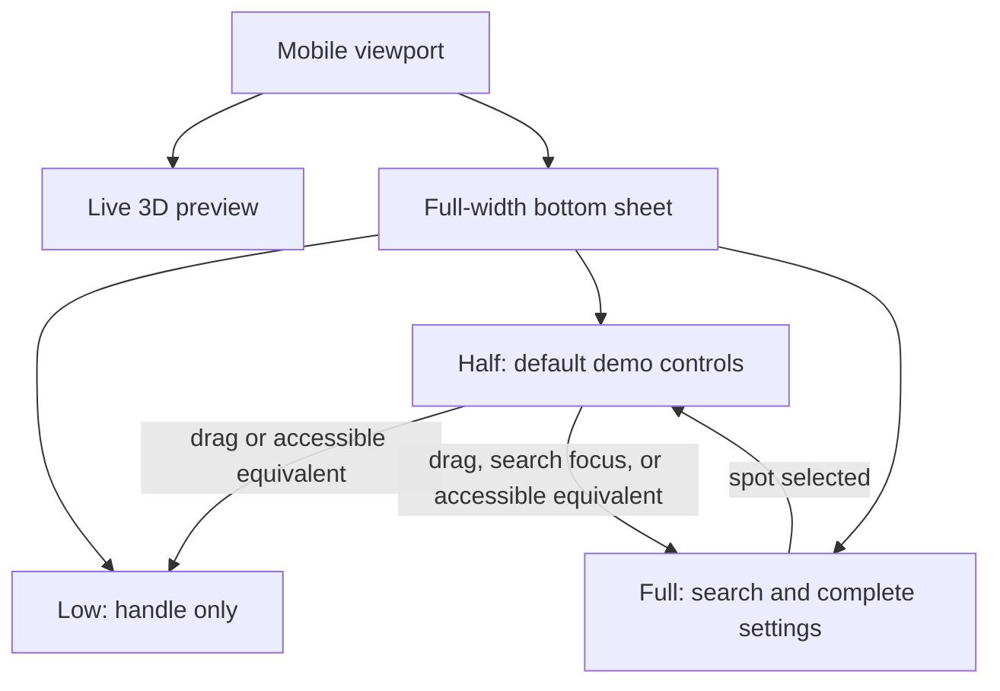
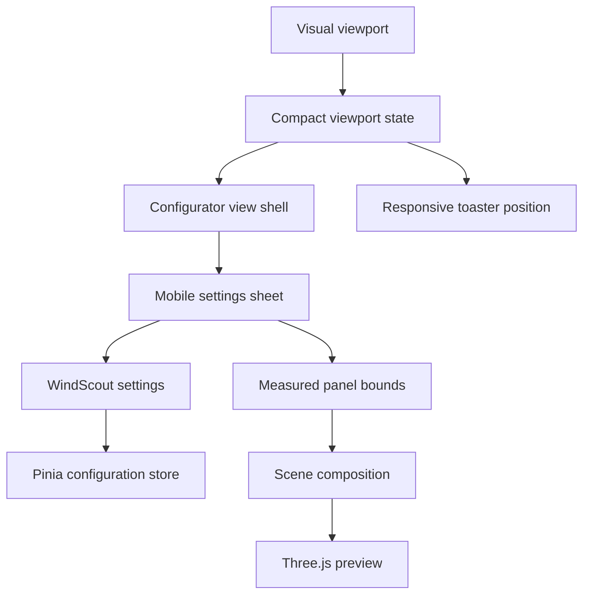
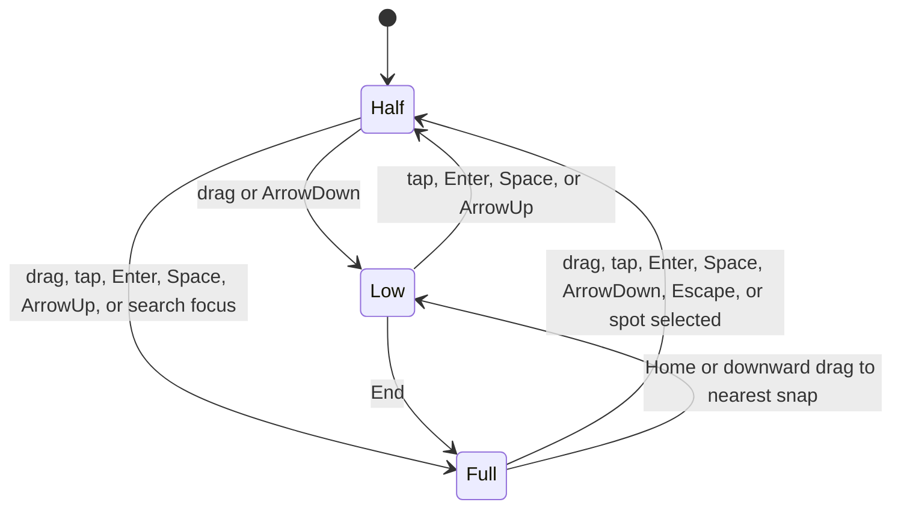
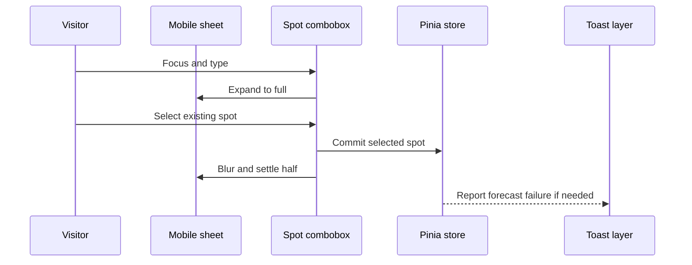

# Mobile Configurator Experience - Plan

## Goal Capsule

- **Objective:** Mobile visitors can understand and explore WindScout by configuring the live display comfortably on a phone, without mistaking the mobile experience for the device-installation flow.
- **Means:** Extend the current inspector and scene-composition patterns with a local, height-driven mobile sheet state machine and compact control variants (KTD1-KTD4).
- **Product authority:** This plan owns the mobile configurator experience. Existing desktop inspector behavior and the eventual installation journey remain separate authority.
- **Open blockers:** None for planning this mobile experience. The location and wording of future desktop-install guidance are deliberately deferred.
- **Execution profile:** Code implementation with component, unit, browser, accessibility, and responsive visual verification.
- **Tail ownership:** The implementation owner is responsible for browser polish and desktop regression coverage; the later installation-messaging pass owns the intentional TODO in R13.

---

## Product Contract

### Summary

The configurator becomes a full interactive mobile demo built around a full-width bottom sheet over the live 3D preview. Implementation extends the existing settings and scene-composition patterns with a local three-snap sheet layer and no new UI dependency.

### Problem Frame

The current inspector was shaped for pointer input and desktop density. On a phone, its small targets, custom dropdown behavior, and fixed panel shape make the demo harder to operate and leave too little room for the display itself.

Mobile still has meaningful demo value even when device installation happens elsewhere. Removing configuration or spot selection would make the preview less personal and would hide the product's core flexibility from visitors who first encounter WindScout on a phone.

### Key Decisions

- **Keep mobile fully interactive** (session-settled: user-directed — chosen over a preview-only mobile mode: the configurator has standalone demo value). Governs R1, R7.
- **Use a three-position bottom sheet** (session-settled: user-directed — chosen over a fixed floating inspector: it balances preview space with access to controls). Governs R2-R5.
- **Limit mobile search to existing spots** (session-settled: user-directed — chosen over the complete custom-spot flow: custom placement adds complexity without being necessary for the demo). Governs R6, R8, R9.
- **Use native mobile pickers for dropdowns** (session-settled: user-directed — chosen over custom mobile dropdown menus: native controls provide better touch and platform behavior). Governs R11.
- **Defer desktop-install messaging** (session-settled: user-directed — chosen over a provisional `Continue on desktop` action: the product has not yet settled where or how to explain installation). Governs R13.

### Requirements

**Mobile composition**

- R1. The mobile configurator must preserve the live 3D preview and make all current configuration settings operable.
- R2. The inspector must become a bottom sheet attached to the bottom edge and spanning the full usable viewport width.
- R3. The sheet must support low, half, and full positions and open at the half position on first arrival.
- R4. The low position must show only the drag handle, without a spot name, label, or persistent action.
- R5. The display must remain meaningfully visible as the sheet changes position, with the scene composed for the unobscured viewport rather than hidden behind the sheet.

**Spot search**

- R6. Mobile spot search must return and select existing WindScout spots but must not offer custom spot creation.
- R7. Spot search must not autofocus on page load, so the mobile keyboard does not cover the initial demo.
- R8. Focusing spot search must move the sheet to its full position and show matching results inline below the field while the visitor types.
- R9. Selecting a result must update the preview, dismiss the keyboard, and return the sheet to its half position.
- R10. A search with no existing match must explain briefly that new spots can be created on desktop without presenting an add action.

**Touch controls**

- R11. Model and temperature dropdowns must use the platform's native select experience on mobile while their closed state remains visually consistent with the inspector.
- R12. Interactive controls must provide a target of at least 44 by 44 CSS pixels; spot search must request a search keyboard, the wind-threshold value must request a numeric keyboard, and Show/Hide settings must remain segmented controls.

**Installation messaging**

- R13. This mobile sheet must not include `Continue on desktop`, an install action, or a provisional installation warning; implementation must retain a discoverable TODO to revisit desktop-install guidance for reTerminal E1001/E1002.

### Key Flows

- F1. First mobile visit
  - **Trigger:** A visitor opens the configurator on a phone.
  - **Steps:** The 3D preview loads with the sheet half open; spot search is unfocused; visible controls can immediately change the preview.
  - **Outcome:** The visitor understands that the product is interactive without the keyboard or inspector dominating the screen.
  - **Covered by:** R1-R5, R7.

- F2. Inspect or hide controls
  - **Trigger:** The visitor moves or activates the sheet handle.
  - **Steps:** The sheet settles at low, half, or full; controls scroll only in the full position when required; the preview recomposes for the remaining space.
  - **Outcome:** The visitor can prioritize either the product preview or its settings without horizontal overflow.
  - **Covered by:** R2-R5, R12.

- F3. Choose an existing spot
  - **Trigger:** The visitor focuses spot search.
  - **Steps:** The sheet expands; the search keyboard opens; matching existing spots appear inline; selecting one updates the preview and returns the sheet to half.
  - **Outcome:** The visitor sees a personally relevant forecast with minimal interruption to the demo.
  - **Covered by:** R6-R9.

- F4. Search without a match
  - **Trigger:** The visitor enters a query that matches no existing spot.
  - **Steps:** The results area gives the desktop-creation explanation and offers no mobile creation action.
  - **Outcome:** The visitor understands the limitation without entering an incomplete custom-spot flow.
  - **Covered by:** R6, R10.

### Acceptance Examples

- AE1. **Covers R3, R4, R7.** Given a visitor arrives on a phone, when the configurator becomes interactive, then the sheet is half open, the search is empty and unfocused, and the software keyboard is closed.
- AE2. **Covers R4, R5.** Given the sheet is half open, when the visitor moves it to low, then only the handle remains and the display occupies the newly available visual space.
- AE3. **Covers R8, R9.** Given the sheet is half open, when the visitor focuses search and selects an existing spot, then the sheet expands for search and returns to half after the preview updates.
- AE4. **Covers R6, R10.** Given no existing spot matches the query, when results settle, then no custom-spot action is shown and the visitor is told that new spots are created on desktop.
- AE5. **Covers R11, R12.** Given a visitor activates Model or Temperature on a phone, when the control opens, then the native platform picker is used and every visible option has a touch-appropriate target.
- AE6. **Covers R1, R2, R12.** Given a 320 CSS-pixel-wide viewport, when the visitor operates every setting, then no control or result creates horizontal page overflow and all settings remain reachable.
- AE7. **Covers R13.** Given the visitor reaches the end of the settings, when no installation journey has been defined, then the sheet ends without a desktop-continuation or install CTA.

### Scope Boundaries

- Creating or pinning a new spot on mobile is deferred; the existing desktop custom-spot flow remains unchanged.
- Installing software on a reTerminal from mobile is outside this work.
- Choosing the location, wording, and interaction for desktop-install guidance is deferred for a separate product pass.
- Preserving configuration through unique links, accounts, device codes, or another mobile-to-desktop handoff is deferred.
- The desktop inspector layout and dropdown behavior are not redesigned by this plan.

### Dependencies and Assumptions

- The same configuration state and live-preview behavior used by the desktop inspector are available to the mobile surface.
- Native select presentation may differ between iOS and Android; consistency is required for the closed control, not for the operating system's opened picker.
- Sheet position changes must remain accessible without requiring precise dragging alone.
- Safe-area insets and the mobile keyboard are part of the usable viewport when determining sheet size and scroll behavior.

### Sources and Research

- Existing configurator direction: `docs/plans/2026-08-26-0630-feat-public-3d-configurator-plan.md`
- Existing 3D prototype direction: `docs/plans/2026-08-26-0724-feat-3d-configurator-prototype-plan.md`
- Existing inspector controls direction: `docs/plans/2026-08-27-0007-refactor-windscout-settings-controls-plan.md`
- Touch target guidance: [Apple UI Design Dos and Don'ts](https://developer.apple.com/design/tips/) and [WCAG 2.2 target size guidance](https://www.w3.org/WAI/WCAG22/Understanding/target-size-minimum.html)
- Native control reference: [MDN `<select>` element](https://developer.mozilla.org/en-US/docs/Web/HTML/Reference/Elements/select)

---

## Planning Contract

**Product Contract preservation:** Product Contract unchanged.

### Key Technical Decisions

- KTD1. **Build a height-driven sheet on the existing layout rather than add a drawer library.** The current scene already observes panel size and composes around its measured top edge, so changing sheet block-size keeps the preview and inspector on one geometry source. Governs U1, U4.
- KTD2. **Keep snap and viewport state outside Pinia.** A dedicated mobile sheet component owns `low`, `half`, and `full`, while Pinia remains the source of product, forecast, and tide state. Governs U1, U2.
- KTD3. **Render one settings surface for the active responsive mode.** Compact detection uses the existing `56rem` boundary and prevents duplicate controls, duplicate autofocus, or two mounted search flows. Governs U1-U4.
- KTD4. **Extend shared controls with compact modes instead of duplicate mobile controls.** The combobox gains inline and blur-after-select behavior, and the select gains a native branch while desktop behavior remains unchanged. Governs U2, U3.
- KTD5. **Model snap geometry from the visible visual-viewport bounds.** Low is a 56 CSS-pixel handle rail plus the bottom safe inset, half is 50% of the current visual viewport, and full stays between `visualViewport.offsetTop` and the visual viewport's visible bottom while leaving the top safe inset visible. Recalculate on both visual-viewport resize and scroll, and fall back to dynamic viewport units when that API is unavailable. Governs U1, U4.
- KTD6. **Move compact forecast toasts above the sheet.** Compact viewports use a top-center safe-area position while desktop keeps bottom-right. Governs U4.

### High-Level Technical Design

The responsive shell owns mode and sheet position. Settings own search drafts and product-control events. The store continues to own committed configuration. The scene derives its composition from the measured space above the sheet.

The sheet uses three stable snap states. Search focus temporarily promotes the sheet to full, and a committed spot returns it to half.

Spot selection separates UI completion from forecast loading. The visitor leaves search immediately while the existing store and toast behavior continue asynchronously.

### Implementation Constraints

- Use `56rem` as the compact boundary across CSS, viewport detection, and scene composition.
- Animate sheet block-size only under `prefers-reduced-motion: no-preference`; reduced motion settles immediately.
- Start drags only from the handle rail and reserve content gestures for vertical scrolling.
- Make low-state settings content inert so clipped controls do not remain keyboard- or screen-reader-reachable.
- In half state, expand to full before a keyboard-focused control would become clipped.
- Use `window.visualViewport` height and `offsetTop` for keyboard-aware visible bounds when available, listen to its resize and scroll events, and fall back to dynamic viewport units.
- Keep custom spot creation, Geoapify search, and `SpotCreationDialog` unchanged on desktop.
- Keep the desktop `InstallContinuation` placeholder unchanged and omit it from the compact accessibility tree per R13.

### Sequencing

1. Establish compact detection, pure snap geometry, and the accessible sheet shell.
2. Adapt spot search lifecycle to inline compact behavior.
3. Add native compact selects and shared touch sizing.
4. Connect moving sheet geometry to scene and toast composition.
5. Complete cross-viewport browser verification and visual polish.

### System-Wide Impact

- **State:** Product state remains in Pinia; sheet and search presentation state stay local and reset on each configurator mount.
- **Accessibility:** The handle becomes a real button whose accessible name announces the current snap and next activation result, low content becomes inert, and native selects preserve existing label and description relationships.
- **Rendering:** Scene composition receives more frequent panel-size changes during drag and snap transitions but retains the existing render-on-demand model.
- **Errors:** Forecast and tide behavior remain unchanged; only compact toast placement changes to avoid occlusion.
- **Data and APIs:** No persistence, API, spot-catalog, Geoapify, or firmware contract changes are required.

### Risks and Mitigations

- **Gesture conflict:** Restrict sheet dragging to the handle and use pointer capture there; preserve scene orbit on the unobscured preview and content scrolling inside the full sheet.
- **Keyboard occlusion:** Derive the sheet's visible top and bottom from visual-viewport height plus offset, update on resize and scroll, expand before focusing search, and blur before returning to half.
- **Scene jitter:** Drive composition from measured sheet height instead of transforms and cover every snap with deterministic scene-composition tests.
- **Hidden focus targets:** Use inert content in low and promote half to full before focus reaches clipped controls.
- **Desktop regressions:** Keep desktop Reka selects, autofocus, popovers, custom-spot creation, and Install behavior behind explicit desktop regression tests.
- **Platform picker variance:** Automate native markup and value behavior, then manually check opened pickers and keyboards on iOS Safari and Android Chrome when those devices are available.

### Sources and Research

- Responsive panel and safe-area pattern: `web/src/styles/configurator.css`
- Settings ownership and spot search: `web/src/components/WindScoutSettings.vue`
- Shared control semantics: `web/src/components/settings/SettingCombobox.vue`, `web/src/components/settings/SettingSelect.vue`, `web/src/components/settings/SettingSwitch.vue`, `web/src/components/settings/SettingNumberInput.vue`
- Panel-aware scene composition: `web/src/components/WindScoutScene.vue`, `web/src/configurator/sceneController.js`
- Current responsive browser coverage: `web/tests/e2e/configurator.spec.js`
- No `docs/solutions/` corpus exists for this area; current code and tests are the implementation authority.

---

## Implementation Units

### U1. Responsive sheet state and shell

- **Goal:** Introduce the compact viewport boundary, deterministic snap geometry, and an accessible full-width sheet without changing desktop composition.
- **Requirements:** R2-R5, R13; F1, F2; AE1, AE2, AE6, AE7.
- **Dependencies:** None.
- **Files:**
  - Create `web/src/components/MobileSettingsSheet.vue`
  - Create `web/src/composables/useCompactViewport.js`
  - Create `web/src/configurator/mobileSheet.js`
  - Modify `web/src/views/ConfiguratorView.vue`
  - Modify `web/src/styles/configurator.css`
  - Modify `web/index.html`
  - Create `web/tests/mobile-sheet.test.js`
  - Modify `web/tests/configurator-view.test.js`
- **Approach:**
  1. Reuse the existing `56rem` boundary through one compact viewport composable with lifecycle-safe `matchMedia` listeners.
  2. Keep one `.settings-panel` wrapper mounted for the active mode so scene measurement retains a stable integration point.
  3. Let the mobile sheet own snap state, visual-viewport height and offset, pointer capture, nearest-snap release, keyboard snap commands, and focus promotion. A handle activation moves low to half, half to full, and full to half; Enter and Space follow the same rule. Its accessible name states the current snap and the result of activation, and `aria-controls` associates it with the settings region.
  4. Size the sheet through block-size and CSS variables rather than translating a fixed-height panel.
  5. Render settings content inert in low and render `InstallContinuation` only outside compact mode.
  6. Add `viewport-fit=cover` and place bottom safe-area space inside the sheet.
  7. Leave the R13 TODO beside the compact omission and name future reTerminal E1001/E1002 desktop-install guidance.
- **Patterns to follow:** Existing compact boundary and safe-area rules in `web/src/styles/configurator.css`; lifecycle cleanup in Vue components; pure geometry tests in `web/tests/scene-controller.test.js`.
- **Test scenarios:**
  - Covers AE1. At 390 by 844, first mount renders one settings surface in half state with no focused control.
  - Covers AE2. Moving half to low leaves only a 44 CSS-pixel-or-larger handle target visible and makes settings content inert.
  - At 896 CSS pixels, compact mode renders the mobile sheet; at 897 CSS pixels, desktop renders the existing inspector.
  - Resizing, rotating, or changing visual-viewport offset preserves the current named snap and recalculates its bounds from the visible viewport.
  - Pointer release selects the nearest snap and pointer cancellation settles safely without leaving an intermediate height.
  - Handle click, Enter, Space, ArrowUp, ArrowDown, Home, and End reach every snap without drag precision; the button name announces the current snap and next activation result.
  - A nonzero visual-viewport offset keeps full-sheet top and bottom inside the visible browser area and updates on visual-viewport scroll as well as resize.
  - Reduced motion changes snap state without an animated transition.
  - Covers AE7. Compact mode has no Install or continuation control, while desktop still renders the existing Install placeholder.
- **Verification:** Snap calculations are deterministic, only one responsive settings surface exists, low has no hidden interactive descendants, and desktop structure remains unchanged.

### U2. Inline mobile spot search lifecycle

- **Goal:** Make existing-spot search behave as an inline, keyboard-aware task inside the full sheet while preserving desktop custom-spot creation.
- **Requirements:** R6-R10; F3, F4; AE3, AE4.
- **Dependencies:** U1.
- **Files:**
  - Modify `web/src/components/WindScoutSettings.vue`
  - Modify `web/src/components/settings/SettingCombobox.vue`
  - Modify `web/src/styles/settings-controls.css`
  - Modify `web/tests/settings.test.js`
  - Modify `web/tests/settings-controls.test.js`
- **Approach:**
  1. Pass compact mode and search lifecycle events through `WindScoutSettings` without moving the query draft into Pinia.
  2. Extend the shared combobox with inline versus portalled content and blur-after-select versus refocus behavior under KTD4.
  3. Disable initial autofocus, create actions, and `SpotCreationDialog` rendering only in compact mode.
  4. Preserve the current two-character threshold, ranking, de-duplication, personal-spot inclusion, and result cap.
  5. Expand the sheet before search focus; on selection commit immediately, close results, blur, and settle half without waiting for forecast loading.
  6. On Escape or handle-driven collapse, restore the committed label, close results, blur, and settle half.
  7. Show concise desktop-creation guidance only after a settled zero-result query and never render an add action.
- **Patterns to follow:** Existing controlled search and committed-label restoration in `SettingCombobox`; existing `searchSpots` behavior in `web/src/spots/searchSpots.js`; current forecast warning flow in the configurator store.
- **Test scenarios:**
  - Covers AE1. Compact search is empty and unfocused on first mount; desktop search retains its existing autofocus behavior.
  - Focusing compact search expands the sheet before input focus and renders results inside the sheet rather than a body portal.
  - Zero or one character renders no list and no empty message; two matching characters show ranked existing and personal spots.
  - Covers AE3. Selecting a different result commits its ID and label, blurs the input, and returns the sheet to half before forecast completion.
  - Selecting the already-selected result still closes search, blurs, and returns half without a redundant store request.
  - Covers AE4. A zero-result query shows desktop-creation guidance with no create option and never opens `SpotCreationDialog`.
  - Escape and handle collapse restore the committed label and leave no inline result list open.
  - Desktop still offers `Add <query>` and opens the existing custom-spot dialog.
- **Verification:** Mobile search has one clear entry and terminal state for selection, cancellation, and no match; desktop search behavior remains intact.

### U3. Native compact controls and touch sizing

- **Goal:** Make every mobile setting comfortable to tap and use platform-native model and temperature selection without changing desktop control behavior.
- **Requirements:** R1, R11, R12; F1, F2; AE5, AE6.
- **Dependencies:** U1.
- **Files:**
  - Modify `web/src/components/settings/SettingSelect.vue`
  - Modify `web/src/components/settings/SettingCombobox.vue`
  - Modify `web/src/components/settings/SettingNumberInput.vue`
  - Modify `web/src/styles/settings-controls.css`
  - Modify `web/tests/settings-controls.test.js`
  - Modify `web/tests/settings.test.js`
- **Approach:**
  1. Add a native select branch that reuses the same options, values, names, disabled states, injected IDs, labels, and descriptions.
  2. Keep the Reka select branch for desktop and render only one accessible control per setting.
  3. Raise the compact shared control, switch, search, result-row, and handle targets to at least 44 by 44 CSS pixels.
  4. Preserve the two-column label/control alignment where it fits and constrain controls with `min-width: 0` so 320 CSS-pixel layouts do not overflow.
  5. Request a search keyboard for spot search and an integer numeric keyboard for the one-knot threshold input.
  6. Keep segmented Show/Hide semantics and disabled Tide explanation behavior unchanged.
- **Patterns to follow:** Row-provided labeling in `SettingRow`; shared option data in `WindScoutSettings`; existing focus-visible styling and compact tokens in `settings-controls.css`.
- **Test scenarios:**
  - Covers AE5. Compact Model and Temperature render real `select` elements with the expected labels, options, values, disabled state, and update events.
  - Desktop Model and Temperature continue to render Reka combobox triggers and keyboard-operable popovers.
  - Search exposes a search input hint and Minimum wind exposes an integer numeric input hint.
  - Every compact handle, field, segmented switch, native select, and result row has a 44 CSS-pixel-or-larger hit box.
  - Covers AE6. Long labels and spot results truncate within a 320 CSS-pixel viewport without widening the page or control column.
  - Unavailable Tide remains on Hide, retains its label contrast, and exposes its reason by focus and hover where supported.
- **Verification:** Compact controls are native where required, retain accessible names, fit the narrowest supported viewport, and leave desktop popup behavior unchanged.

### U4. Scene, viewport, and error-layer integration

- **Goal:** Keep the 3D product and error feedback visible through sheet movement, keyboard changes, and every snap position.
- **Requirements:** R1, R3, R5; F1-F3; AE2, AE3, AE6.
- **Dependencies:** U1, U2.
- **Files:**
  - Modify `web/src/components/WindScoutScene.vue`
  - Modify `web/src/configurator/sceneController.js`
  - Modify `web/src/App.vue`
  - Modify `web/src/styles/configurator.css`
  - Modify `web/tests/scene-controller.test.js`
  - Modify `web/tests/configurator-view.test.js`
  - Modify `web/tests/e2e/configurator.spec.js`
- **Approach:**
  1. Continue measuring the `.settings-panel` top and let sheet block-size changes trigger the existing resize observer throughout drag and snap motion.
  2. Add low, half, full, keyboard-open, nonzero visual-viewport offset, and landscape composition fixtures to the pure scene calculation tests.
  3. Keep the product centered in measured free space and apply the same region to the WebGL failure surface.
  4. Switch Sonner to top-center with a safe-area offset in compact mode and preserve bottom-right on desktop.
  5. Keep toast z-index above the full sheet without changing forecast or tide error sources.
- **Patterns to follow:** `calculateSceneComposition` as the single scene-fitting function; render-on-demand and resize observation in `WindScoutScene`; the existing global Sonner error watcher in `App.vue`.
- **Execution note:** Measure render behavior during real drag and keep the existing request-animation-frame coalescing; do not add a continuous render loop.
- **Test scenarios:**
  - Covers AE2. Low, half, and full bounds produce stable available-height, view-offset, and zoom results without hiding the device.
  - During a sheet drag, observed panel-top changes recompute the scene and finish at the exact selected snap composition.
  - Opening the software keyboard keeps the handle and focused search field inside the visual viewport.
  - A forecast failure after spot selection does not reopen or delay the completed search flow and remains visible through the compact toast.
  - A landscape resize recomputes sheet and scene geometry without body overflow.
  - A WebGL failure remains centered in the unobscured preview region at low, half, and full.
  - A forecast failure is visible above both half and full sheets at top-center on compact viewports.
  - Desktop forecast failure remains bottom-right.
- **Verification:** The preview, WebGL error, and toast layer remain visible and stable across every compact geometry state without a permanent render loop.

### U5. Cross-viewport browser regression and polish

- **Goal:** Prove the complete mobile experience at supported narrow sizes and preserve the current desktop inspector behavior.
- **Requirements:** R1-R13; F1-F4; AE1-AE7.
- **Dependencies:** U1-U4.
- **Files:**
  - Modify `web/tests/e2e/configurator.spec.js`
  - Modify `web/tests/configurator-view.test.js`
  - Modify `web/tests/settings.test.js`
  - Modify `web/tests/settings-controls.test.js`
  - Modify `web/tests/scene-controller.test.js`
- **Approach:**
  1. Split the existing shared responsive test so desktop retains floating-panel, autofocus, popup-alignment, Install, and 32/38 CSS-pixel expectations.
  2. Add compact journeys for 390 by 844, 320 by 700, landscape, 896 CSS-pixel boundary, and 897 CSS-pixel desktop boundary.
  3. Exercise each snap by pointer and keyboard, then verify focus order, inertness, internal scrolling, safe areas, target sizes, and body width.
  4. Exercise search selection, same-result selection, cancellation, no match, native selects, threshold input, unavailable Tide, and forecast failure.
  5. Capture browser screenshots at low, half, full, search-open, and keyboard-aware states for visual comparison during implementation.
- **Patterns to follow:** Existing Playwright geometry, focus, dropdown-stability, truncation, and reduced-motion assertions in `web/tests/e2e/configurator.spec.js`.
- **Execution note:** Start by rewriting the outdated mobile assertions before styling so browser failures describe the new contract rather than the old floating panel.
- **Test scenarios:**
  - Covers AE1-AE7. Complete the product flows at 390 by 844 and repeat geometry-critical coverage at 320 by 700.
  - At 896 CSS pixels the compact contract applies; at 897 CSS pixels the desktop contract applies.
  - At low, tab navigation cannot enter settings; at half, focus promotion makes a clipped destination visible in full before focus settles.
  - Full-state content scrolls without moving the sheet, and handle dragging moves the sheet without scrolling content.
  - Reduced-motion mode has no interpolated snap frames and preserves every terminal state.
  - No tested state creates horizontal document overflow, a hidden toast, or a control below the 44 CSS-pixel compact target.
  - Desktop search, custom spot creation, Reka dropdown alignment, close stability, focus rings, and Install placeholder retain current behavior.
- **Verification:** Automated browser evidence and screenshots show consistent layout, interaction, and polish across compact and desktop modes; any native picker variance is documented by the manual checks below.

---

## Verification Contract

| Layer | Command or check | Proves | Applies to |
| --- | --- | --- | --- |
| Focused unit tests | `cd web && npm test -- tests/mobile-sheet.test.js tests/configurator-view.test.js tests/settings.test.js tests/settings-controls.test.js tests/scene-controller.test.js` | Snap math, responsive render ownership, search lifecycle, native controls, labels, and scene composition | U1-U4 |
| Full web tests | `cd web && npm test` | No regression across the configurator store, renderer, map, forecast, and current component suite | U1-U5 |
| Chromium browser flow | `cd web && npm run test:e2e -- tests/e2e/configurator.spec.js --project=chromium` | Real layout, pointer, keyboard, focus, overflow, toast, responsive, and desktop regression behavior | U1-U5 |
| Production build | `cd web && npm run build` | Vue and Vite production compilation succeeds with the new responsive branches | U1-U5 |
| Mobile visual QA | Inspect 390 by 844, 320 by 700, 844 by 390, 896 CSS-pixel, and 897 CSS-pixel states in a real browser | Sheet polish, shadows, rounded top corners, scene balance, truncation, scrolling, and safe-area composition | U1-U5 |
| Native platform QA | Open Model, Temperature, search, and Minimum wind on iOS Safari and Android Chrome when available | Real OS picker and keyboard presentation cannot be proven by desktop Chromium automation | U2, U3 |

The web package has no lint script. Do not claim lint verification unless the project adds one.

---

## Definition of Done

- All R1-R13 requirements and AE1-AE7 acceptance examples have automated or named manual evidence.
- U1 is complete when snap geometry, accessible handle behavior, responsive ownership, safe areas, and mobile Install omission pass their focused tests.
- U2 is complete when mobile search reaches correct terminal states for selection, cancellation, same-result selection, and no match while desktop creation remains intact.
- U3 is complete when compact controls meet the 44 CSS-pixel target, native selects retain semantics, and 320 CSS-pixel layouts do not overflow.
- U4 is complete when preview, error, keyboard, and toast composition remain visible at every snap without introducing a permanent render loop.
- U5 is complete when compact and desktop browser journeys pass and their screenshots show consistent spacing, alignment, shadows, radii, focus states, and truncation.
- The source contains the intentional R13 TODO for future reTerminal E1001/E1002 desktop-install guidance and no other placeholder product behavior.
- Desktop custom-spot creation, Reka dropdowns, focus behavior, Install placeholder, and 3D interaction remain regression-covered.
- No abandoned sheet experiments, unused dependencies, duplicate responsive controls, dead styles, or temporary browser instrumentation remain in the final diff.
