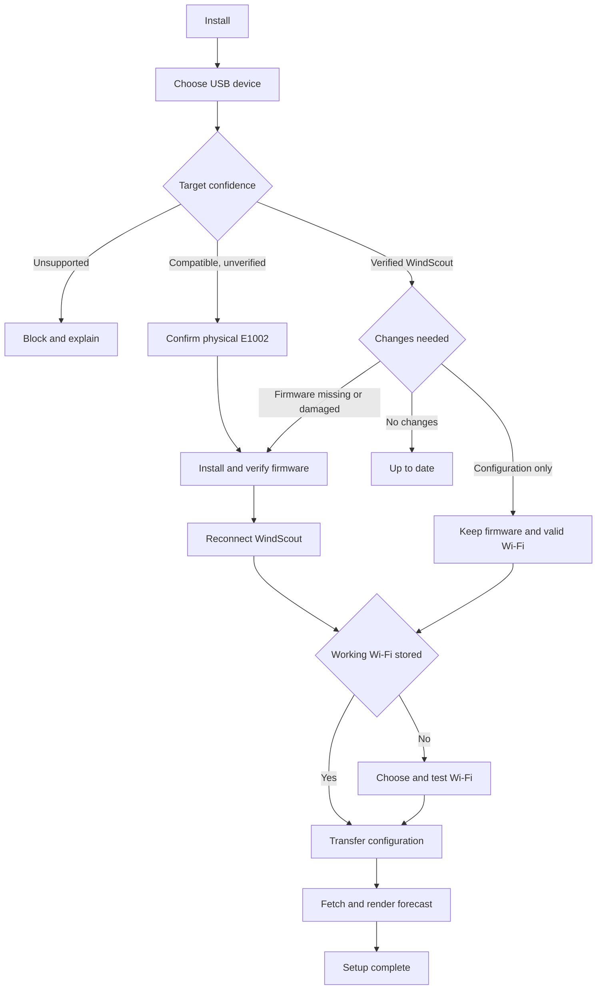
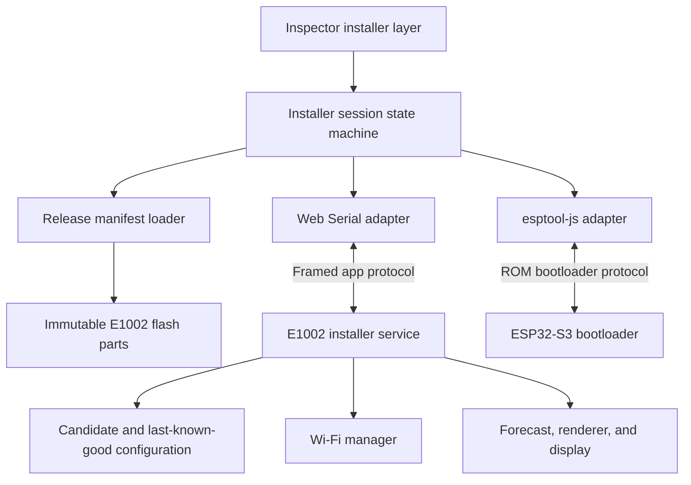
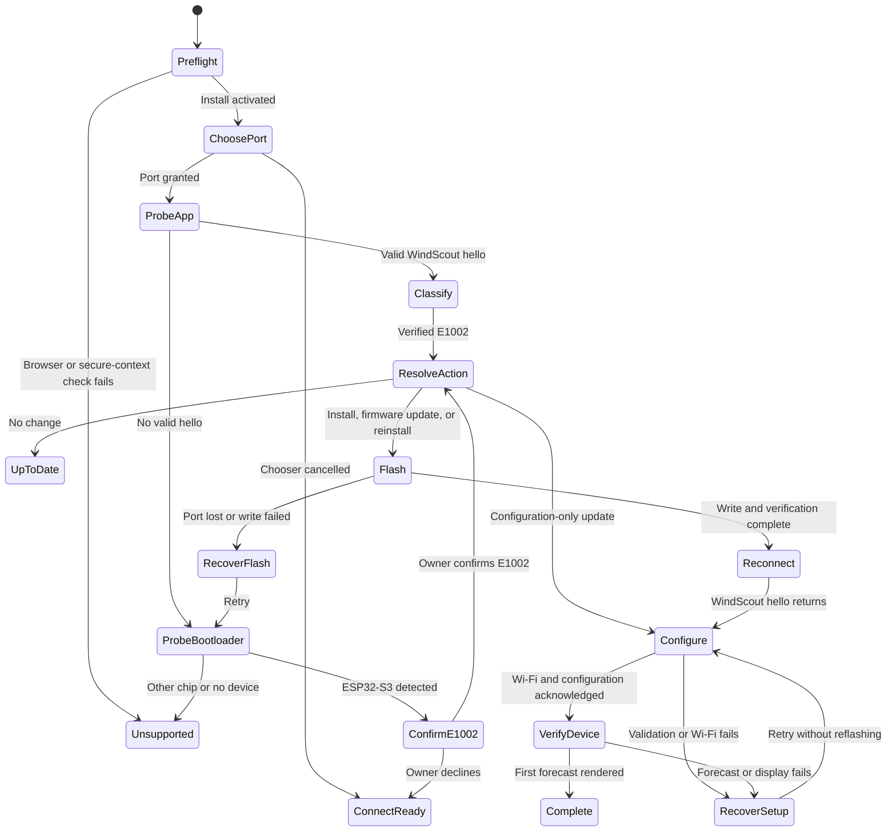
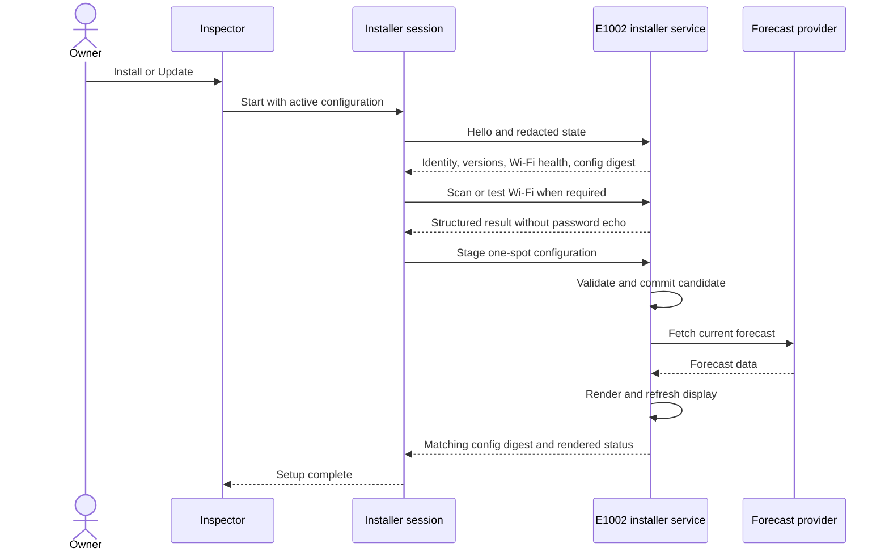

# USB Device Installer - Plan

## Goal Capsule

- **Objective:** An E1002 owner can turn the configured browser preview into a working physical WindScout through one guided desktop USB flow, then return later to update settings without reinstalling unnecessarily.
- **Means:** Push a first-party installer layer into the existing inspector and use a browser-based Espressif flashing engine beneath WindScout-owned device detection, progress, Wi-Fi, configuration, and verification states.
- **Product authority:** This plan owns first installation, USB configuration updates, and USB reinstallation for the E1002. It does not own the surrounding configurator, automatic OTA, or other device models.
- **Open blockers:** None at product scope. Planning must bind the experience to physically verified E1002 behavior before implementation is considered shippable.

---

## Product Contract

### Summary

WindScout shall provide one first-party USB installer that changes its path according to the connected E1002's state. New devices are installed and provisioned, existing WindScouts are updated without unnecessary flashing, and damaged installations can be reinstalled through the same focused interface.

**Product Contract preservation:** changed R14 to confirm that the browser-selected spot becomes the device's single installed spot. This user-approved clarification does not expand the installer beyond the active configuration already owned by R14.

### Problem Frame

The configurator can already produce a credible device preview, while the existing firmware web app can open a generic ESP Web Tools installer. These surfaces do not yet form one product journey. The generic installer also owns its own modal, terminology, board selection, and recovery behavior, which breaks the continuity of the inspector experience and makes non-technical users reason about firmware tooling.

The browser cannot silently trust every connected ESP32-S3 as an E1002. It also cannot hide the operating system's serial-port permission dialog or guarantee uninterrupted USB access. The product therefore needs honest target confidence, deliberate critical states, and recovery that does not expose developer tooling.

### Key Decisions

- **Own the complete flash interface.** (session-settled: user-directed — chosen over handing the destructive step to the ESP Web Tools modal: first-party control provides the most coherent installation experience.) Governs R5-R7, R16-R17.
- **Preserve valid Wi-Fi intelligently.** (session-settled: user-directed — chosen over always erasing or never erasing device data: returning owners keep a frictionless update while unknown devices still receive a predictable clean installation.) Governs R9, R12-R13.
- **Use one focused state per inspector layer.** (session-settled: user-directed — chosen over a persistent stepper or expanding checklist: conditional install and update routes should remain calm and spatially consistent.) Governs R15-R17.
- **Change the action to match the connected device.** (session-settled: user-approved — chosen over asking the owner to select install, update, or recovery before detection: the device state should determine the next action.) Governs R3, R8, R18.
- **Lock navigation only during critical writes.** (session-settled: user-directed — chosen over always allowing cancellation or locking the entire flow: normal navigation remains flexible without inviting unsafe interruption.) Governs R10.
- **Reinstall inside the normal installer.** (session-settled: user-directed — chosen over a separate recovery experience: repeating the familiar route is sufficient for the first release.) Governs R18-R19.
- **Support E1002 first.** (session-settled: user-directed — chosen over launching E1001 and E1002 together: one physical target can reach reliable identification and acceptance sooner.) Governs R3-R4, R20.
- **Install one active spot.** (session-settled: user-approved — chosen over preserving the firmware's current rotating built-in spot set: the physical WindScout should match the one spot configured in the browser.) Governs R8, R14, R17.

<!-- ce-section: work-relationships -->
### How This Work Fits Together

This plan owns the USB installer slice of the broader public configurator described in `docs/plans/2026-08-26-0630-feat-public-3d-configurator-plan.md`. The relationships below orient later planning and do not commit a roadmap.

- **Depends on:** The canonical browser configuration and release firmware must represent the same supported E1002 behavior.
- **Shares:** Mobile configurator work shares installation-availability messaging but can proceed independently of the desktop USB implementation.
- **Enables:** Later automatic OTA and rollback can use the installed firmware and USB recovery route, but remain separate work.
- **Preserves:** The current captive portal remains available until USB Wi-Fi setup and recovery pass physical acceptance.

### Actors

- A1. **First-time E1002 owner:** Has configured a WindScout preview and wants to install WindScout on a new or unknown device.
- A2. **Returning WindScout owner:** Reconnects an installed E1002 to update its spot, display settings, firmware, or Wi-Fi.
- A3. **Browser installer:** Requests serial permission, identifies capabilities, flashes firmware, transfers configuration, and presents progress without retaining secrets.
- A4. **E1002 device:** Reports identity and state when possible, accepts validated changes, joins Wi-Fi, retrieves a forecast, and reports a verifiable result.

### Requirements

**Entry and target confidence**

- R1. Installation shall begin only in a secure desktop browser context with the required serial capability, while unsupported browsers receive a clear desktop-browser requirement before any device action.
- R2. Activating `Install` shall push the installer into the existing inspector before or alongside the unavoidable system serial-port chooser, and cancellation shall leave a recoverable connect state.
- R3. After permission, the installer shall classify the target as a verified WindScout E1002, an unverified compatible ESP32-S3, or an unsupported device without presenting chip detection as enclosure detection.
- R4. An unverified compatible ESP32-S3 shall require an illustrated E1002 confirmation before any destructive operation, while an unsupported device shall remain blocked.

**Installation and preservation**

- R5. All product-facing connection, flash, progress, and error states shall remain inside WindScout's installer chrome, except for browser-owned permission UI.
- R6. A first installation shall write the approved E1002 firmware, verify the written result, reset the device, and continue the same installer journey after reconnection.
- R7. The installer shall show useful progress during firmware preparation, writing, and verification without exposing raw serial logs as the primary experience.
- R8. A verified WindScout that only needs configuration changes shall update without reflashing, and an unchanged compatible device shall report `Up to date`.
- R9. A normal WindScout update shall preserve valid Wi-Fi data, while a clean install or required full erase shall state that Wi-Fi must be configured again before the destructive action begins.
- R10. Back navigation shall work before and after firmware writing but remain unavailable while flash writing or verification is in its critical section.

**Wi-Fi and configuration**

- R11. After a reboot, the installer shall guide the owner to reconnect the same device while preserving the non-secret configuration selected in the current browser session.
- R12. A verified WindScout with valid working Wi-Fi shall skip Wi-Fi entry, while a device without a working connection shall offer device-scanned networks and a manual network-name fallback.
- R13. Wi-Fi credentials shall travel only between the active browser session and the connected device, shall remain in memory only as long as needed, and shall never enter website persistence, URLs, analytics, or diagnostic output.
- R14. The installer shall replace the device's installed spot with the browser's one active WindScout spot, transfer its display configuration, validate device acknowledgement, and retry rejected or interrupted configuration without reflashing.

**Interaction, completion, and reinstallation**

- R15. Forward and backward user navigation shall push only the inspector's inner layer horizontally, while automatic progress shall update within the current layer and reduced-motion users shall receive an equivalent non-sliding transition.
- R16. A waiting state shall identify the active operation, show determinate progress when available, explain whether disconnecting is safe, and present one primary recovery action when it fails.
- R17. Installation shall report success only after the device has working Wi-Fi, has accepted the active WindScout configuration, and has retrieved and rendered its first valid forecast.
- R18. A compatible device with missing or damaged WindScout firmware shall offer `Reinstall` through the normal installer rather than entering a separate recovery product.
- R19. An interruption during flash shall return to a bootloader or reinstall instruction, while an interruption during Wi-Fi or configuration shall preserve the last committed working device state.
- R20. The first release shall install only on the reTerminal E1002 and shall not offer a destructive route for the E1001 or another ESP32 device.

### Key Flows



- F1. First installation
  - **Trigger:** A1 activates `Install` and grants access to a new or unknown compatible ESP32-S3.
  - **Actors:** A1, A3, A4
  - **Steps:** Preflight checks the browser, classifies the device, obtains physical E1002 confirmation when needed, flashes and verifies WindScout, reconnects, provisions Wi-Fi, transfers the active configuration, and verifies the first forecast.
  - **Outcome:** The physical E1002 runs the configuration shown in the browser.
  - **Covers:** R1-R7, R9-R17, R20.

- F2. Returning configuration update
  - **Trigger:** A2 reconnects a verified WindScout after changing the browser configuration.
  - **Actors:** A2, A3, A4
  - **Steps:** The installer detects the installed state, changes the action to `Update`, preserves working Wi-Fi, transfers only the required configuration, and verifies the resulting forecast.
  - **Outcome:** The device is updated without unnecessary firmware writing or Wi-Fi entry.
  - **Covers:** R3, R8-R9, R11-R17.

- F3. Reinstall a damaged WindScout
  - **Trigger:** A3 can reach a compatible E1002 bootloader but cannot validate working WindScout firmware.
  - **Actors:** A2, A3, A4
  - **Steps:** The existing installer offers `Reinstall`, explains any data that must be reset, writes and verifies firmware, then resumes the normal Wi-Fi and configuration path.
  - **Outcome:** The owner restores the device without entering a separate recovery application.
  - **Covers:** R9-R10, R16, R18-R19.

- F4. Unsafe or unsupported target
  - **Trigger:** Preflight cannot establish the minimum E1002 confidence required by R3-R4.
  - **Actors:** A1, A2, A3
  - **Steps:** The installer blocks firmware writing, states what it detected, and offers only a safe reconnect or exit action.
  - **Outcome:** No unsupported device is erased or presented as an E1002.
  - **Covers:** R3-R4, R20.

### Acceptance Examples

- AE1. **Covers R3-R4, R6, R20.** Given a blank compatible ESP32-S3, when the owner selects it, then the installer labels the enclosure as unverified and performs no write until the owner confirms an illustrated E1002 check.
- AE2. **Covers R8-R9, R12, R14.** Given a working WindScout with stored Wi-Fi, when the owner changes only the active spot, then the action becomes `Update`, no firmware or Wi-Fi step runs, and the device acknowledges the new configuration.
- AE3. **Covers R9, R12-R13.** Given a clean installation, when WindScout restarts without valid Wi-Fi, then the owner selects or enters a network, the browser transfers the credentials over the active USB session, and no browser persistence contains the password afterward.
- AE4. **Covers R10, R16, R19.** Given firmware writing is active, when the owner views the installer, then back navigation is unavailable and the state says disconnecting is unsafe; if USB is lost, the next state offers the relevant reconnect or reinstall action.
- AE5. **Covers R12, R14, R19.** Given the owner enters an incorrect Wi-Fi password, when the device rejects the connection, then the installer retains the non-secret WindScout configuration, accepts a credential retry, and does not flash again.
- AE6. **Covers R17.** Given firmware, Wi-Fi, and configuration have completed, when the device has not yet rendered a valid forecast, then the installer remains in a finishing or specific failure state rather than showing success.
- AE7. **Covers R1-R2.** Given the configurator is open in Safari, Firefox without the required capability, or a mobile browser, when the owner reaches installation, then the UI explains the supported desktop route and requests no serial permission.
- AE8. **Covers R3, R20.** Given an E1001 or incompatible ESP chip is selected, when preflight completes, then the installer blocks every destructive operation and never labels the target as an E1002.

### Success Criteria

- First install, configuration-only update, Wi-Fi change, and reinstall each complete on a physical E1002 through supported desktop browsers on macOS and Windows.
- A configuration-only update preserves working Wi-Fi and performs no firmware write.
- Wrong Wi-Fi, denied permission, port cancellation, disconnect during flash, disconnect after reboot, and an unsupported target each end in one truthful recoverable state.
- Network inspection, browser persistence, analytics, logs, and surfaced diagnostics contain no Wi-Fi password.
- The final physical display reflects the same selected WindScout configuration as the browser preview.

### Scope Boundaries

- E1001 and other reTerminal models are deferred.
- Mobile and Safari may explain where installation is supported but cannot perform USB installation in this release.
- Automatic OTA, boot rollback, and release-channel policy remain separate work.
- The captive portal remains available until the USB route passes physical Wi-Fi setup and recovery acceptance.
- A separate recovery application, developer serial console, and general-purpose ESP flasher are not part of this product.
- Exact motion easing, durations, and visual polish are deferred to implementation using the project's animation and design-engineering guidance; R15 owns the required interaction meaning.
- Changes to spot search, forecast controls, 3D scene behavior, and the core inspector layout are outside this plan except where their current configuration must continue into installation.

### Dependencies and Assumptions

- The public installer is served over HTTPS and its supported desktop browsers expose the required serial API.
- Espressif's browser flasher can be used as the low-level engine while WindScout owns the interface and release artifacts.
- WindScout firmware can report a versioned device identity, Wi-Fi status, configuration acknowledgement, and first-forecast result after installation.
- Factory firmware is not assumed to expose a trustworthy E1002 model identity or reusable Wi-Fi credentials.
- The E1002 firmware keeps Wi-Fi and WindScout configuration in a data partition that normal updates can preserve.
- At least one physical E1002 remains available for destructive first-install and reinstall testing throughout implementation.

### Sources and Existing Foundations

- `docs/plans/2026-08-26-0630-feat-public-3d-configurator-plan.md` defines the broader public configurator, E1002-first scope, USB route, and later OTA relationship.
- `firmware/webapp/src/views/LandingPage.vue` demonstrates the existing ESP Web Tools install surface and release-manifest selection.
- `firmware/scripts/generate_manifests.py` prepares merged ESP32-S3 firmware and browser-install manifests.
- `firmware/partitions.csv` separates NVS from application partitions, which makes preservation a testable update policy rather than an assumption about whole-flash erasure.
- `firmware/main/config_manager.c`, `firmware/main/wifi_manager.c`, and `firmware/main/wifi_provisioning.c` provide existing Wi-Fi persistence, connection testing, scanning, and captive-portal behavior.
- [USB installer inspector concept](https://www.figma.com/design/NoPmY8tC0GJMYe1irMcjRD/Untitled?node-id=408-2372&t=9iRaoVciTGenbRZ6-1) provides the proposed pushed-layer chrome and back-button direction.
- [Espressif esptool-js](https://github.com/espressif/esptool-js) documents the browser flasher engine, Web Serial connection, chip detection, write progress, optional full erase, and reset support.
- [ESP Web Tools](https://esphome.github.io/esp-web-tools/) documents the current generic installer baseline and serial Wi-Fi capabilities this first-party experience replaces.

---

## Planning Contract

### Key Technical Decisions

- KTD1. **Use a framed WindScout protocol on a clean USB Serial/JTAG channel.** A fixed binary header carries magic, protocol version, payload length, request ID, message type, and CRC32 around a bounded UTF-8 JSON payload. The E1002 release build moves normal console output to UART and gives USB Serial/JTAG exclusively to the installer service. This prevents logs from corrupting protocol frames and keeps credential-bearing payloads out of console output. The protocol supports hello, redacted state, network scan, Wi-Fi test, configuration transaction, verification status, reboot, and structured errors. Governs R3, R7, R11-R17, R19-R20.
- KTD2. **Promote one staged setup only after the new configuration renders successfully.** The non-secret record contains the single spot, forecast model, display settings, schema version, and digest. Wi-Fi credentials use a separate write-only candidate tied to the same transaction generation. Firmware tests the candidate network and runs the candidate configuration without replacing the active generation. It promotes the configuration and credentials together only after the first valid forecast renders, so every failure can resume the last-known-good setup. This extends the configuration validation and NVS patterns already used by `firmware/main/config_manager.c` and implements R8-R9, R12-R14, R17, and R19.
- KTD3. **Pin `esptool-js` 0.6.1 behind a WindScout adapter and load it only when installation needs the ROM bootloader.** The version is current as of 2026-08-27 and includes connection cleanup, device-loss handling, progress, reset strategies, flash reads, and `Uint8Array` writes. Vue components never import its transport classes directly. A small browser adapter owns port selection, app-protocol probing, bootloader connection, flashing, reset, and reconnect so unit and browser tests can substitute deterministic fake devices. Governs R1-R8, R10-R11, R18-R20.
- KTD4. **Classify the connected device before choosing an action.** A valid WindScout hello with board ID `seeedstudio_reterminal_e1002` is verified. A ROM-level ESP32-S3 without a valid hello is compatible but unverified and requires the illustrated E1002 confirmation. Any other reported WindScout board or chip is unsupported. Verified state, firmware compatibility, Wi-Fi health, and configuration digest then resolve `Install`, `Update`, `Up to date`, or `Reinstall` without asking the owner to choose a mode. Governs R3-R4, R8, R18, and R20.
- KTD5. **Publish immutable, checksummed flash parts instead of a padded merged image.** The release packager derives offsets and filenames from ESP-IDF build metadata and publishes bootloader, partition table, boot-selection metadata, application, sizes, SHA-256 values, board ID, firmware version, and supported protocol/configuration ranges in one installer manifest. A clean install or explicit full reset erases all flash before writing the approved parts. A normal firmware update writes only the release-declared bootable ranges without whole-chip erase, so NVS and user storage remain intact and the new application becomes the selected boot target. The browser verifies every downloaded part before opening the critical write section and verifies the written ranges through the adapter's supported write-verification path or bounded readback before reset. Governs R6-R10 and R18-R20.
- KTD6. **Keep secrets inside the active installer session.** Wi-Fi passwords exist only in component memory and outbound protocol buffers. They never enter Pinia persistence, local or session storage, URLs, analytics, Sonner messages, protocol diagnostics, or release logs. The UI clears password fields and drops references after acknowledgement, cancellation, disconnect, and page unload; mutable byte buffers are zeroed where the runtime permits, without claiming JavaScript can erase every internal string copy. While credentials exist, the installer performs no map, forecast, analytics, or third-party requests; firmware assets come from the first-party release origin. Governs R12-R14 and R16-R17.
- KTD7. **Model the inspector flow as an explicit interruptible state machine.** User-driven forward and back navigation pushes one inner inspector layer. Automatic operations update within that layer. Only firmware writing and verification are critical states that block navigation and page-exit without confirmation. Reconnect, provisioning, and configuration failures retain the non-secret browser configuration and return one relevant recovery action. Reduced motion replaces lateral movement with an immediate or opacity-only transition. Governs R2, R5, R10-R11, and R15-R19.
- KTD8. **Physical E1002 evidence is a release gate, not a later polish pass.** Automated tests prove state, protocol, artifact, and UI contracts with fake ports. A real-device matrix on current desktop Chrome and Edge for macOS and Windows proves first install, configuration-only update, Wi-Fi retry, interrupted flash recovery, reconnect, and first rendered forecast. The captive portal stays available until this matrix passes. Governs R1-R20 and all Success Criteria.

### High-Level Technical Design

#### Component topology



The browser owns orchestration and presentation. The firmware owns validation, durable commit, network testing, and the truth of whether a forecast reached the display.

#### Connection and action state machine



#### Browser-to-device transaction



### Output Structure

```text
contracts/
├── windscout-config.schema.json
└── windscout-serial-protocol.md
web/
├── src/
│   ├── components/installer/
│   └── installer/
└── tests/
    ├── installer/
    └── e2e/installer.spec.js
firmware/
├── main/
│   ├── installed_configuration.c/.h
│   ├── wind_installer_service.c/.h
│   └── wind_usb_protocol.c/.h
├── host_tests/
│   ├── test_installed_configuration.cpp
│   └── test_wind_usb_protocol.cpp
└── scripts/
    ├── generate_installer_manifest.py
    └── test_generate_installer_manifest.py
```

The tree declares ownership, not exact final filenames. The implementation may consolidate files when that improves clarity without mixing browser orchestration into Vue components or protocol parsing into the main application loop.

### Delivery Sequence

1. Freeze the shared configuration and serial protocol contracts before changing either runtime.
2. Build configuration transactions and the firmware USB service with host tests before connecting real browser flashing.
3. Produce and validate release artifacts before the browser session depends on their layout.
4. Implement the browser adapters and session state machine against fake ports, then prove a minimal physical flash-and-reconnect path.
5. Add the finished inspector layers around the proven session behavior.
6. Run automated, accessibility, privacy, and physical acceptance before treating the installer as available.

### System-Wide Impact

- **Firmware configuration:** The current compile-time rotating spot array becomes a one-record installed configuration. Existing firmware defaults remain available only as migration input or development fixtures.
- **USB ownership:** E1002 release builds stop mirroring logs over USB Serial/JTAG. UART remains the developer console, while the browser receives only framed installer messages.
- **Power:** An active USB installer session suppresses automatic sleep. Normal sleep policy resumes after completion, cancellation, timeout, or disconnect.
- **Release publishing:** Firmware releases gain browser-install parts and an installer manifest in addition to the existing OTA application binary. Website and firmware deployments remain independent.
- **Privacy:** The browser and firmware treat the password as write-only. Sanitized error codes and stage names replace raw payload or serial logging.
- **Configurator:** The existing Pinia configuration remains the browser authority. The installer takes a snapshot at entry and does not create a second persistent settings store.

### Risks and Mitigations

| Risk | Consequence | Mitigation |
| --- | --- | --- |
| USB reset and re-enumeration differ by OS | The flow can stall after flashing | Make reconnect an explicit state, listen for device loss, reuse granted ports when available, and provide one manual reconnect action after a bounded timeout. |
| A blank ESP32-S3 cannot prove its enclosure | The installer could erase an E1001 or another board | Keep the unverified classification and illustrated E1002 confirmation; block every non-S3 and verified non-E1002 target. |
| A padded full-flash image overlaps NVS | A firmware update silently erases Wi-Fi | Publish separate offset-addressed parts and test that update ranges never intersect NVS or storage. |
| A malformed frame or oversized JSON reaches firmware | The device can exhaust memory or commit partial data | Cap frame and field sizes, validate CRC and versions before parsing, fuzz the host parser, and commit only complete validated candidates. |
| Console output shares the protocol channel | Responses become ambiguous and secrets may leak | Reserve USB Serial/JTAG for the installer service in E1002 release builds and keep logs on UART. |
| `esptool-js` changes an unstable API | Installation breaks after a dependency update | Pin 0.6.1 exactly, isolate it behind an adapter, and upgrade only through the physical acceptance matrix. |
| Browser configuration and device state diverge after a retry | Success can be reported for the wrong setup | Compare the acknowledged configuration digest and final rendered status before success. |
| The device sleeps during setup | The browser sees an unexplained disconnect | Hold a scoped installer wake lock with timeout and release it on every terminal path. |
| Credentials appear in diagnostics or third-party traffic | A home-network secret leaks | Use write-only payloads, sanitized errors, buffer clearing, no persistence, and network inspection during acceptance. |

### Alternative Approaches Considered

- **Keep the ESP Web Tools modal:** Rejected because it owns critical terminology, board selection, progress, and recovery outside the WindScout inspector.
- **Use a padded merged firmware image for every write:** Rejected because it can erase the NVS sector even when whole-chip erase is disabled.
- **Send commands through the ordinary logging console:** Rejected because mixed logs and commands create ambiguous framing and a larger secret-exposure surface.
- **Keep multiple built-in spots and mark one active:** Rejected by the confirmed one-spot product model; it would preserve firmware behavior the configurator does not expose.
- **Build a general device-management framework:** Deferred because the first release has one model, one active session, and one USB transport.

### Dependencies and Implementation-Time Checks

- A physical reTerminal E1002 and data-capable USB cable must remain available throughout implementation.
- The deployed configurator must use HTTPS and permit Web Serial from its top-level origin.
- The production release origin must serve immutable firmware assets with correct CORS and cache headers.
- Before UI polish, a thin physical spike must confirm E1002 reset, ROM entry, app reconnect, and exclusive USB Serial/JTAG protocol behavior on macOS and Windows.
- The physical spike must record the factory, ROM, and WindScout USB vendor/product identifiers on each supported OS. Port filters may ship only when those identifiers are stable across all three modes; otherwise classification remains protocol- and chip-based after the owner selects a port.
- Reconnect timeouts and reset timing remain implementation-time tuning values. They must be measured on the physical matrix and represented as named policy constants rather than scattered delays.
- Exact transition curves and durations remain implementation-time polish. R15 and KTD7 constrain their meaning, interruption behavior, and reduced-motion fallback.

### Sources and Research

- `docs/plans/2026-08-26-0630-feat-public-3d-configurator-plan.md` already establishes one active spot, a versioned configuration, target-confidence ladder, and framed USB protocol. This focused plan supersedes its broad U6 installer outline where the two differ.
- `web/src/components/InstallContinuation.vue` is the current truthful placeholder that becomes the installer entry.
- `web/src/components/WindScoutSettings.vue`, `web/src/views/ConfiguratorView.vue`, and `web/src/styles/settings-controls.css` define the existing inspector, responsive boundary, focus treatment, and control polish to preserve.
- `web/src/stores/configurator.js` and `web/src/config/configuration.js` are the browser authority for the active spot and display configuration.
- `firmware/main/config_manager.c`, `firmware/main/wifi_manager.c`, `firmware/main/wind_spots.c`, and `firmware/main/wind_app.c` provide the storage, Wi-Fi, static-spot, forecast, render, and result patterns the installer must extend.
- `firmware/partitions.csv` keeps NVS at `0x9000` and user storage separate from application partitions; artifact range validation must preserve those regions on normal updates.
- `firmware/scripts/generate_manifests.py` shows the current ESP Web Tools packaging baseline but contains stale merged-image assumptions and should not remain the source of installer offsets.
- `.github/workflows/firmware-release.yml` currently publishes only the OTA application binary and must add the browser-install contract.
- [Espressif esptool-js 0.6.1](https://github.com/espressif/esptool-js/releases/tag/v0.6.1) is the pinned browser flasher engine.
- [Espressif esptool-js API](https://github.com/espressif/esptool-js) documents port selection, write progress, readback, reset, device-loss handling, and explicit erase behavior.
- [Web Serial specification](https://wicg.github.io/serial/) requires a secure context and transient user activation for the permission chooser, exposes prior grants through `getPorts()`, and defines connect/disconnect events.
- [ESP-IDF USB Serial/JTAG guidance](https://docs.espressif.com/projects/esp-idf/en/stable/esp32s3/api-guides/stdio.html) documents the ESP32-S3 console choices and the output-only nature of a secondary USB console.
- [ESP-IDF OTA guidance](https://docs.espressif.com/projects/esp-idf/en/latest/esp32/api-reference/system/ota.html) confirms that NVS and other data partitions are separate from application slots and that boot metadata has its own interruption semantics.

---

## Implementation Units

### U1. Freeze the configuration and serial contracts

- **Goal:** Give browser, firmware, release tooling, and tests one versioned definition of the installed E1002 state and USB exchange.
- **Requirements:** R3, R8-R9, R11-R14, R17, R20; F1-F4; AE1-AE3, AE8; KTD1-KTD2, KTD4.
- **Dependencies:** None.
- **Files:** `contracts/windscout-config.schema.json`, `contracts/windscout-serial-protocol.md`, `web/src/config/configuration.js`, `web/tests/configuration.test.js`, `firmware/main/installed_configuration.c`, `firmware/main/installed_configuration.h`, `firmware/main/wind_spots.c`, `firmware/main/wind_spots.h`, `firmware/main/wind_app.c`, `firmware/host_tests/test_installed_configuration.cpp`, `firmware/host_tests/test_wind_spots.cpp`, `firmware/host_tests/CMakeLists.txt`.
- **Approach:**
  1. Define one shared configuration version with board ID, one spot, coordinates, IANA timezone, forecast model, display settings, and a canonical digest.
  2. Replace the firmware's compile-time rotating spot authority with a validated installed record while retaining deterministic defaults for migration and tests.
  3. Define KTD1's framing, capability negotiation, command families, typed results, bounds, timeout semantics, and redaction rules without binding the contract to `esptool-js`.
  4. Persist candidate and last-known-good generations with version, length, checksum, and commit marker so an interrupted write cannot become active state.
- **Execution note:** Start with shared fixtures and failing host/browser contract tests before changing the firmware runtime.
- **Patterns to follow:** Versioned display configuration in `web/src/config/configuration.js` and validation plus NVS persistence in `firmware/main/wind_display_config.c` and `firmware/main/config_manager.c`.
- **Test scenarios:**
  - A valid browser configuration and its firmware fixture normalize to the same one-spot fields and digest.
  - Covers AE2. Changing only the spot yields a new digest while preserving valid display settings and excluding Wi-Fi credentials.
  - Minimum and maximum coordinate, name, timezone, model, threshold, and payload lengths are accepted; values outside each bound are rejected without persistence.
  - A truncated candidate, wrong checksum, future schema, unsupported board ID, or missing spot field leaves the last-known-good generation active.
  - Migrating a device with only the current built-in spots selects its current spot as the one installed record and does not keep the rotating set.
  - The protocol contract marks password fields as write-only and forbids them from redacted state, diagnostics, and error payloads.
- **Verification:** Shared fixtures pass in browser and firmware host tests; a power-loss simulation at each candidate-write boundary always restores the last-known-good record.

### U2. Add the E1002 installer service to firmware

- **Goal:** Let a running WindScout identify itself, accept safe Wi-Fi and configuration transactions, stay awake, and report truthful completion over USB.
- **Requirements:** R3, R7-R9, R11-R19, R20; F1-F4; AE2-AE6, AE8; KTD1-KTD2, KTD6, KTD8.
- **Dependencies:** U1.
- **Files:** `firmware/boards/sdkconfig.defaults.seeedstudio_reterminal_e1002`, `firmware/main/CMakeLists.txt`, `firmware/main/main.c`, `firmware/main/wind_usb_protocol.c`, `firmware/main/wind_usb_protocol.h`, `firmware/main/wind_installer_service.c`, `firmware/main/wind_installer_service.h`, `firmware/main/config_manager.c`, `firmware/main/config_manager.h`, `firmware/main/wifi_manager.c`, `firmware/main/wifi_manager.h`, `firmware/main/power_manager.c`, `firmware/main/power_manager.h`, `firmware/main/wind_app.c`, `firmware/main/wind_app.h`, `firmware/host_tests/test_wind_usb_protocol.cpp`, `firmware/host_tests/test_installer_service.cpp`, `firmware/host_tests/CMakeLists.txt`.
- **Approach:**
  1. Reserve USB Serial/JTAG for the bounded protocol task in the E1002 release configuration and keep normal logs on UART.
  2. Implement hello and redacted-state responses with board, firmware, protocol, configuration, Wi-Fi, and last-render status.
  3. Reuse Wi-Fi scanning and connection testing, but stage successful credentials under KTD2's transaction generation; never return or log the password.
  4. Run the one-spot candidate without promoting it, invalidate candidate-scoped caches, fetch and render a forecast, then atomically select the candidate configuration and credential generation as active.
  5. Suppress sleep only while the installer session is active and guarantee release on success, timeout, cancellation, protocol error, and disconnect.
- **Execution note:** Keep parser and transaction logic host-testable. Use the physical device only after malformed-input and rollback coverage passes.
- **Patterns to follow:** Deduplicated Wi-Fi scans in `firmware/main/wifi_provisioning.c`, outcome reporting in `firmware/main/wind_app.c`, and scoped sleep policy in `firmware/main/power_manager.c`.
- **Test scenarios:**
  - A verified E1002 hello reports the correct board and versions without returning a device secret or raw NVS value.
  - Covers AE2. A configuration-only spot change commits once, performs no flash operation, preserves working Wi-Fi, and acknowledges the matching digest.
  - Covers AE3. A device without working Wi-Fi returns deduplicated scan results, accepts a manual SSID, and commits credentials only after connection succeeds.
  - Covers AE5. A wrong password reports a retryable failure, keeps the prior credential generation and non-secret candidate configuration, and accepts another attempt.
  - Covers AE6. Successful configuration without a valid fetched and rendered forecast remains in finishing or failure status rather than complete.
  - A valid new network followed by configuration validation, forecast, or display failure restores the previous network and one-spot configuration after reboot.
  - Random, truncated, oversized, repeated, and out-of-order frames cannot overrun buffers, starve the protocol task, commit partial state, or echo credential bytes.
  - USB loss, idle timeout, cancellation, and every terminal error release the installer wake lock and leave the last committed device state bootable.
- **Verification:** Firmware host tests prove framing, validation, redaction, transaction rollback, wake-lock cleanup, and final-status rules; an E1002 app-mode smoke test exchanges hello and a redacted state over USB with no console contamination.

### U3. Package trustworthy browser-install artifacts

- **Goal:** Give the browser one immutable E1002 release manifest whose files and flash ranges can be validated before writing.
- **Requirements:** R6-R7, R9-R10, R18-R20; F1, F3-F4; AE1, AE4, AE8; KTD3, KTD5.
- **Dependencies:** U1.
- **Files:** `firmware/scripts/generate_installer_manifest.py`, `firmware/scripts/test_generate_installer_manifest.py`, `firmware/scripts/generate_manifests.py`, `firmware/build.py`, `.github/workflows/firmware-release.yml`, `web/public/firmware/.gitkeep`, `README.md`.
- **Approach:**
  1. Read ESP-IDF build metadata for the E1002 rather than hardcoding legacy names, offsets, flash size, or a padded merged image.
  2. Emit immutable versioned parts and KTD5's manifest, including separate clean-install and preserving-update write sets with explicit boot-selection metadata.
  3. Reject overlapping ranges, files outside flash bounds, missing checksums, unsupported board IDs, protocol incompatibility, and any preserving-update range that intersects NVS or storage.
  4. Publish the installer bundle and existing OTA binary from the same tagged build, then expose a small stable pointer without coupling website deployment to firmware compilation.
- **Execution note:** Treat this as packaging work: prove the generated artifact shape and flash ranges before integrating it into the UI.
- **Patterns to follow:** Version selection in `firmware/scripts/get_version.py`, board-specific builds in `firmware/build.py`, and the tagged release flow in `.github/workflows/firmware-release.yml`.
- **Test scenarios:**
  - A tagged E1002 build publishes bootloader, partition table, application, installer manifest, and OTA binary with one matching version.
  - Every declared byte count and SHA-256 matches the published file; altering or truncating any part fails validation.
  - The clean-install set contains every bootable part and permits full erase; the normal-update set touches no NVS or storage sector.
  - A preserving update selects the declared application after reboot even when the device previously booted the other OTA slot.
  - A stale legacy application filename, 16 MB flash assumption, overlapping range, absent build file, or non-E1002 board causes packaging to fail closed.
  - Re-running packaging for the same immutable version produces the same manifest content and does not overwrite a different artifact silently.
- **Verification:** Generator tests pass; CI produces a locally validated E1002 bundle; range inspection proves normal updates cannot erase Wi-Fi or user storage.

### U4. Build the browser installer engine and action resolver

- **Goal:** Orchestrate permission, device classification, flash, reconnect, provisioning, configuration, and verification independently of presentation components.
- **Requirements:** R1-R14, R16-R20; F1-F4; AE1-AE8; KTD3-KTD7.
- **Dependencies:** U1, U3. U2 must expose a physical protocol target before final integration.
- **Files:** `web/package.json`, `web/package-lock.json`, `web/src/installer/createInstallerSession.js`, `web/src/installer/serialPortAdapter.js`, `web/src/installer/esptoolAdapter.js`, `web/src/installer/firmwareManifest.js`, `web/src/installer/actionResolver.js`, `web/src/installer/installerErrors.js`, `web/tests/installer/installer-session.test.js`, `web/tests/installer/serial-port-adapter.test.js`, `web/tests/installer/firmware-manifest.test.js`, `web/tests/installer/action-resolver.test.js`.
- **Approach:**
  1. Feature-detect secure desktop Web Serial before loading `esptool-js` or requesting permission.
  2. Keep `requestPort()` inside the Install user gesture, treat chooser cancellation as a normal connect state, and use prior grants only for reconnect.
  3. Probe the running WindScout protocol first; fall back to ROM chip detection only when no valid hello is available, then apply KTD4's confidence gate.
  4. Fetch and validate the first-party manifest and bytes before entering the critical write state; verify each written range before reset and map byte progress to stable product stages.
  5. Close the bootloader transport cleanly, reset, observe loss/reconnect, reacquire the granted device, and continue through Wi-Fi, configuration, and final device verification.
  6. Represent every transition and error as typed session state so Vue renders facts rather than interpreting raw exceptions.
- **Execution note:** Implement the state machine against fake transports first. Follow with a minimal physical install/reconnect spike before expanding UI states.
- **Patterns to follow:** Request revision guards in `web/src/stores/configurator.js`, normalized error-to-toast handling already provided by `vue-sonner`, and lazy loading in `web/src/views/ConfiguratorView.vue`.
- **Test scenarios:**
  - Covers AE7. Insecure context, missing Web Serial, Safari, Firefox, and mobile stop before a permission prompt and report the supported desktop route.
  - Covers AE1. A ROM-detected ESP32-S3 remains unverified and cannot write until E1002 confirmation; a verified E1001 or non-S3 remains blocked.
  - An older WindScout build without the framed hello follows the same unverified E1002 confirmation and clean-install path as another compatible ESP32-S3; the UI warns that its existing Wi-Fi and configuration will be replaced.
  - Factory, ROM, and installed E1002 identifiers that differ across reconnect are treated as one session only after protocol or chip classification succeeds; an unrelated previously granted port is ignored.
  - Chooser cancellation returns to connect-ready with no error toast, no retained port, and no manifest download.
  - A verified current E1002 with equal configuration and healthy Wi-Fi resolves `Up to date`; configuration drift resolves `Update` without loading `esptool-js`.
  - Firmware drift resolves a preserving update; missing or damaged firmware resolves install or reinstall; none require the owner to choose the mode.
  - Covers AE4. Port loss during writing enters flash recovery and keeps back navigation disabled until the writer has stopped; loss during configuration returns a retry path without flashing.
  - A checksum mismatch, unsupported manifest schema, incompatible protocol range, fetch failure, or stale asynchronous response produces one typed recoverable state and performs no write.
  - A downloaded-part mismatch fails before writing; a post-write verification mismatch stops before reset, reports flash recovery, and never presents completion.
  - Reconnect succeeds through a prior grant when available and falls back to one explicit chooser action after timeout; stale ports and responses from an earlier attempt are ignored.
- **Verification:** Browser unit tests cover every action branch and terminal state with deterministic fake devices; a physical spike completes flash, reset, app hello, and reconnect on one E1002 before U5 begins.

### U5. Replace the placeholder with the guided inspector flow

- **Goal:** Present the installer as one polished WindScout-owned inspector journey with truthful progress, recovery, keyboard behavior, and reduced motion.
- **Requirements:** R1-R2, R4-R5, R7, R10-R12, R15-R19; F1-F4; AE1, AE3-AE7; KTD6-KTD7.
- **Dependencies:** U4, with U2 available for integration.
- **Files:** `web/src/components/InstallContinuation.vue`, `web/src/components/WindScoutSettings.vue`, `web/src/components/installer/InstallerPanel.vue`, `web/src/components/installer/InstallerConnect.vue`, `web/src/components/installer/InstallerProgress.vue`, `web/src/components/installer/InstallerWifi.vue`, `web/src/components/installer/InstallerComplete.vue`, `web/src/views/ConfiguratorView.vue`, `web/src/styles/installer.css`, `web/src/styles/configurator.css`, `web/src/App.vue`, `web/public/devices/e1002/`, `web/tests/installer/installer-panel.test.js`, `web/tests/configurator-view.test.js`, `web/tests/e2e/installer.spec.js`.
- **Approach:**
  1. Replace the explanatory placeholder with an Install entry that snapshots the active browser configuration and pushes KTD7's first inspector layer before the system chooser appears.
  2. Render connection, illustrated E1002 target confirmation, Wi-Fi, progress, reconnect, completion, and recovery from the session state without duplicating orchestration inside components; source the recognisable enclosure image from a versioned first-party asset.
  3. Keep progress in the current layer, state whether disconnecting is safe, and expose one primary action for each failure.
  4. Move and restore focus on layer navigation, announce progress without excessive live-region updates, and preserve keyboard access when pointer actions are unavailable.
  5. Use Sonner at bottom right for brief non-blocking errors; keep blocking and recovery information inside the active layer.
  6. Match the existing inspector type, radius, shadow, spacing, and focus system. Use a horizontal transition only for user navigation and honor reduced motion.
- **Execution note:** Prove the semantic state and focus order in component tests before adding transition polish.
- **Patterns to follow:** Inspector controls and focus-visible behavior in `web/src/components/settings/`, surface styling in `web/src/styles/settings-controls.css`, and toast placement in `web/src/App.vue`.
- **Test scenarios:**
  - Activating Install pushes the connect layer before or with the chooser; cancelling the chooser leaves a focused retry action inside the inspector.
  - Covers AE1. An unverified compatible board shows the E1002 visual confirmation and cannot expose the destructive action until confirmed.
  - Covers AE4. During writing and verification, back and close controls are unavailable, progress names the operation, and the UI says disconnecting is unsafe.
  - Covers AE5. Wrong Wi-Fi retains the selected network name and non-secret browser configuration, clears the password after rejection, and focuses the retry field without reflashing.
  - Covers AE6. The complete layer does not appear until the device reports matching configuration and a rendered forecast.
  - Keyboard users can traverse, submit, go back where safe, cancel, and retry; focus never lands behind the pushed layer or inside a hidden layer.
  - Reduced-motion mode uses no lateral travel; pointer/touch interaction does not leave a false focus ring; all states retain visible keyboard focus.
  - Long network names, translated system port names, 200% zoom, short desktop heights, and progress text do not widen the inspector or hide its primary action.
- **Verification:** Component accessibility tests and Playwright flows pass; visual review covers every state at desktop inspector width, short-height desktop, reduced motion, and 200% zoom.

### U6. Prove privacy, recovery, and physical completion

- **Goal:** Demonstrate that the complete installer is safe and recoverable on the supported real-world matrix before release.
- **Requirements:** R1-R20; F1-F4; AE1-AE8; KTD8.
- **Dependencies:** U1-U5.
- **Files:** `web/tests/e2e/installer.spec.js`, `firmware/host_tests/`, `docs/setup.md`, `docs/recovery.md`, `docs/release.md`, `README.md`, `.github/workflows/firmware-release.yml`.
- **Approach:**
  1. Run all automated contracts together and retain a deterministic fake-device E2E route for every branch that cannot be induced safely in CI.
  2. Execute the physical matrix with a clean E1002, verified current WindScout, damaged app, wrong Wi-Fi, cancelled chooser, and disconnects during flash and configuration.
  3. Inspect browser storage, URLs, network traffic, console output, firmware logs, protocol diagnostics, crash output, and toasts for credential leakage.
  4. Record the validated browser/OS combinations, cable and bootloader recovery instructions, release artifact version, and known unsupported paths.
  5. Keep the captive portal enabled and documented until every USB Wi-Fi and recovery acceptance case passes; removing it remains follow-up work.
- **Execution note:** Physical evidence is mandatory. Mocks establish coverage but cannot close this unit.
- **Patterns to follow:** Existing Playwright network mocking in `web/tests/e2e/configurator.spec.js`, firmware host-test registration in `firmware/host_tests/CMakeLists.txt`, and tagged release gates in `.github/workflows/firmware-release.yml`.
- **Test scenarios:**
  - A clean first install completes on current Chrome and Edge on macOS and Windows, then the physical display shows the browser-selected one spot and display settings.
  - A configuration-only update performs no firmware write, preserves working Wi-Fi, and produces the new matching configuration digest and display.
  - A normal firmware update preserves NVS; a clean install or explicit full reset states that Wi-Fi will be lost before erase.
  - Covers AE4. Disconnect during flash returns to bootloader/reinstall guidance and can recover the same device; disconnect during configuration boots the last committed setup.
  - Covers AE7. Unsupported browsers and mobile show desktop guidance and never request serial permission.
  - Covers AE8. E1001, another ESP chip, and a declined unverified E1002 confirmation perform no destructive write.
  - No password appears in browser persistence, network requests, analytics, URL history, console output, firmware logs, diagnostics, failure screenshots, or toast text.
  - Page reload, tab close, and browser crash during every non-critical state leave the device bootable and the next visit able to restart honestly.
- **Verification:** The physical acceptance record is attached to the release; all supported paths finish or recover truthfully; the captive portal remains until the recorded matrix is complete.

---

## Verification Contract

| Gate | Scope | Done signal |
| --- | --- | --- |
| `npm test` in `web/` | Browser configuration, manifest, adapters, action resolver, session state, and inspector components | All Vitest suites pass with no unhandled promise rejection or secret-bearing snapshot. |
| `npm run test:e2e` in `web/` | Permission, install, update, retry, recovery, focus, reduced motion, zoom, and responsive desktop behavior | Playwright passes against deterministic fake devices and the existing configurator suite remains green. |
| `npm run build` in `web/` | Production dependency graph and lazy installer chunk | Build succeeds; `esptool-js` is absent from the initial configurator chunk and no third-party runtime script is introduced. |
| `make -C firmware test` | Installed configuration, protocol parser, transaction rollback, Wi-Fi decisions, wake lock, wind runtime, and existing firmware behavior | Every registered CTest passes, including malformed-input and interrupted-commit cases. |
| Installer manifest generator tests | Release metadata, hashes, range safety, reproducibility, and failure gates | The generator accepts the real E1002 build and rejects corrupt, overlapping, stale, or preserving-update artifacts that touch data partitions. |
| E1002 release build | ESP-IDF 6.0.2 E1002 firmware plus browser-install artifacts | Firmware and all declared parts build from the tagged source with matching board, version, protocol, and configuration metadata. |
| Physical acceptance matrix | Current Chrome and Edge on macOS and Windows with one real E1002 | First install, update, retry, reconnect, interruption recovery, and first rendered forecast meet the Product Contract. |
| Privacy inspection | Browser, network, protocol, firmware, diagnostics, storage, and toasts | No Wi-Fi password or equivalent credential material is retained or emitted outside the active browser-to-device exchange. |

Automated test doubles must simulate port cancellation, app/bootloader modes, disconnect and reconnect, stale responses, flash progress, corrupt artifacts, Wi-Fi rejection, and final render status. They do not replace U6's physical release gate.

---

## Definition of Done

- The requirements trace through KTDs, U1-U6, automated verification, or the physical matrix without a launch-blocking gap.
- A supported desktop owner can install a clean E1002, update one existing spot configuration, and reinstall damaged firmware from the inspector without seeing developer tooling.
- The installer never treats chip detection as enclosure detection and performs no destructive write to a verified non-E1002 or an unconfirmed compatible ESP32-S3.
- Configuration-only updates perform no flash write. Preserving firmware updates do not touch NVS or user storage.
- Success requires matching configuration acknowledgement, working Wi-Fi, and a valid forecast rendered on the physical display.
- Every failure identifies whether disconnecting is safe and offers one relevant recovery action.
- Wi-Fi credentials remain absent from browser persistence, URLs, analytics, diagnostics, logs, toasts, and unrelated network requests.
- Web unit, Playwright, production build, firmware host, manifest, E1002 build, and physical acceptance gates pass.
- Setup, supported-browser, reinstall, bootloader recovery, and release documentation reflect the implemented behavior.
- The captive portal remains available until the physical USB recovery matrix passes; OTA and its rollback policy remain outside this plan.
- Abandoned spikes, obsolete merged-installer artifacts, duplicate state owners, raw protocol logs, and dead UI states are removed before handoff.
