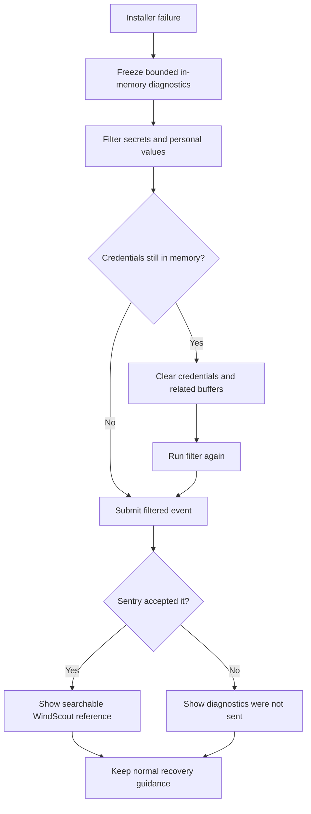
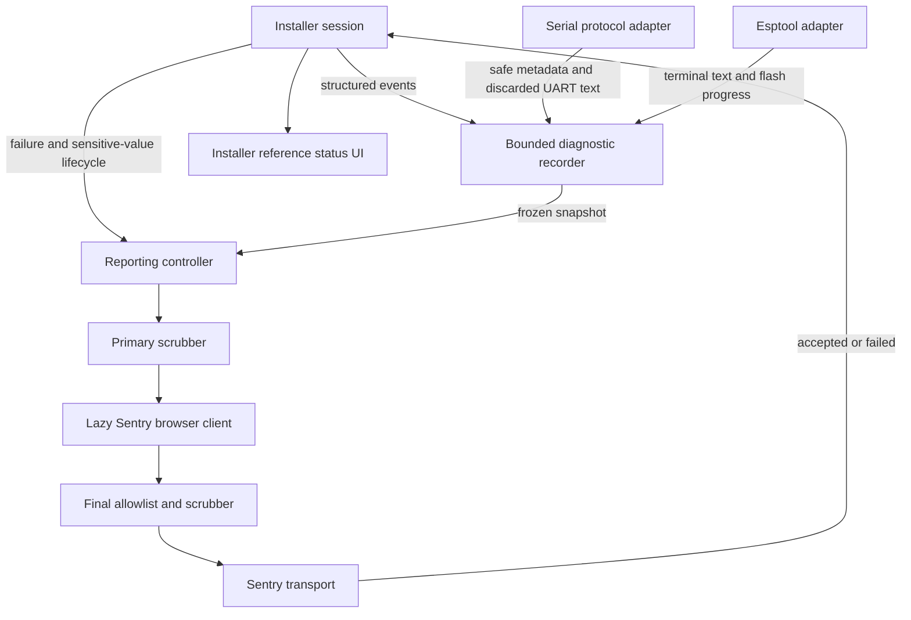
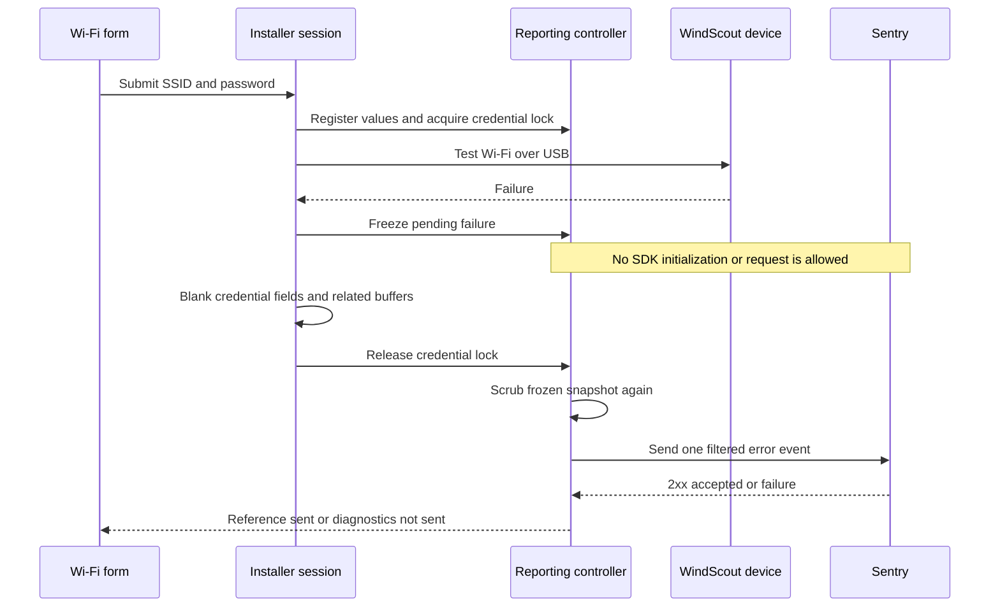
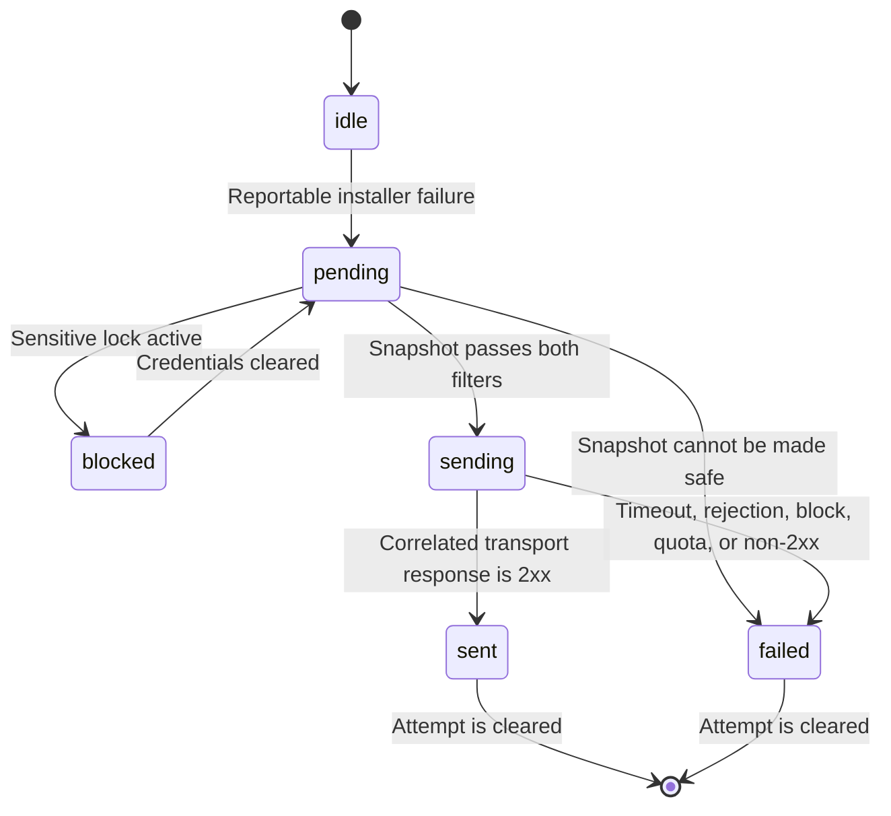

# Installer Sentry Diagnostics - Plan

## Goal Capsule

- **Objective:** WindScout maintainers can diagnose failed installations on other people's devices without asking them to reproduce the failure or inspect browser developer tools.
- **Means:** Automatically report installer failures to Sentry with deep, pre-filtered diagnostics and a user-visible reference code.
- **Product authority:** This plan governs production observability for the browser installer only. It does not authorize general website analytics or monitoring.
- **Open blockers:** None.

---

## Product Contract

### Summary

The browser installer will automatically report failed installation attempts to Sentry.
Each report will carry enough filtered technical context to reconstruct the failure path, while the installer shows the user a short reference code that identifies the incident.

### Problem Frame

The installer already turns low-level failures into clear error codes and recovery states, but that information exists only in the active browser session.
When another person encounters a problem, the maintainer receives no event history, device output, or searchable incident after the page closes.

### Actors

- A1. **Installer user:** Connects a supported device and receives recovery guidance plus a reference code when diagnostics are reported.
- A2. **WindScout maintainer:** Investigates an incident in Sentry without needing access to the user's browser or device.
- A3. **Connected device:** Supplies installer protocol, bootloader, flash, and runtime output that may inform diagnosis.
- A4. **Sentry:** Receives only the filtered installer failure event and makes it searchable by reference code.

### Key Decisions

- **Use automatic Sentry reporting.** (session-settled: user-directed — chosen over a user-shared support bundle: failures should be available without relying on the user to export and send a file.) Governs R1, R3, R11.
- **Keep monitoring installer-only.** (session-settled: user-directed — chosen over whole-site monitoring: the immediate need is failed device installation and broader collection would add noise.) Governs R2, R10.
- **Capture maximum useful device diagnostics.** (session-settled: user-directed — chosen over error-only or structured-step-only reports: deep USB and flashing failures need the underlying technical evidence.) Governs R4, R5.
- **Filter before transmission.** (session-settled: user-directed — chosen over sending literal unfiltered device output: passwords and other secrets must never leave the browser.) Governs R6-R9.
- **Do not add consent or privacy UI.** (session-settled: user-directed — chosen over a minimal disclosure or opt-in prompt: the hobby project should keep automatic diagnostics unobtrusive while collection is technically minimized.) Governs R7, R10.
- **Show a searchable reference code.** (session-settled: user-directed — chosen over invisible monitoring: a user report must be linkable to the corresponding Sentry incident.) Governs R3, R12.

### Requirements

**Failure capture and diagnosis**

- R1. Every unexpected production installer failure shall create one automatic Sentry error report when the security gates in R6-R9 permit transmission.
- R2. Reporting shall cover only failures originating in the device connection, device check, firmware download, flashing, reconnection, Wi-Fi setup, configuration application, and verification flow.
- R3. A successfully accepted report shall produce a short WindScout reference code that the user sees and the maintainer can use to find the event in Sentry.
- R4. Each report shall identify the installer phase, stable installer error code, user action, selected installation route, software release, browser environment, supported hardware identity, elapsed timings, and the deepest safe cause available.
- R5. Reports shall include a bounded timeline of installer state changes, flash progress, protocol exchanges, and available device, serial, or bootloader output at the greatest detail allowed by R6-R9.

**Security and data minimization**

- R6. All diagnostic content shall be filtered inside the browser before any Sentry request is created.
- R7. Reports shall exclude Wi-Fi credentials, network names, location data, configuration values, user identity, persistent user identifiers, and any other detected secret or personal value.
- R8. No Sentry request shall occur while Wi-Fi credentials remain in installer memory; a pending failure may be sent only after those credentials and related mutable buffers have been cleared.
- R9. Unfiltered device output shall remain in a bounded in-memory buffer only and shall never enter browser storage, console output, URLs, screenshots, user-facing messages, or a network request.

**Scope and resilience**

- R10. The integration shall not enable session replay, screen capture, general website error monitoring, performance monitoring, product analytics, or new consent and privacy interfaces.
- R11. Sentry being blocked, offline, over quota, or otherwise unavailable shall never block installation, change device recovery behavior, or make a safe-to-disconnect decision.
- R12. When reporting fails, the installer shall state that diagnostics could not be sent instead of presenting a reference code that cannot be found.
- R13. Sentry shall be configured to prevent IP-address storage and to apply server-side scrubbing as a second defense after the browser filter.

### Key Flows

- F1. Automatic report before credentials exist
  - **Trigger:** The installer encounters an unexpected device, download, flash, or reconnection failure.
  - **Actors:** A1, A2, A3, A4
  - **Steps:** The installer freezes the bounded diagnostic timeline, filters it, submits one error event, receives the event identity, and renders the matching WindScout reference code with the existing recovery guidance.
  - **Outcome:** The user can quote the code and the maintainer can inspect the failure path in Sentry.
  - **Covered by:** R1-R7, R9, R11-R13
- F2. Failure while credentials exist
  - **Trigger:** Wi-Fi setup, configuration, or verification fails while credentials are still held in memory.
  - **Actors:** A1, A2, A3, A4
  - **Steps:** The installer retains the pending failure in memory, clears credentials and related buffers, filters the remaining diagnostics, and only then attempts transmission.
  - **Outcome:** The diagnostic event is useful without allowing credentials to enter a third-party request.
  - **Covered by:** R1-R9, R11-R13
- F3. Reporting service unavailable
  - **Trigger:** A filtered report cannot reach or be accepted by Sentry.
  - **Actors:** A1, A2, A4
  - **Steps:** The reporting attempt fails independently of the installer state machine and the user receives honest status without an unresolvable reference code.
  - **Outcome:** Device safety and recovery remain correct even though remote diagnostics are unavailable.
  - **Covered by:** R11, R12

### Acceptance Examples

- AE1. **Covers R1-R6, R9, R13.** Given firmware flashing fails before Wi-Fi credentials exist, when the installer reports the failure, then Sentry contains one searchable event with the phase, error code, flash timeline, filtered low-level cause, and matching reference code.
- AE2. **Covers R6-R9, R13.** Given diagnostic fixtures contain a Wi-Fi password, network name, coordinates, configuration values, and personal-looking text, when filtering and transmission complete, then none of those planted values appears in the outbound payload or stored Sentry event.
- AE3. **Covers R8, R11.** Given Wi-Fi verification fails while credentials remain in memory, when the failure is captured, then no Sentry request starts until the credentials and related buffers have been cleared.
- AE4. **Covers R3, R12.** Given Sentry accepts the event, when the error screen appears, then its reference code finds that event; given Sentry rejects the event, the screen states that diagnostics were not sent and shows no false searchable code.
- AE5. **Covers R10.** Given a non-installer website error or ordinary configurator interaction, when it occurs, then this integration sends no event, replay, performance trace, or analytics record.
- AE6. **Covers R11.** Given Sentry is blocked by the browser or has exhausted its quota, when installation fails, then the existing error and safe-disconnect behavior remain correct and responsive.

### Success Criteria

- A maintainer can determine the failing installer phase and deepest safe cause from one Sentry event without first asking the user for developer-console output.
- Every displayed WindScout reference code resolves to the corresponding Sentry event.
- Secret-bearing test values remain absent from outbound requests, Sentry storage, browser persistence, console output, and user-facing diagnostics.
- Blocking Sentry produces no observable regression in installation, recovery, cancellation, or USB safety behavior.
- Sentry contains no events from outside the browser installer.

### Scope Boundaries

- General website errors, product analytics, performance monitoring, session replay, screenshots, and screen recordings are outside this work.
- Successful-install analytics and installation conversion metrics are outside this work.
- A user-triggered diagnostic download or support bundle is outside this work.
- A new WindScout telemetry backend is outside this work; the first version uses Sentry's free Developer plan.
- Consent prompts and a new privacy notice are outside this work.

### Dependencies and Assumptions

- `docs/plans/2026-08-27-2152-feat-usb-device-installer-plan.md` remains authoritative for keeping credentials out of analytics, diagnostics, logs, and unrelated requests.
- The free Sentry Developer plan remains sufficient for the expected hobby-project event volume and retention needs.
- Browser-side filtering is the primary boundary; Sentry IP scrubbing and server-side data scrubbing are defense in depth rather than permission to send unfiltered data.

### Sources and Research

- `web/src/installer/installerErrors.js` defines the existing stable error taxonomy and retains low-level causes.
- `web/src/installer/createInstallerSession.js` publishes current state but retains no diagnostic event history or remote report.
- `web/src/installer/esptoolAdapter.js` currently discards default bootloader terminal output.
- `web/src/installer/serialPortAdapter.js` currently ignores ordinary UART output outside protocol frames.
- `web/src/components/installer/InstallerPanel.vue` currently shows only the user-facing error message.
- `docs/release.md` defines the existing password-exclusion and physical installer acceptance rules.

---

## Planning Contract

Product Contract unchanged.

### Key Technical Decisions

- KTD1. **Use the browser SDK only for explicit installer failure reports.** Add `@sentry/browser`, load it lazily after a report passes the credential gate, and do not install a global Vue error handler. Initialize it with `defaultIntegrations: false`, `sendClientReports: false`, `enableLogs: false`, `enableMetrics: false`, `tracePropagationTargets: []`, and every `dataCollection` category disabled. A final `beforeSend` hook shall accept only WindScout-marked diagnostic events and shall rebuild their custom fields from an allowlist. This implements R1, R2, R6, R7, R10, and R11.
- KTD2. **Own the diagnostic history in a bounded browser-memory recorder.** Keep at most 100 structured entries and 50 KiB of text for the active installation attempt. Truncate each low-level text entry to 512 characters before insertion, evict the oldest entries at either bound, and destroy the recorder on completion, cancellation, or panel close. Do not use Sentry Logs or automatic breadcrumbs. This implements R5 and R9.
- KTD3. **Treat Wi-Fi credentials as an active transmission lock.** Register every scalar configuration value for redaction when an attempt starts, but do not use configuration reachability as a network lock. Acquire the transmission lock when the submitted SSID and password are copied from the form. The reporting controller shall refuse SDK initialization and network transmission while that credential lock is active. On every success, exception, cancellation, and stale-attempt path, both the form and session shall blank SSID and password references, release the lock, scrub the frozen report again, and only then allow a pending report to continue. This implements R6-R9 and F2.
- KTD4. **Use two independent browser-side filters.** The first filter shall replace every registered sensitive value and remove prohibited structured fields before a report snapshot is created. It shall also redact common secret assignments, network identifiers, email addresses, IP addresses, coordinates, URL query strings, and authorization material from free text. The `beforeSend` allowlist in KTD1 is the final filter. Any field or text fragment that cannot be classified safely shall be dropped. This implements R6, R7, R9, and AE2.
- KTD5. **Instrument existing seams with a passive diagnostic sink.** Inject one recorder/controller into `createInstallerSession`, `createSerialProtocol`, and `createEsptoolAdapter`. Record phase changes, elapsed durations, stable error codes, safe device metadata, command names, response status, byte counts, flash progress, discarded UART text, and esptool terminal text. Never record protocol request values, response configuration values, serial numbers, configuration digests, full user-agent strings, or raw device objects. This implements R4, R5, and R7.
- KTD6. **Give each report a WindScout-owned reference and confirm delivery before showing it.** Generate a random `WS-` reference with at least 50 bits of entropy, store it as an exact Sentry tag, and include it in the filtered event. Wrap the Sentry transport so the reporter can correlate the envelope event ID with its HTTP result. Set state to `sent` and expose the reference only after a 2xx response; timeout, rejection, blocking, quota failure, or non-2xx response sets state to `failed` and exposes no reference. `captureException` or `flush` alone is not proof of acceptance. This implements R3, R11, R12, and F3.
- KTD7. **Report one event for each reportable failure occurrence.** Report failures that end or interrupt an installation attempt in connection, download, flash, reconnection, Wi-Fi, configuration, or verification. Do not report unsupported-browser guards, cancelled device choosers, declined hardware confirmation, incompatible-device safety blocks, successful attempts, or ordinary configurator behavior. Deduplicate by attempt and failure occurrence so repeated rendering or subscriptions cannot send the same event twice. This implements R1, R2, R10, and AE5.
- KTD8. **Upload hidden production source maps without publishing them.** Add `@sentry/vite-plugin` after the Vue plugin, use one release identifier for the SDK event and upload, and enable hidden source maps only for production release builds that have Sentry configuration. The release workflow shall supply the public DSN and release identifier through repository variables and the upload token through a GitHub secret. Delete source maps from `web/dist` after upload and before the Pages artifact is created. This implements R4 without exposing source maps or credentials.
- KTD9. **Keep Sentry failure outside the installer safety state machine.** Reporting runs as a separately observed promise and may update only diagnostic delivery fields. It shall not delay device cleanup, recovery transitions, cancellation, panel close, or `safeToDisconnect`. This implements R11 and AE6.

### High-Level Technical Design

The diagrams show boundaries and sequencing. They are directional, not implementation code.

### Data Contract

The report uses a small allowlist. Any unlisted field is discarded.

- **Tags:** WindScout reference, stable installer error code, installer phase, installation action, firmware release, board ID, chip family, firmware layout version, browser engine family and major version, operating-system family, and build release identifier.
- **Measurements:** Milliseconds since attempt start, phase durations, flash file index, bytes written, total bytes, retry count, and bounded recorder counts.
- **Timeline:** Timestamp offset, category, safe operation name, result status, and filtered message. Protocol command names are allowed; request and response values are not.
- **Exception:** Stable user-safe message, error class, safe cause chain, and production stack trace. Arbitrary enumerable properties from thrown objects are not copied.
- **Forbidden:** SSID, password, configuration or location values, configuration digest, IP address, email, cookies, headers, request body, query string, Web Serial identity or serial number, full user agent, URL with parameters, DOM content, screenshots, replay, and persistent user identity.

### Reporting Ownership and Failure Boundaries

- `createInstallerDiagnostics` owns the recorder, sensitive-value registry, bounds, and pure snapshot scrubber.
- `createSentryReporter` owns lazy SDK initialization, the final event allowlist, reference generation, delivery correlation, timeout, and report deduplication.
- `createInstallerSession` owns failure classification, credential clearing, attempt lifecycle, and the public diagnostic delivery state.
- The serial and esptool adapters only emit candidate diagnostic entries. They never decide whether transmission is allowed.
- `InstallerPanel.vue` only renders delivery state. It never calls Sentry or constructs diagnostic payloads.

### Sequencing

1. Build and test the in-memory recorder and scrubber before connecting them to installer code.
2. Add session and adapter instrumentation with an injected no-op default so existing tests and consumers remain valid.
3. Add the Sentry reporter and production build configuration after the payload contract is testable without a network.
4. Add the user-facing status after the session exposes deterministic `idle`, `sending`, `sent`, and `failed` states.
5. Finish with outbound-payload, production-build, and physical-device privacy verification.

### Risks and Dependencies

- Sentry SDK defaults are version-sensitive. Pin compatible major versions, keep all collection switches explicit, and retain payload-level regression tests when dependencies change.
- Browser extensions and network policy can block Sentry. R11 and R12 make that a supported result, not an installer failure.
- Free-form device output can contain unknown secrets. KTD4 therefore defaults to dropping ambiguous data instead of preserving it.
- Sentry project settings are outside the repository. Production reporting must remain disabled until IP storage, server-side scrubbing, allowed origins, and an alert are configured and verified.
- The public DSN is not a secret. The Sentry auth token is a secret and may exist only in GitHub Actions secret storage.

### Sources and Research

- `web/src/installer/createInstallerSession.js` is the existing owner of attempt state, credential lifetime, recovery, and dependency injection.
- `web/src/installer/serialPortAdapter.js` already discards UART bytes before protocol frames and can expose them through a passive sink.
- `web/src/installer/esptoolAdapter.js` already accepts an esptool terminal and progress callback, so low-level evidence can be captured without changing flashing behavior.
- `web/src/installer/installerErrors.js` provides stable error codes and cause chains.
- `web/src/components/installer/InstallerPanel.vue` renders every error-bearing installer phase and is the single UI integration point.
- `.github/workflows/firmware-release.yml` is the only production website build and Pages publication path.
- [Sentry JavaScript configuration options](https://docs.sentry.io/platforms/javascript/configuration/options/) document collection defaults, `beforeSend`, client reports, logs, metrics, and transport behavior.
- [Sentry JavaScript filtering](https://docs.sentry.io/platforms/javascript/guides/vue/configuration/filtering/) recommends client-side removal before event transmission.
- [Sentry Vite source-map upload](https://docs.sentry.io/platforms/javascript/guides/vue/sourcemaps/uploading/vite/) documents hidden source maps, release matching, auth-token handling, and post-upload deletion.

---

## Implementation Units

### U1. Bounded diagnostic recorder and scrubber

- **Goal:** Create a pure, testable browser-memory diagnostic boundary that cannot persist or transmit prohibited values.
- **Requirements:** R4-R9; KTD2, KTD4.
- **Files:** Create `web/src/installer/installerDiagnostics.js` and `web/tests/installer/installer-diagnostics.test.js`.
- **Approach:** Implement the bounded structured/text recorder, sensitive-value registry, recursive allowlist, free-text redaction, snapshot freeze, and destruction lifecycle. Accept injected clock and randomness where tests need determinism. Keep the module independent of Sentry and browser storage APIs.
- **Test scenarios:**
  - Record more than 100 entries and more than 50 KiB; verify the oldest entries are evicted and no retained text entry exceeds 512 characters.
  - Plant an SSID, password, coordinates, configuration scalars, email, IP addresses, authorization values, and query parameters in nested objects and raw text; verify none survives a snapshot.
  - Pass cyclic objects, binary data, getters that throw, oversized causes, and unknown fields; verify snapshot creation remains bounded and drops unsafe content.
  - Destroy the recorder after success or cancellation; verify subsequent reads are empty and writes do not revive the old attempt.
- **Verification:** `cd web && npm test -- tests/installer/installer-diagnostics.test.js`.

### U2. Installer lifecycle and low-level instrumentation

- **Goal:** Feed useful installer evidence into the recorder and enforce the credential transmission lock on every session path.
- **Requirements:** R1, R2, R4, R5, R8, R9, R11; F1, F2; KTD3, KTD5, KTD7, KTD9.
- **Dependencies:** U1.
- **Files:** Modify `web/src/installer/createInstallerSession.js`, `web/src/installer/serialPortAdapter.js`, `web/src/installer/esptoolAdapter.js`, `web/src/components/installer/InstallerWifi.vue`, `web/tests/installer/installer-session.test.js`, `web/tests/installer/serial-port-adapter.test.js`, `web/tests/installer/esptool-adapter.test.js`, and `web/tests/installer/installer-panel.test.js`.
- **Approach:** Inject a no-op-compatible diagnostics interface. Record state transitions, timings, safe device facts, protocol command/result metadata, flash progress, discarded UART output, and esptool terminal output. Centralize reportable-failure handling in the session, including a failed network scan while the Wi-Fi step remains active. Acquire the credential lock before credentials enter the USB call and release it only from a cleanup path that blanks password and SSID references in both the form and session. Preserve all existing safety and recovery transitions.
- **Test scenarios:**
  - Fail connection, download, flash, reconnection, Wi-Fi, configuration, and verification once; verify one frozen report per failure occurrence with the expected phase and stable error code.
  - Cancel the chooser, decline confirmation, reject an incompatible device, use an unsupported browser, and complete successfully; verify no report is created.
  - Throw before, during, and after the Wi-Fi USB request; verify no reporter call begins until password and SSID references in the form and session are blank and the credential lock is released.
  - Fail a Wi-Fi network scan; verify it becomes one reportable Wi-Fi failure, leaves retry available, and exposes diagnostic delivery status in the existing Wi-Fi view.
  - Cancel or supersede an attempt while credentials or a report are pending; verify stale callbacks cannot send or alter the new attempt.
  - Feed UART and esptool output around a protocol failure; verify the bounded sink receives the output while protocol payload values are absent.
  - Make the diagnostic sink throw; verify installer phase, cleanup, and `safeToDisconnect` remain unchanged.
- **Verification:** `cd web && npm test -- tests/installer/installer-session.test.js tests/installer/serial-port-adapter.test.js tests/installer/esptool-adapter.test.js`.

### U3. Sentry reporter and production source maps

- **Goal:** Send only approved installer events, correlate real acceptance, and provide readable production stacks without publishing source maps.
- **Requirements:** R1-R7, R10-R13; F1-F3; KTD1, KTD4, KTD6-KTD9.
- **Dependencies:** U1.
- **Files:** Create `web/src/installer/sentryReporter.js` and `web/tests/installer/sentry-reporter.test.js`. Modify `web/package.json`, `web/package-lock.json`, `web/vite.config.js`, and `.github/workflows/firmware-release.yml`.
- **Approach:** Add the browser SDK and Vite plugin. Build a reporter with lazy initialization, explicit opt-outs, marked-event enforcement, a final allowlist, random reference generation, correlated transport results, a finite delivery timeout, and occurrence deduplication. Make an absent DSN a clean `failed` delivery result. Configure the production workflow with `VITE_SENTRY_DSN`, `VITE_SENTRY_RELEASE`, Sentry organization/project variables, and `SENTRY_AUTH_TOKEN`; upload hidden maps and remove them before Pages packaging.
- **Test scenarios:**
  - Import the normal site and complete non-installer interactions; verify the Sentry SDK is not loaded and no request occurs.
  - Submit a safe marked event through a fake 2xx transport; verify one event, an exact searchable `WS-` tag, and `sent` only after the correlated response.
  - Return non-2xx, reject, block, time out, omit the DSN, or exhaust the queue; verify `failed`, no displayed reference, and no unhandled rejection.
  - Attempt to submit an unmarked event or inject forbidden nested fields after the primary scrub; verify `beforeSend` drops or removes them.
  - Run two subscriptions against the same failure and then a distinct retry failure; verify one event for the first occurrence and one for the retry.
  - Build with release configuration; verify event and uploaded maps share the release identifier and `web/dist` contains no `.map` files.
- **Verification:** `cd web && npm test -- tests/installer/sentry-reporter.test.js && npm run build`; then `find web/dist -name '*.map' -print -quit` must print nothing after the release-build upload step.

### U4. Honest diagnostic status in the installer UI

- **Goal:** Let a user share a reference only when the corresponding event is searchable, without changing recovery guidance.
- **Requirements:** R3, R11, R12; F1-F3; AE4; KTD6, KTD9.
- **Dependencies:** U2, U3.
- **Files:** Create `web/src/components/installer/InstallerDiagnosticStatus.vue`. Modify `web/src/components/installer/InstallerPanel.vue`, `web/tests/installer/installer-panel.test.js`, and `web/tests/e2e/installer.spec.js`.
- **Approach:** Extend session state with `diagnosticStatus` and `diagnosticReference`. Render a small status region in the existing `error`, `reconnect`, and Wi-Fi error views: sending, accepted with copyable reference, or not sent. Keep the original error, action buttons, focus order, live-region behavior, and safe-disconnect copy authoritative.
- **Test scenarios:**
  - Hold a fake reporter pending after an installer error; verify recovery controls remain responsive and the UI says diagnostics are being sent without showing a reference.
  - Resolve the correlated report as accepted; verify the exact reference appears in each applicable error-bearing view and can be selected or copied.
  - Reject the report; verify the UI says diagnostics could not be sent and renders no reference-shaped text.
  - Change delivery status after panel close or attempt replacement; verify stale results do not update the current UI.
  - Navigate the status and recovery controls by keyboard and inspect screen-reader roles; verify the new status does not steal focus or repeat the primary error alert.
- **Verification:** `cd web && npm test -- tests/installer/installer-panel.test.js && npm run test:e2e -- tests/e2e/installer.spec.js`.

### U5. Production privacy and operational verification

- **Goal:** Make the off-repository Sentry settings and end-to-end privacy checks a release condition before diagnostics are enabled.
- **Requirements:** R6-R13; AE1-AE6; KTD4, KTD8, KTD9.
- **Dependencies:** U1-U4.
- **Files:** Modify `docs/release.md` and, when fixture coverage needs a shared payload, create `web/tests/fixtures/installer-diagnostics.js`.
- **Approach:** Document one-time Sentry project setup: prevent IP storage, add server-side scrub rules, restrict the client key to production origins, configure issue alerts and quota/spike protection, and store GitHub variables/secrets. Expand the privacy inspection with unique canary values for every prohibited class. Require inspection of the actual outbound envelope and stored Sentry event, a blocked-Sentry run, reference lookup, and a resolved production stack trace. Keep diagnostics disabled in production until every setup and canary check passes.
- **Test scenarios:**
  - Trigger a known production canary failure with planted SSID, password, location, configuration, email, IP, and query-string values; verify none appears in the browser request or stored Sentry event.
  - Look up the displayed reference in Sentry; verify it resolves to exactly one event with the expected phase, code, timeline, and de-minified source location.
  - Block the Sentry host and repeat a flash or Wi-Fi failure; verify normal recovery and safe-disconnect behavior and an honest not-sent status.
  - Inspect a successful installation and ordinary configurator browsing; verify no Sentry network request occurs.
  - Download the Pages artifact; verify it contains no source maps, auth token, planted canary, or diagnostic payload artifact.
- **Verification:** Complete the updated `docs/release.md` privacy inspection on the temporary production Pages URL and record the result with the existing physical acceptance matrix.

---

## Verification Contract

| Gate | Command or evidence | Proves |
|---|---|---|
| Diagnostic unit tests | `cd web && npm test -- tests/installer/installer-diagnostics.test.js tests/installer/sentry-reporter.test.js` | Bounds, scrubbing, lazy initialization, deduplication, and honest delivery status |
| Installer regression tests | `cd web && npm test -- tests/installer/installer-session.test.js tests/installer/serial-port-adapter.test.js tests/installer/esptool-adapter.test.js tests/installer/installer-panel.test.js` | Session safety, credential lifetime, adapter evidence, and UI integration |
| Full web unit suite | `cd web && npm test` | No regressions outside the installer diagnostics paths |
| Installer browser flow | `cd web && npm run test:e2e -- tests/e2e/installer.spec.js` | User-visible status, recovery controls, and absence of ordinary Sentry traffic |
| Full browser suite | `cd web && npm run test:e2e` | No broader configurator regression |
| Generated assets | `cd web && npm run renderer:check && npm run spots:catalog:check` | Existing release prerequisites remain reproducible |
| Production build | `cd web && npm run build` | Vite integration, lazy chunking, and production configuration compile |
| Pages artifact inspection | `find web/dist -name '*.map' -print -quit` prints nothing; repository and artifact scans find no `SENTRY_AUTH_TOKEN` value | Source maps and upload credentials are not published |
| Sentry project acceptance | A canary event is searchable by its displayed reference and resolves to the original production source | Transport correlation, release matching, source-map upload, and operator workflow |
| Privacy acceptance | Updated `docs/release.md` canary inspection passes in the outbound envelope and stored event | Browser filtering and server-side defense in depth satisfy R6-R9 and R13 |
| Failure isolation | Repeat a reportable failure with Sentry blocked and inspect the device recovery state | R11 and R12 remain true under real network failure |

The release workflow remains the final automated gate. Diagnostics may merge behind an unset production DSN, but the DSN must not be enabled until the one-time Sentry configuration and all physical/privacy acceptance evidence pass.

---

## Definition of Done

- Every R-ID and AE-ID is covered by at least one implementation unit and a named verification gate.
- One filtered Sentry event is created for each reportable failure occurrence, and no event is created for excluded or successful behavior.
- Every displayed WindScout reference resolves to exactly one accepted Sentry event; failed delivery never displays a reference.
- Credential-bearing and planted personal values are absent from recorder snapshots, outbound envelopes, stored events, browser persistence, console output, UI copy, source maps, and build artifacts.
- No Sentry SDK initialization or request can occur while the credential lock is active.
- Blocking, rejecting, timing out, or disabling Sentry does not change installer recovery, cancellation, device cleanup, or `safeToDisconnect` behavior.
- The production event contains enough filtered phase, timing, hardware, protocol, flash, and low-level output context to diagnose the canary failure without browser developer tools.
- Production stack traces resolve through uploaded source maps, while the deployed Pages artifact contains no source maps or upload token.
- `docs/release.md` names the Sentry project settings, GitHub variables/secrets, canary inspection, alert ownership, and disable/rollback action.
- All commands in the Verification Contract pass, and the physical privacy checks are recorded before the production DSN is enabled.
- U1 is done when recorder bounds, destruction, and adversarial secret fixtures pass.
- U2 is done when every installer failure path is classified once and credential cleanup is proven across success, error, cancellation, and stale-attempt paths.
- U3 is done when the reporter proves lazy loading, strict opt-outs, final filtering, correlated acceptance, and hidden source-map handling.
- U4 is done when all error-bearing views show accurate non-blocking delivery status with accessible behavior.
- U5 is done when project settings and production canary evidence satisfy the release checklist.
- Remove abandoned experiments, debug output, temporary fixtures, unused instrumentation branches, and obsolete dependencies before declaring the work complete.
