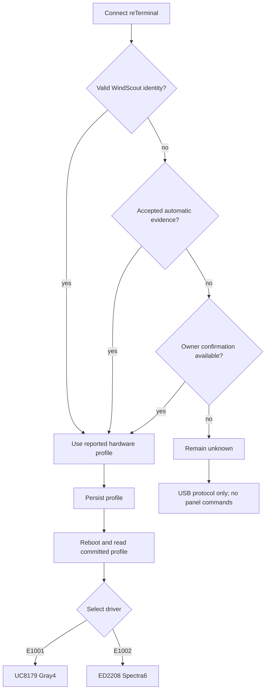
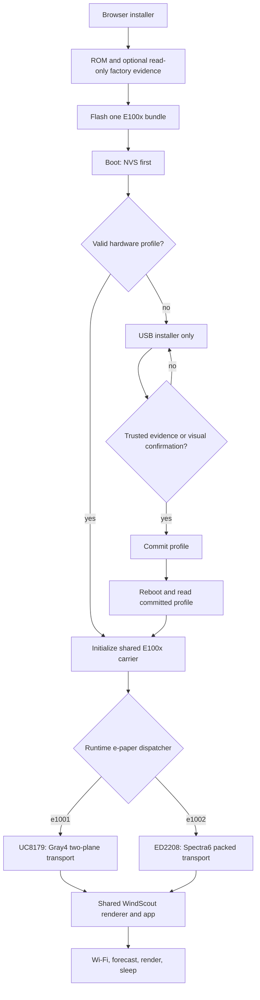
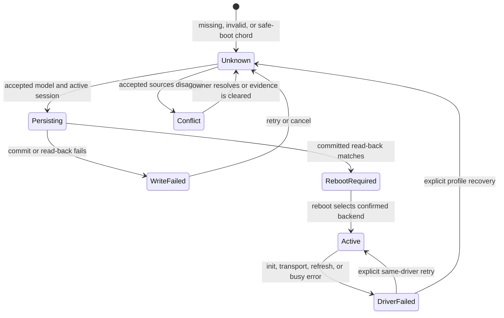

# Universal E100x Firmware - Plan

## Goal Capsule

- **Objective:** An owner can install the same WindScout release on a supported reTerminal E1001 or E1002 without routinely identifying the model, while an unrecognized device remains safe.
- **Means:** One firmware image contains both display drivers and selects one through a persisted hardware profile backed by a small accepted-source flow.
- **Product authority:** This plan owns E1001/E1002 runtime display selection, installer behavior, grayscale output, recovery, and the experiment that determines how far automatic detection can go. It does not extend support to other reTerminal models.
- **Open blockers:** None before planning. A real E1001 and E1002 are required before production support can be declared.

---

## Product Contract

### Summary

WindScout will ship one universal E1001/E1002 firmware release that contains both screen drivers, automatically selects the supported display when trustworthy evidence exists, and leaves the display untouched when the hardware profile is unknown. E1002, E1001, and each automatic evidence source advance through independent support gates.

### Problem Frame

The current installer can identify an ESP32-S3 through its ROM, but that identifies the processor rather than the surrounding reTerminal model. WindScout therefore asks an owner to confirm an E1002 before a clean flash and blocks a known E1001.

E1001 and E1002 share the same 800×480 layout surface but require different display controllers and refresh protocols. Treating the E1001 as a color-limited E1002 would not provide a safe fallback; the firmware must select the matching low-level driver before touching the panel.

### Key Decisions

- **Ship one firmware containing both drivers.** (session-settled: user-approved — chosen over separate model-specific releases: owners get one install and update path while WindScout maintains one release.) Governs R1-R3, R10-R12.
- **Use a detection ladder instead of a single heuristic.** Trusted existing identity has priority when accepted sources agree; disagreement remains `unknown`. Other evidence is admitted only after it is characterized and proven safe. Governs R4-R7, R14, R19.
- **Unknown means no display access.** Safety takes precedence over a zero-question installer when the model cannot be proven. Governs R3, R5-R7, R13.
- **Treat E1001 support as an experiment until physical acceptance passes.** Automated evidence can prepare the implementation but cannot establish panel behavior, sleep quality, or recovery safety. Governs R15-R17.

### Actors

- A1. **Device owner:** Connects a reTerminal, installs WindScout, supplies Wi-Fi credentials, and may answer one fallback hardware question when detection cannot prove the model.
- A2. **Browser installer:** Collects trustworthy identity evidence, installs the universal release, provisions the hardware profile and configuration, and explains recovery without guessing.
- A3. **Universal WindScout firmware:** Starts safely without a selected panel, persists the hardware profile, exposes its identity over USB, and dispatches display operations to the selected driver.
- A4. **Physical acceptance tester:** Exercises E1001 and E1002 installation, rendering, sleep, update, interruption, and restoration before support is published.

### Requirements

**Universal runtime and profile**

- R1. One release artifact shall run the shared WindScout application on both reTerminal E1001 and E1002 and shall contain the low-level display support required by both models.
- R2. The firmware shall represent the hardware profile as `unknown`, `e1001`, or `e1002` and shall retain a confirmed profile across normal firmware updates.
- R3. When the hardware profile is `unknown`, the firmware shall expose the installer protocol but shall not initialize, refresh, sleep, or otherwise command the e-paper controller.

**Detection and fallback**

- R4. Version 1 selection shall use persisted universal profile, live pre-flash legacy E1002 hello, then owner confirmation; any later automatic signal requires its own R6 evidence before it enters production.
- R5. ESP32-S3 ROM identity, MAC address, uncharacterized timing, and mutable factory-image bytes shall not independently prove E1001 or E1002.
- R6. A hardware probe may select a model only after it is shown to be non-destructive and stable across both supported models, relevant hardware revisions, repeated boots, temperature variation, and USB versus battery power.
- R7. The normal supported-device flow shall not ask the owner to choose a model; when all accepted automatic methods remain inconclusive, the installer may request one clear visual confirmation and shall persist the answer.
- R18. When only ESP32-S3 ROM identity is available, the installer shall require confirmation that the connected enclosure belongs to the E1001/E1002 family before any erase or flash operation.
- R19. When accepted identity sources disagree, the device shall remain `unknown`, expose the source identifiers without raw bytes, and require recovery confirmation.

**Display behavior**

- R8. E1001 shall render the shared 800×480 WindScout composition as four intentional grayscale levels, while E1002 shall retain the existing six-color output.
- R9. Each selected driver shall own its complete panel lifecycle, including initialization, framebuffer transport, full refresh, busy handling, power-off, and deep sleep.

**Installer and compatibility**

- R10. The public installer shall download the same universal firmware release for E1001 and E1002 and shall no longer validate all configuration and release contracts against one compile-time E1002 identity.
- R11. A clean installation shall flash the universal firmware before Wi-Fi provisioning, resolve and persist the hardware profile before the first display operation, then continue through Wi-Fi, configuration, and transport-verified first render; visual correctness is proven only by physical acceptance.
- R12. A previously configured E1001 or E1002 shall report its persisted model over the WindScout protocol so updates and configuration-only changes require no model question.
- R20. While the profile is `unknown`, the protocol shall allow identity, state, diagnostics, clock, profile selection, and cancellation only; Wi-Fi, configuration, dashboard refresh, scheduled refresh, and panel-cache actions shall return a typed refusal.

**Safety, evidence, and release**

- R13. Cancellation, lost USB, power loss, an invalid profile, or failed detection shall leave either a bootable universal firmware with an untouched display or a documented browser recovery route.
- R14. Non-secret diagnostics shall report the selected model, accepted source, active display driver, and refusal reason when selection remains unknown.
- R15. Automated tests shall prove profile persistence, driver dispatch, unknown-device refusal, model-aware rendering, manifest compatibility, installer transitions, and recovery decisions without requiring physical hardware.
- R16. Physical acceptance shall cover clean install, fallback selection, first render, grayscale quality, color parity, update, repair, interruption, wake, forecast refresh, deep sleep, and restoration on at least one real E1001 and one real E1002.
- R17. E1001 support and zero-question detection shall remain experimental until their applicable physical acceptance cases pass; failure of automatic detection shall not block shipping the safe one-question fallback.
- R21. A selected driver that fails initialization, transport, refresh, or `BUSY` completion shall keep its confirmed profile, latch recovery-only boot, shall not try the other driver, and shall require an explicit retry or profile recovery with typed diagnostics.
- R22. Profile mutation shall be idempotent for the same answer, reject stale or conflicting sessions, and serialize persistence so activation cannot race ahead of committed read-back.
- R23. New family-confirmation, model-fallback, reboot, and recovery states shall preserve the installer's keyboard, screen-reader, visible-focus, reduced-motion, target-size, and responsive behavior.

### Detection Boundary

### Key Flows

- F1. Clean installation with trustworthy automatic evidence
  - **Trigger:** A1 connects a supported device that does not yet run the universal WindScout release.
  - **Actors:** A1, A2, A3
  - **Steps:** A2 collects read-only evidence, flashes the universal release, reconnects to A3, provisions the proven profile, then continues with Wi-Fi and configuration.
  - **Outcome:** The matching driver renders the first forecast without a model question.
  - **Covered by:** R1-R5, R7-R12, R14.
- F2. Clean installation with inconclusive evidence
  - **Trigger:** A2 can prove ESP32-S3 compatibility but cannot prove E1001 or E1002.
  - **Actors:** A1, A2, A3
  - **Steps:** When ROM is the only identity, A2 confirms the E1001/E1002 family before erase or flash; A2 flashes and reconnects to A3 in unknown mode; A2 asks one visual fallback question; a confirmed answer is persisted before any display operation.
  - **Outcome:** Installation continues safely, or stops without commanding the panel when A1 cannot confirm.
  - **Covered by:** R2-R7, R11, R13-R14, R18.
- F3. Update of an installed supported device
  - **Trigger:** A1 connects or updates a universal WindScout installation with a confirmed profile.
  - **Actors:** A1, A2, A3
  - **Steps:** A3 reports its model and capabilities; A2 installs the same universal update or sends configuration only; A3 retains the profile and dispatches to the same driver.
  - **Outcome:** The owner is never asked for the model again.
  - **Covered by:** R2, R9-R12, R15.
- F4. Detection experiment and release decision
  - **Trigger:** A4 has access to one real E1001 and E1002 and an automatic detection candidate exists.
  - **Actors:** A2, A3, A4
  - **Steps:** A4 runs the candidate across the required conditions, records model evidence and panel behavior, and repeats the recovery and restore paths.
  - **Outcome:** The signal is admitted to the detection ladder only if it meets R6; otherwise the one-question fallback remains the supported route.
  - **Covered by:** R6, R13-R17.
- F5. Legacy E1002 preserving upgrade
  - **Trigger:** A1 connects current production E1002 firmware that predates the universal hardware-profile record.
  - **Actors:** A1, A2, A3
  - **Steps:** A2 validates the legacy E1002 hello before flashing, performs a preserving universal update, then A3 migrates the committed configuration and seeds the E1002 profile before driver activation.
  - **Outcome:** The owner keeps Wi-Fi and configuration and receives no model question.
  - **Covered by:** R2, R4, R10-R15, R22.
- F6. Forced safe boot and profile correction
  - **Trigger:** A1 selected the wrong screen appearance or a confirmed driver repeatedly fails.
  - **Actors:** A1, A2, A3
  - **Steps:** A1 holds both side buttons during boot; A3 starts in effective `unknown` with USB-only commands; A2 clears and replaces the profile; A3 reboots before driver activation.
  - **Outcome:** The profile is corrected without trying the alternate driver during the failing boot.
  - **Covered by:** R3, R7, R13-R14, R20-R22.
- F7. Interrupted installation recovery
  - **Trigger:** USB or power is lost during flash, profile commit, reboot, or first render.
  - **Actors:** A1, A2, A3
  - **Steps:** A2 reconnects through ROM repair or the universal USB protocol; A3 validates committed state and resumes from the last safe boundary.
  - **Outcome:** The device is either repairable in ROM mode, safely `unknown`, or confirmed on the same driver with a retryable render state.
  - **Covered by:** R2-R3, R11, R13-R15, R22.
- F8. Unknown or failed device is left unattended
  - **Trigger:** A1 cancels setup, disconnects USB, or receives a driver failure.
  - **Actors:** A1, A2, A3
  - **Steps:** A3 rejects disallowed work, keeps the panel untouched when unknown, and may enter MCU sleep on battery without sending a panel sleep command; a later boot returns to the same safe state.
  - **Outcome:** No background schedule or fallback attempt touches an unselected or failed panel.
  - **Covered by:** R3, R13-R14, R20-R21.

### Acceptance Examples

- AE1. **Covers R3, R5, R7, R13.** Given a blank compatible ESP32-S3 with no accepted model evidence, when universal WindScout boots, then USB setup is available and no command is sent to either display controller.
- AE2. **Covers R4, R7, R12.** Given a valid installed WindScout identity reporting E1001, when the owner updates it, then the universal release retains E1001 and does not ask a model question.
- AE3. **Covers R6.** Given a proposed automatic hardware probe that misclassifies once or changes panel state, when its evidence is reviewed, then it is rejected from the supported detection ladder.
- AE4. **Covers R7, R11, R13.** Given inconclusive automatic evidence and an owner who confirms a monochrome E1001, when setup continues, then the profile is persisted before the UC8179 driver performs the first display operation.
- AE5. **Covers R7, R13.** Given inconclusive evidence and no owner confirmation, when setup is cancelled, then the device remains recoverable and its display remains untouched.
- AE6. **Covers R8-R9.** Given the same dashboard inputs on E1001 and E1002, when both devices render, then their geometry and content agree while E1001 uses four grayscale levels and E1002 uses the six-color palette.
- AE7. **Covers R10-R12.** Given an E1001 and E1002 on the same WindScout version, when an update is offered, then both receive the same release artifact and resume with their original driver selection.
- AE8. **Covers R14.** Given a selection or refusal, when diagnostics are exported, then they identify the evidence path and active driver without Wi-Fi credentials or other secrets.
- AE9. **Covers R16-R17.** Given automated tests pass but no physical E1001 acceptance run exists, when release readiness is evaluated, then E1001 remains experimental.
- AE10. **Covers R13, R20-R21.** Given E1001 was mistakenly stored on an E1002, when the owner holds both side buttons at boot, then USB-only recovery starts with zero backend calls and permits a confirmed correction followed by reboot.
- AE11. **Covers R4, R12, R22.** Given current production E1002 firmware with valid committed configuration, when a preserving universal update completes, then E1002, Wi-Fi, and user settings survive without a model question.
- AE12. **Covers R18.** Given ROM proves only ESP32-S3, when the owner has not confirmed an E1001/E1002 enclosure, then erase and flash remain blocked without asking which of the two models it is.
- AE13. **Covers R4, R19.** Given a persisted universal profile and a live legacy E1002 hello disagree, when selection is evaluated, then the device remains `unknown`, reports both source IDs, and sends no panel command.
- AE14. **Covers R3, R20.** Given an unknown device, when a browser sends Wi-Fi or configuration apply, then it receives a typed profile-required error and neither backend is called.
- AE15. **Covers R9, R11, R21.** Given a confirmed driver reaches a bounded `BUSY` timeout, when first-render status is evaluated, then transport verification fails, the other driver is not tried, and visual success is not claimed.
- AE16. **Covers R13, R22.** Given power is lost during profile persistence, when the device reboots, then committed read-back yields either the previous profile or `unknown`, never a partial model.

### Success Criteria

- One universal build and installer bundle serves both supported models.
- A known installed E1001 or E1002 completes update and configuration without a model question.
- An unknown model can boot and communicate over USB without touching the display.
- The same dashboard composition reaches verified four-level grayscale on E1001 and existing six-color parity on E1002.
- Every admitted automatic detection signal has reproducible physical evidence; all other cases use the safe fallback.
- Each model or automatic evidence source completes its applicable physical matrix before that support level becomes generally available.

### Scope Boundaries

- E1003, E1004, and unrelated ESP32-S3 devices are not supported by the universal runtime in this work.
- A ROM-only device needs an E1001/E1002 family confirmation before destructive flashing; this is a safety check, not a model choice.
- A single-question fallback remains acceptable when automatic detection cannot be proven safe.
- Wi-Fi is provisioned after the universal firmware is running and is not a hardware-identification mechanism.
- Factory-firmware fingerprinting and electrical probing are candidate evidence sources, not promised detection methods.
- Partial-refresh optimization and redesigning the WindScout dashboard specifically for monochrome are deferred unless physical E1001 evidence makes them necessary for acceptable output.

### Dependencies / Assumptions

- Seeed documents E1001 as an 800×480 UC8179 display with four-level grayscale and E1002 as an 800×480 ED2208 six-color display.
- E1001 and E1002 expose matching display control pins, but this does not prove that a runtime electrical distinction exists.
- A real E1001 can be made available remotely for flashing, serial diagnostics, screen photography, wake actions, and factory restoration.
- The existing E1002 remains available as the regression and misclassification control device.

### Deferred Implementation Evidence

- Exact factory-firmware fingerprint ranges remain unknown until untouched E1001 and E1002 images can be captured. Fingerprinting is optional evidence and does not block the one-question fallback.
- Active reset, `BUSY`, temperature, or OTP probing remains outside the shipping firmware because it conflicts with R3. A separate characterization build may study it under R6.
- Additional hardware revisions beyond the first available E1001 and E1002 remain experimental until they repeat the R6 matrix.

### Sources / Research

- `docs/plans/2026-08-27-2152-feat-usb-device-installer-plan.md` — current installer identity, safety, sequencing, and acceptance decisions.
- `docs/plans/2026-08-26-0630-feat-public-3d-configurator-plan.md` — E1001 deferral and the requirement to characterize factory serial metadata before claiming detection.
- `firmware/components/board_hal/` — compile-time board and display-driver selection.
- `firmware/main/windscout_display_manager.c` and `firmware/components/epaper_src/GUI_ColorMap.h` — existing Spectra6 versus GC16 runtime mapping boundary.
- `web/src/installer/` and `web/src/config/configuration.js` — current E1002-only installer, manifest, and configuration contracts.
- `contracts/windscout-serial-protocol.md` and `contracts/windscout-config.schema.json` — current E1002-only external contracts.
- [Seeed Studio E1001 documentation](https://wiki.seeedstudio.com/getting_started_with_reterminal_e1001/) — processor, resolution, grayscale panel, storage, and physical behavior.
- [Seeed GxEPD2 E1001 Gray4 example at pinned commit](https://github.com/Seeed-Projects/Seeed_GxEPD2/blob/1100ea37c16b910fd79152f4250c13d802b9c20b/examples/GxEPD2_reTerminal_E1001_Gray4/GxEPD2_reTerminal_E1001_Gray4.ino) — UC8179 transport, four-level rendering, two-plane packing, LUTs, and lifecycle.
- [Seeed_GFX E1001 preset at pinned commit](https://github.com/Seeed-Studio/Seeed_GFX/blob/79afc12a29a8a689896fd78732ce11a46a8f8cab/User_Setups/Setup520_Seeed_reTerminal_E1001.h) and [E1002 preset](https://github.com/Seeed-Studio/Seeed_GFX/blob/79afc12a29a8a689896fd78732ce11a46a8f8cab/User_Setups/Setup521_Seeed_reTerminal_E1002.h) — matching geometry and pins with different compile-time drivers.
- [ESP-IDF NVS documentation](https://docs.espressif.com/projects/esp-idf/en/stable/esp32/api-reference/storage/nvs_flash.html) — committed NVS persistence and namespace behavior.
- [ESP-IDF OTA documentation](https://docs.espressif.com/projects/esp-idf/en/stable/esp32/api-reference/system/ota.html) — app-slot updates and the separate handling required for data partitions.
- [Seeed Studio E1001 and E1002 schematics](https://wiki.seeedstudio.com/reterminal_e10xx_main_page/) — shared board wiring and model-specific panel circuitry.

---

## Planning Contract

### Key Technical Decisions

- KTD1. **Compile one E100x carrier target and select the panel at runtime.** Add `seeedstudio_reterminal_e100x` as the release family. Keep `hardwareModel` as a separate runtime value. This removes the current compile-time E1002 coupling while preserving one release identity. (session-settled: user-approved — chosen over separate E1001 and E1002 firmware builds: both drivers can safely share one image when only the confirmed backend is activated.) Governs R1-R3, R10-R12.
- KTD2. **Put both panel implementations behind one dispatcher.** The public `epaper_*` facade owns state guards and delegates to namespaced ED2208 or UC8179 backends. The inactive backend receives no calls. Governs R1, R3, R8-R9.
- KTD3. **Load a dedicated hardware-profile record before panel initialization.** Store a versioned and integrity-checked record in its own NVS namespace. A write becomes authoritative only after `nvs_commit` succeeds and the device reboots. Normal preserving updates keep the NVS partition. Governs R2-R4, R11-R14.
- KTD4. **Treat a profile change as a controlled reboot, not a hot driver switch.** Production setup accepts only `unknown` to `e1001` or `unknown` to `e1002`. A model-to-model change first clears the profile through an explicit recovery action. Holding both side buttons during early startup forces an effective `unknown` session without erasing the stored record. Governs R2-R3, R7, R13.
- KTD5. **Keep active electrical probing out of unknown-mode production firmware.** ROM inspection may establish chip compatibility, and factory ranges may be hashed as experiment-only diagnostics before flashing. Neither selects the model. The universal firmware itself stays passive until a profile is confirmed. Unknown-mode reset, `BUSY`, temperature, OTP, or DIN/MOSI experiments use a separate characterization build; a confirmed E1001 backend may use a physically accepted OTP waveform path. Governs R3-R6, R13, R17.
- KTD6. **Keep one shared 800×480 composition and encode per backend.** The renderer keeps its existing one-byte-per-logical-pixel output. A runtime display descriptor maps semantic pixels before the transport stage. UC8179 packs a 96,000-byte two-plane buffer; ED2208 keeps the existing 192,000-byte packed color transport. Governs R8-R9, R15-R16.
- KTD7. **Extend protocol v1 through capabilities and add configuration schema v4.** Protocol v1 gains optional `hardware-profile` fields and commands without firmware-version guessing. Configuration v4 uses the E100x family ID, while hardware identity stays outside the weather configuration digest. Legacy E1002 configuration remains migratable. Governs R10-R12, R14-R15.
- KTD8. **Ship one four-part installer bundle with model capabilities.** The manifest names the E100x family and lists `e1001` and `e1002` as supported hardware models. Preserving updates must not overlap NVS or storage. The ESP-IDF application image must leave at least 256 KiB free in each `0x380000` OTA slot. Governs R1-R2, R10-R13, R15.
- KTD9. **Use a human-friendly fallback when evidence is inconclusive.** The browser asks whether the screen is “color” or “black/gray,” persists the answer, waits for the controlled reboot, and then continues to Wi-Fi. It never exposes controller names to the owner. Governs R7, R11, R13.
- KTD10. **Keep version 1 identity evidence concrete.** Source order is persisted universal profile, a live pre-flash legacy WindScout E1002 hello, then owner confirmation. A stored legacy configuration alone is not hardware evidence. Any disagreement enters `profile-conflict`; no source silently overrides another. Fingerprints and probes remain experiment results until a follow-up plan admits one under R6. Governs R4-R7, R14, R19.
- KTD11. **Bind pre-flash evidence to one device and session.** The browser keeps an allowlisted source ID and model in memory across erase and reconnect. The token binds the pre-flash ROM chip identity to a firmware boot nonce and profile revision; these fields prove continuity only, never the model. Mismatch, replay, expiry, or reload destroys the token and requires a new probe or fallback. Raw factory bytes never enter firmware or diagnostics. Governs R4-R5, R14, R19, R22.
- KTD12. **Gate model support independently in the manifest.** Each hardware-model entry has a versioned `disabled`, `beta`, or `ga` support level, and missing or unknown values fail closed. E1002 stays `ga`; E1001 fallback stays `beta` until its physical matrix passes. Experimental detection candidates are not manifest entries. Governs R6, R16-R17.
- KTD13. **Persist panel failure as a recovery latch.** A backend failure records the model, stage, and typed error. The next boot exposes USB recovery without initializing a panel until the owner explicitly retries the same driver or enters profile correction. Governs R13-R14, R20-R21.

### High-Level Technical Design

The first firmware boot can therefore happen before Wi-Fi and before a display driver is chosen. Device selection does not happen by “trying both drivers.” It happens by trusted metadata or one owner confirmation, followed by committed read-back and a reboot into one backend.

The runtime profile sequence is `unknown` → `persisting` → `reboot-required` → `active`. `profile-conflict`, `profile-write-failed`, and `driver-failed` are refusal states. A stale session cannot leave `persisting`, and a driver failure never changes the confirmed model.

### State and Data Boundaries

| Boundary | Owner | Rule |
| --- | --- | --- |
| Release family | Build and manifest | `seeedstudio_reterminal_e100x` identifies the shared carrier and bundle. |
| Hardware model | Hardware-profile NVS record | `unknown`, `e1001`, or `e1002`; separate from weather settings and their digest. |
| Driver activation | E-paper dispatcher | Exactly one backend can be active after boot; `unknown` activates none. |
| Composition | Shared renderer | Geometry and one-byte-per-pixel semantic output remain shared at 800×480. |
| Transport | Selected backend | UC8179 and ED2208 own their distinct init, encoding, refresh, timeout, and sleep sequences. |
| Detection evidence | Browser session and firmware diagnostics | Only allowlisted source, model, driver, and refusal fields are retained or exported. |

### Sequencing

1. Establish profile persistence and unknown-mode boot before adding a second panel driver.
2. Introduce the dispatcher with the current ED2208 backend and prove exact E1002 parity.
3. Add UC8179 Gray4 encoding and deterministic frame evidence.
4. Prove E1001 transport, Gray4, sleep, wake, and E1002 parity in an early remote hardware spike.
5. Extend the protocol and installer around the accepted profile and driver contract.
6. Produce the universal release bundle and run the complete remote acceptance matrix.

### System-Wide Impact

- **Firmware startup:** NVS initialization moves ahead of board and display initialization. Shared storage, RTC, buttons, charger, and SD behavior must remain available after the E1002 board target becomes an E100x carrier target.
- **Persistent data:** Hardware identity gains a separate lifecycle from installed weather configuration. Full erase removes both; preserving update retains both.
- **Renderer contract:** The 800×480 composition stays shared, but the render signature and golden artifacts become hardware-model aware.
- **USB contract:** Older firmware remains discoverable through existing protocol v1 behavior. New installers use capabilities before sending profile commands.
- **Release pipeline:** Build size, manifests, public artifacts, documentation, and physical acceptance all move from E1002-only to the E100x family.

### Risks and Mitigations

| Risk | Impact | Mitigation |
| --- | --- | --- |
| A wrong driver sends destructive or hanging commands | Panel state or boot can fail | R3 gate, KTD2 dispatcher guards, KTD4 safe boot, bounded `BUSY` timeouts, and physical wrong-profile recovery tests. |
| UC8179 readback looks like model detection but is unstable | Silent misclassification | Keep the probe outside production under KTD5 until the complete R6 matrix passes. |
| Existing E1002 owners lose their profile during update | Model question or wrong state after update | Bind identity to a live pre-flash legacy hello, preserve NVS, migrate weather settings separately, and test interrupted writes and updates. |
| Gray4 conversion removes warning emphasis | Safety information becomes visually weak | Define semantic Gray4 mapping, preserve crisp geometry outside dithering, and inspect gray ramps plus warning fixtures on the panel. |
| Two drivers exceed the OTA application slot | Universal artifact cannot ship | Add a size gate against the current slot and inspect ESP-IDF component sizes in CI. |
| Official Seeed prose and source disagree on E1002 controller naming | Wrong implementation reference | Pin implementation provenance to the maintained source files and commits listed in research, not the inconsistent wiki label. |
| Remote access cannot press buttons or photograph the screen | Physical acceptance stalls | Require an operator beside each device for USB reconnects, the two-side-button recovery chord, power cycles, and consistent screen photos. |

### Alternatives Considered

- **Two model-specific firmware releases:** Simpler internally, but preserves the owner-facing model choice and doubles release identity. Rejected by the session-settled product decision.
- **Try one driver and fall back to the other:** Unsafe because both panels are write-only on this carrier and their initialization sequences differ. Rejected by R3 and official driver evidence.
- **Put the model inside the weather configuration:** Couples physical identity to editable content and configuration digests. Rejected in favor of a dedicated profile lifecycle.
- **Block all work until automatic detection exists:** Unnecessary. The universal runtime and one-question visual fallback deliver the main value while detection stays experimental.

### Documentation and Operational Notes

- Document the visible fallback as screen appearance, not controller terminology.
- Document the two-side-button safe boot and the official full-flash restoration route before physical testing begins.
- Record driver provenance and license obligations in `firmware/UPSTREAM.md`.
- Keep only a redacted physical acceptance summary in the repository. Raw photos, serial captures, MAC addresses, serial numbers, Wi-Fi names, locations, and owner details remain outside the repository and are deleted after review.

---

## Implementation Units

### U1. Persist and gate the hardware profile

- **Goal:** Establish a durable hardware identity and make `unknown` a safe first-class boot mode.
- **Requirements:** R2-R7, R11-R15; F1-F3; AE1-AE5, AE8.
- **Dependencies:** None.
- **Files:** `firmware/main/hardware_profile.h` (new), `firmware/main/hardware_profile.c` (new), `firmware/main/windscout_main.c`, `firmware/main/CMakeLists.txt`, `firmware/main/installed_configuration.c`, `firmware/main/installed_configuration.h`, `firmware/host_tests/test_hardware_profile.cpp` (new), `firmware/host_tests/test_installed_configuration.cpp`, `firmware/host_tests/CMakeLists.txt`.
- **Approach:**
  1. Add the KTD3 record with model, accepted source, format version, integrity data, and committed state in a dedicated NVS namespace.
  2. Load NVS and the effective profile before any path can reach panel initialization.
  3. Keep weather-configuration migration separate from hardware identity; accept E1002 identity only from the live pre-flash evidence token defined by KTD10-KTD11.
  4. Implement KTD4 transitions, committed read-back, request-session generation checks, idempotent retry, and the two-side-button safe-boot override.
  5. Persist KTD13 after a backend failure and require an explicit same-driver retry or profile recovery before later panel initialization.
  6. Gate app refresh and sleep paths while retaining USB setup in `unknown` mode.
- **Patterns to follow:** The atomic candidate-to-active writes and host failure injection in `firmware/main/installed_configuration.c`; the existing protected NVS update boundary in `firmware/scripts/generate_installer_manifest.py`.
- **Test scenarios:**
  - Covers AE1. A missing, corrupt, unsupported-version, or partially committed record loads as `unknown` and leaves display-facing dependencies unused.
  - Covers AE11. A live pre-flash legacy E1002 hello can seed E1002 after preserving update; a copied legacy record or generated default cannot.
  - Covers AE4. Persisting E1001 commits the record, acknowledges success, and activates only after simulated reboot.
  - Covers AE5. Cancellation or an injected failure at each write boundary leaves the previous valid profile or `unknown` recoverable.
  - A direct E1001-to-E1002 change is rejected until recovery clears the record.
  - Two sessions that race to set different models yield one committed answer and one typed conflict; an identical retry is idempotent.
  - Holding both side buttons produces an effective `unknown` boot without destroying the stored profile; a normal green-button wake does not.
  - A backend failure survives reboot as recovery-only state until an explicit same-driver retry or profile correction.
- **Verification:** Host tests prove every record, migration, transition, failure boundary, and safe-boot case. Startup tests prove `wind_app_start` and panel sleep cannot run while the effective profile is `unknown`.

### U2. Add the universal carrier and e-paper dispatcher

- **Goal:** Compile both display backends into one E100x firmware while activating only the selected backend.
- **Requirements:** R1-R3, R9-R10, R13, R15; AE1, AE7.
- **Dependencies:** U1.
- **Files:** `firmware/boards/boards.json`, `firmware/boards/sdkconfig.defaults.seeedstudio_reterminal_e100x` (new), `firmware/components/board_hal/Kconfig`, `firmware/components/board_hal/CMakeLists.txt`, `firmware/components/board_hal/include/board_hal.h`, `firmware/components/board_hal/include/board_seeedstudio_reterminal_e100x.h` (new), `firmware/components/board_hal/src/driver_seeedstudio_reterminal_e100x.c` (new), `firmware/components/epaper/include/epaper.h`, `firmware/components/epaper/CMakeLists.txt`, `firmware/components/epaper/epaper_dispatcher.c` (new), `firmware/components/epaper_driver_ed2208_gca/src/driver_ed2208_gca.c`, `firmware/main/CMakeLists.txt`, `firmware/main/config_manager.c`, `firmware/main/power_manager.c`, `firmware/main/storage.c`, `firmware/main/wifi_manager.c`, `firmware/main/wind_app.c`, `firmware/host_tests/test_epaper_contract.cpp`, `firmware/host_tests/test_epaper_dispatcher.cpp` (new), `firmware/host_tests/CMakeLists.txt`.
- **Approach:**
  1. Add the KTD1 carrier target by extracting the current shared E1002 pins and peripherals from panel selection.
  2. Replace E1002 model-equality compile guards with one explicit E100x WindScout capability across source selection, power, Wi-Fi, storage, configuration, timezone, and application paths.
  3. Convert the current ED2208 exports into a namespaced backend and register it behind KTD2.
  4. Make the public facade select one backend from U1 before panel initialization.
  5. Return typed invalid-state and bounded timeout errors instead of silent no-ops or unbounded `BUSY` loops.
  6. Make shared carrier shutdown skip display sleep when no backend is active.
- **Patterns to follow:** `firmware/components/board_hal/src/driver_seeedstudio_reterminal_e1002.c` for shared peripherals; `firmware/host_tests/test_epaper_contract.cpp` for host-visible display boundaries.
- **Test scenarios:**
  - Covers AE1. `unknown` rejects initialize, display, clear, and sleep without calling either backend.
  - Selecting E1002 delegates each lifecycle operation exactly once to ED2208.
  - A second backend selection in one boot is rejected.
  - A stuck `BUSY` signal returns a timeout and does not hang the task.
  - Covers AE7. The universal carrier compiles the WindScout source set without the old E1002-only application condition.
- **Verification:** Dispatcher fakes prove exclusivity and refusal. A universal firmware build links both backends with no duplicate symbols and preserves all common carrier peripherals.

### U3. Implement UC8179 Gray4 and model-aware rendering

- **Goal:** Render the shared WindScout dashboard correctly on E1001 without changing E1002 output.
- **Requirements:** R1, R8-R9, R15-R17; F4; AE3, AE6, AE9.
- **Dependencies:** U2.
- **Files:** `firmware/components/epaper_driver_uc8179/CMakeLists.txt` (new), `firmware/components/epaper_driver_uc8179/Kconfig` (new), `firmware/components/epaper_driver_uc8179/src/driver_uc8179.c` (new), `firmware/components/epaper_src/GUI_ColorMap.h`, `firmware/main/windscout_display_manager.c`, `firmware/main/wind_renderer.c`, `firmware/main/wind_renderer.h`, `firmware/main/CMakeLists.txt`, `firmware/UPSTREAM.md`, `firmware/host_tests/test_epaper_dispatcher.cpp`, `firmware/host_tests/test_wind_renderer.cpp`, `firmware/host_tests/fixtures/e1001-gray4-*.bin` (new), `firmware/host_tests/fixtures/e1002-spectra6-*.bin` (new), `firmware/host_tests/CMakeLists.txt`, `shared/renderer-fixtures/`.
- **Approach:**
  1. Pin and port the official UC8179 lifecycle from Seeed_GxEPD2 commit `1100ea37c16b910fd79152f4250c13d802b9c20b`, recording source files, LUT bytes or hash, license, and local deviations.
  2. Characterize external-LUT and official internal-OTP waveform selection after the profile is confirmed as E1001; support only revisions whose chosen path passes U7.
  3. Convert the shared one-byte-per-pixel logical surface to the two one-bit UC8179 planes defined by KTD6.
  4. Add a runtime display descriptor and explicit semantic mapping for white, dark text, secondary structure, and warning emphasis.
  5. Include the hardware model in render invalidation so a cached E1002 buffer cannot be reused on E1001.
  6. Preserve the existing ED2208 bytes as exact regression goldens.
- **Execution note:** Start with E1002 characterization goldens before changing the palette boundary.
- **Patterns to follow:** `docs/learnings/wind-rendering.md`; shared composition in `firmware/main/wind_renderer.c`; existing deterministic fixtures under `firmware/host_tests/fixtures/`.
- **Test scenarios:**
  - Covers AE6. Identical inputs produce identical geometry and content coordinates for both models.
  - E1001 mapping produces only Gray4 codes 0 through 3 and packs a 96,000-byte two-plane frame.
  - E1002 mapping matches pre-change 192,000-byte Spectra6 goldens exactly.
  - Warning fixtures remain distinct from ordinary text in Gray4.
  - Crisp rules, text, and icons bypass photographic dithering.
  - UC8179 wake after deep sleep re-runs the required initialization and LUT sequence.
  - Each supported E1001 revision uses a physically accepted external-LUT or confirmed-profile OTP path; no OTP access occurs while unknown.
  - Missing or stuck panel state returns a bounded error.
- **Verification:** Native and browser renderer fixtures agree, buffer size and palette invariants pass, E1002 goldens are unchanged, and E1001 remains marked experimental pending U7.

### U7. Prove panel transport on both physical models

- **Goal:** Falsify the panel architecture early on real E1001 and E1002 hardware before installer and release integration expands around it.
- **Requirements:** R3, R6, R8-R9, R13-R17; F4; AE3, AE6, AE9, AE15.
- **Dependencies:** U3.
- **Files:** `firmware/experiments/e100x_detection/CMakeLists.txt` (new only when a concrete probe candidate exists), `firmware/experiments/e100x_detection/main/` (new only when a concrete probe candidate exists), `docs/hardware/e100x-physical-acceptance.md` (new).
- **Approach:**
  1. Prove UC8179 initialization, Gray4 refresh, bounded `BUSY`, deep sleep, green-button wake, timer wake, and repeated refresh on E1001.
  2. Repeat the same lifecycle on E1002 and compare it with the existing baseline.
  3. Capture consistent photos of shared fixtures, Gray4 ramps, warnings, and Spectra6 parity.
  4. If a concrete probe candidate exists, use the separate KTD5 build and repeat it across both devices, power modes, boots, revisions, and practical temperature variation; mutable flash bytes remain non-selecting evidence under R5.
  5. Record an admit-or-reject result, but leave production admission to a follow-up plan after R6 passes.
  6. Extract hashes and allowlisted range metadata locally, exclude NVS and user storage, keep any temporary raw dump encrypted and access-restricted, and delete it after verification.
- **Execution note:** A remote operator must connect each device, share serial output, press buttons, power-cycle it, and provide screen photos. The implementation agent can direct and interpret the session without owning the hardware locally.
- **Patterns to follow:** The evidence discipline in `docs/learnings/wind-rendering.md`; official Seeed full-flash recovery; the acceptance structure in `docs/release.md`.
- **Test scenarios:**
  - Covers AE6. Both devices show the same content and geometry with their intended model-specific palette.
  - E1001 completes first render, repeated refresh, sleep, green-button wake, timer wake, and restoration without ghost state or lockup.
  - E1002 matches the baseline image and its existing refresh, wake, and sleep behavior.
  - Covers AE3. Any unstable, state-changing, floating-input, or misclassifying probe is rejected and removed from production scope.
  - A disconnected or stuck `BUSY` path returns a bounded error and latches recovery-only boot.
  - Covers AE9. U4-U6 protocol, installer, and release integration does not proceed until the E1001 transport row passes; E1002 parity remains a separate pass condition.
- **Verification:** The dated acceptance record contains pass/fail evidence for both panel lifecycles and the decision for any concrete detection candidate.

### U4. Extend device, protocol, and configuration contracts

- **Goal:** Make the hardware profile observable and provisionable without coupling it to editable weather settings.
- **Requirements:** R2, R4, R7, R10-R15, R19-R20; F1-F3; AE2, AE4, AE7-AE8, AE13-AE14.
- **Dependencies:** U1, U2, U7.
- **Files:** `contracts/windscout-serial-protocol.md`, `contracts/windscout-config.schema.json`, `firmware/main/wind_usb_protocol.c`, `firmware/main/wind_usb_protocol.h`, `firmware/main/wind_installer_service.c`, `firmware/main/wind_installer_service.h`, `firmware/main/installed_configuration.c`, `firmware/main/installed_configuration.h`, `firmware/host_tests/test_wind_usb_protocol.cpp`, `firmware/host_tests/test_installer_service.cpp`, `firmware/host_tests/test_installed_configuration.cpp`, `firmware/host_tests/CMakeLists.txt`, `web/src/config/configuration.js`, `web/tests/configuration.test.js`.
- **Approach:**
  1. Implement KTD7 with an E100x family ID, a separate `hardwareModel`, and the `hardware-profile` capability.
  2. Add model, persisted source, current activation status, active driver, accepted source IDs, and refusal reason to allowlisted hello/state diagnostics.
  3. Add a profile command that accepts only U1 transitions, commits the record, returns a reboot-required result, and never triggers a preview render in the same boot.
  4. Align the JSON schema and firmware configuration version at v4 and migrate valid E1002 v2/v3 records.
  5. Keep credentials and raw factory bytes outside every response, error, diagnostic, and digest.
- **Patterns to follow:** Capability negotiation and redaction rules in `contracts/windscout-serial-protocol.md`; configuration migrations in `firmware/main/installed_configuration.c`.
- **Test scenarios:**
  - Old E1002 firmware remains identifiable without the new capability and receives only supported commands.
  - Covers AE2. A universal device reports a persisted E1001 or E1002 profile and needs no confirmation.
  - Covers AE4. An unknown device accepts one valid profile, commits it, and reports reboot required without touching the display.
  - Invalid, unsupported, or model-to-model profile requests return typed errors.
  - Covers AE13. Conflicting accepted evidence leaves `hardwareModel` unknown and reports source IDs without raw evidence.
  - Covers AE14. Every disallowed unknown-mode command returns `hardware_profile_required` with zero render calls.
  - Covers AE8. Hello, state, errors, and diagnostics contain no Wi-Fi password or raw factory data.
  - v2 and v3 E1002 configurations migrate to v4 with unchanged user settings and a stable post-migration digest.
- **Verification:** Protocol frame tests, installer-service tests, schema tests, migration tests, and redaction scans pass for old and new capability combinations.

### U5. Build the no-routine-choice installer flow

- **Goal:** Flash one bundle, resolve the model safely, and then continue through Wi-Fi and first render.
- **Requirements:** R4-R7, R10-R15, R18-R23; F1-F3, F5-F8; AE1-AE5, AE7-AE8, AE10-AE16.
- **Dependencies:** U4.
- **Files:** `web/src/installer/createInstallerSession.js`, `web/src/installer/esptoolAdapter.js`, `web/src/installer/serialPortAdapter.js`, `web/src/installer/actionResolver.js`, `web/src/installer/firmwareManifest.js`, `web/src/installer/installerDiagnostics.js`, `web/src/installer/installerErrors.js`, `web/src/components/installer/InstallerPanel.vue`, `web/src/components/installer/InstallerProgress.vue`, `web/src/components/installer/InstallerComplete.vue`, `web/src/styles/installer.css`, `web/tests/installer/installer-session.test.js`, `web/tests/installer/esptool-adapter.test.js`, `web/tests/installer/action-resolver.test.js`, `web/tests/installer/firmware-manifest.test.js`, `web/tests/installer/installer-diagnostics.test.js`, `web/tests/installer/installer-panel.test.js`, `web/tests/e2e/installer.spec.js`.
- **Approach:**
  1. Probe existing WindScout identity first, then collect only approved read-only pre-flash evidence.
  2. When ROM is the only identity, show a recognizable reTerminal enclosure illustration and physical button hints, require one affirmative family action before erase, and provide “Not this device / I’m not sure” as the safe exit.
  3. Flash the KTD8 bundle and reconnect to the universal firmware in either confirmed or `unknown` state.
  4. Apply KTD10 and KTD11 without building generic fingerprint or probe admission machinery.
  5. When needed, show the KTD9 fallback with “Colors,” “Only black/white/gray,” and “I’m not sure”; show E1001 beta status before confirmation and on completion, persist a positive answer, wait for reboot and reattachment, then begin Wi-Fi setup.
  6. Surface recovery controls and allowlisted diagnostics for cancellation, disconnect, timeout, evidence conflict, profile refusal, and render failure.
  7. Implement R23 with labelled radio groups, semantic status and live regions, state-entry focus, reconnect focus restoration, visible focus, 44×44 CSS-pixel targets, and equivalent reduced-motion feedback.
  8. Preserve readable, reachable content without horizontal scrolling or clipped actions at the existing `640×720` narrow and `1280×720` wide desktop fixtures.
- **Patterns to follow:** The current clean-install phase separation in `web/src/installer/createInstallerSession.js`; typed action recovery in `web/src/installer/actionResolver.js`; deterministic fake-device journeys in `web/tests/e2e/installer.spec.js`.
- **Test scenarios:**
  - Covers AE2. A known E1001 update skips both firmware-family and model questions.
  - Covers AE1. A clean blank device reaches USB-only `unknown` after flash and sends no configuration that can render.
  - Covers AE12. A ROM-only device cannot be erased until the owner confirms the supported reTerminal family.
  - Covers AE4. “Black/gray screen” persists E1001, reconnects, and only then enables Wi-Fi and render steps.
  - “Color screen” follows the same flow for E1002.
  - Covers AE5. Declining the fallback stops safely with a resumable recovery action.
  - Disconnect before profile commit, after commit, and during reboot resumes from reported state without duplicate writes.
  - A factory byte pattern or experimental probe result is ignored by the production installer.
  - Browser reload after pre-flash evidence collection discards the evidence token and returns to probe or fallback.
  - A different ROM chip reconnecting with the first device's token is rejected; nonce, revision, replay, and expiry mismatches destroy the token.
  - Loss during flash routes to ROM repair; loss before commit resumes unknown; loss after commit resumes the committed model; loss during render preserves the model and retries only that driver.
  - Covers AE8. Exported installer diagnostics contain allowlisted profile fields and no secrets.
  - Keyboard and screen-reader journeys operate both confirmations, hear state changes and errors, and recover focus after reconnect with reduced motion enabled.
  - Narrow and wide desktop fixtures keep choices, recovery guidance, diagnostics, progress, and primary actions visible without horizontal scroll.
- **Verification:** Unit tests cover every state transition and retry boundary. Playwright proves clean, update, fallback, cancel, reconnect, and responsive installer journeys with deterministic fake devices.

**Owner-facing recovery states:**

| State | Explanation | Primary action | Resume point |
| --- | --- | --- | --- |
| Cancelled or unsure | Nothing further will be written | Reconnect when ready | Family or model confirmation |
| Flash disconnected | Application may be incomplete; panel profile was not activated | Repair through ROM mode | Universal `unknown` boot |
| Profile not committed | Model answer was not saved | Retry confirmation | `unknown` profile |
| Profile committed, reboot pending | Model is saved; reconnect is expected | Reconnect | Confirmed startup |
| Evidence conflict | Sources disagree; the installer will not guess | Review and confirm in safe recovery | `unknown` profile |
| Profile refused | The requested transition is unsafe or stale | Enter profile recovery | `unknown` profile |
| Driver or render failed | The selected driver failed and the alternate was not tried | Retry same driver or safe recovery | Recovery-only boot |
| ROM repair | WindScout cannot boot, but the ESP bootloader is reachable | Clean universal reinstall | Universal `unknown` boot |

### U6. Package and validate one universal release

- **Goal:** Produce a size-safe, migration-safe installer artifact and document its recovery contract.
- **Requirements:** R1-R2, R10, R13, R15, R17; AE7, AE9.
- **Dependencies:** U2-U5.
- **Files:** `firmware/build.py`, `firmware/scripts/generate_installer_manifest.py`, `firmware/scripts/test_generate_installer_manifest.py`, `firmware/scripts/generate_manifests.py`, `firmware/boards/boards.json`, `.github/workflows/firmware-release.yml`, `web/scripts/prepare-local-installer.mjs`, `web/scripts/local-installer-build.mjs`, `web/public/firmware/.gitkeep`, `docs/setup.md`, `docs/recovery.md`, `docs/release.md`, `README.md`.
- **Approach:**
  1. Make `seeedstudio_reterminal_e100x` the only public E1001/E1002 release family and remove the installer-output E1002-only guard.
  2. Emit one manifest with versioned per-model support levels, existing four-part flash offsets, immutable hashes, and the KTD8 protected-partition rules.
  3. Add a build-size gate against the actual application slot and retain component-size output for diagnosis.
  4. Preserve legacy E1002 upgrade recognition while preventing unrelated ESP32-S3 boards from entering the flow.
  5. Document fallback, safe boot, preserving update, full erase, and official factory restoration.
  6. Apply KTD12 so E1002 publication and E1001 beta have independent admission gates.
- **Execution note:** This unit is packaging-heavy; require artifact inspection and install smoke evidence in addition to automated tests.
- **Patterns to follow:** Existing overlap and hash validation in `firmware/scripts/generate_installer_manifest.py`; release gates in `.github/workflows/firmware-release.yml`; recovery language in `docs/recovery.md`.
- **Test scenarios:**
  - Covers AE7. E1001 and E1002 resolve to the same immutable manifest and application binary.
  - Preserving update rejects every write that overlaps NVS or storage.
  - Clean install contains bootloader, partition table, boot selection, and universal application at valid non-overlapping offsets.
  - Legacy E1002 identity maps to the universal family; unsupported boards remain blocked.
  - Covers AE9. Release metadata keeps E1001 `beta`, and no automatic detection entry exists in the version 1 manifest.
  - E1002 remains publishable while E1001 fallback is beta and unproven automatic sources are absent.
  - An oversized combined application fails CI before publication.
- **Verification:** Manifest tests, local bundle preparation, universal ESP-IDF build, component-size inspection, web build, and workflow validation produce one internally consistent release candidate.

### U8. Complete end-to-end physical acceptance

- **Goal:** Validate the installer, interruption, repair, and restoration journeys after the universal release candidate exists.
- **Requirements:** R2-R23; F1-F8; AE1-AE16.
- **Dependencies:** U4-U7.
- **Files:** `docs/hardware/e100x-physical-acceptance.md`, `docs/recovery.md`, `docs/release.md`.
- **Approach:**
  1. Run clean install, preserving legacy E1002 update, profile fallback, Wi-Fi, first render, forecast refresh, sleep, wake, and configuration-only update on both models.
  2. Exercise ROM repair, pre-commit loss, post-commit reboot loss, render interruption, failure latch, two-side-button safe boot, full erase, and official restoration.
  3. Record the support-level decision for each model; automatic detection remains outside the production claim.
  4. Commit only a sanitized summary and cropped evidence after secret/PII scanning plus human publication review.
- **Execution note:** A remote operator must connect each device, share serial output, press buttons, power-cycle it, and provide screen photos. The implementation agent can direct and interpret the session without owning the hardware locally.
- **Patterns to follow:** The evidence discipline in `docs/learnings/wind-rendering.md`; official Seeed full-flash recovery; the acceptance structure in `docs/release.md`.
- **Test scenarios:**
  - Covers AE10. A wrong profile is corrected through the side-button recovery chord without a backend call.
  - Covers AE11. A live legacy E1002 preserving update retains profile, Wi-Fi, and user settings.
  - Covers AE12-AE16. Family confirmation, conflicts, unknown refusals, driver timeout, and interrupted profile writes match the automated state machine.
  - Full erase returns to display-safe `unknown`; official factory restore remains possible on both devices.
- **Verification:** The dated acceptance record contains pass/fail evidence for every R16 lifecycle, all recovery routes, both support-level decisions, and representative screen photos.

---

## Verification Contract

| Gate | Command or evidence | Proves |
| --- | --- | --- |
| Firmware host tests | `make -C firmware test` | Profile storage, boot gating, dispatch, protocol, migrations, rendering, and failure paths from U1-U4. |
| Manifest unit tests | `python3 firmware/scripts/test_generate_installer_manifest.py` | One valid universal bundle, protected partitions, hashes, offsets, family compatibility, and size refusal. |
| Universal firmware build | `cd firmware && python3 build.py --board seeedstudio_reterminal_e100x --step firmware --fullclean` | Both drivers and the shared application link in one ESP-IDF 6.0.2 image. |
| Firmware size | Run ESP-IDF `size-components` against the universal build | The ESP-IDF image leaves at least 256 KiB free in each `0x380000` OTA slot and identifies driver cost. |
| Installer unit suite | `cd web && npm test` | Detection ladder, capabilities, fallback, reconnect, diagnostics, configuration v4, and manifest behavior. |
| Installer browser journey | `cd web && npm run test:e2e -- tests/e2e/installer.spec.js` | Real browser clean install, update, fallback, cancellation, interruption, and recovery states. |
| Static production build | `cd web && npm run build` | The public installer packages the universal manifest and UI successfully. |
| Early panel spike | First dated rows in `docs/hardware/e100x-physical-acceptance.md` | E1001 transport, Gray4, sleep/wake, bounded failure, and E1002 parity before contract expansion. |
| Physical E1001/E1002 matrix | Completed evidence in `docs/hardware/e100x-physical-acceptance.md` | R16 behavior, visual quality, wrong-profile recovery, safe boot, full erase, and factory restoration on both devices. |

The final release gate requires the automated suite and E1002 regression evidence. E1001 remains experimental until its physical row passes. Zero-question detection remains experimental independently; failure there falls back to KTD9 and does not invalidate the universal runtime.

---

## Definition of Done

- U1 is done when every persisted-profile state and interrupted write resolves to a tested safe state before display initialization.
- U2 is done when one universal image links both backends and dispatcher tests prove exclusivity, refusal, and bounded waits.
- U3 is done when E1001 Gray4 goldens pass, E1002 bytes remain exact, and render signatures cannot cross models.
- U4 is done when legacy and universal devices negotiate through protocol v1, configuration v4 migrates correctly, and diagnostics remain redacted.
- U5 is done when the installer normally avoids a model question and the visual fallback safely resumes after reboot when needed.
- U6 is done when CI can build, size-check, validate, and package one universal four-part release without touching protected partitions.
- U7 is done when both physical panel lifecycles pass before U4-U6 continue, and every concrete detection candidate has an explicit experiment result.
- U8 is done when both devices pass the complete installer, lifecycle, interruption, recovery, and restoration matrix.
- The feature is done when one release installs and updates both models, `unknown` never touches a panel, and the remote physical evidence supports the published support level.
- Abandoned probe code, duplicate model-specific release paths, obsolete E1002-only gates, temporary logs, and unused experimental artifacts are removed before handoff.
