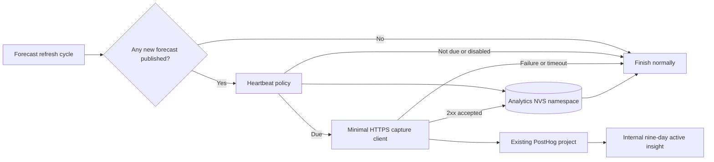

# Anonymous Dashboard Activity - Plan

## Goal Capsule

- **Objective:** Give the maintainer a useful weekly estimate of how many WindScout dashboards are still running.
- **Means:** After a successful forecast refresh, each dashboard sends at most one small anonymous heartbeat per week to the existing PostHog project.
- **Product authority:** This plan covers device activity analytics only. It does not authorize website analytics, installation analytics, location tracking, or a public counter.
- **Open blockers:** Before release, the shared PostHog project must be confirmed to discard IP addresses. If that conflicts with the existing side project, this integration does not ship until the privacy boundary is revised explicitly.

---

## Product Contract

### Summary

WindScout firmware will send one minimal `windscout_dashboard_heartbeat` event after a real forecast update, no more than once every seven days. The event goes directly to the existing PostHog project and powers an internal dashboard showing active units, firmware versions, and device types.

### Problem Frame

There is currently no reliable way to know whether two, twenty, or two hundred WindScout dashboards are still operating. Install counts are insufficient: a configured device may be offline, retired, or never successfully updating. A successful forecast refresh is the smallest meaningful signal that the dashboard is alive and doing its job.

### Actors

- A1. **Dashboard owner:** Uses a WindScout that refreshes normally without any new controls or interruptions.
- A2. **WindScout dashboard:** Decides locally whether a heartbeat is due and sends the minimal event after a successful refresh.
- A3. **WindScout maintainer:** Views aggregate activity in the existing PostHog project.
- A4. **PostHog:** Receives personless events and provides aggregate insights.

### Key Decisions

- **Measure active dashboards, not installations.** (session-settled: user-directed — a successful online forecast update is the useful proof that a dashboard is running.) Governs R1-R3.
- **Send weekly, not daily or live.** (session-settled: user-directed — a rough active count is enough and should add minimal traffic.) Governs R2, R8, R9.
- **Use the existing PostHog project.** (session-settled: user-directed — the free account cannot add another project and a separate backend is unnecessary for this first version.) Governs R4, R10-R12.
- **Keep the first version internal.** (session-settled: user-directed — a public count might be useful later, but WindScout does not expose one now.) Governs R13.
- **Add no button or setting.** (session-settled: user-directed — the signal should be automatic and unobtrusive.) Governs R1, R14.
- **Send only a dashboard ID, firmware version, and device type.** (session-settled: user-directed — location, weather choices, Wi-Fi, and configuration data are unnecessary.) Governs R5-R7.

### Requirements

**Heartbeat meaning and cadence**

- R1. A dashboard shall consider a heartbeat only after at least one forecast was fetched, validated, stored, and published successfully during the current refresh cycle.
- R2. One dashboard shall attempt no heartbeat within seven days of a locally acknowledged success, regardless of the number of configured spots or refreshes. A response lost after server acceptance may create a duplicate retry; aggregate views shall therefore count unique dashboard IDs rather than raw events.
- R3. A cached render, failed fetch, invalid forecast, configuration action, boot without a successful update, or ordinary wake shall not create a heartbeat.
- R4. The firmware shall send the heartbeat directly to the existing PostHog project through the US HTTPS capture endpoint at `https://us.i.posthog.com/i/v0/e/`.

**Data minimization**

- R5. Each outbound request shall contain only the PostHog project token, a locally generated random dashboard ID, `FIRMWARE_VERSION`, the public board ID, the fixed event name, and PostHog's required personless-processing property. PostHog-managed ingestion metadata is outside the firmware payload and remains subject to the project's privacy settings.
- R6. The event and all analytics logs shall exclude spot IDs, coordinates, timezone, forecast values, Wi-Fi details, configuration values or digests, serial numbers, MAC addresses, hardware-derived IDs, and error output.
- R7. The random dashboard ID shall survive reboot, reconfiguration, and OTA updates, shall not be derived from device or user data, and shall be replaced by a full factory erase.

**Reliability and resource use**

- R8. PostHog failure, timeout, rejection, or missing build configuration shall never change forecast, display, retry, installer, or sleep behavior.
- R9. A failed heartbeat may retry only after 24 hours and only after another successful forecast publication; every request shall have a short bounded timeout and shall not create a new wake-up.
- R10. The last successful heartbeat time and last attempt time shall be stored independently from the installed dashboard configuration.

**Operations and product boundary**

- R11. Official release firmware shall receive the public PostHog project token from the build environment; local and pull-request builds may compile with analytics disabled.
- R12. The shared PostHog project shall discard source IP addresses before enabled firmware is released, and the WindScout event shall not create a PostHog person profile.
- R13. PostHog shall contain an internal saved insight for unique active dashboards over the last nine days, plus breakdowns by firmware version and device type. Nine days gives a weekly heartbeat room for offline days and timing drift.
- R14. This work shall add no dashboard UI, public counter, consent control, web autocapture, session replay, or broader analytics SDK.
- R15. Public documentation shall plainly disclose the weekly anonymous activity signal and the exact fields sent, without adding an in-product control.

### Key Flows

- F1. Successful refresh and heartbeat due
  - **Trigger:** At least one spot publishes a newly fetched valid forecast and the last accepted heartbeat is at least seven days old.
  - **Actors:** A1-A4
  - **Steps:** The firmware loads or creates the random dashboard ID, stores the attempt time, sends one personless event, and stores the success time only after an accepted HTTP response.
  - **Outcome:** The dashboard appears once in the active count while normal rendering and scheduling remain unchanged.
  - **Covered by:** R1-R2, R4-R7, R10-R12.
- F2. Successful refresh but heartbeat not due
  - **Trigger:** A new forecast is published within seven days of the last accepted heartbeat, or within 24 hours of a failed attempt.
  - **Actors:** A2
  - **Steps:** The local policy returns without creating a network request.
  - **Outcome:** Normal forecast and display work completes with no analytics traffic.
  - **Covered by:** R2, R8-R10.
- F3. Heartbeat delivery fails
  - **Trigger:** DNS, TLS, connectivity, timeout, PostHog, or payload acceptance fails.
  - **Actors:** A1-A4
  - **Steps:** The firmware records only the attempt time, emits a non-identifying status log, preserves the previous success time, and returns control to the normal refresh path.
  - **Outcome:** The display remains correct and a later successful refresh may retry after 24 hours.
  - **Covered by:** R6, R8-R10.
- F4. Analytics is not configured
  - **Trigger:** A local or pull-request build omits the PostHog host or project token.
  - **Actors:** A2
  - **Steps:** The module reports itself disabled and performs no NVS write or request.
  - **Outcome:** Development remains simple and behavior matches today.
  - **Covered by:** R8, R11.

### Acceptance Examples

- AE1. **Covers R1-R7, R10-R12.** Given fresh enabled firmware with valid time and no analytics state, when one or several spots successfully publish new forecasts, then exactly one personless heartbeat is accepted and the same random dashboard ID is stored locally.
- AE2. **Covers R2-R3, R9.** Given a heartbeat succeeded less than seven days ago, when any number of later refreshes succeed or use cache, then no heartbeat request is made.
- AE3. **Covers R1, R3.** Given every provider request fails or only cached data is rendered, when the refresh cycle completes, then no heartbeat request is made.
- AE4. **Covers R8-R10.** Given PostHog is unreachable, when a forecast publishes successfully, then the forecast and display result are unchanged, sleep remains possible, and no second attempt occurs for 24 hours.
- AE5. **Covers R5-R7, R12.** Given fixtures contain locations, SSIDs, passwords, forecasts, serial numbers, and MAC-like values, when the request body and logs are inspected, then only the event name, random ID, firmware version, device type, and personless flag are present.
- AE6. **Covers R7, R10.** Given reboot, dashboard reconfiguration, and OTA update, the dashboard ID and cadence survive; given a full factory erase, a later successful refresh creates a new random ID.
- AE7. **Covers R8-R9.** Given the clock is invalid, moves backwards, or stored timestamps are corrupt, then the module fails closed without repeated requests and normal refresh behavior continues.
- AE8. **Covers R8, R11.** Given a build has no PostHog project token, then analytics is compiled as a no-op and no endpoint, ID, or payload is logged.
- AE9. **Covers R12-R13.** Given two dashboard IDs report during the nine-day window, one of them more than once due to a delivery ambiguity, then the saved insight reports two unique active dashboards and can break them down by firmware and device type.
- AE10. **Covers R13-R15.** Given a visitor uses WindScout or the website, then no public counter, control, pageview, replay, or other analytics behavior appears; the repository documentation does describe the heartbeat.

### Success Criteria

- The internal PostHog insight answers “how many dashboards were active recently?” with a unique-device count over nine days.
- A normal dashboard attempts about one event per week; repeated refreshes are suppressed and delivery ambiguity does not inflate the unique-dashboard insight.
- Captured WindScout events contain only the approved allowlist and create no person profiles.
- PostHog outages and missing analytics configuration cause no user-visible change and no refresh or sleep regression.
- Both supported release board builds pass automated tests and a physical-device smoke test.

### Scope Boundaries

- No public activity counter in this version.
- No new backend, database, queue, proxy, or separate PostHog project.
- No website analytics, install conversion funnel, pageviews, autocapture, session replay, feature flags, or Sentry expansion.
- No locations, spot choices, weather data, Wi-Fi data, configuration contents, error diagnostics, or user identity in analytics.
- No analytics button, setting, or consent UI.
- The internal number is an operational estimate, not billing-grade or abuse-resistant telemetry; the public PostHog project token in firmware can be imitated.

### Dependencies and Assumptions

- The existing PostHog project uses PostHog US at `https://us.i.posthog.com` and remains within its event and retention allowance.
- The project-level IP discard setting can be used without harming the side project's intended analytics. This is an operational release gate, not a code default.
- PostHog's public project token is suitable for client-side capture; no personal API key or secret enters firmware.
- The device has valid time after its normal clock synchronization. Analytics does not introduce a separate clock or wake flow.
- A persistent random dashboard ID is pseudonymous rather than directly identifying. Documentation must describe it accurately and should not claim that no data at all leaves the device.

### Sources and Research

- `firmware/main/wind_app.c:122-140` marks `published_forecast` only after fetch, validation, coverage checking, and cache storage succeed.
- `firmware/main/wind_app.c:810-839` is the one refresh-cycle seam that sees every spot outcome and can aggregate to one heartbeat.
- `firmware/main/windscout_main.c:115-130` shows that refreshes already run while connected and that analytics must not add a wake.
- `firmware/main/CMakeLists.txt:47-78` defines the current WindScout firmware sources and already links the HTTP/TLS/NVS dependencies used elsewhere.
- `firmware/CMakeLists.txt:19-31` establishes the existing build-time firmware version pattern.
- `.github/workflows/firmware-release.yml` builds both supported board families and is the release configuration seam.
- `docs/plans/2026-08-29-0649-feat-installer-sentry-diagnostics-plan.md` explicitly excludes general analytics from Sentry.
- [PostHog Capture API](https://posthog.com/docs/api/capture) documents public POST capture endpoints and the required project token, event name, and distinct ID.
- [PostHog event capture](https://posthog.com/docs/product-analytics/capture-events) documents personless events through `$process_person_profile: false`.
- [PostHog privacy controls](https://posthog.com/docs/privacy/data-collection) documents project-level IP discard and notes that a persistent distinct ID is pseudonymous personal data in privacy-sensitive contexts.
- [ESP-IDF HTTP client](https://docs.espressif.com/projects/esp-idf/en/v6.0.2/esp32s3/api-reference/protocols/esp_http_client.html) documents the HTTPS POST client used by the pinned ESP-IDF release.

---

## Planning Contract

Product Contract unchanged.

### Key Technical Decisions

- KTD1. **Add a small firmware-owned analytics module.** Create `wind_analytics.c/.h` with three separable responsibilities: pure cadence policy, NVS-backed identity/state, and PostHog HTTPS transport. Keep the policy callable with supplied timestamps and transport callbacks so host tests do not require ESP-IDF networking. This implements R2, R7-R10 and makes failure isolation testable.
- KTD2. **Hook once at the public refresh boundary.** Extend `wind_app_refresh_unlocked` to return the aggregated `published_forecast` result to its caller without sending. `wind_app_refresh` captures that result, releases both the app and runtime locks, and then calls `wind_analytics_maybe_send(now)` once. The configuration-preview path calls the same unlocked refresh but discards the signal, so preview activity cannot report. Ignore the analytics result for the existing refresh result. This implements R1-R3, R8 and prevents preview reporting, multi-spot double counting, and holding either application lock during HTTPS.
- KTD3. **Use a separate NVS namespace and random 128-bit ID.** Store a lowercase 32-hex-character value generated from ESP's random source plus `last_success_unix` and `last_attempt_unix` in namespace `wind_analytics`. Never read the MAC address, installed configuration, or spot identity. Write a newly generated ID before first transmission. A weekly rotating ID was rejected because one device could then count twice inside the nine-day active window; factory-reset rotation provides the intended lifecycle boundary. This implements R5-R7 and R10.
- KTD4. **Use a seven-day success gate plus a 24-hour failure cooldown.** Send only when time is valid, `now >= last_success`, at least 604800 seconds passed since success, `now >= last_attempt`, and at least 86400 seconds passed since an unsuccessful attempt. Missing success is due; corrupt/future timestamps fail closed for that boot and produce no request. Store attempt before HTTPS and success only after an accepted response. This implements R2, R8-R10 and AE7.
- KTD5. **Post one explicit allowlisted event without an SDK.** Use `esp_http_client` and the ESP certificate bundle to POST JSON to the fixed US endpoint `https://us.i.posthog.com/i/v0/e/`. The body shall be built from constants and trusted build/state values only: `api_key`, `event`, `distinct_id`, and properties `$process_person_profile: false`, `firmware_version`, and `device_type`. Do not serialize a general application object. Treat only 2xx as transport acceptance, cap the body, disable redirects, and use a five-second total timeout. A direct client was chosen over a new backend because the metric is internal and approximate; the public token means this design is unsuitable for a trusted public counter. This implements R4-R6, R8 and R12.
- KTD6. **Compile analytics off unless the public token exists.** Read `WINDSCOUT_POSTHOG_PROJECT_TOKEN` from the CMake process environment and escape it into a private compile definition only when non-empty; otherwise expose one disabled code path. Keep the US host as a source constant and do not pass the token as a printed command-line argument: `build.py` currently prints CMake arguments. The token is public by design but must not appear in build or device logs. This implements R8 and R11.
- KTD7. **Enable only official distributable builds.** Expose the GitHub repository variable as a step environment value for both E1002 and E1003 builds. Pull-request builds leave it empty because untrusted PR workflows should not emit production events; main and tag publication must fail before packaging when the variable is absent. This implements R11 and prevents accidentally shipping unconfigured or logged telemetry.
- KTD8. **Treat the PostHog setup as part of release correctness.** Before enabling the build variables, verify the shared project is configured to discard IP addresses, create a saved insight counting unique `distinct_id` values for `windscout_dashboard_heartbeat` over nine days, and add firmware/device-type breakdowns. Do not call `identify`, create person properties, or enable another PostHog product. This implements R12-R14.
- KTD9. **Document the signal without adding product UI.** Add a short README privacy note naming the weekly trigger, random persistent ID, two build properties, PostHog destination, and factory-reset behavior; add maintainer setup and verification steps to `docs/release.md`. This implements R15 while preserving the no-control decision.

### High-Level Technical Design

```mermaid
stateDiagram-v2
  [*] --> Disabled: Host or token absent
  [*] --> Waiting: Analytics enabled
  Waiting --> Waiting: No forecast published
  Waiting --> Due: Forecast published and 7 days elapsed
  Due --> CoolingDown: Attempt stored before request
  CoolingDown --> Waiting: 2xx; success time stored
  CoolingDown --> CoolingDown: Failed; less than 24 hours
  CoolingDown --> Due: Failed; 24 hours elapsed and another forecast publishes
  Waiting --> Waiting: Invalid or backward clock; fail closed
```

---

## Implementation Units

### U1. Analytics policy and durable anonymous state

- **Purpose:** Own the stable random ID and low-frequency cadence independently from weather configuration.
- **Files:** Create `firmware/main/wind_analytics.h`, `firmware/main/wind_analytics.c`, and `firmware/host_tests/test_wind_analytics.cpp`; modify `firmware/host_tests/CMakeLists.txt`.
- **Contracts:** Define a narrow `wind_analytics_maybe_send(time_t now)` production entry point plus internal/test seams for state load/store, randomness, and transport. NVS keys and serialized types are versioned constants; partial state is repaired conservatively without deleting installed configuration.
- **Error semantics:** Missing namespace is normal first run. ID persistence failure, invalid time, corrupt/future timestamps, or state-write failure yields no request. Errors are logged by category only, without values.
- **Test scenarios:** First-run ID creation; ID persistence across reboot; factory-reset recreation by absent namespace; seven-day gate boundaries; 24-hour retry boundary; invalid/backward time; corrupt NVS values; failed attempt vs accepted success; disabled configuration causes no writes.
- **Traceability:** R2, R5-R10; F1-F4; AE1-AE2, AE4-AE8; KTD1, KTD3-KTD4.
- **Depends on:** None.

### U2. Minimal PostHog capture transport and build configuration

- **Purpose:** Send exactly the approved personless payload over bounded HTTPS.
- **Files:** Complete transport in `firmware/main/wind_analytics.c`; modify `firmware/CMakeLists.txt`, `firmware/main/CMakeLists.txt`, and host-test fakes as needed.
- **Contracts:** Require the build token; use the fixed US capture URL, public board ID, and `FIRMWARE_VERSION`; build JSON from an explicit allowlist; clean up the HTTP client on every path.
- **Error semantics:** Allocation, DNS, TLS, timeout, non-2xx, or malformed configuration returns an analytics-local error and never changes the caller's refresh result. A 2xx is treated as accepted for cadence while payload-shape tests protect against PostHog's permissive ingestion response.
- **Test scenarios:** Exact body snapshot for E1002 and E1003; personless flag present; forbidden planted values absent; exact US URL; missing token; bounded body; 2xx vs non-2xx; timeout/cleanup; token and distinct ID absent from logs.
- **Traceability:** R4-R6, R8, R11-R12; F1, F3-F4; AE1, AE4-AE5, AE8; KTD1, KTD5-KTD6.
- **Depends on:** U1.

### U3. Forecast-success integration and failure isolation

- **Purpose:** Trigger one heartbeat only when a full refresh cycle publishes real forecast data.
- **Files:** Modify `firmware/main/wind_app.c`, `firmware/host_tests/test_wind_app.cpp`, and relevant host-test wiring/stubs.
- **Contracts:** Aggregate `published_forecast` across spots and return that signal from the unlocked helper. Only the public normal-refresh wrapper may consume it; the preview path must discard it. Release `s_app_lock` and `s_runtime_lock` before calling analytics at most once. The analytics return value is diagnostic only and cannot replace the existing refresh result.
- **Error semantics:** Analytics failure logs one safe warning at most and leaves display success, forecast retry scheduling, installer activity, and sleep eligibility untouched.
- **Test scenarios:** Selected spot success; prefetch-only success; multiple successes; all failures; cache-only render; configuration preview with a successful fetch; analytics transport failure; verify one call only for qualifying normal refreshes and an unchanged refresh result in every case.
- **Traceability:** R1-R3, R8-R9; F1-F3; AE1-AE4; KTD2.
- **Depends on:** U1-U2.

### U4. Release wiring, PostHog insight, and disclosure

- **Purpose:** Make official firmware consistently configured and make the aggregate useful and transparent.
- **Files:** Modify `.github/workflows/firmware-release.yml`, `docs/release.md`, and `README.md`.
- **Contracts:** Supply the repository variable as a non-printed environment value to both board builds; fail main/tag packaging when it is missing; keep PR builds disabled; document the shared-project IP gate and exact PostHog insight; disclose the exact fields and lifecycle publicly.
- **Error semantics:** A release configuration error blocks distributable packaging with a clear setup message. A conflict with the side project's IP policy blocks enablement rather than silently weakening the WindScout boundary.
- **Test scenarios:** PR build with no token; main/tag preflight with a missing variable; both board processes receive the same token without printing it; manual project-setting check; event appears in the saved insight and breaks down correctly.
- **Traceability:** R11-R15; F4; AE8-AE10; KTD7-KTD9.
- **Depends on:** U2-U3.

---

## System-Wide Impact

- **Device path:** The new branch sits after forecast publication and display work. It does not affect provider selection, cached fallback, rendering, or refresh scheduling.
- **Persistence:** One isolated NVS namespace adds a random ID and two timestamps. OTA and reconfiguration preserve it; the existing full NVS erase removes it.
- **Network:** At most one PostHog attempt follows each locally acknowledged seven-day period, with at most one failed retry per 24 hours after another successful forecast update. A server-accepted request whose response is lost can be retried, so raw event count is not authoritative.
- **Build and release:** One public environment value enters official firmware as a private compile definition. No secret is needed, no server credential is embedded, and the build command does not print the project token.
- **Operations:** The shared PostHog project gains one namespaced event and three saved views: active unique dashboards, firmware breakdown, and device-type breakdown.
- **Privacy:** PostHog still receives a network request and a persistent pseudonymous random ID. The project must discard IP addresses, person profiles stay disabled, and documentation names what is collected.
- **Failure blast radius:** PostHog failure affects only the estimate. It cannot make weather, display, installer, or sleep fail.

---

## Verification Contract

### Automated gates

- Run all firmware host tests: `make -C firmware test`.
- Run firmware formatting checks: `make -C firmware format-check`.
- Run installer bundle generator tests to catch release-path regressions: `python3 firmware/scripts/test_generate_installer_manifest.py`.
- Build both release targets with non-production test values through the same commands used by `.github/workflows/firmware-release.yml`.
- Inspect a captured test body and assert its complete key set, not only selected field values.

### Physical-device checks

- Flash an enabled test build, erase NVS, complete one successful forecast update, and confirm exactly one event appears with the expected device type and firmware version.
- Trigger another successful refresh immediately and confirm no second request.
- Make PostHog unreachable, move test time past the due boundary, refresh successfully, and confirm the display finishes and no retry occurs within 24 hours.
- Reboot and update firmware without erasing NVS; confirm the same ID is used. Factory erase and confirm a new ID is created.
- Capture device traffic or the server event and verify that no location, Wi-Fi, forecast, configuration, serial, MAC, or log value is present.

### PostHog release checks

- Confirm **Settings → Project → General → IP data capture** is set to discard before enabling official builds.
- Confirm the test event has no person profile and only the allowlisted properties.
- Confirm the saved “Active WindScout dashboards” insight counts unique IDs over the last nine days and the two breakdowns work.
- Send the same dashboard ID twice in a test window and confirm the unique insight remains one while raw events show two.
- Confirm the project's event allowance and spike protection are suitable; label the insight as approximate because a public client token can be imitated.

---

## Risks and Mitigations

- **Shared IP policy conflict:** The existing side project may rely on IP-derived analytics. Mitigation: make IP discard a hard enablement gate; do not silently ship if the projects need incompatible policies.
- **Pseudonymous ID misunderstood as “no data”:** A stable random ID can still be personal data in some privacy contexts. Mitigation: avoid identity claims, minimize fields, disable person profiles, discard IP, and disclose the signal plainly.
- **Spoofed or duplicated events:** A public project token cannot authenticate hardware. Mitigation: treat the internal count as directional, count unique IDs, and require an abuse-resistant server boundary before making the count public.
- **Lost acknowledgement after ingestion:** The device cannot prove whether PostHog stored a request whose response was lost. Mitigation: preserve retry behavior for eventual visibility and define the metric as unique IDs, never raw heartbeat volume.
- **Battery or refresh delay:** A slow telemetry request can consume awake time. Mitigation: no extra wake, call after rendering, release the app lock first, use a five-second timeout, and apply the 24-hour failure cooldown.
- **Clock rollback or corrupt state causes spam:** Mitigation: validate all timestamps and fail closed when time or ordering is implausible.
- **Multi-spot double counting:** Mitigation: aggregate success across the refresh loop and call analytics once per cycle.
- **Payload expands accidentally:** Mitigation: construct from an allowlist and assert the complete serialized key set in tests.

---

## Rollout and Rollback

1. Implement and run host tests with analytics disabled by default.
2. Configure the existing PostHog project's IP policy and saved insights; send a manual test event to the correct regional host.
3. Add repository variables and build both board variants with a test firmware version.
4. Run the physical-device checks on one supported dashboard before publishing broadly.
5. Release normally and compare event volume with the expected installed fleet for two weeks.
6. Roll back without a firmware downgrade by clearing the repository variable and publishing the next firmware build; the module becomes a no-op. Existing PostHog events can then be deleted or retained according to the project's policy.

---

## Open Questions

- None. The current value of the shared project's IP setting is an explicit release prerequisite, not an unresolved product decision.

---

## Definition of Done

- U1-U4 are complete and their automated tests pass.
- A heartbeat occurs only after real forecast publication and respects the seven-day/24-hour cadence.
- The outbound event and logs pass the strict allowlist check.
- PostHog person profiles and IP storage are disabled for the shared project.
- Both release board variants build with the same configured destination.
- The internal nine-day unique-dashboard insight and breakdowns are saved and verified.
- A physical dashboard passes success, suppression, outage, reboot/OTA, and factory-reset checks.
- README and release documentation accurately explain the behavior and rollback.
