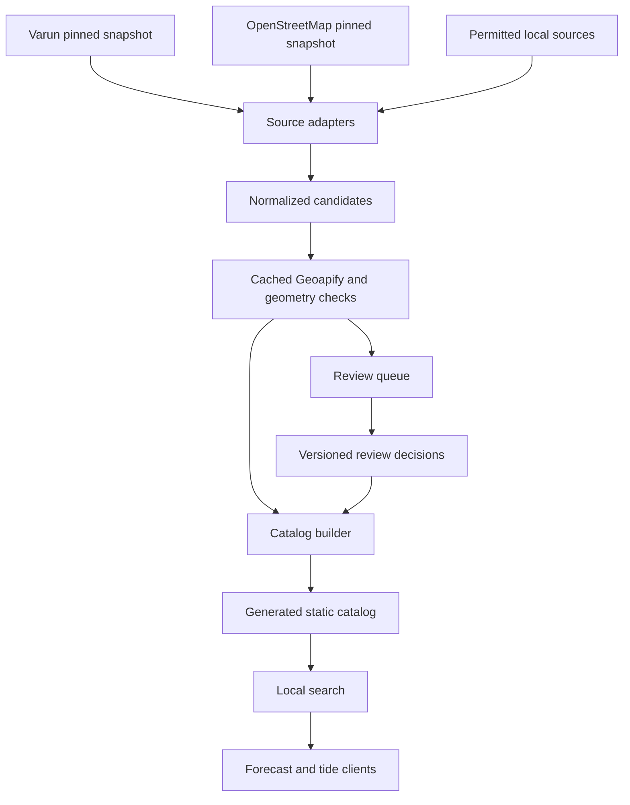
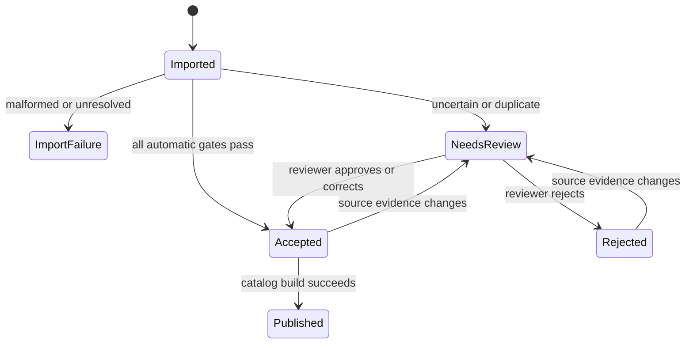

# Global Wind Watersport Spot Catalog - Plan

## Goal Capsule

- **Objective:** A user can find known wind-dependent watersport locations worldwide by name and get a forecast for the correct point on the water.
- **Means:** Generate a static catalog from normalized external candidates, cached deterministic validation, and human review (KTD1-KTD4).
- **Product authority:** The catalog is a forecast lookup for kitesurfing, windsurfing, wingfoiling, and sailing; it is not a spot guide.
- **Execution profile:** Code and curated data changes in the web configurator; no firmware catalog expansion.
- **Stop conditions:** Do not publish candidates with unresolved review status, missing source rights, invalid coordinates, or invalid timezones.
- **Tail ownership:** Maintainers run imports and review changed candidates; users keep the existing personal-spot fallback for missing locations.

---

## Product Contract

### Summary

Windscout will ship a quality-controlled worldwide catalog of kitesurf, windsurf, wingfoil, and sailing locations.
Each public result presents only a name and forecast location; deterministic source processing and human review keep the catalog trustworthy without AI.

### Problem Frame

Windscout currently ships three manually maintained spots, so catalog search is useful only for a tiny part of its intended audience.
Public datasets offer much broader coverage, but mix facilities with usable water locations and contain uneven names, shortened links, duplicates, incorrect pins, and unclear provenance.
No single source covers all four activities well enough to become the sole authority.

### Key Decisions

- **All wind-dependent watersports** (session-settled: user-directed — chosen over a kitesurf-only catalog: Windscout's forecast is useful for kitesurfing, windsurfing, wingfoiling, and sailing). Governs R1, R5, R6, R18.
- **Name and location are the complete public spot model** (session-settled: user-directed — chosen over surf conditions and access metadata: Windscout only needs a forecast target). Governs R2-R4.
- **Deterministic validation instead of AI** (session-settled: user-approved — chosen over model-assisted review: geometry and explicit rules are cheaper and repeatable). Governs R7-R10.
- **Aggregate and curate instead of trusting one source.** Varun provides kite coverage, OpenStreetMap adds multiple activities, and permitted local sources or personal spots fill gaps. Governs R5, R6, R13, R19.

### Requirements

**Catalog scope**

- R1. The searchable catalog supports locations used for kitesurfing, windsurfing, wingfoiling, or sailing and excludes locations that only serve unrelated sports.
- R2. A published location exposes a stable identity, display name, latitude, and longitude; only the name and location are user-facing.
- R3. Coordinates represent usable water, launch access, or a watersports club closely enough to request a relevant forecast rather than the center of a town or region.
- R4. Restricted locations may remain searchable without turning Windscout into an access guide, while locations known to be forbidden are excluded.

**Source handling**

- R5. External records enter Windscout as candidates and are never published merely because they exist in a source collection.
- R6. The first import uses the current Varun records as kite candidates and a pinned OpenStreetMap snapshot for tagged kitesurf, windsurf, sailing, and wind-watersport candidates.
- R7. Every candidate is checked for valid coordinates, plausible country placement, a valid timezone, proximity to mapped water, and likely duplication before publication.
- R8. Import, normalization, and validation consume no AI or language-model calls.
- R9. A failed or uncertain automated check sends the candidate to human review rather than guessing or silently discarding it.
- R10. Nearby records are only flagged as possible duplicates; distinct launches, clubs, or zones are never merged automatically.
- R18. Sailing candidates must represent usable water access, a launch, or a sailing club; shops, travel agencies, and unrelated marina facilities are excluded.

**Quality and maintenance**

- R11. Each candidate has an internal outcome of accepted, needs review, rejected, or import failure, and only accepted records enter the searchable catalog.
- R12. Windscout internally retains source identity, activity tags, evidence fingerprints, and review history without exposing that metadata in the inspector.
- R13. OpenStreetMap and permitted national or community sources can add or corroborate candidates without becoming live runtime dependencies.
- R14. Catalog search keeps working from Windscout's own versioned data when any external source is unavailable or changes format.
- R15. User-created personal spots remain available for missing locations and stay separate from the curated global catalog until reviewed.
- R16. Re-running an unchanged import produces the same normalized records, flags, and review outcomes.
- R17. A catalog release includes every required source attribution, and no restricted external dataset is imported without permission.
- R19. The catalog supports all four activities from its first release but does not claim complete worldwide coverage; missing locations can enter through later source batches or the personal-spot flow.

### Key Flows

- F1. Source import
  - **Trigger:** A maintainer imports a new or updated source snapshot.
  - **Steps:** Records become candidates, supported map links become coordinates, source activity tags are normalized, and malformed records are reported.
  - **Outcome:** Every source record has a deterministic candidate result or visible import failure.
  - **Covered by:** R5, R6, R8, R12, R16, R18.
- F2. Automated validation
  - **Trigger:** Normalized candidates are available.
  - **Steps:** Coordinate bounds, country plausibility, timezone, water proximity, and duplicate likelihood are evaluated with explicit rules and cached evidence.
  - **Outcome:** Confident candidates are accepted and uncertain candidates enter review.
  - **Covered by:** R3, R7-R11, R16.
- F3. Human review
  - **Trigger:** A candidate fails or falls near an automated confidence boundary.
  - **Steps:** A reviewer sees the name, activities, source evidence, and pin in geographic context, then approves, corrects, or rejects it.
  - **Outcome:** The decision is retained until the candidate's evidence changes.
  - **Covered by:** R9-R12, R16, R18.
- F4. Forecast selection
  - **Trigger:** A user selects a curated result in spot search.
  - **Steps:** Windscout resolves the stable location and uses its coordinates and derived timezone for the forecast request.
  - **Outcome:** The forecast targets the selected watersport location.
  - **Covered by:** R1-R3, R14, R19.

### Acceptance Examples

- AE1. **Covers R3, R7, R11.** Given a candidate with valid coastal coordinates beside its named beach, when validation finds mapped water nearby and no contradictions, then the candidate can be accepted without AI review.
- AE2. **Covers R3, R9.** Given a named coastal location whose pin resolves to a town center several kilometers inland, when water proximity fails, then it enters human review instead of being published.
- AE3. **Covers R6, R8.** Given a supported shortened map link, when the import runs, then the link is resolved once into coordinates without a language-model call.
- AE4. **Covers R10.** Given two differently named launches close to each other, when duplicate detection flags the pair, then neither record is automatically removed or merged.
- AE5. **Covers R4.** Given a source marks a location as restricted but not forbidden, when its location passes validation, then it may appear as a normal forecast location without access advice.
- AE6. **Covers R4, R11.** Given reliable evidence that a location is forbidden, when candidates are reviewed, then that location is rejected from the searchable catalog.
- AE7. **Covers R12, R16.** Given an accepted record reappears unchanged in a later source snapshot, when the import reruns, then the prior decision is recognized and no duplicate review task is created.
- AE8. **Covers R18.** Given an OpenStreetMap object tagged for sailing is a boat shop without launch or club access, when source filtering runs, then it becomes an import exclusion rather than a catalog candidate.
- AE9. **Covers R1, R10.** Given the same water location appears in kite and windsurf sources, when cross-source duplicate detection runs, then a reviewer can retain one forecast location without losing its internal activity provenance.
- AE10. **Covers R1, R15, R19.** Given a wingfoil location has no supported external tag, when a user needs its forecast, then the personal-spot flow remains available until a permitted curated source adds it.

### Success Criteria

- The initial Varun and OpenStreetMap snapshots are fully accounted for as accepted, needs review, rejected, import failure, or source exclusion.
- Every published location has a non-empty name, stable identity, valid coordinates, and a valid timezone.
- All automated validation completes with zero AI calls and reports candidate counts by source, activity, and outcome.
- Every flagged candidate is reviewable without editing raw catalog files.
- A manual random sample of at least 10% of automatically accepted records finds no systematic coordinate or facility-classification error before the first release.
- Re-importing unchanged snapshots changes no published records and creates no new review work.
- Search remains responsive and keyboard-usable with the generated global catalog loaded.

### Scope Boundaries

- Conditions, skill levels, hazards, facilities, best wind directions, seasonal guidance, and activity badges are not shown in catalog search.
- Surfing, swimming, paddling, rowing, diving, motorboating, and other non-wind activities do not qualify on their own.
- Windscout does not promise that a listed location is currently legal, safe, open, or suitable; it only provides a forecast target.
- Live scraping or querying source catalogs during user search is excluded.
- AI enrichment, AI classification, and AI review are excluded.
- Synchronizing the complete global catalog to firmware is deferred to follow-up work.
- Public moderation, accounts, voting, and a hosted catalog backend are outside this work.

### Dependencies and Assumptions

- The first Varun source snapshot is pinned to a reviewed commit and contains only the minimal fields needed for candidate discovery.
- OpenStreetMap imports obey ODbL attribution and share-alike obligations and use a pinned, locally retained snapshot rather than runtime Overpass requests.
- Geoapify reverse geocoding returns country and timezone evidence, while its Places categories provide water-proximity evidence; both are triage signals rather than proof of watersport suitability.
- Geoapify's current free plan provides 3,000 credits per day and simple Reverse Geocoding and Places calls usually cost one credit each, which fits one uncached pass over the first Varun snapshot.
- OpenStreetMap has established tags for kitesurfing, windsurfing, and sailing but no established wingfoil tag, so initial wingfoil coverage relies on shared locations, local sources, and personal spots.

### Sources and Research

- Current catalog: `web/src/spots.js`
- Personal spots: `web/src/spots/personalSpots.js`
- Existing search integration: `web/src/components/WindScoutSettings.vue`
- Existing map and reverse-geocoding patterns: `web/src/map/geoapify.js`, `web/src/map/geoapifyMap.js`, `web/src/components/SpotCreationDialog.vue`
- Existing catalog and browser tests: `web/tests/configurator-store.test.js`, `web/tests/settings.test.js`, `web/tests/e2e/configurator.spec.js`
- Varun spot catalog and GPL-3.0 repository: https://github.com/pwittchen/varun.surf
- OpenStreetMap activity tags: https://wiki.openstreetmap.org/wiki/Tag%3Asport%3Dkitesurfing, https://wiki.openstreetmap.org/wiki/Tag%3Asport%3Dwindsurfing, https://wiki.openstreetmap.org/wiki/Tag%3Asport%3Dsailing
- OpenStreetMap license and attribution: https://www.openstreetmap.org/copyright
- Geoapify Places categories and radius filters: https://apidocs.geoapify.com/docs/places/
- Geoapify Reverse Geocoding fields and pricing: https://apidocs.geoapify.com/docs/geocoding/reverse-geocoding/, https://www.geoapify.com/pricing/

---

## Planning Contract

### Product Contract Preservation

Product Contract changed: R1, R6, R12, R13, and the related flows, examples, sources, and boundaries now cover all wind-dependent watersports instead of kitesurfing only, as confirmed by the user during planning.
All other product intent and stable IDs are preserved.

### Key Technical Decisions

- KTD1. **Generate and bundle a static runtime catalog.** A maintainer pipeline produces versioned web data; user search never waits on Varun, OpenStreetMap, Geoapify, or a new backend. Governs R2, R14, R16.
- KTD2. **Use source adapters and immutable snapshots.** Varun and OpenStreetMap normalize into one candidate contract while retaining source-specific IDs and snapshot metadata. Governs R5, R6, R12, R13, R16, R18.
- KTD10. **Separate import eligibility from release eligibility.** Maintainers may inspect a pinned source locally, but its candidates cannot enter generated output until the manifest records the applicable license or permission, required notices, and whether a merged catalog may legally redistribute those fields. An unknown or incompatible status fails closed. Governs R5, R13, R17.
- KTD3. **Validate with cached Geoapify evidence and explicit geometry rules** (session-settled: user-approved — chosen over AI-assisted validation: the checks must be cheap, deterministic, and rerunnable). Each uncached candidate may use one reverse-geocoding request and one nearby-water request; a preflight credit budget prevents accidental overuse. Governs R7-R9, R16.
- KTD4. **Persist review decisions in versioned data through a local review app.** The reviewer approves, corrects, or rejects candidates on a map, and a changed evidence fingerprint reopens the decision. Governs R9-R12, R16, R18.
- KTD5. **Keep public fields minimal and derive runtime-only fields at build time.** The generated runtime record adds stable ID, uppercase renderer name, and timezone because the existing forecast and cache contracts require them, but search displays only name and location. Governs R2, R3, R12.
- KTD6. **Preserve current IDs and make new IDs correction-safe.** Existing Edam, Brouwersdam, and Castricum IDs stay stable; accepted new records receive a stored Windscout ID that does not change when a reviewer moves the pin or fixes the name. Governs R2, R10, R12, R16.
- KTD7. **Rank a bounded local result set.** Search folds accents and punctuation, ranks personal and exact or prefix matches before substrings, requires two typed characters for the global catalog, and renders at most 20 results. Governs R14, R15, R19.
- KTD8. **Filter source semantics before geographic validation.** OpenStreetMap objects must have a supported activity plus a physical water, launch, club, school, or sports-centre feature; shops, offices, and travel agencies never become candidates. Governs R1, R5, R18.
- KTD9. **Treat attribution as a release gate, not inspector content.** Ship a public data-sources page and a subtle link outside the inspector; keep source details out of search results. Governs R2, R12, R17.

### High-Level Technical Design

The maintenance pipeline is separate from the shipped runtime path.
Only its generated catalog enters the normal Vite build.

Candidate state is derived from immutable source evidence plus the latest matching review decision.

### Validation Rules

- Candidate names are trimmed, Unicode-normalized, and kept in their original script.
- Coordinates must be finite and within geographic bounds.
- Geoapify country evidence must match the source country mapping; missing or conflicting evidence routes to review.
- Geoapify must return a valid IANA timezone accepted by the existing runtime validator.
- A candidate passes the water gate when a supported water or coastal feature is found within 2,000 meters; absence routes to review and never causes automatic rejection.
- Any pair within 75 meters is a possible duplicate.
- Records with equivalent normalized names within 5 kilometers are possible duplicates.
- Duplicate flags always route to review and never merge records automatically.
- A review decision is reusable only while its source and validation evidence fingerprint remains unchanged.

### Source Intake Rules

- Varun import extracts only name, country, location reference, and a stable upstream reference from a pinned commit.
- Before candidate generation, each adapter verifies that its manifest entry is release-eligible; exploratory snapshots with unresolved rights remain maintenance-only and cannot influence generated output.
- Direct Google coordinate links are parsed locally; shortened links are resolved once and stored without copying Google descriptions or place content.
- OpenStreetMap import reads kitesurfing, windsurfing, sailing, and known wind-watersport values, including semicolon-separated activity tags.
- OpenStreetMap ways and relations use a representative point, but very large geometries always route to review.
- Sailing candidates require a named physical feature suitable for access or organized use per R18 and KTD8.
- Wingfoil-specific candidates can enter through future permitted adapters or personal-spot review even while OpenStreetMap lacks a canonical tag.

### Output Structure

- `web/data/spots/`
  - `source-manifest.json` pins source versions and license metadata.
  - `candidates.json` stores normalized source records.
  - `link-resolutions.json` stores one-time short-link coordinates.
  - `validation-cache.json` stores compact Geoapify evidence by coordinate fingerprint.
  - `review-decisions.json` stores accepted corrections and rejections.
- `web/scripts/spots/` contains source adapters, validators, catalog generation, and the local review server integration.
- `web/src/spot-review/` contains the maintainer-only browser review interface.
- `web/src/spots/catalog.generated.json` is the only generated data imported by the shipped search path.

### Sequencing

1. Establish deterministic source and candidate contracts.
2. Add cached validation and generate the first outcome report.
3. Add the review interface once the real review volume and evidence shape are known.
4. Generate the accepted runtime catalog and integrate bounded search.
5. Add attribution, release checks, and browser acceptance coverage before publishing the first batch.

### System-Wide Impact

- **Web bundle:** The generated minimal catalog adds roughly hundreds of kilobytes rather than Varun's multi-megabyte descriptive source file; the build must report actual impact.
- **Forecast contract:** Generated records must include a valid timezone because Open-Meteo URLs, normalization, forecast caches, and tide caches already depend on it.
- **Search UX:** Empty focus remains visually empty; global results appear after two characters, while personal results follow the same ranking rules.
- **Maintainer operations:** Network calls occur only in explicit maintenance commands and are resumable from checked-in compact caches.
- **Firmware:** The three-record firmware catalog and its prefetch behavior do not change in this work.
- **Existing edits:** Implementation must preserve the current uncommitted inspector, map, animation, and renderer changes and adapt to their final shape instead of reverting them.

### Risks and Mitigations

| Risk | Impact | Mitigation |
| --- | --- | --- |
| Source license or database rights are incompatible | Catalog cannot ship | Pin source terms, retain notices, keep direct NKV import disabled without permission, and fail release validation when attribution is incomplete. |
| Repository code license does not clearly license its embedded location dataset | Varun-derived records may be unsafe to redistribute | Record dataset-level rights separately from the repository's GPL code license; keep the adapter usable for local inspection but exclude its records until redistribution is confirmed. |
| Sailing tags identify a shop or generic marina | Irrelevant forecast results | Apply KTD8 before coordinate validation and sample accepted sailing records separately. |
| Geoapify categories miss a real small lake or offshore spot | Valid location is flagged | Treat the water check as triage only; route misses to the reviewer instead of rejecting them. |
| Geoapify quota or network fails mid-run | Incomplete evidence | Preflight the uncached credit count, limit request rate, persist each compact result, and resume without repeating cached calls. |
| Nearby launches are merged | Distinct forecast points disappear | Flag only, require a human merge choice, and retain source provenance for every accepted record. |
| Large catalog slows or overwhelms the combobox | Inspector feels worse | Use KTD7, keep catalog data minimal, and add focused component and browser performance assertions. |
| Corrected name or pin changes cache identity | Forecast history is lost | Persist Windscout IDs separately from mutable labels and coordinates per KTD6. |
| Wingfoil coverage remains sparse | Supported activity feels incomplete | Include shared kite or windsurf locations, preserve personal spots, and add permitted wingfoil sources later without changing the runtime contract. |

### Alternatives Considered

- **Runtime search against external spot APIs:** Rejected because it creates latency, outage, quota, and format dependencies in the primary inspector flow.
- **Import all source rows directly:** Rejected because source semantics and coordinate errors would become user-visible without a quality gate.
- **OpenStreetMap only:** Rejected because current explicit activity coverage is sparse and wingfoil has no established tag.
- **A hosted Windscout database and moderation system:** Deferred because a static reviewed catalog meets the current forecast need without accounts, backend operations, or abuse handling.
- **AI-assisted classification:** Rejected by the settled no-AI requirement; deterministic checks are cheaper and auditable.

---

## Implementation Units

### U1. Source snapshots and candidate normalization

- **Goal:** Convert pinned Varun and OpenStreetMap inputs into one reproducible candidate dataset with visible exclusions and failures.
- **Requirements:** R1, R5, R6, R8, R12, R16, R18; F1; AE3, AE8.
- **Dependencies:** None.
- **Files:** `web/package.json`, `web/scripts/spots/import-sources.mjs`, `web/scripts/spots/lib/varun-source.mjs`, `web/scripts/spots/lib/osm-source.mjs`, `web/scripts/spots/lib/candidate-normalization.mjs`, `web/data/spots/source-manifest.json`, `web/data/spots/link-resolutions.json`, `web/data/spots/candidates.json`, `web/tests/spot-source-import.test.js`.
- **Approach:**
  1. Pin each source snapshot and its license metadata in the manifest.
  2. Classify each source as inspection-only or release-eligible and fail closed when dataset redistribution rights are unclear.
  3. Parse the supported direct coordinate URL forms without network calls.
  4. Resolve shortened links through an injectable fetch client and retain only the final coordinates and original source reference.
  5. Normalize activity tags and physical-feature types before creating candidates per KTD2 and KTD8.
  6. Write deterministically sorted candidates plus separate exclusion and failure counts.
- **Execution note:** Implement parser and normalization cases test-first because source-format drift is the primary failure surface.
- **Patterns to follow:** Injectable request behavior and normalized return values in `web/src/map/geoapify.js`; schema validation and frozen spot records in `web/src/spots/personalSpots.js`.
- **Test scenarios:**
  - Covers AE3. A direct coordinate URL and each supported alternate Google URL format produce the same normalized coordinate precision without network access.
  - Covers AE3. A shortened URL follows a mocked redirect once, persists its resolution, and uses the cache on an unchanged rerun.
  - Covers AE8. A sailing-tagged shop or travel agency is reported as excluded and never appears in candidates.
  - A named sailing club, kitesurfing beach, and windsurfing sports centre each become candidates with normalized activity provenance.
  - A semicolon-separated OSM activity value retains every supported wind activity and ignores unrelated values.
  - Missing names, invalid URLs, absent OSM geometry, and unsupported source shapes become visible import failures without aborting other records.
  - Identical source snapshots produce byte-identical sorted candidate output.
  - A source with missing or incompatible dataset rights can be inspected locally but contributes zero records to release-eligible candidates.
- **Verification:** The import report accounts for every upstream record, the candidate file contains no descriptive Varun content, and an unchanged rerun has an empty diff.

### U2. Deterministic validation and evidence cache

- **Goal:** Classify candidates with explicit country, timezone, water, duplicate, and validity gates while remaining resumable and free of AI calls.
- **Requirements:** R3, R7-R11, R16; F2; AE1, AE2, AE4, AE9.
- **Dependencies:** U1.
- **Files:** `web/package.json`, `web/scripts/spots/validate-candidates.mjs`, `web/scripts/spots/lib/geoapify-validation.mjs`, `web/scripts/spots/lib/spot-validation.mjs`, `web/scripts/spots/lib/duplicate-detection.mjs`, `web/data/spots/validation-cache.json`, `web/tests/spot-validation.test.js`.
- **Approach:**
  1. Preflight the number of uncached reverse and Places calls against a conservative daily credit budget.
  2. Reuse the existing Geoapify request conventions while adding maintainer-only rate limiting, retry handling, and compact evidence persistence.
  3. Apply the Validation Rules in a pure classifier so network transport and decision logic remain independently testable.
  4. Compare candidates across all sources with geodesic distance and normalized-name similarity, but emit flags rather than merges.
  5. Produce accepted, needs-review, and import-failure reports by source and activity.
- **Execution note:** Build the pure classifier and duplicate detector before the network runner; prove restart behavior with a simulated mid-run failure.
- **Patterns to follow:** Abort, timeout, and response normalization in `web/src/map/geoapify.js`; timezone validity in `web/src/timezone.js`.
- **Test scenarios:**
  - Covers AE1. Valid coordinates, matching country, valid timezone, nearby water, and no duplicate flags produce an automatic acceptance.
  - Covers AE2. A valid coordinate more than 2,000 meters from mapped water produces needs-review rather than rejection.
  - Covers AE4. Candidates within 75 meters are flagged as possible duplicates and remain separate records.
  - Covers AE9. Same-name cross-source records within 5 kilometers are flagged with both source references.
  - Invalid geographic bounds, missing country evidence, country conflict, and invalid timezone each produce the specified non-published outcome.
  - A valid inland lake with nearby water evidence passes even when no coastline is nearby.
  - A preflight over the configured credit budget makes zero requests and reports the required uncached credit count.
  - A 429, timeout, malformed payload, and network interruption preserve prior cache entries and can resume without duplicate successful calls.
  - An unchanged evidence cache yields identical classifications with zero network calls and zero AI calls.
- **Verification:** Every candidate has a deterministic outcome and evidence fingerprint; the report shows request, cache-hit, activity, source, and outcome totals.

### U3. Local map review and durable decisions

- **Goal:** Let a maintainer resolve uncertain candidates on a map without editing JSON by hand.
- **Requirements:** R9-R12, R16, R18; F3; AE4, AE6, AE7, AE9.
- **Dependencies:** U2.
- **Files:** `web/review.html`, `web/vite.spot-review.config.js`, `web/scripts/spots/review-server.mjs`, `web/src/spot-review/main.js`, `web/src/spot-review/SpotReviewApp.vue`, `web/src/spot-review/reviewState.js`, `web/src/styles/spot-review.css`, `web/data/spots/review-decisions.json`, `web/tests/spot-review.test.js`, `web/tests/e2e/spot-review.spec.js`.
- **Approach:**
  1. Run a maintainer-only Vite entry bound to loopback, with local read and write endpoints limited to the review data files and atomic decision-file replacement.
  2. Show one unresolved candidate at a time with source, activity, failed checks, duplicate links, and a center-pin map.
  3. Support approve, corrected name or position, reject, previous, next, and keyboard navigation.
  4. Store decisions by candidate identity and evidence fingerprint, including a stable Windscout ID on first approval.
  5. Reopen stale decisions when source or validation evidence changes instead of silently carrying them forward.
- **Patterns to follow:** Center-pin interaction and lifecycle cleanup in `web/src/components/SpotCreationDialog.vue` and `web/src/map/geoapifyMap.js`; accessible controls and focus treatment in `web/src/components/settings/`.
- **Test scenarios:**
  - A needs-review record loads with its pin, reasons, source links, activity provenance, and queue position.
  - Approving an unchanged pin stores an accepted decision and removes the item from the unresolved queue.
  - Moving the map and correcting the name stores the corrected values while preserving candidate and source identity.
  - Covers AE6. Rejecting a known forbidden location excludes it from catalog generation and retains the reason.
  - Covers AE4 and AE9. A duplicate group can retain both launches or approve one shared location without automatic deletion.
  - Covers AE7. An unchanged evidence fingerprint reuses its decision; a changed fingerprint reopens the record.
  - Keyboard navigation never loses focus, skips completed items, and exposes every action with an accessible name.
  - The review server rejects paths outside the spot-data files and handles malformed writes without corrupting the decisions file.
  - The review server is unreachable through non-loopback interfaces and an interrupted write leaves the previous valid decisions file intact.
  - The review interface remains usable at a narrow laptop viewport and when map tiles fail.
- **Verification:** A maintainer can clear a representative mixed review queue, restart the tool, and see the same completed and pending state without manual file edits.

### U4. Catalog generation and inspector search

- **Goal:** Build the accepted static catalog and make it searchable without changing the established selection and forecast behavior.
- **Requirements:** R1-R3, R10-R16, R19; F4; AE7, AE9, AE10.
- **Dependencies:** U1-U3.
- **Files:** `web/package.json`, `web/scripts/spots/build-catalog.mjs`, `web/scripts/spots/check-catalog.mjs`, `web/src/spots/catalog.generated.json`, `web/src/spots/searchSpots.js`, `web/src/spots.js`, `web/src/stores/configurator.js`, `web/src/components/WindScoutSettings.vue`, `web/tests/spot-catalog.test.js`, `web/tests/configurator-store.test.js`, `web/tests/settings.test.js`, `web/tests/e2e/configurator.spec.js`.
- **Approach:**
  1. Merge automatically accepted candidates with matching review decisions and exclude every unresolved or rejected record.
  2. Preserve the three existing IDs and allocate stored IDs for new records per KTD5 and KTD6.
  3. Validate renderer text capacity, coordinate bounds, unique IDs, valid timezones, and deterministic sorting before writing the generated catalog.
  4. Add a pure ranked search helper per KTD7 and keep personal spots in the same selection contract.
  5. Keep the spot input empty after selection and avoid showing hundreds of options before the user types two characters.
  6. Verify forecast and tide clients receive the generated record without changing their request contracts.
- **Execution note:** Add catalog and ranking tests before replacing the three-record runtime array; preserve current inspector work and adapt tests to its final component API.
- **Patterns to follow:** Existing `SPOTS`, `getSpot`, and store getters in `web/src/spots.js` and `web/src/stores/configurator.js`; controlled keyboard combobox behavior in `web/src/components/settings/SettingCombobox.vue`.
- **Test scenarios:**
  - Only accepted records enter generated output; needs-review, rejected, import-failure, and excluded source rows do not.
  - Existing Edam, Brouwersdam, and Castricum records retain their IDs while approved coordinate corrections remain possible.
  - Generated records reject duplicate IDs, invalid timezones, out-of-range coordinates, embedded NUL bytes, and names beyond renderer capacity.
  - Search for `chalupy` finds `Chałupy`; punctuation and case differences do not prevent a match.
  - Personal exact matches rank before curated prefix and substring matches, and the result set never exceeds 20.
  - Empty or one-character global queries do not render the full catalog or trigger external requests.
  - Selecting a generated location uses its latitude, longitude, and timezone in the existing forecast request and separates its cache by stable ID.
  - Covers AE10. A missing wingfoil location still follows the existing add-personal-spot flow and becomes immediately selectable.
  - Keyboard selection, Escape, focus return, and the separated create action remain compatible with the larger catalog.
- **Verification:** Unit tests prove catalog and ranking determinism; the browser flow selects multiple international locations and emits the expected Open-Meteo coordinates without layout or keyboard regressions.

### U5. Attribution and release-quality gate

- **Goal:** Make the catalog publishable, auditable, and cheap to refresh without adding source noise to the inspector.
- **Requirements:** R11-R14, R16, R17, R19; AE1-AE10.
- **Dependencies:** U1-U4.
- **Files:** `README.md`, `web/package.json`, `web/public/data-sources.html`, `web/src/components/InstallContinuation.vue`, `web/scripts/spots/check-catalog.mjs`, `web/tests/model-asset.test.js`, `web/tests/e2e/configurator.spec.js`.
- **Approach:**
  1. Publish source names, snapshot identifiers, licenses, required notices, and refresh instructions on a standalone data-sources page.
  2. Add a subtle data-sources link outside the inspector controls per KTD9.
  3. Make the catalog check fail on missing attribution, unresolved candidates in a release batch, stale generated output, or mismatched source fingerprints.
  4. Document import, validate, review, generate, and check commands with their network and credit behavior.
  5. Record first-release sample results by source and activity without turning the plan or runtime catalog into a mutable progress log.
- **Patterns to follow:** Asset provenance checks in `web/tests/model-asset.test.js`; existing build and test scripts in `web/package.json`.
- **Test scenarios:**
  - Every source present in the released catalog has a snapshot identifier and required public notice.
  - Missing or stale attribution makes the release check fail before the web build is considered publishable.
  - A catalog generated from changed candidates without rerunning validation or review fails its fingerprint check.
  - The data-sources link is keyboard-accessible, visually secondary, and absent from the inspector's control rows and search results.
  - The documented cold run stays within the configured request budget; a warm unchanged run reports zero Geoapify requests.
  - Production build output contains the generated catalog and data-sources page but excludes candidates, validation cache, and review decisions.
- **Verification:** A clean maintainer run produces an auditable release artifact, the full web build succeeds, and required source notices are reachable without changing the inspector design.

---

## Verification Contract

| Gate | Command | Applies to | Required signal |
| --- | --- | --- | --- |
| Source and validator unit coverage | `cd web && npm test` | U1-U5 | All existing and new Vitest suites pass with no real network calls. |
| Source import determinism | `cd web && npm run spots:import -- --check` | U1 | The pinned snapshots produce no unexplained exclusions, failures, or file diff. |
| Cached validation | `cd web && npm run spots:validate -- --check` | U2 | Every candidate has evidence and an outcome; unchanged input makes zero Geoapify calls. |
| Review readiness | `cd web && npm run spots:review` | U3 | The local review app opens and can persist a test correction and rejection safely. |
| Catalog integrity | `cd web && npm run spots:catalog:check` | U4, U5 | Generated output is current, unique, schema-valid, fully attributed, and free of unresolved records. |
| Production build | `cd web && npm run build` | U4, U5 | Vite builds the shipped catalog without bundling maintenance evidence or exceeding the existing chunk warning budget. |
| Browser behavior | `cd web && npm run test:e2e` | U3-U5 | Spot review, global search, personal fallback, keyboard behavior, and forecast coordinates pass in Playwright. |
| Manual catalog sample | Review at least 10% of automatic accepts, stratified by source and activity | U2-U5 | No systematic coordinate, facility-type, or duplicate error; any discovered rule defect is fixed and the batch is revalidated. |

External network is allowed only for explicit cold import or validation runs.
Unit tests, catalog checks, ordinary builds, and browser tests must use fixtures or checked-in caches.

---

## Definition of Done

- Product Contract meaning and IDs are preserved except for the confirmed expansion from kite-only to all wind-dependent watersports.
- U1 is complete when both pinned sources produce deterministic candidates, exclusions, and import failures with no copied descriptions.
- U2 is complete when every candidate has cached evidence, a deterministic outcome, and zero AI use.
- U3 is complete when uncertain candidates can be approved, corrected, or rejected through the local accessible map tool and decisions survive restart.
- U4 is complete when only accepted locations enter the generated catalog and international keyboard search drives the existing forecast path correctly.
- U5 is complete when attribution, provenance, generated-data freshness, and release sampling are enforced before build handoff.
- The current three web spot IDs remain valid, personal spots still work, and firmware behavior is unchanged.
- Existing inspector, map, renderer, and animation edits remain intact and all affected tests pass.
- Production output excludes source snapshots, validation caches, review decisions, and maintainer endpoints.
- Required source notices are public and the inspector continues to show only location names.
- Abandoned experiments, temporary downloads, leaked API keys, debug output, and unused dependencies are removed before completion.
